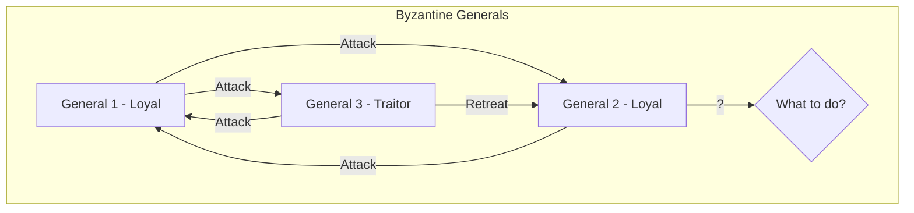
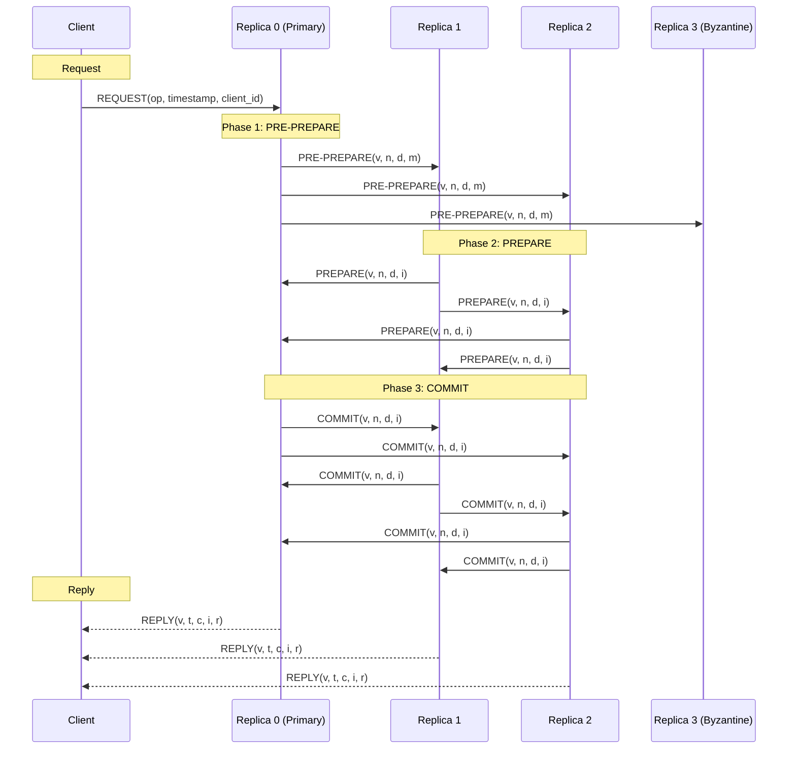
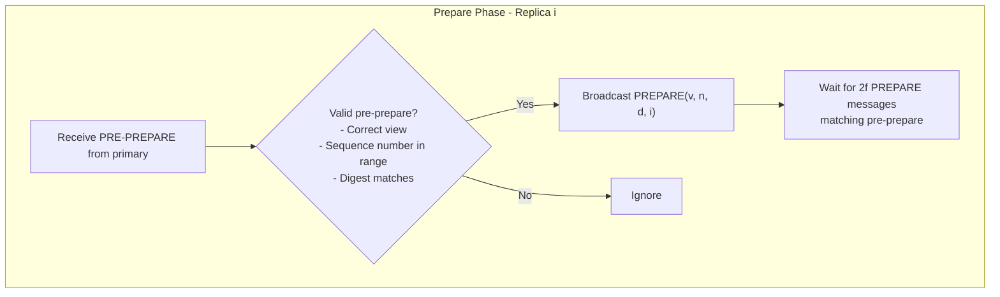
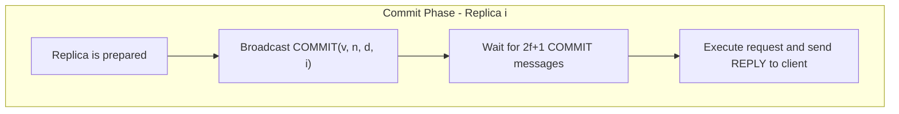
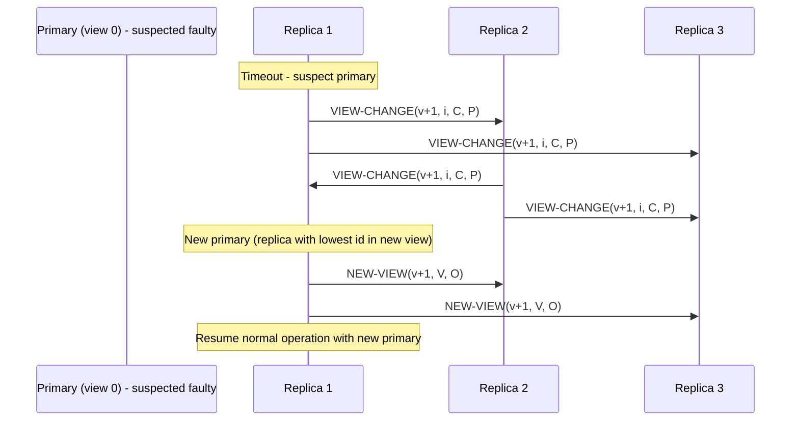
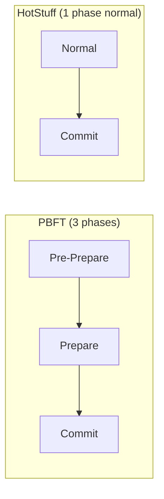

# Practical Byzantine Fault Tolerance (PBFT)

## Overview

PBFT (Practical Byzantine Fault Tolerance) is a consensus algorithm that can tolerate **Byzantine faults** — nodes that can behave arbitrarily, including lying, sending conflicting messages, or colluding. Developed by Miguel Castro and Barbara Liskov in 1999, PBFT was the first practical BFT algorithm, making Byzantine fault tolerance feasible for real-world systems.

## The Byzantine Generals Problem

The classic problem: generals surrounding a city must agree on whether to attack or retreat. Some generals may be traitors who send conflicting messages.

## Fault Tolerance Bounds

| Fault Type | Max Tolerable Faults | Min Nodes Required |
|-----------|---------------------|-------------------|
| Crash faults | f | 2f + 1 |
| Byzantine faults | f | 3f + 1 |

With 4 nodes, PBFT can tolerate 1 Byzantine fault. With 7 nodes, it can tolerate 2.

## PBFT System Model

- **Asynchronous** network (messages can be delayed but not lost)
- **Byzantine** faults (nodes can lie, collude, or behave arbitrarily)
- **3f + 1** total nodes to tolerate f faults
- Uses **digital signatures** and **message authentication codes (MACs)**

## PBFT Protocol Phases

PBFT operates in three phases for each client request:

### Phase 1: Pre-Prepare

The **primary** (leader) assigns a sequence number `n` to the client request and broadcasts a `PRE-PREPARE` message:

| Field | Description |
|-------|-------------|
| `v` | Current view number |
| `n` | Sequence number |
| `d` | Digest (hash) of the request |
| `m` | The client request |

Replicas validate the pre-prepare message and, if valid, move to the prepare phase.

### Phase 2: Prepare

Each replica broadcasts a `PREPARE` message to all other replicas:

A replica is **prepared** when it has:
1. The pre-prepare message
2. 2f matching prepare messages (including its own)

### Phase 3: Commit

Once a replica is prepared, it broadcasts a `COMMIT` message:

A replica **commits** when it has:
1. 2f+1 matching commit messages (including its own)
2. The request is executed and the reply is sent to the client

## View Changes

When the primary is suspected to be faulty, replicas trigger a **view change**:

The `VIEW-CHANGE` message contains:
- The set of prepared certificates (`C`)
- The set of pre-prepared messages (`P`)

## PBFT Message Complexity

| Phase | Messages per replica | Total |
|-------|---------------------|-------|
| Pre-Prepare | n-1 | n-1 |
| Prepare | n-1 | n(n-1) |
| Commit | n-1 | n(n-1) |
| **Total** | — | **O(n²)** |

This quadratic complexity limits PBFT to small clusters (typically 4-100 nodes).

## PBFT Safety and Liveness

### Safety

PBFT guarantees **safety** (agreement) even during network partitions or message delays. Two replicas never commit different values for the same sequence number.

### Liveness

PBFT requires **partial synchrony** for liveness. If the network is fully asynchronous, PBFT may not make progress (due to FLP impossibility). In practice, timeouts ensure progress.

## Optimistic Path: Speculative Execution

Modern BFT protocols (like HotStuff) optimize the normal case:

## PBFT vs. Crash Fault Tolerant Consensus

| Aspect | PBFT | Raft/Paxos |
|--------|------|------------|
| Fault type | Byzantine | Crash |
| Min nodes | 3f+1 | 2f+1 |
| Message complexity | O(n²) | O(n) |
| Use case | Blockchain, critical systems | Databases, coordination |
| Performance | Lower | Higher |

## Real-World Usage

| System | Usage |
|--------|-------|
| **Hyperledger Fabric** | Blockchain consensus |
| **Zilliqa** | Blockchain using PBFT-like protocol |
| **Tendermint** | Blockchain consensus (modified PBFT) |
| **HotStuff** | Facebook's LibraBFT (1-phase normal case) |
| **Aircraft systems** | Flight control redundancy |

## Interview Questions

1. **What is the Byzantine Generals Problem?**
   - Distributed nodes must agree on a value, but some nodes may be faulty and send conflicting messages. The problem is to ensure all honest nodes agree despite faulty ones.

2. **Why does PBFT need 3f+1 nodes?**
   - To tolerate f Byzantine faults, the system needs enough honest nodes to form a quorum. With 3f+1 nodes, even if f are faulty, 2f+1 honest nodes can agree. The extra node ensures the quorum property holds.

3. **Explain the three phases of PBFT.**
   - Pre-prepare: Primary assigns sequence number and broadcasts. Prepare: Replicas validate and broadcast prepare messages. Commit: After receiving 2f+1 prepares, replicas broadcast commit. After 2f+1 commits, the request is executed.

4. **What happens if the primary in PBFT is faulty?**
   - Replicas trigger a view change. They send VIEW-CHANGE messages to the new primary (lowest ID in new view). The new primary sends NEW-VIEW to resume operation.

5. **Why is PBFT's complexity O(n²)?**
   - Each of the Prepare and Commit phases requires every replica to send a message to every other replica: n replicas × (n-1) messages each = O(n²).

6. **How does PBFT differ from Raft?**
   - PBFT tolerates Byzantine faults (lying nodes); Raft only tolerates crash faults. PBFT needs 3f+1 nodes; Raft needs 2f+1. PBFT has O(n²) complexity; Raft has O(n).

## Common Mistakes

- Thinking PBFT can handle unlimited Byzantine faults — it's limited to f < n/3
- Forgetting that PBFT requires **digital signatures** for security
- Confusing Byzantine faults with crash faults — crash is a subset of Byzantine
- Not understanding that view changes are the most complex part of PBFT
- Assuming PBFT is suitable for large-scale systems — O(n²) limits it to small clusters

## Summary

PBFT is the foundational algorithm for Byzantine fault tolerance. It uses a three-phase protocol (pre-prepare, prepare, commit) to ensure agreement despite f Byzantine faults with 3f+1 nodes. While its O(n²) complexity limits scalability, it's the basis for blockchain consensus and critical systems. Modern variants like HotStuff optimize the normal case to O(n) complexity.

## Cross-References

- [Consensus Overview](README.md) — Consensus problem definition
- [Raft](raft.md) — Crash fault tolerant consensus
- [Paxos](paxos.md) — Classic consensus
- [Chain Replication](../replication/chain.md) — Alternative replication strategy
- [Circuit Breakers](../microservices/circuit-breakers.md) — Handling faulty nodes
