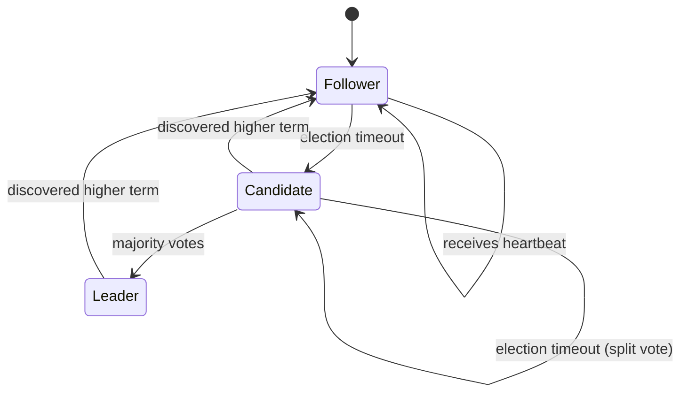
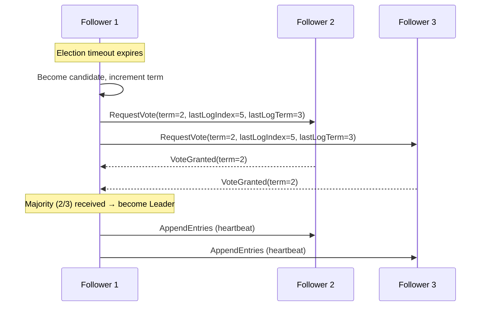
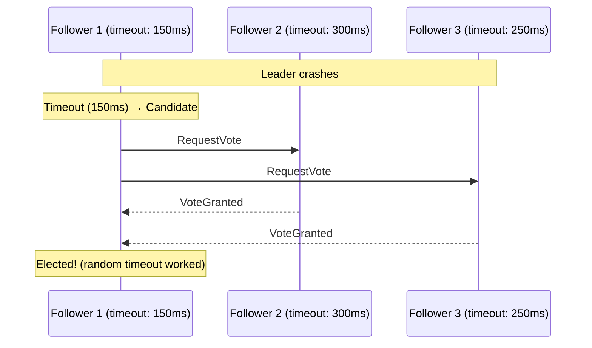
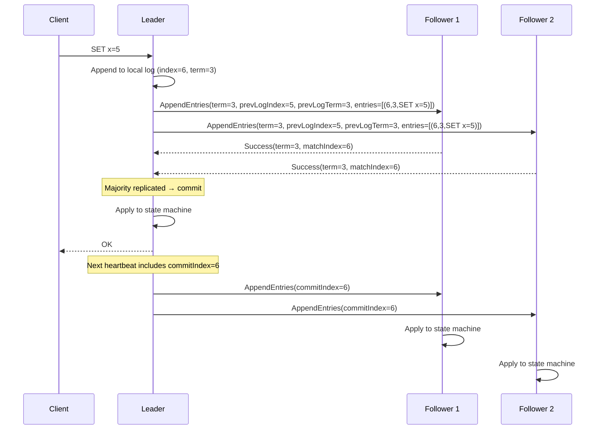
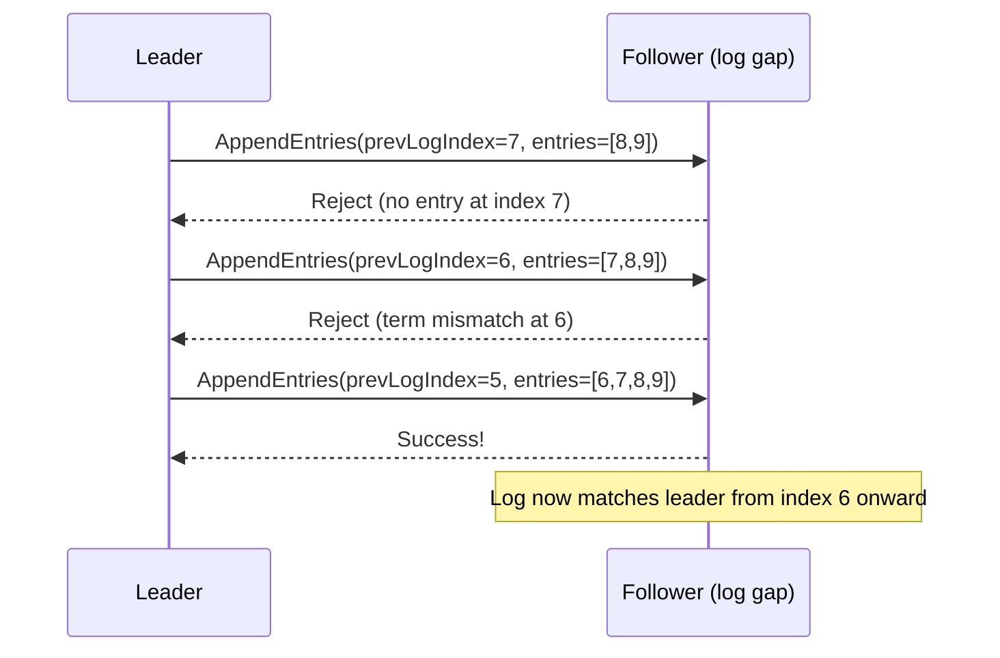
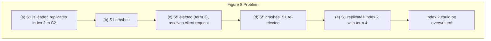
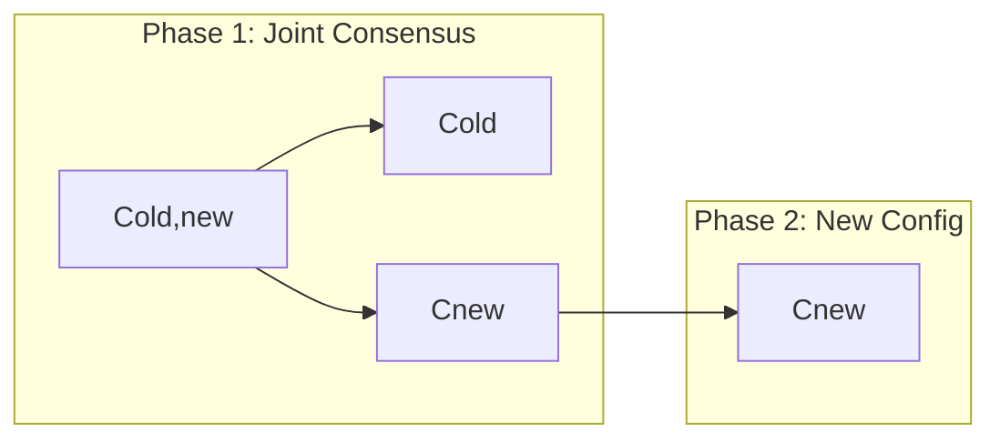
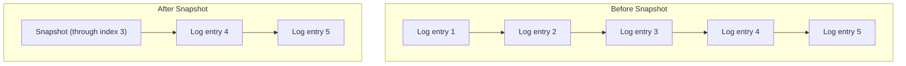
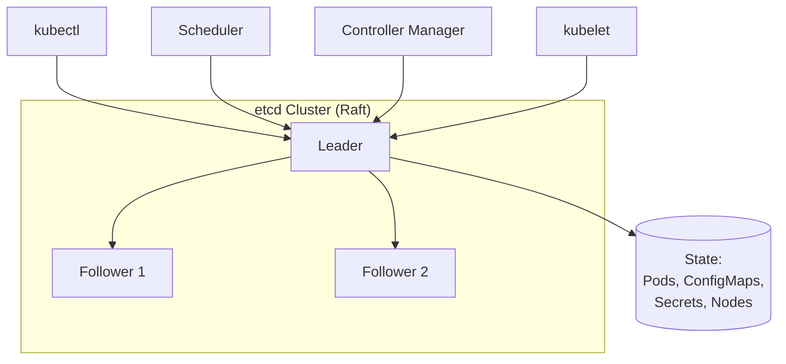

# Raft Consensus

## Overview

Raft is a consensus algorithm designed to be **understandable** while being equivalent to Multi-Paxos in power. Created by Diego Ongaro and John Ousterhout in 2014, Raft decomposes consensus into three subproblems: leader election, log replication, and safety. It is used in etcd, CockroachDB, TiKV, Consul, and many other systems.

## Design Goals

1. **Understandability** — Must be easy for students and engineers to learn
2. **Correctness** — Must be safe under all conditions
3. **Efficiency** — Must perform well enough for production use

## Node States



| State | Description |
|-------|-------------|
| **Follower** | Passive; responds to leader and candidate requests |
| **Candidate** | Requests votes to become leader |
| **Leader** | Handles all client requests; replicates log entries |

## Key Concepts

### Terms

Raft divides time into **terms**, each identified by a monotonically increasing integer. Each term begins with an election.

```mermaid
gantt
    title Raft Terms
    dateFormat X
    axisFormat %s
    
    section Term 1
    Leader 1 (elected)    :a1, 0, 3
    section Term 2
    Election (no leader)  :a2, 3, 4
    Leader 2 (elected)    :a3, 4, 7
    section Term 3
    Election (split)      :a4, 7, 8
    Leader 3 (elected)    :a5, 8, 10
```



### Log Entries

Each log entry contains:
- **Term**: The term when the entry was received by the leader
- **Index**: The position in the log
- **Command**: The state machine command

```
Index:  1     2     3     4     5
Term:   1     1     2     3     3
Cmd:   x=1   y=2   x=3   y=4   x=5
```

## Leader Election

### When Does an Election Happen?

1. System starts up (no leader exists)
2. Follower's **election timeout** expires (no heartbeat from leader)
3. Leader crashes

### Election Process



### Vote Decision Rules

A follower grants a vote if:
1. The candidate's term is **at least as high** as the follower's current term
2. The follower **hasn't voted** in this term yet
3. The candidate's log is **at least as up-to-date** as the follower's (compared by last log term, then last log index)

### Split Votes

If multiple candidates split the vote, no one gets a majority. Raft uses **randomized election timeouts** to break ties:



## Log Replication

Once a leader is elected, it handles all client requests:



### AppendEntries RPC

| Field | Description |
|-------|-------------|
| term | Leader's current term |
| leaderId | So follower can redirect clients |
| prevLogIndex | Index of log entry immediately preceding new ones |
| prevLogTerm | Term of prevLogIndex entry |
| entries[] | Log entries to store (empty for heartbeat) |
| leaderCommit | Leader's commitIndex |

### Log Consistency Check

If a follower's log doesn't match the leader's at `prevLogIndex`, it rejects the AppendEntries. The leader then decrements `nextIndex` and retries:



## Safety

### Election Restriction

A candidate must have a log that is **at least as up-to-date** as a majority. This ensures the leader always has all committed entries.

**Comparison**: Compare last log term first; if equal, compare last log index.

```
Log A: term 3, 3, 4 (last: index 3, term 4)  → More up-to-date
Log B: term 3, 3, 3 (last: index 3, term 3)
```

### Commitment Rules

A log entry is committed when:
1. The leader has replicated it to a **majority** of servers
2. The entry's **term is the current term** (prevents the Figure 8 problem)



### Safety Theorem

**If a leader has committed a log entry for a given term, that entry will be present in the logs of the leaders for all higher-numbered terms.**

## Cluster Membership Changes

Raft uses **joint consensus** for safe configuration changes:



Entries are replicated to both old and new configurations. Once the joint consensus entry is committed, the new configuration takes effect.

## Log Compaction

Raft uses **snapshotting** to compact logs:



## Raft vs. Multi-Paxos

| Aspect | Raft | Multi-Paxos |
|--------|------|-------------|
| Leader | Required, strong leader | Optional |
| Log structure | No gaps allowed | Gaps possible |
| Election | Randomized timeouts | Various strategies |
| Membership | Joint consensus | Complex mechanisms |
| Understandability | High | Low |

## Real-World Usage

| System | Usage |
|--------|-------|
| **etcd** | Kubernetes' backing store |
| **CockroachDB** | Distributed SQL database |
| **TiKV** | Distributed key-value store |
| **Consul** | Service discovery and configuration |
| **Rook/Ceph** | Distributed storage |
| **MongoDB** | Replica set elections (Raft-like) |
| **RabbitMQ** | Quorum queues use Raft |
| **CockroachDB** | Multi-region with Raft groups per range |

### etcd Deep Dive

etcd is the canonical Raft implementation and the backbone of Kubernetes:



- **Why Raft for etcd?** Kubernetes needs strong consistency for cluster state—Pod assignments, ConfigMaps, Secrets must be linearizable.
- **Performance**: etcd handles ~10K writes/sec with typical latencies of 10-50ms.
- **Scale**: etcd clusters typically run 3 or 5 nodes (odd numbers for majority quorum).

### CockroachDB Multi-Raft

CockroachDB uses **thousands of independent Raft groups**, one per data range (64MB):

```mermaid
graph TD
    subgraph "CockroachDB"
        R1[Range 1: keys a-m<br/>Raft Group 1] --> N1[Node 1 (leader)]
        R1 --> N2[Node 2]
        R1 --> N3[Node 3]
        R2[Range 2: keys n-z<br/>Raft Group 2] --> N2b[Node 2 (leader)]
        R2 --> N3b[Node 3]
        R2 --> N1b[Node 1]
    end
```

This allows horizontal scaling—different ranges can have different leaders on different nodes, spreading write load across the cluster.

## Interview Questions

1. **How does Raft ensure safety during leader election?**
   - Candidates must have logs at least as up-to-date as a majority. The comparison is by last log term, then last log index. This guarantees the new leader has all committed entries.

2. **What is the term in Raft and why is it important?**
   - Terms are logical clocks that detect stale leaders. If a node receives a message with a higher term, it steps down. This prevents multiple leaders in the same term.

3. **How does Raft handle network partitions?**
   - The partition with a majority continues operating. The minority partition's leader will step down when it discovers a higher term. When the partition heals, the stale leader catches up.

4. **What happens if a leader crashes?**
   - Followers' election timeouts expire. A new election occurs. The new leader's log is guaranteed to have all committed entries, so no data is lost.

5. **Explain the Figure 8 problem in Raft.**
   - A leader might commit an entry from a previous term, then crash. A new leader could overwrite it. Raft prevents this by only committing entries from the current term (once a current-term entry is committed, all previous entries are implicitly committed).

## Common Mistakes

- Thinking Raft guarantees **liveness** — it only guarantees safety; elections can theoretically fail indefinitely
- Forgetting that **heartbeats** are just empty AppendEntries RPCs
- Not randomizing election timeouts (causes repeated split votes)
- Confusing **commitIndex** (known to be committed) with **lastApplied** (applied to state machine)
- Assuming Raft handles Byzantine faults — it only handles crash faults

## Summary

Raft decomposes consensus into leader election, log replication, and safety. Its strong leader model simplifies reasoning: only the leader can accept writes, and log entries flow from leader to followers. Randomized timeouts prevent election conflicts, and the election restriction ensures committed entries are never lost. Raft's clarity has made it the consensus algorithm of choice for modern distributed systems.

## Cross-References

- [Consensus Overview](README.md) — Consensus problem definition
- [Paxos](paxos.md) — The algorithm Raft was designed to replace
- [ZAB](zab.md) — ZooKeeper's similar protocol
- [Primary-Backup Replication](../replication/primary-backup.md) — Raft implements this pattern
- [Service Discovery](../microservices/discovery.md) — etcd (Raft-based) is commonly used

## Cross References

- [Paxos](paxos.md)
- [ZAB](zab.md)
- [DBMS Raft](../../dbms/distributed/raft.md)
- [Consistency Models](../fundamentals/consistency.md)
