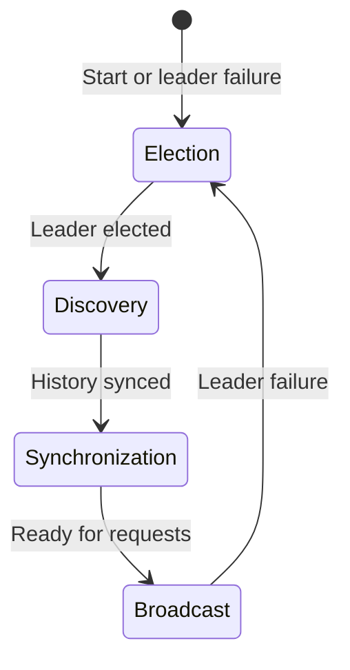
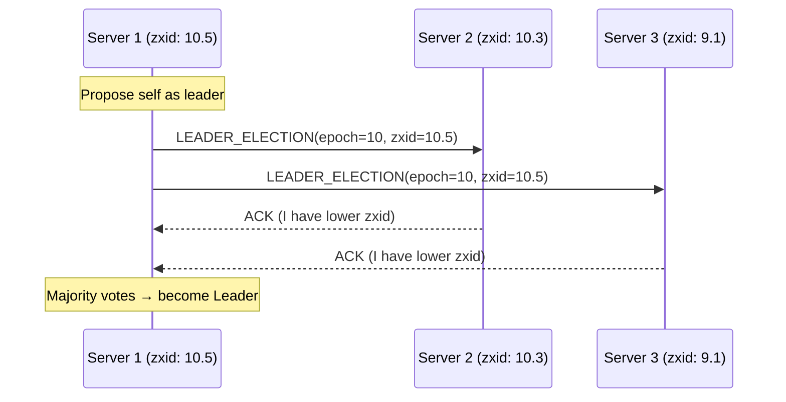
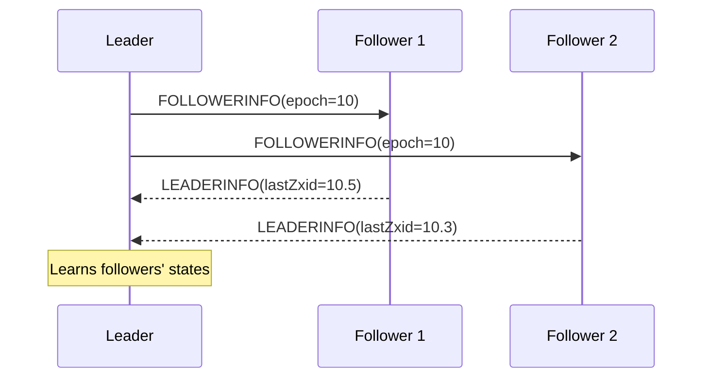
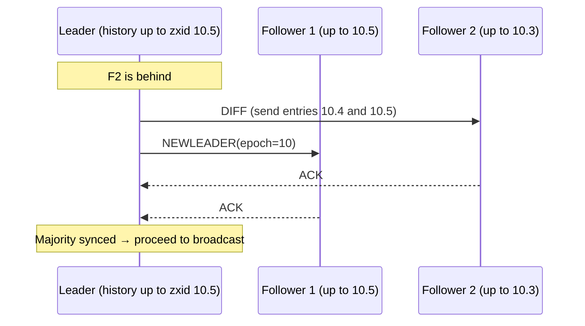
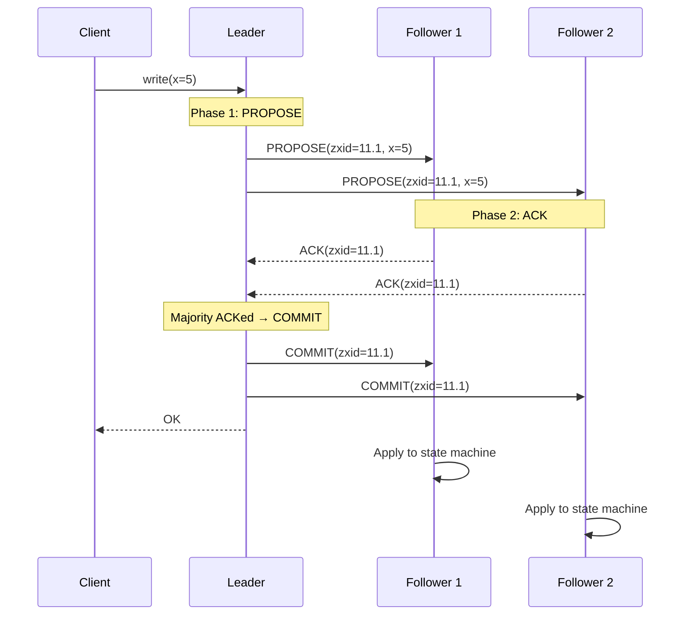
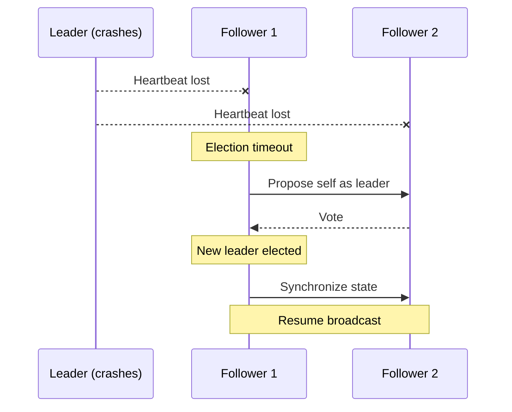
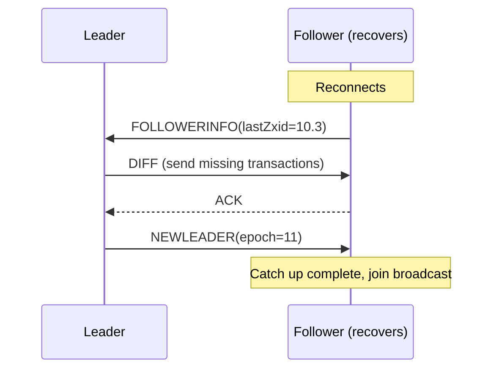
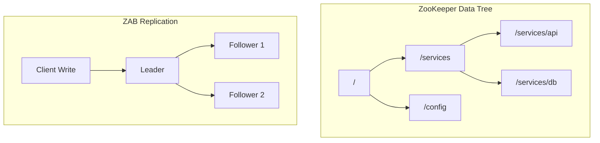

# ZooKeeper Atomic Broadcast (ZAB)

## Overview

ZAB (ZooKeeper Atomic Broadcast) is the consensus protocol used by Apache ZooKeeper. It provides total ordering of messages and ensures that all updates to ZooKeeper's state are replicated consistently across all servers. ZAB is similar to Raft and Multi-Paxos but was designed specifically for ZooKeeper's use case: a hierarchical key-value store used for coordination.

## ZAB's Guarantees

1. **Total ordering**: Messages are delivered in the same order to all nodes
2. **Causal ordering**: If message A causally precedes message B, A is delivered before B
3. **Reliability**: If a message is delivered, it will be delivered to all correct nodes

## ZAB vs. Raft

| Aspect | ZAB | Raft |
|--------|-----|------|
| Designed for | ZooKeeper | General consensus |
| Leader name | Leader | Leader |
| Log entries | Transactions (zxid) | Log entries |
| Epoch | Epoch (high 32 bits of zxid) | Term |
| Message ordering | Atomic broadcast | Log replication |

## ZAB Protocol Phases

ZAB operates in four phases:



### Phase 1: Election (Leader Election)

When the system starts or the leader fails, nodes elect a new leader. ZooKeeper uses a fast leader election algorithm based on **zxid** (transaction ID):



**Voting rule**: A server with a higher zxid (more up-to-date) is preferred. If zxids are equal, the server with the higher server ID wins.

### Phase 2: Discovery

The new leader collects information from followers about their last processed transactions:



The leader determines the **highest zxid** among all followers and establishes a new **epoch**.

### Phase 3: Synchronization

The leader ensures all followers have a consistent history:



### Phase 4: Broadcast (Normal Operation)

Once synchronized, the system processes client requests using atomic broadcast:



## Zxid Structure

The zxid is a 64-bit number:

```
|<--- 32 bits --->|<--- 32 bits --->|
|     Epoch       |    Counter      |
```

- **Epoch**: Incremented each time a new leader is elected
- **Counter**: Incremented for each transaction within an epoch

This ensures monotonically increasing transaction IDs across leader changes.

## ZAB Atomic Broadcast Properties

| Property | Description |
|----------|-------------|
| **Integrity** | A message is delivered at most once |
| **Total order** | All messages are delivered in the same order |
| **Agreement** | If a message is delivered by one node, it's delivered by all correct nodes |
| **Validity** | If a correct sender broadcasts a message, it will eventually be delivered |

## ZAB Failure Handling

### Leader Failure



### Follower Failure and Recovery



## ZAB in ZooKeeper

ZooKeeper uses ZAB to replicate its **data tree** (hierarchical key-value store):



## ZAB vs. Paxos

| Aspect | ZAB | Paxos |
|--------|-----|-------|
| Message ordering | Total order guaranteed | No inherent ordering |
| Leader role | Required | Optional |
| Epoch handling | Part of zxid | Separate from values |
| Use case | State machine replication | Single value consensus |

## Interview Questions

1. **What is ZAB and how does it differ from Paxos?**
   - ZAB is ZooKeeper's atomic broadcast protocol. Unlike Paxos (which decides single values), ZAB provides total ordering of a message stream. It uses epochs (like Raft terms) and guarantees causal ordering.

2. **What is a zxid in ZooKeeper?**
   - A 64-bit transaction ID with a 32-bit epoch (leader term) and 32-bit counter. It monotonically increases, ensuring total ordering of transactions across leader changes.

3. **What are the four phases of ZAB?**
   - Election: Choose a new leader. Discovery: Leader learns followers' states. Synchronization: Leader ensures all followers are consistent. Broadcast: Normal atomic broadcast operation.

4. **How does ZAB handle leader failure?**
   - Followers detect missing heartbeats, trigger a new election. The new leader discovers the most up-to-date state, synchronizes followers, and resumes broadcast.

5. **Why does ZAB need a separate synchronization phase?**
   - After election, followers may have divergent states. Synchronization ensures all nodes have a consistent history before accepting new requests.

## Common Mistakes

- Confusing ZAB's **epoch** with Raft's **term** — they're conceptually similar but implementation details differ
- Thinking ZAB is identical to Raft — while similar, ZAB has distinct phases and zxid structure
- Forgetting that ZooKeeper reads can be served by followers (only writes go through ZAB)
- Not understanding that zxid ordering is what provides ZooKeeper's sequential consistency

## Summary

ZAB is ZooKeeper's consensus protocol that provides atomic broadcast with total ordering. It operates in four phases: election, discovery, synchronization, and broadcast. The zxid (epoch + counter) ensures globally unique, monotonically increasing transaction IDs. ZAB is conceptually similar to Raft but was designed specifically for ZooKeeper's state machine replication needs.

## Cross-References

- [Consensus Overview](README.md) — Consensus problem definition
- [Raft](raft.md) — A very similar protocol
- [Paxos](paxos.md) — The classic consensus algorithm
- [Service Discovery](../microservices/discovery.md) — ZooKeeper is commonly used for this
- [Primary-Backup Replication](../replication/primary-backup.md) — ZAB implements this pattern
