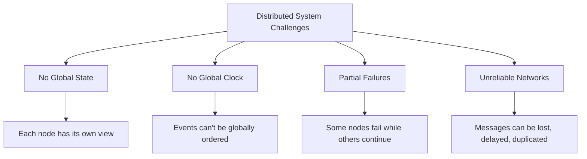
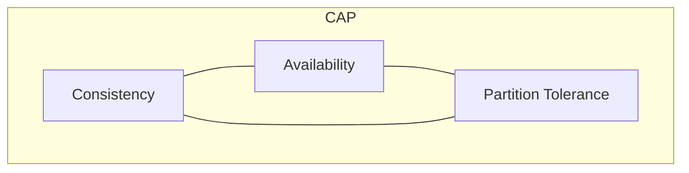
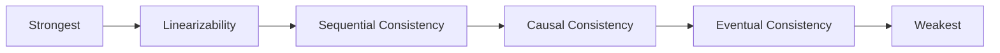
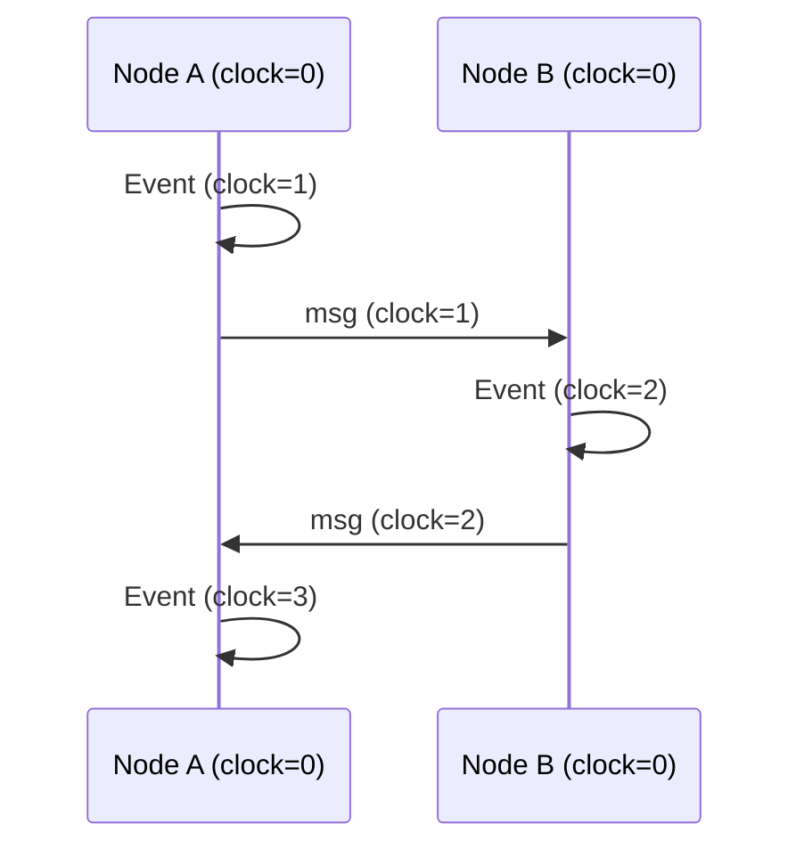

# Distributed Systems Fundamentals

## Overview

Distributed systems are collections of independent computers that appear to users as a single coherent system. Understanding the fundamental constraints — CAP theorem, FLP impossibility, consistency models, and time/ordering — is essential for reasoning about distributed algorithms and system design.

## Why Distributed Systems?

No single machine can handle the demands of modern applications. Distributed systems provide:

- **Scalability** — Handle more load by adding machines
- **Availability** — Survive hardware failures
- **Latency** — Serve users from nearby data centers
- **Throughput** — Parallelize work across nodes

But they come with fundamental challenges that don't exist on a single machine.

## The Four Horsemen of Distributed Systems



1. **No global state** — Each node has its own view of the world. There's no single source of truth.
2. **No global clock** — Nodes can't perfectly synchronize time. "Now" means different things on different machines.
3. **Partial failures** — Unlike a single machine that either works or crashes, parts of a distributed system can fail independently.
4. **Unreliable networks** — Messages can be lost, delayed, duplicated, or reordered. Network partitions are inevitable.

## CAP Theorem

The CAP theorem (Brewer, 2000; proven by Gilbert & Lynch, 2002) states that a distributed system can only guarantee two of three properties:



| Property | Meaning |
|----------|---------|
| **Consistency** | All nodes see the same data at the same time (linearizability) |
| **Availability** | Every request receives a response (success or failure) |
| **Partition Tolerance** | System continues despite network partitions |

**Key insight**: Since network partitions are unavoidable in distributed systems, the real choice is between **CP** (consistent but may reject requests) and **AP** (available but may serve stale data).

| System | Choice | Trade-off |
|--------|--------|-----------|
| **etcd, ZooKeeper** | CP | Reject writes during partition |
| **Cassandra, DynamoDB** | AP | Serve stale data during partition |
| **PostgreSQL (single node)** | CA | No partition tolerance needed |

## FLP Impossibility

The Fischer-Lynch-Paterson (FLP) result (1985) proves that **no deterministic consensus protocol can guarantee termination in an asynchronous system with even one faulty process**.

This doesn't mean consensus is impossible — it means you need additional assumptions:
- **Synchronous bounds** (timeouts detect failures)
- **Failure detectors** (eventually accurate)
- **Randomization** (Las Vegas algorithms)
- **Partial synchrony** (most of the time, messages arrive within bounds)

Raft and Paxos work because they assume partial synchrony and use timeouts for leader election.

## Consistency Models

Consistency models define the contract between the system and the application about what values reads can return.



| Model | Guarantee | Use Case |
|-------|-----------|----------|
| **Linearizability** | Operations appear to happen atomically, in real-time order | Bank account balance |
| **Sequential** | All operations appear in some total order (no real-time constraint) | Collaborative editing |
| **Causal** | Causally related operations are seen in order | Social media feeds |
| **Eventual** | All replicas converge eventually (no timeline) | DNS, CDN caches |
| **Read-your-writes** | You always see your own writes | User profile updates |

### Eventual Consistency Deep Dive

```
Time 0: Node A writes x=1
Time 1: Node B still reads x=0 (stale)
Time 2: Replication propagates
Time 3: Node B reads x=1 (converged)

"Eventual" = no bound on when convergence happens
```

## Time and Ordering

### The Problem

Without a global clock, how do you know which event happened first?

### Lamport Clocks

Lamport clocks assign a logical timestamp to each event using a simple algorithm:

```
1. Before sending a message, increment your clock
2. Attach your clock to the message
3. On receiving a message, set clock = max(local, received) + 1
```



**Limitation**: Lamport clocks can't detect concurrent events. If `a.clock < b.clock`, we know `a` *might* have happened before `b`, but not necessarily.

### Vector Clocks

Vector clocks solve this by maintaining a counter per node:

```
Node A: [A:1, B:0, C:0]  → send to B
Node B: [A:1, B:1, C:0]  → merge + increment
Node C: [A:0, B:0, C:1]  → concurrent with B's event!
```

**Comparison check**: `V1 < V2` iff every element in V1 ≤ V2 and at least one is strictly less.

| Clock Type | Detects Happens-Before | Detects Concurrency | Overhead |
|------------|----------------------|---------------------|----------|
| Lamport | Yes | No | O(1) per node |
| Vector | Yes | Yes | O(n) per node |

## Failure Models

| Model | Description | Example |
|-------|-------------|---------|
| **Crash** | Node stops completely | Power failure |
| **Omission** | Node drops messages | Network buffer overflow |
| **Byzantine** | Node behaves arbitrarily | Compromised node, hardware bug |
| **Timing** | Node responds too slowly | GC pause, network congestion |

**Crash-fault tolerant** systems (Raft, Paxos) handle crash failures. **Byzantine-fault tolerant** systems (PBFT, Tendermint) handle arbitrary failures — required for blockchain and adversarial environments.

## Topics in This Chapter

| Topic | Description |
|-------|-------------|
| [CAP Theorem](./cap.md) | The fundamental trade-off between consistency, availability, and partition tolerance |
| [FLP Impossibility](./flp.md) | Why deterministic consensus is impossible in asynchronous systems |
| [Consistency Models](./consistency.md) | The spectrum from strong to eventual consistency |
| [Time and Ordering](./time.md) | How to order events without a global clock |
| [Lamport Clocks](./lamport.md) | Logical clocks that capture happened-before relationships |
| [Vector Clocks](./vector-clocks.md) | Capturing causal dependencies across all nodes |

## Interview Questions

1. **Q: Explain the CAP theorem with a real-world example.**
   A: Consider a distributed database with nodes in US and EU. If the network between them partitions: CP system (like MongoDB) rejects writes on the minority partition to maintain consistency. AP system (like Cassandra) accepts writes on both but may serve stale data. You can't have both availability and strong consistency during a partition.

2. **Q: What's the difference between linearizability and sequential consistency?**
   A: Linearizability requires that operations appear to happen atomically at some point between their invocation and response — respecting real-time ordering. Sequential consistency requires a total order that respects each process's program order, but doesn't need to respect real-time. Linearizability is stronger.

3. **Q: How do Raft and Paxos circumvent the FLP impossibility result?**
   A: FLP proves impossibility in a purely asynchronous model. Raft and Paxos assume partial synchrony — there exists a time after which messages are delivered within a known bound. They use timeouts (heartbeat in Raft) to detect leader failure. If the system is asynchronous, they may not make progress, but they'll never violate safety.

4. **Q: When would you choose eventual consistency over strong consistency?**
   A: When availability and low latency are more important than immediate consistency. Examples: social media feeds (a slight delay in seeing a friend's post is acceptable), shopping cart (merge conflicts are tolerable), DNS, CDN caching. Strong consistency is needed for: financial transactions, inventory counts, distributed locks.

5. **Q: How would you detect that two events are concurrent using vector clocks?**
   A: Compare their vector timestamps. If neither V1 ≤ V2 nor V2 ≤ V1, the events are concurrent. Example: V1=[1,0,1] and V2=[0,1,1] — V1 has a higher A but lower B, so neither dominates. They happened independently on different nodes.

6. **Q: What is the difference between a network partition and a node failure?**
   A: A node failure is when a node stops responding entirely. A network partition is when some nodes can communicate with each other but not with others — the network splits into groups. Partitions are harder because you can't tell if a node is down or just unreachable. This ambiguity drives the CAP theorem.

7. **Q: Explain the two generals problem and its implications.**
   A: Two armies on opposite sides of a valley must coordinate an attack. Messengers can be captured. No protocol can guarantee both generals agree to attack — every acknowledgment needs its own acknowledgment, creating an infinite regress. Implication: perfect agreement over an unreliable network is impossible. Real systems use timeouts and probabilistic guarantees.

8. **Q: What is quorum and how is it used in distributed systems?**
   A: A quorum is the minimum number of nodes that must agree for an operation to succeed. In a system with N replicas, a write quorum W and read quorum R satisfy W + R > N to ensure overlap. Example: N=3, W=2, R=2 ensures every read sees the latest write. This is the basis of Dynamo-style systems.

9. **Q: How do you handle clock skew in distributed systems?**
   A: (1) Use NTP for approximate synchronization (typically within 1-10ms), (2) Use logical clocks (Lamport, vector) for ordering events, (3) For real-time needs, use TrueTime (Google Spanner) or hybrid logical clocks, (4) Design systems to be tolerant of skew (e.g., lease expiration should have grace periods).

10. **Q: What is the CALM theorem?**
    A: CALM (Consistency As Logical Monotonicity) states that monotonic programs (ones that only add facts, never retract) can achieve consistency without coordination. Non-monotonic operations (like "assign x=5" which overwrites) require coordination. This principle underlies CRDTs and eventually consistent systems.

## Cross References

- [CAP Theorem](./cap.md)
- [Consistency Models](./consistency.md)
- [Lamport Clocks](./lamport.md)
- [Vector Clocks](./vector-clocks.md)
- [FLP Impossibility](./flp.md)
- [Time and Ordering](./time.md)
- [Consensus Algorithms](../consensus/README.md)

## References

- [Designing Data-Intensive Applications](https://dataintensive.net/) — Martin Kleppmann (Chapters 5-9)
- [Distributed Systems](https://www.distributed-systems.net/) — Maarten van Steen, Andrew Tanenbaum
- [CAP Theorem (Brewer)](https://people.eecs.berkeley.edu/~brewer/cs262b-2004/PODC-keynote.pdf) — Original 2000 keynote
- [FLP Impossibility (1985)](https://groups.csail.mit.edu/tds/papers/Lynch/jacm85.pdf) — Fischer, Lynch, Paterson
- [Time, Clocks, and the Ordering of Events (1978)](https://lamport.azurewebsites.net/pubs/time-clocks.pdf) — Leslie Lamport
- [Designing Distributed Systems](https://www.oreilly.com/library/view/designing-distributed-systems/9781491983638/) — Brendan Burns
