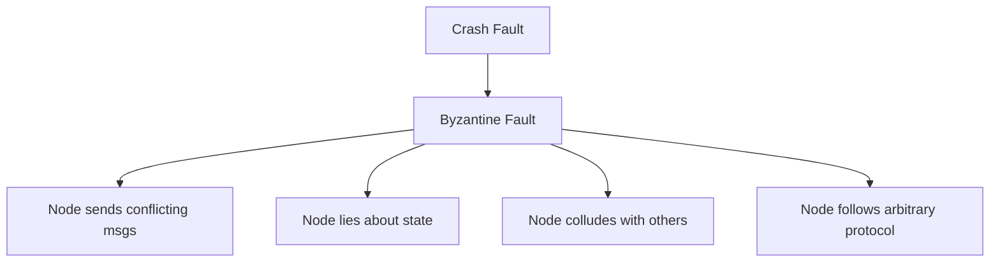

# Byzantine Faults

## Overview

A **Byzantine fault** is the most general failure model: a node can behave arbitrarily — crash, send conflicting messages, lie, or collude with other faulty nodes. Named after the Byzantine Generals Problem (Lamport, Shostak, Pease, 1982), where loyal generals must agree on a battle plan despite traitors sending false messages.

## BFT Consensus Threshold

A system tolerating **f** Byzantine nodes requires at least **3f + 1** total nodes. This is necessary because f faulty nodes can each send different messages to 2f + 1 honest nodes, and the honest nodes must communicate to detect the discrepancy.

| Fault Model | Tolerance | Example System |
|-------------|-----------|----------------|
| Crash-stop | f < n/2 | Raft, Paxos |
| Byzantine | f < n/3 | PBFT, Tendermint |

## PBFT (Practical BFT)

Castro and Liskov (1999) designed the first practical BFT protocol, providing safety and liveness with up to f Byzantine nodes out of 3f + 1.

**Three-phase protocol**: Pre-prepare, Prepare, Commit.

1. Client sends request to primary (leader)
2. Primary multicasts PRE-PREPARE to all replicas
3. Each replica multicasts PREPARE; waits for 2f matching PREPAREs
4. Replica multicasts COMMIT; waits for 2f+1 matching COMMITs (incl. own)
5. Replica executes and replies to client
6. Client waits for f+1 identical replies

**Complexity**: O(n^2) messages per consensus round — acceptable for small committees (20-100 nodes) but does not scale to thousands.

## FLP Impossibility

Fischer, Lynch, and Paterson (1985) proved that **no deterministic async consensus protocol can guarantee liveness** in the presence of even one crash failure. This is fundamental — it applies regardless of the protocol.

**Practical bypasses**:
- Use randomness or timeouts (Raft uses leader election timeouts)
- Use synchrony assumptions (partially synchronous models)
- Accept eventual (not immediate) consensus

## Practical BFT Systems

| System | Throughput | Nodes | Use Case |
|--------|-----------|-------|----------|
| PBFT | ~1k TPS | 3f+1 (~20) | Database replication |
| Tendermint/Cosmos | ~10k TPS | 100+ | Blockchain consensus |
| HotStuff (LibraBFT) | ~100k TPS | 100+ | Diem blockchain |
| Zyzzyva | ~50k TPS | ~50 | Speculative BFT |

## Interview Questions

**Q: Why do BFT systems need 3f+1 nodes vs n/2 for crash faults?**
A: With crash faults, non-responding nodes are simply excluded. With Byzantine faults, f nodes can send *different* messages to different nodes. To outvote the liars, the 2f+1 honest nodes must communicate and reach a 2f+1 majority. You need 3f+1 total so that 2f+1 honest nodes always exist.

**Q: What is the FLP impossibility result?**
A: FLP proved that no deterministic consensus protocol can guarantee both safety and liveness in a fully asynchronous system with even one faulty process. All practical systems (Raft, Paxos, PBFT) bypass this by using timeouts or randomness, which means they operate in partially synchronous models.

## References

- [The Byzantine Generals Problem - Lamport et al.](https://lamport.azurewebsites.net/pubs/byz.pdf)
- [Practical Byzantine Fault Tolerance - Castro and Liskov](https://dl.acm.org/doi/10.1145/347094.347097)
- [FLP Impossibility - Fischer, Lynch, Paterson](https://dl.acm.org/doi/10.1145/3149.214121)
- See also: [CAP Theorem](./cap.md), [Consistency Models](./consistency.md), [FLP](./flp.md), [CRDTs](./crdts.md)
