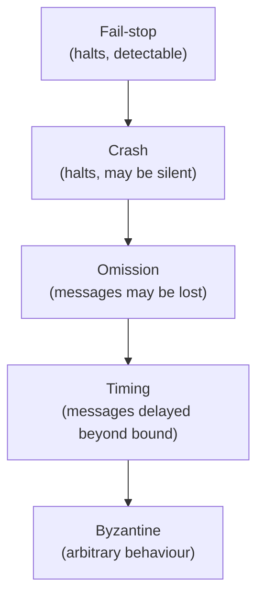
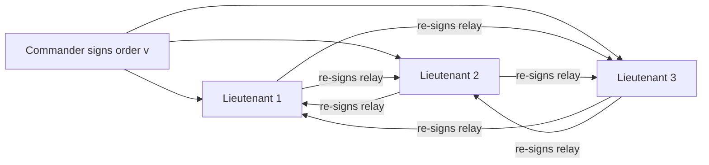
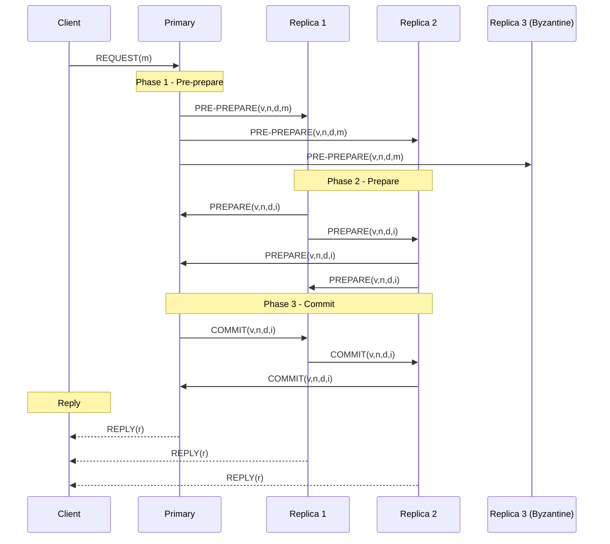
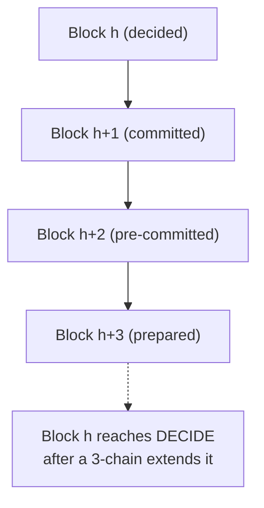
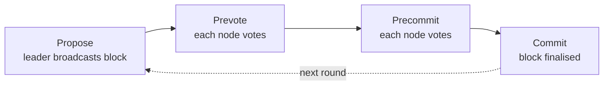

# Byzantine Faults

## Overview

A **Byzantine fault** is the most general failure model in distributed
computing: a node may behave arbitrarily — crash, omit messages, send
conflicting messages to different peers, lie about its state, or actively
collude with other faulty nodes. The term comes from the **Byzantine
Generals Problem** formalised by Lamport, Shostak, and Pease (1982), in
which loyal generals encamped around a city must agree on a common battle
plan despite some commanders being traitors who send falsified messages.

**Byzantine Fault Tolerance (BFT)** is the family of protocols that keep
a distributed system safe and live when up to \\( f \\) of its \\( n \\)
nodes are Byzantine. BFT underpins permissioned blockchains, replicated
state machines holding high-value state, and safety-critical storage
clusters. The price is steep: the quorum threshold is \\( 3f + 1 \\)
rather than the \\( 2f + 1 \\) of crash-fault systems, and classic
protocols (PBFT) carry \\( O(n^2) \\) message complexity. HotStuff (Yin
et al., 2019) reduces this to \\( O(n) \\) using threshold signatures, at
the cost of more rounds and cryptographic machinery. The companion page
[`../consensus/pbft.md`](../consensus/pbft.md) gives the line-by-line
PBFT walkthrough; [`./flp.md`](./flp.md) covers the asynchronous
impossibility result that shapes every BFT protocol's synchrony
assumptions.

## The Fault Model Hierarchy

Distributed-systems literature distinguishes a hierarchy of failure
models, each strictly more permissive than the one below it. A protocol
that tolerates the stronger model also tolerates the weaker one. The
canonical textbook treatment is Tanenbaum & Van Steen, *Distributed
Systems: Principles and Paradigms*.

| Fault Model | What a faulty node can do | Tolerable \\( f \\) for \\( n \\) nodes | Example Systems |
|-------------|---------------------------|-----------------------------------------|------------------|
| **Fail-stop** | Halts cleanly and announces it | \\( f < n \\) (trivial) | Process groups with reliable failure detection |
| **Crash** | Halts silently; may stop mid-message | \\( f < n/2 \\) (i.e. \\( 2f+1 \\)) | Paxos, Raft, ZAB, Chain Replication |
| **Omission** | Drops or never sends/receives messages | \\( f < n/2 \\) send-omission; \\( f < n/3 \\) general | TCP retransmission, gossip protocols |
| **Timing** | Delays messages arbitrarily | depends on synchrony model | Partially-synchronous protocols |
| **Byzantine** | **Arbitrary** — lie, equivocate, forge (within crypto limits), collude | \\( f < n/3 \\) (i.e. \\( 3f+1 \\)) | PBFT, HotStuff, Tendermint, Zyzzyva |

Crash faults assume the node is *honest but broken*: it crashes and
stops. Byzantine faults make no such assumption — the node actively
deviates from the protocol, which is why BFT must use **cryptographic
authentication** (signatures, MACs) so a faulty node cannot forge
messages from honest peers.

## The Byzantine Generals Problem

Lamport, Shostak, and Pease framed the problem as a parable: several
Byzantine army divisions surround an enemy city, each commanded by a
general, communicating only via messengers. Some generals may be
traitors. The loyal generals must agree on a common plan — attack or
retreat — such that:

1. **Agreement**: All loyal generals decide the same plan.
2. **Validity**: If the commanding general is loyal, every loyal general
   obeys his order (traitors cannot override an honest commander).

### Oral Messages (Unsigned)

In the **oral messages** model, messengers cannot be forged but the
sending general can say anything to anyone — a traitor can tell General B
"attack" and General C "retreat" in the same round.

**Impossibility for 3 generals with 1 traitor.** Suppose generals A, B,
and C with A as commander. If A is loyal, A sends the same order \\( v
\\) to B and C. But B cannot trust what C reports A said, because C could
be the traitor relaying a different order. Symmetrically, if A is the
traitor, A can send `attack` to B and `retreat` to C; B and C exchange
messages, but each sees one "attack" and one "retreat" vote and cannot
tell which report was the traitor's lie. No algorithm can resolve this
with only 3 participants.

**Lamport-Shostak-Pease theorem (oral messages).** Byzantine agreement
with oral messages is solvable iff \\( n \\geq 3f + 1 \\). The proof is by
induction on \\( f \\) and yields the iconic `OM(f)` recursive algorithm:
the commander sends its value to all lieutenants; each lieutenant then
acts as a new commander in an `OM(f-1)` round, relaying what it heard;
after \\( f+1 \\) rounds each lieutenant applies a deterministic choice
function (typically majority) to the multiset of values it received. The
recursion depth \\( f+1 \\) bounds the traitor's ability to fabricate a
consistent lie.

### Signed Messages

If messages are **cryptographically signed** (the commander signs every
order, and every relay preserves all signatures), a traitor can no longer
invent an order from a loyal general. The threshold drops dramatically:
signed-message Byzantine agreement is solvable for **any** \\( n > f \\),
in \\( f + 1 \\) rounds. This is the model underpinning modern blockchains
— every vote carries a signature, so equivocation is detectable and
provable.

The Byzantine Generals Problem is the **abstract agreement problem** that
every BFT consensus protocol solves in a concrete setting. PBFT,
HotStuff, and Tendermint all reduce to "commander + lieutenants exchange
signed messages until the honest majority converges on one value," with
the engineering concerns of message complexity, leader rotation, and
synchrony assumptions added on top.

## The 3f + 1 Threshold: Proof Sketch

Why does BFT need \\( n \geq 3f + 1 \\) nodes when crash-fault consensus
only needs \\( n \geq 2f + 1 \\)? The intuition: with crash faults, a
non-responding node is simply excluded — silent means "broken." With
Byzantine faults, a faulty node *responds*, possibly differently to each
peer, and the honest nodes must outvote both the faulty responses and
the messages that the faulty nodes may have suppressed.

### Quorum-Intersection Argument

A BFT protocol makes progress when a **quorum** of \\( q \\) nodes votes.
For safety, any two quorums (for two different proposals) must intersect
in at least one honest node, so the honest node cannot have voted for
both. Let \\( n = 3f + 1 \\) and \\( f \\) nodes be Byzantine. The honest
quorum size is:

\\[
q = 2f + 1
\\]

Two quorums of size \\( 2f+1 \\) drawn from \\( 3f+1 \\) nodes intersect
in at least:

\\[
|Q_1 \cap Q_2| \;\geq\; 2(2f+1) - (3f+1) \;=\; f + 1
\\]

nodes. Since at most \\( f \\) of these are Byzantine, **at least one
honest node** is in the intersection — guaranteeing the two quorums share
a common honest witness. If \\( n \\) were only \\( 3f \\) and \\( q = 2f
\\), two quorums could intersect in exactly \\( f \\) nodes, **all
Byzantine**, and there would be no honest witness to detect the
double-vote.

### Liveness Argument

For liveness, the protocol must make progress when \\( f \\) nodes are
silent (the worst case — faulty nodes may crash as part of their
Byzantine behaviour). With \\( n = 3f+1 \\), the remaining \\( 2f+1 \\)
honest nodes form a quorum and can drive the protocol forward. With \\( n
= 3f \\), only \\( 2f \\) nodes remain after \\( f \\) crashes — short of
the \\( 2f+1 \\) quorum, and the protocol stalls.

### Quorum Sizes: 2f+1 vs 3f+1

| Property | Crash-Fault (Paxos/Raft) | Byzantine (PBFT/HotStuff) |
|----------|--------------------------|---------------------------|
| Total nodes \\( n \\) | \\( 2f + 1 \\) | \\( 3f + 1 \\) |
| Quorum size | \\( f + 1 \\) (majority of \\( 2f+1 \\)) | \\( 2f + 1 \\) |
| Min intersection | \\( 1 \\) (honest, since no lying) | \\( f + 1 \\) (≥1 honest after subtracting \\( f \\) Byzantine) |
| Failure mode of faulty node | silent | arbitrary |
| Crypto required | no | yes (signatures or MACs) |

## Synchronous vs Asynchronous BFT

The synchrony assumption determines whether BFT is even possible, and at
what threshold.

- **Synchronous model**: message delay is bounded by a known \\( \Delta
  \\). Byzantine agreement is solvable for \\( n > 3f \\) with oral
  messages, and \\( n > f \\) with signed messages (Dolev-Strong, 1983).
- **Asynchronous model**: message delay is unbounded. The [FLP
  impossibility result](./flp.md) (Fischer, Lynch, Paterson, 1985) shows
  that **no deterministic protocol can guarantee both safety and liveness
  in a fully asynchronous system with even one crash fault** — let alone
  Byzantine faults.
- **Partial synchrony** (Dwork, Lynch, Stockmeyer, 1988): there exists an
  unknown **Global Stabilisation Time (GST)** after which messages are
  delivered within a bounded \\( \Delta \\). Safety holds always; liveness
  holds after GST. This is the model PBFT, HotStuff, and Tendermint run
  in.

Every practical BFT protocol bypasses FLP with **partial synchrony +
timeouts + leader rotation**: when the current leader is slow or
unresponsive, replicas time out and elect a new one. Randomisation
(Ben-Or) is an alternative but is rarely deployed at scale.

## PBFT: Practical Byzantine Fault Tolerance

Castro and Liskov (OSDI 1999) introduced PBFT — the first BFT protocol
fast enough for real workloads. It runs in asynchronous environments with
\\( n = 3f+1 \\) replicas and provides safety always and liveness after
GST.

### Three-Phase Protocol

1. **Pre-prepare**: The primary assigns a sequence number \\( n \\) to
   client request \\( m \\), signs it, and multicasts
   `PRE-PREPARE(v, n, d, m)` (where \\( d = \text{hash}(m) \\)). This
   phase total-orders requests.
2. **Prepare**: Each replica broadcasts `PREPARE(v, n, d, i)`. A replica
   is *prepared* when it holds the pre-prepare plus \\( 2f \\) matching
   prepares — \\( 2f+1 \\) total, of which at most \\( f \\) are
   Byzantine, so at least \\( f+1 \\) honest replicas agree on \\( (v, n,
   d) \\).
3. **Commit**: Each prepared replica broadcasts `COMMIT(v, n, d, i)` and
   waits for \\( 2f+1 \\) matching commits. The commit certificate
   guarantees **at least \\( f+1 \\) honest replicas are prepared**, so a
   future primary can prove the decision was valid.
4. **Execute & reply**: Each replica executes the request in
   sequence-number order and replies to the client. The client waits for
   \\( f+1 \\) matching replies — enough to override the \\( f \\)
   Byzantine replies.

### View Changes (Leader Election)

If the primary is slow or Byzantine, replicas detect it via timeout and
trigger a **view change**. A replica sends a `VIEW-CHANGE` message
containing its prepared certificates; when a new primary collects \\(
2f+1 \\) view-change messages it issues a `NEW-VIEW` that re-proposes any
prepared requests. The leader (primary) rotates on view changes: the
primary for view \\( v \\) is replica \\( v \bmod |R| \\). A Byzantine
primary can delay requests but cannot forge an inconsistent commit,
because commits require \\( 2f+1 \\) votes of which at most \\( f \\) are
faulty.

### Message Complexity

PBFT's all-to-all prepare and commit phases give it \\( O(n^2) \\) message
complexity per request — workable for \\( n \approx 4\text{–}20 \\)
replicas (the regime Castro-Liskov benchmarked) but a barrier to scaling.
Check-pointing and cryptographic batching mitigate but do not eliminate
this.

## HotStuff

HotStuff (Yin et al., 2019, originally developed at Facebook for
Diem/Libra) is a linear-message-complexity BFT protocol built around
three innovations: a **three-chain commit rule**, **linear view
changes**, and **threshold signatures**.

### Four-Phase Pipeline

HotStuff's four phases (`prepare → pre-commit → commit → decide`) each
produce a **Quorum Certificate (QC)** — a threshold signature aggregating
\\( 2f+1 \\) votes into a single signature. Because the QC is one
constant-size object, communication with the leader is \\( O(n) \\), not
\\( O(n^2) \\).

### Three-Chain Commit Rule

A block is **committed** only after three more blocks extend it. This
"three-chain" rule decouples safety from view changes — a leader can
propose a fresh block in a new view using only the highest QC it knows,
without gathering state from every other replica.

A block \\( B \\) is committed when its great-grandchild is prepared —
i.e., there exist three QCs forming a chain
`QC(B) → QC(B.child) → QC(B.grandchild)`. This lineage proves that \\(
2f+1 \\) replicas voted for \\( B \\) in a view that no later view could
have overridden, because to override they would have needed to first
override the grandchild, which requires overriding the child, which
requires overriding \\( B \\) itself.

### Linear View Changes & Threshold Signatures

When the leader fails, HotStuff's view change is \\( O(n) \\): the new
leader collects \\( n \\) constant-size signed messages and needs only
the **highest QC** it has seen, plus a fresh threshold signature. PBFT
view changes, by contrast, require replicas to ship their full
prepared-state, which is \\( O(n^2) \\) total. A threshold signature
scheme (BLS, FROST) lets \\( 2f+1 \\) of \\( 3f+1 \\) replicas jointly
produce one signature on a block, verifiable in \\( O(1) \\). This
collapses \\( 2f+1 \\) individual signatures into one — the key
ingredient that lets HotStuff and its successors (Aptos' AptosBFT, Sui's
Narwhal/Bullshark) reach \\( O(n) \\) per-round communication.

## Tendermint

Tendermint (Buchman, 2016) is the BFT engine behind the Cosmos
ecosystem. It runs in **rounds**, each with a fixed structure:

1. **Propose**: The round's designated proposer broadcasts a candidate
   block.
2. **Prevote**: Each validator broadcasts a prevote for the proposed
   block (or `nil` if the proposal is invalid or missing).
3. **Precommit**: If a validator receives \\( 2f+1 \\) prevotes for the
   same block (a *polka*), it broadcasts a precommit. If it receives \\(
   2f+1 \\) precommits, the block is committed.
4. **Commit**: The committed block is finalised; the next height begins.

Tendermint's distinctive feature is its **instant finality**: once a
block is committed, it cannot be reverted (no forks, no probabilistic
finality). This makes Cosmos chains attractive for cross-chain
communication — an IBC packet can be relayed as soon as the source chain
commits its block.

## Comparison of BFT Algorithms

| Algorithm | Year | Phases | Msg Complexity | View Change | Finality | Crypto | Notable Deployments |
|-----------|------|--------|----------------|-------------|----------|--------|---------------------|
| **PBFT** | 1999 | 3 (pre-prepare, prepare, commit) | \\( O(n^2) \\) | \\( O(n^2) \\) | Instant | MACs | Hyperledger Fabric (early), VMWare |
| **Zyzzyva** | 2007 | Speculative (1 round if no faults) | \\( O(n^2) \\) avg | \\( O(n^2) \\) | Instant | Signatures | Research; speculative execution |
| **Tendermint** | 2016 | 3 (propose, prevote, precommit) | \\( O(n^2) \\) | \\( O(n^2) \\) | Instant | Signatures | Cosmos, Binance Chain |
| **HotStuff** | 2019 | 4 (prepare, pre-commit, commit, decide) | \\( O(n) \\) | \\( O(n) \\) | Instant (3-chain) | Threshold sigs | Diem/Libra, Aptos (AptosBFT) |
| **DiemBFT / LibraBFT** | 2019 | HotStuff variant | \\( O(n) \\) | \\( O(n) \\) | Instant | Threshold sigs | Diem (cancelled) |
| **Narwhal/Bullshark** | 2022 | DAG-based | \\( O(n) \\) amortised | n/a (DAG) | Probabilistic→final | Signatures | Sui |

## BFT vs Crash-Fault Consensus

| Dimension | Crash-Fault (Paxos/Raft) | Byzantine (PBFT/HotStuff) |
|-----------|--------------------------|---------------------------|
| Failure assumption | Nodes are honest but may crash | Nodes may behave arbitrarily |
| Quorum threshold | \\( 2f + 1 \\) of \\( 2f + 1 \\) (majority) | \\( 2f + 1 \\) of \\( 3f + 1 \\) |
| Total replicas for \\( f=1 \\) | 3 | 4 |
| Total replicas for \\( f=10 \\) | 21 | 31 |
| Cryptography needed | No | Yes (signatures / MACs) |
| Typical \\( n \\) in practice | 3–7 | 4–100+ |
| Throughput (typical) | 10k–100k ops/s | 1k–100k TPS |
| Use case | Inside a trusted data centre | Across trust domains, blockchain |
| Examples | Paxos, Raft, ZAB | PBFT, HotStuff, Tendermint |

BFT is more expensive per node (more replicas, more crypto, more
communication) but is the only option when participants do not mutually
trust each other — for example, the validator set of a permissioned
blockchain.

## Byzantine Fault Detection

BFT protocols guarantee **safety** and **liveness** but do not *identify*
which nodes are Byzantine. Detection is an orthogonal concern:

- **Equivocation proofs**: If a node signs two conflicting votes for the
  same round (e.g. two PREPAREs for different values), any peer that
  receives both has a *cryptographic proof* of Byzantine behaviour. This
  proof can be gossiped and the offending node slashed (blockchain) or
  expelled (federated system).
- **Timeout-based suspicion**: Replicas that consistently fail to vote
  within the timeout window are *suspect*. PBFT-style view changes treat
  a slow primary as Byzantine for liveness purposes, but a merely-slow
  node is not provably faulty.
- **Reputation systems**: Tendermint, Algorand, and Hyperledger Fabric
  track per-validator uptime and proposal quality; low-scoring
  validators lose rewards or are de-slotted.
- **Auditable logs**: Signed consensus messages allow post-hoc forensic
  analysis — Diem/Libra's design emphasised this for regulator access.

Detection is hard because a Byzantine node can be *strategically* faulty:
behave honestly for years, then defect at a critical moment (say, when a
large transaction is pending). This is why BFT protocols remain safe
*regardless* of when faults manifest.

## Real-World Deployments

| System | BFT Engine | \\( n \\) (validators) | Notes |
|--------|-----------|------------------------|-------|
| **Hyperledger Fabric** | PBFT (early) / Raft (orderer, crash-fault) | 4–20+ | Pluggable consensus; PBFT for BFT use cases |
| **Cosmos Hub** | Tendermint | ~180 | Instant finality; IBC cross-chain messaging |
| **Binance Chain (BNB)** | Tendermint | 21–40 | High-throughput DEX |
| **Diem / Libra** (cancelled) | LibraBFT (HotStuff-derived) | ~100 | Designed for regulatory compliance |
| **Aptos** | AptosBFT (HotStuff-derived, leader-rotated) | ~100 | Pipelined HotStuff with leader-reputation |
| **Sui** | Narwhal/Bullshark | ~100 | DAG-based mempool + Bullshark consensus |
| **Algorand** | Algorand BA★ (randomised BFT) | ~1000 | VRF-selected committees, \\( O(1) \\) expected msg |
| **Ethereum 2.0 beacon chain** | Gasper (LMD-GHOST + Casper FFG) | ~1M validators | BFT-inspired finality gadget over longest-chain |

The migration from PBFT (small committees, \\( O(n^2) \\)) to HotStuff
(large committees, \\( O(n) \\)) reflects the blockchain scaling
imperative: validator sets of 100+ make \\( O(n^2) \\) prohibitively
expensive, and threshold signatures are the only viable answer.

## Why BFT Is Expensive

The cost of Byzantine Fault Tolerance compounds:

1. **More replicas**: \\( 3f+1 \\) vs \\( 2f+1 \\) is a 50% overhead for
   the same fault tolerance.
2. **Cryptography**: Every message carries a signature (or MAC). For
   threshold-sig protocols, every vote involves a multi-party signing
   ceremony costing tens of milliseconds.
3. **Communication**: PBFT's \\( O(n^2) \\) prepare+commit blow up at
   scale — \\( n=100 \\) means 10,000 messages per request. HotStuff's
   \\( O(n) \\) linear communication with the leader costs \\( n \\)
   messages but adds a hop.
4. **Latency**: Three or four network round trips per decision (PBFT 3,
   HotStuff 4, Tendermint 3) vs Raft's 1–2.
5. **Bandwidth**: At \\( n=100 \\), threshold-signed votes are hundreds
   of bytes each; one consensus round produces ~100 KB of consensus
   traffic before the payload.
6. **State overhead**: Storing the latest \\( 2f+1 \\) QCs, view-change
   certificates, and signed messages is non-trivial at large \\( n \\).

These costs are why public, open-participation blockchains (Bitcoin,
Ethereum pre-merge) often prefer **probabilistic finality** (Nakamoto
longest-chain) with \\( O(1) \\) per-node communication, and reserve BFT
for permissioned validator sets where \\( n \\) is bounded.

## Interview Questions

### Q1: Why do BFT systems need 3f+1 nodes when crash-fault systems only need 2f+1?
**Answer**: With crash faults, a silent node is simply excluded — silence
is itself a signal of failure. With Byzantine faults, a faulty node
*responds*, possibly differently to each peer, so honest nodes cannot
tell "silent" from "lying." To outvote \\( f \\) Byzantine nodes that may
send conflicting messages, you need \\( 2f+1 \\) honest nodes to form a
quorum, and those \\( 2f+1 \\) honest nodes must exist even after \\( f
\\) nodes go silent — so \\( n \geq 3f+1 \\). Quorum intersection then
guarantees any two quorums share at least \\( f+1 \\) nodes, of which at
least one is honest.

### Q2: What is the Byzantine Generals Problem, and what did Lamport-Shostak-Pease prove?
**Answer**: It is the abstract agreement problem: \\( n \\) generals (some
traitors) must agree on a common plan via messengers. Lamport, Shostak,
and Pease (1982) proved that with **oral (unsigned) messages**, agreement
is possible iff \\( n \geq 3f+1 \\), and is **impossible** for \\( n = 3
\\) with even one traitor. With **signed messages**, agreement is
possible for any \\( n > f \\).

### Q3: Walk through the three phases of PBFT.
**Answer**: (1) **Pre-prepare**: the primary assigns a sequence number
and multicasts `PRE-PREPARE(v, n, d, m)`. (2) **Prepare**: each replica
broadcasts `PREPARE(v, n, d, i)`; a replica is *prepared* when it holds
the pre-prepare plus \\( 2f \\) matching prepares (\\( 2f+1 \\) total,
≥\\( f+1 \\) honest). (3) **Commit**: prepared replicas broadcast
`COMMIT`; after \\( 2f+1 \\) matching commits the request is committed,
executed, and the reply sent to the client (who waits for \\( f+1 \\)
matching replies).

### Q4: What problem does HotStuff solve that PBFT does not?
**Answer**: HotStuff reduces communication from \\( O(n^2) \\) to \\( O(n)
\\) per consensus round using **threshold signatures** (which aggregate
\\( 2f+1 \\) votes into one constant-size QC) and a star-shaped
communication pattern (all-to-leader, not all-to-all). It also provides
**linear view changes** — a new leader needs only the highest QC, not
the prepared state of every replica. The cost is a fourth phase (prepare,
pre-commit, commit, decide) and the three-chain commit rule.

### Q5: How do BFT protocols bypass the FLP impossibility?
**Answer**: FLP says deterministic consensus cannot guarantee liveness in
a fully asynchronous system with even one crash. BFT protocols (PBFT,
HotStuff, Tendermint) bypass it by assuming **partial synchrony** —
there is an unknown GST after which messages are delivered within a
bounded \\( \Delta \\). Safety holds always; liveness holds after GST.
Timeouts and leader rotation are the mechanism: when a leader is
unresponsive, replicas time out and elect a new one, eventually
converging on a working leader during a synchronous period.

### Q6: What is the three-chain commit rule in HotStuff?
**Answer**: A block \\( B \\) is committed only after three of its
descendants have been prepared in succession — i.e., there is a chain
\\( B \to B' \to B'' \to B''' \\) of QCs. This lineage proves that \\(
2f+1 \\) replicas voted for \\( B \\) in a way that no later view could
revoke, because revoking \\( B \\) would require first revoking \\( B'''
\\), which requires revoking \\( B'' \\), which requires revoking \\( B'
\\), which requires revoking \\( B \\) — a circular dependency that a
Byzantine adversary cannot satisfy.

### Q7: Why does Tendermint have "instant finality" while Bitcoin does not?
**Answer**: Tendermint requires \\( 2f+1 \\) of \\( 3f+1 \\) validators to
precommit a block before it is appended; once \\( 2f+1 \\) precommits
exist, the block is final and cannot be reverted without \\( > f \\)
validators double-signing (which is provable and slashable). Bitcoin uses
Nakamoto longest-chain consensus, where finality is *probabilistic* — a
block can always be reorged by a longer chain, and "finality" is a
confidence level (\\( k \\) confirmations). BFT finality is faster and
more certain but requires a known, permissioned validator set.

### Q8: If you were designing a blockchain with 1000 validators, would you pick PBFT or HotStuff?
**Answer**: HotStuff. PBFT's \\( O(n^2) \\) communication means \\(
10^6 \\) messages per request at \\( n=1000 \\), infeasible. HotStuff's
\\( O(n) \\) threshold-signature QCs keep per-round communication linear;
pipelined HotStuff variants (AptosBFT, DiemBFT) further amortise the
cost across pipelined blocks. The trade-off is the additional crypto cost
of threshold signatures and the four-phase commit, but at \\( n=1000 \\)
this is overwhelmingly preferable to PBFT's quadratic blow-up.

## Common Mistakes

1. **Confusing crash tolerance with Byzantine tolerance** — A system
   tolerating \\( f \\) crashes (Raft, \\( 2f+1 \\)) does **not** tolerate
   \\( f \\) Byzantine faults. A single Byzantine leader in Raft can fork
   the log.
2. **Thinking \\( 3f+1 \\) is "twice as many"** — It's \\( 3f+1 \\) vs
   \\( 2f+1 \\), a 50% overhead, not 2×. For \\( f=1 \\), that's 4 vs 3.
3. **Forgetting that FLP applies to BFT too** — FLP is about *crash*
   faults; if async + deterministic can't solve crash consensus, it
   certainly can't solve Byzantine. BFT protocols need partial synchrony.
4. **Assuming signed messages solve everything** — Signatures prevent
   forgery but do not by themselves solve agreement. The \\( 3f+1 \\)
   bound still applies for oral-message protocols; signatures reduce the
   threshold only in signed-message algorithms (Dolev-Strong).
5. **Equating "BFT" with "blockchain"** — BFT predates blockchains by two
   decades. PBFT was designed for replicated databases; blockchains are
   one (high-profile) application area.
6. **Treating HotStuff as "just pipelined PBFT"** — HotStuff's three-chain
   rule and threshold-signature QCs fundamentally change the
   communication complexity class, not just the throughput.

## Summary

| Aspect | Detail |
|--------|--------|
| **Byzantine fault** | Arbitrary deviation from protocol — lie, equivocate, collude |
| **Threshold** | \\( n \geq 3f+1 \\) (oral) or \\( n > f \\) (signed) |
| **Quorum size** | \\( 2f+1 \\) of \\( 3f+1 \\) |
| **Synchrony** | Partially synchronous (post-GST liveness) |
| **Foundational paper** | Lamport, Shostak, Pease (1982) |
| **First practical protocol** | PBFT (Castro-Liskov, 1999), \\( O(n^2) \\) |
| **Linear-complexity successor** | HotStuff (Yin et al., 2019), \\( O(n) \\) via threshold sigs |
| **Blockchain-grade variants** | Tendermint, LibraBFT, AptosBFT, Narwhal/Bullshark |
| **FLP bypass** | Partial synchrony + timeouts + leader rotation |

## Cross-References

- [Distributed Algorithms](./distributed-algorithms.md) — unifying tour
  of consensus, leader election, snapshots, gossip, BFT
- [FLP Impossibility](./flp.md) — the async-impossibility result that
  shapes every BFT protocol's synchrony assumptions
- [Consensus Overview](../consensus/README.md) — the consensus family
- [Paxos](../consensus/paxos.md) — classic crash-fault consensus
- [Raft](../consensus/raft.md) — understandable crash-fault consensus
- [PBFT (deep dive)](../consensus/pbft.md) — line-by-line PBFT walkthrough
- [CAP Theorem](./cap.md) — the other fundamental distributed-systems
  impossibility result
- [Formal Methods](../../cs-theory/formal-methods.md) — formal
  verification of BFT protocols (TLA+ specs for PBFT and HotStuff exist)

## References

- Lamport, L., Shostak, R., Pease, M. **"The Byzantine Generals Problem."**
  ACM TOPLAS 4(3), 1982.
  <https://lamport.azurewebsites.net/pubs/byz.pdf>
- Castro, M., Liskov, B. **"Practical Byzantine Fault Tolerance."** OSDI
  1999. <https://dl.acm.org/doi/10.1145/296806.296824>
- Yin, M., Malkhi, D., Reiter, M. K., Gueta, G. G., Abraham, I.
  **"HotStuff: BFT Consensus with Linearity and Responsiveness."** PODC
  2019. <https://arxiv.org/abs/1803.05069>
- Buchman, E. **"Tendermint: Byzantine Fault Tolerance in the Age of
  Blockchains."** M.Eng. thesis, Cornell, 2016.
- Fischer, M. J., Lynch, N. A., Paterson, M. S. **"Impossibility of
  Distributed Consensus with One Faulty Process."** JACM 32(2), 1985.
- Dwork, C., Lynch, N., Stockmeyer, S. **"Consensus in the Presence of
  Partial Synchrony."** JACM 35(2), 1988.
- Tanenbaum, A. S., Van Steen, M. **Distributed Systems: Principles and
  Paradigms.** 2nd ed., Prentice Hall, 2007 — Chapter 8 on fault
  tolerance and the failure-model hierarchy.
- See also: [CAP Theorem](./cap.md), [Consistency Models](./consistency.md),
  [FLP](./flp.md), [CRDTs](./crdts.md), [Lamport Clocks](./lamport.md)
