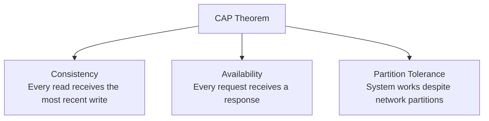
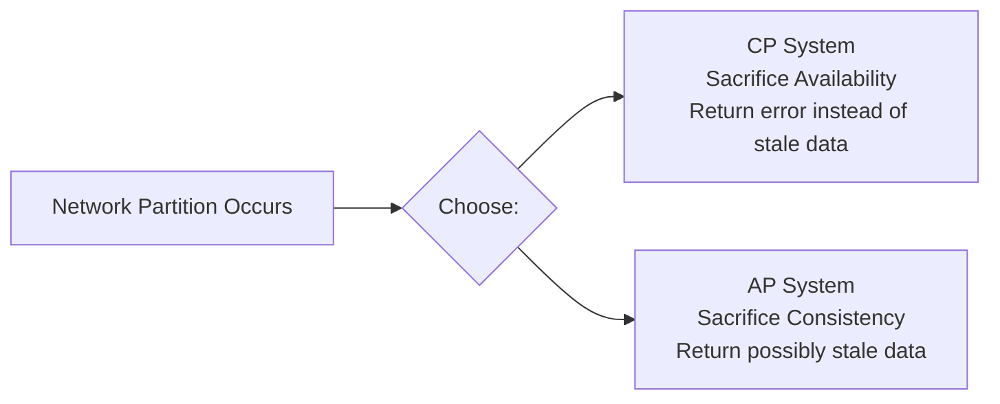

# CAP Theorem

## Overview

The **CAP Theorem** (Brewer's Theorem, 2000; proven by Gilbert & Lynch, 2002) states that a distributed data store can provide at most two out of three guarantees: **Consistency**, **Availability**, and **Partition Tolerance**. Since network partitions are unavoidable in distributed systems, the real choice is between consistency and availability during a partition.

## Detailed Explanation

### The Three Properties



| Property | Definition | Example |
|----------|-----------|---------|
| **Consistency (C)** | Every read returns the most recent write (linearizability) | Reading key X always returns the latest value written to X |
| **Availability (A)** | Every request receives a response (success or failure), without timeout | No request hangs indefinitely |
| **Partition Tolerance (P)** | The system continues to operate despite network partitions (dropped/delayed messages between nodes) | System works even if some nodes can't communicate |

### The Real Choice

Since network partitions **will** happen in distributed systems, P is not optional. The real trade-off is:



```
During a network partition:

CP System (Consistency + Partition Tolerance):
  - Refuses to respond if it can't guarantee consistency
  - Returns error/timeout instead of stale data
  - Example: Bank transfer — better to fail than show wrong balance

AP System (Availability + Partition Tolerance):
  - Always responds, even with potentially stale data
  - Resolves conflicts after partition heals
  - Example: Shopping cart — better to show old cart than fail
```

### CA Systems?

A **CA system** (Consistency + Availability, no Partition Tolerance) is only possible on a single node or with perfect networking:

```
CA is not realistic for distributed systems because:
  - Network partitions WILL occur
  - A system that can't tolerate partitions isn't distributed
  - Single-node databases are "CA" but not distributed

The theorem is really: Given P (always true), choose C or A.
```

### PACELC: Extending CAP

Daniel Abadi (2010) extended CAP with the **PACELC** model:

```
If Partition (P):
  Choose: Availability (A) or Consistency (C)
Else (E):
  Choose: Latency (L) or Consistency (C)

This captures the trade-off even when there's no partition:
  - Some systems optimize for lower latency (relaxed consistency)
  - Others optimize for stronger consistency (higher latency)
```

| System | Partition | Else | Category |
|--------|-----------|------|----------|
| **DynamoDB** | A | L | PA/EL |
| **Cassandra** | A | L | PA/EL |
| **HBase** | C | C | PC/EC |
| **MongoDB** | C | C | PC/EC |
| **PNUTS** | C | L | PC/EL |

### Real-World Examples

**CP Systems:**
- **ZooKeeper** — Consistent coordination service; unavailable during partitions
- **etcd** — Consistent key-value store for Kubernetes
- **HBase** — Consistent big data store; region servers go offline during partitions
- **Google Spanner** — Globally consistent; uses TrueTime for ordering

**AP Systems:**
- **DynamoDB** — Always available; eventual consistency (configurable)
- **Cassandra** — Tunable consistency; always writable
- **CouchDB** — Always available; resolves conflicts on read
- **DNS** — Always available; eventual consistency for updates

**Tunable Consistency:**
Many modern systems let you choose per-operation:

```
Cassandra:
  ConsistencyLevel.ONE    → AP behavior (fast, eventually consistent)
  ConsistencyLevel.QUORUM → More consistent (majority must agree)
  ConsistencyLevel.ALL    → CP behavior (all replicas must agree)

You choose per read/write based on your application's needs.
```

## Examples

### Example 1: Bank Transfer (CP)

```
Scenario: Transfer $100 from Account A to Account B
Nodes: Node 1 (has A), Node 2 (has B)
Network partition between Node 1 and Node 2

CP approach:
  Node 1: Debit $100 from A → can't reach Node 2 to credit B
  Decision: BLOCK the operation (return error)
  Consistency preserved: A and B are always consistent
  Availability sacrificed: Request fails

AP approach:
  Node 1: Debit $100 from A → queue credit for B
  Node 2: Not updated yet
  Decision: Return success to client
  Conflict resolution: When partition heals, credit B
  Problem: If queried, B shows wrong balance temporarily
```

### Example 2: Shopping Cart (AP)

```
Scenario: Add item to cart
Nodes: Node 1 (US), Node 2 (EU)
Network partition between regions

AP approach:
  Node 1: Add item to cart → success
  Node 2: Doesn't see the update yet
  Decision: Return success (user sees item in cart)
  When partition heals: Merge carts (union of items)
  Acceptable: User might see old cart briefly, but never loses items

CP approach:
  Node 1: Add item → can't replicate to Node 2
  Decision: Return error
  Problem: User can't add items to cart! Bad UX.
```

### Example 3: DNS (AP)

```
DNS is a classic AP system:
  - Always available (can always resolve names)
  - Eventually consistent (updates propagate over time, TTL-based)
  - Partition tolerant (works even if some DNS servers are unreachable)

  Update: Change example.com IP from 1.1.1.1 to 2.2.2.2
  During propagation: Some resolvers return old IP, some return new
  After TTL expires: All resolvers return new IP
  
  This is acceptable for DNS — brief inconsistency is tolerable.
```

### Example 4: ZooKeeper (CP)

```
ZooKeeper is a CP system:
  - Maintains consistent state across all nodes
  - Uses ZAB (ZooKeeper Atomic Broadcast) for consensus
  - Requires majority of nodes to be available
  - If majority is lost → system becomes unavailable

  5-node ZooKeeper cluster:
    3 nodes up → operates normally
    2 nodes up → majority lost → UNAVAILABLE
    Consistency always preserved
```

## Interview Questions

### Q1: What does the CAP theorem state?
**Answer**: In a distributed system, you can provide at most two of three guarantees: Consistency (every read gets the latest write), Availability (every request gets a response), and Partition Tolerance (system works despite network partitions). Since partitions are unavoidable, the real choice is between consistency and availability during a partition.

### Q2: Can you have a CA distributed system?
**Answer**: Not really. A CA system would need to give up partition tolerance, but network partitions are inevitable in distributed systems. A single-node database is effectively "CA" but isn't distributed. The CAP theorem applies specifically to distributed systems where partitions can occur.

### Q3: What's the difference between CP and AP systems?
**Answer**: CP systems prioritize consistency—they may refuse to respond during a partition rather than return stale data (e.g., ZooKeeper, HBase). AP systems prioritize availability—they always respond, even if the data might be stale, and resolve conflicts later (e.g., DynamoDB, Cassandra).

### Q4: What is PACELC?
**Answer**: PACELC extends CAP by considering the trade-off even when there's no partition. It says: if there's a Partition, choose between Availability and Consistency; Else (no partition), choose between Latency and Consistency. This captures that some systems optimize for lower latency at the cost of consistency even in normal operation.

### Q5: Is the CAP theorem still relevant?
**Answer**: Yes, but it's often oversimplified. Modern systems offer tunable consistency (like Cassandra's consistency levels), making the binary C vs A choice less rigid. The CAP theorem is more useful as a framework for thinking about trade-offs than as a strict classification.

## Common Mistakes

1. **Thinking you pick two of three permanently** — The trade-off only matters during partitions. In normal operation, you can have both C and A. The choice is per-partition, not permanent.
2. **Confusing consistency models** — CAP's "C" means linearizability (strong consistency). Weaker consistency models (eventual, causal) don't map directly to CAP.
3. **Ignoring that P is mandatory** — Network partitions are not optional in real distributed systems. The choice is C or A given P, not picking from all three.
4. **Overlooking tunable consistency** — Many systems (Cassandra, DynamoDB) let you choose consistency per operation, making the CAP classification a spectrum rather than binary.
5. **Confusing CAP with the full picture** — CAP doesn't consider latency, throughput, or durability. PACELC and other models provide a more complete picture.

## Summary

| Property | Meaning | Sacrifice |
|----------|---------|-----------|
| **C** (Consistency) | Linearizable reads/writes | Higher latency during partitions |
| **A** (Availability) | Always responds | Possibly stale data |
| **P** (Partition Tolerance) | Works despite network issues | Can't be sacrificed |

| System Type | During Partition | Example |
|-------------|-----------------|---------|
| **CP** | Rejects requests if consistency can't be guaranteed | ZooKeeper, etcd, HBase |
| **AP** | Responds with possibly stale data | DynamoDB, Cassandra, DNS |

## Cross-References

- [Consistency Models](./consistency.md) — Different levels of consistency
- [FLP Impossibility](./flp.md) — Another fundamental impossibility result
- [Quorum Replication](../replication/quorum.md) — How quorums tune the CAP trade-off
- [Raft](../consensus/raft.md) — A CP consensus algorithm
- [Kafka](../messaging/kafka.md) — Configurable consistency in messaging
