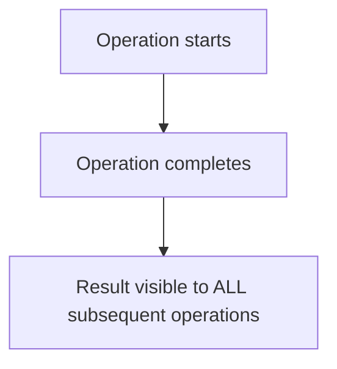

# Consistency Models

## Overview

A **consistency model** defines the contract between a distributed data store and its clients about what values reads can return. It's the rules governing how and when changes made by one operation become visible to others. The spectrum ranges from **strong consistency** (behaves like a single machine) to **eventual consistency** (replicas converge eventually).

## Detailed Explanation

### The Consistency Spectrum


### Linearizability (Strongest)



```
Definition: Every operation appears to take effect atomically at some
point between its invocation and response.

Requirements:
  - Operations appear to execute sequentially
  - The order respects real-time ordering
  - Each read returns the most recent write

Example:
  Time 1: Client A writes X = 1
  Time 2: Client B reads X → must return 1 (not stale value)
  Time 3: Client A writes X = 2
  Time 4: Client B reads X → must return 2

This is the strongest model — behaves like a single copy.
```

### Sequential Consistency

```
Definition: All processes see operations in the same order,
and the order is consistent with each process's program order.

Difference from linearizability:
  - Does NOT require real-time ordering
  - Operations can be reordered as long as program order is preserved

Example:
  P1: Write(X=1), Write(X=2)
  P2: Read(X) → 2, Read(X) → 1
  
  This is sequentially consistent if all processes see:
  Write(X=2), Write(X=1), Read(X)→2, Read(X)→1
  (Operations reordered but consistent across all processes)
  
  NOT linearizable (Write(X=1) happened before Write(X=2) in real time)
  But sequentially consistent (there exists a total order)
```

### Causal Consistency

```
Definition: Operations that are causally related are seen in the same
order by all processes. Concurrent operations may be seen in different orders.

Causally related:
  - Operation A happens before B (A → B)
  - If B reads a value written by A
  - If A and B are on the same process (program order)

Example:
  P1: Write(X=1)
  P2: Read(X)→1, Write(Y=2)  (Y depends on X — causal)
  
  All processes must see Write(X=1) before Write(Y=2)
  
  But if P3 writes Z=3 independently, it can be seen in any order
  relative to X=1 and Y=2.
```

### Eventual Consistency (Weakest Practical)

```
Definition: If no new updates are made, all replicas will eventually
converge to the same value.

Requirements:
  - No guarantee WHEN convergence happens
  - No guarantee what value is returned before convergence
  - Just guarantees eventual convergence

Example:
  Client writes X=1 to Node A
  Node B still has X=0 (not yet replicated)
  Client reads from Node B → gets 0 (stale!)
  After replication delay → Node B has X=1
  Client reads from Node B → gets 1

  "Eventually" could be milliseconds or hours.
```

### Session Consistency

```
Variations that provide guarantees within a client session:

Read Your Writes (RYW):
  After writing, your subsequent reads see your write
  (but other clients may not)

Monotonic Reads:
  Once you read a value, subsequent reads won't return older values
  (reads move forward in time)

Monotonic Writes:
  Your writes appear in the order you issued them
  (writes don't get reordered)

Followed Reads (Read-After-Write):
  If you read a value and then write based on it,
  other reads will see at least that value
```

### Comparison Table

| Model | Guarantees | Performance | Use Case |
|-------|-----------|-------------|----------|
| **Linearizability** | Strongest; real-time ordering | Lowest | Banking, inventory |
| **Sequential** | Total order; program order | Low | Some databases |
| **Causal** | Causal order preserved | Medium | Social media, collaboration |
| **Read Your Writes** | See your own writes | Medium | User profiles |
| **Monotonic Reads** | No going backward | Medium | Dashboards |
| **Eventual** | Eventual convergence | Highest | DNS, CDN, shopping carts |

## Examples

### Example 1: Linearizability Violation

```
Timeline:
  T1: Client A writes X = 1 to Node 1
  T2: Client A waits for acknowledgment
  T3: Client B reads X from Node 2 → gets 0 (stale!)
  T4: Node 1 replicates X=1 to Node 2

Linearizability violated: B's read at T3 should have returned 1
(because A's write at T1 completed before B's read at T3)
```

### Example 2: Causal Consistency Preserved

```
P1 posts a photo, then P2 comments on it:
  P1: Post(photo) → "photo123"
  P2: Read(photo) → "photo123", Comment("Nice!")

Causal: P2's comment causally depends on P1's post
All processes must see: Post before Comment

But P3 liking a different photo has no causal relationship → can be seen in any order
```

### Example 3: Eventual Consistency in Practice

```
Amazon DynamoDB (eventual consistency reads):
  Write X=1 to partition A
  Immediate read from partition B → might return old value
  After replication (typically <1 second) → returns 1

Strongly consistent reads (DynamoDB option):
  Write X=1
  Read with ConsistentRead=true → always returns 1
  But: Higher latency, lower availability
```

### Example 4: Social Media and Causal Consistency

```
Facebook-style feed (causal consistency):
  Alice posts: "I'm engaged!"
  Bob comments: "Congratulations!" (causally depends on Alice's post)
  
  All users must see Alice's post BEFORE Bob's comment.
  
  But Charlie's unrelated post about lunch can appear in any order
  relative to Alice's post — no causal relationship.
  
  This is why causal consistency is ideal for social media:
  - Strong enough to preserve conversation ordering
  - Weak enough to allow high availability and performance
```

## Interview Questions

### Q1: What is linearizability?
**Answer**: Linearizability is the strongest consistency model. Every operation appears to take effect atomically at some point between its invocation and completion. It behaves as if there's a single copy of the data. Every read returns the most recent write, and operations respect real-time ordering.

### Q2: What's the difference between linearizability and sequential consistency?
**Answer**: Both provide a total order of operations. Linearizability additionally requires that the order respects real-time: if operation A completes before operation B starts, A must appear before B. Sequential consistency only requires consistency with each process's program order, allowing reordering across processes.

### Q3: What is eventual consistency?
**Answer**: If no new updates are made, all replicas will eventually converge to the same value. It provides no guarantee on when convergence happens or what value is returned before convergence. It's the weakest practical consistency model but offers the best availability and performance.

### Q4: What is "read your writes" consistency?
**Answer**: After a client writes a value, all its subsequent reads will see that write (or a later one). It doesn't guarantee other clients see the write immediately. It's commonly implemented using session affinity (always read from the node you wrote to) or client-side caching.

### Q5: When would you choose eventual consistency over strong consistency?
**Answer**: When availability and low latency are more important than immediate consistency. Examples: social media feeds (brief staleness acceptable), shopping carts (better to show old cart than fail), DNS (updates propagate over time). Strong consistency is needed for: financial transactions, inventory management, leader election.

## Common Mistakes

1. **Confusing consistency models** — Linearizability, sequential consistency, and eventual consistency are different models with different guarantees. Don't use them interchangeably.
2. **Thinking eventual consistency means "instant"** — "Eventually" has no time bound. It could be milliseconds or hours. The system makes no promise about when.
3. **Ignoring session guarantees** — Even with eventual consistency, session guarantees (read-your-writes, monotonic reads) significantly improve user experience.
4. **Assuming strong consistency is always better** — Strong consistency comes with higher latency and lower availability. The right model depends on the application's requirements.

## Summary

| Model | Guarantee | Trade-off |
|-------|-----------|-----------|
| **Linearizability** | Strongest: real-time, single-copy | High latency, low availability |
| **Sequential** | Total order, program order | Lower latency than linearizability |
| **Causal** | Causal order preserved | Good balance for many apps |
| **Eventual** | Eventual convergence | Highest availability and performance |

## Cross-References

- [CAP Theorem](./cap.md) — The fundamental trade-off
- [Lamport Clocks](./lamport.md) — Used to implement causal consistency
- [Vector Clocks](./vector-clocks.md) — Capturing causal dependencies
- [Quorum Replication](../replication/quorum.md) — Tuning consistency with quorums
- [DynamoDB](../replication/primary-backup.md) — Eventual consistency in practice
