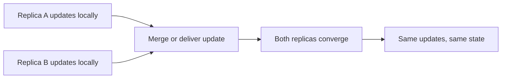

# Conflict-Free Replicated Data Types

A **Conflict-Free Replicated Data Type**, or **CRDT**, is a replicated data
type designed so that replicas can accept updates independently and converge
when they have received the same updates. CRDTs are useful when coordination is
expensive or unavailable: offline-first applications, collaborative editors,
geo-distributed caches, replicated metadata, and intermittently connected
clients.

CRDTs do not make every business conflict disappear. They provide a
mathematically defined merge for the data type. Application semantics still
need to decide what an acceptable concurrent update means.

## Convergence and the consistency model

A useful target is **strong eventual consistency**:

1. Every update is eventually delivered to every healthy replica.
2. Replicas that have processed the same updates reach the same state,
   regardless of delivery order.

For a state-based CRDT, the merge operation should be:

- **Commutative:** \\(merge(a,b) = merge(b,a)\\)
- **Associative:** \\(merge(a,merge(b,c)) = merge(merge(a,b),c)\\)
- **Idempotent:** \\(merge(a,a) = a\\)

These properties make retries, reordering, and duplicate state delivery safe.
Operation-based CRDTs instead make concurrent operations commute and rely on
an operation-delivery layer that does not lose operations and suppresses
unwanted duplicates.

## State-based, operation-based, and delta-based CRDTs

### State-based CRDTs

A replica sends its state, or a state summary, and the receiver merges it with
its own state. The state forms a join-semilattice: local updates move upward in
the lattice and merge computes a least upper bound.

**Strengths:** simple anti-entropy, retries are naturally idempotent, and a
new replica can often bootstrap from a snapshot.

**Costs:** full state can be large; compaction and state transfer need careful
engineering.

### Operation-based CRDTs

A local update produces an operation. Replicas deliver and apply operations.
Operations must preserve causality or commute when concurrent, and the network
must provide reliable enough delivery semantics.

**Strengths:** small incremental messages and efficient live collaboration.

**Costs:** operation identity, causal context, duplicate suppression, and
history storage become part of the protocol.

### Delta-state CRDTs

A delta-state CRDT sends a compact state difference instead of the whole
state. It keeps the algebraic merge properties while reducing anti-entropy
traffic. Deltas still need a strategy for loss, deduplication, batching, and
state repair.

## Common data types

### Grow-only counter

Each replica owns a component of a map. Incrementing updates only the local
component; the value is the sum of component maxima. The merge is pointwise
maximum, so concurrent increments are preserved.

### Positive-negative counter

Use two grow-only counters: one for increments and one for decrements. The
value is `increments - decrements`. This avoids trying to merge a mutable
integer with a non-monotonic operation.

### Last-write-wins register

Attach a deterministic timestamp or logical clock and select the winning value.
This converges, but “last” may mean highest timestamp rather than the update a
user intuitively considers newest. Clock skew and tie-break rules must be
explicit.

### Add-wins and remove-wins sets

A set needs a policy for concurrent add and remove of the same element. An
observed-remove or add-wins set keeps an add that is concurrent with a remove;
a remove-wins set gives deletion priority. Choose based on safety and product
semantics, not convenience.

### Lists and text

Collaborative text uses stable element identifiers and a deterministic ordering
for concurrent inserts. Deletes generally leave tombstones or causal metadata
until the system can prove that all relevant replicas have observed the
operation. Rich text adds range formatting, block structure, and user-intent
questions that make it substantially harder than a plain sequence.

## Causality and clocks

A CRDT can converge without totally ordering every update, but it often needs to
know whether one update observed another.

- **Lamport clocks:** provide a scalar causal order and deterministic tie-breaks,
  but do not identify all concurrency.
- **Vector clocks or version vectors:** represent per-replica knowledge and can
  distinguish happens-before from concurrent updates, at the cost of metadata
  that grows with replica membership.
- **Dotted version vectors and compact causal contexts:** reduce metadata for
  dynamic membership and operation identifiers.
- **Hybrid logical clocks:** combine physical time with a logical component;
  they are useful for ordering and debugging but do not replace a merge policy.

Do not use wall-clock order as proof that an update happened after another
update unless the protocol establishes that relationship.

## Deletes, tombstones, and garbage collection

Insertion-only examples hide the hardest part of CRDT storage: deletion.
A replica that has not yet seen a delete may still send an old add. If the
receiver permanently discards the causal evidence for the delete, the removed
value can reappear.

A safe compaction design needs a **stability condition**, such as an observed
version from every replica that could still deliver the old operation. Common
techniques include:

- Version vectors or acknowledgements to establish a causal frontier.
- Snapshots plus a retained log suffix.
- Replica leases or bounded offline windows.
- Peer-to-peer anti-entropy and explicit resynchronization.

A CRDT that converges mathematically can still grow without bound if history
compaction is not designed as part of the product.

## CRDT versus Operational Transformation

| Concern | CRDT | Operational Transformation |
|---|---|---|
| Coordination | Can accept independent/offline updates | Usually relies on a central ordering service |
| Merge model | Data type and causal metadata | Transform operations against concurrent operations |
| Offline branches | Natural fit | Requires additional synchronization design |
| Metadata | May be substantial, especially for text/history | Central server can keep a compact linear history |
| Rich-text maturity | Depends heavily on data type and implementation | Mature implementations exist for centralized editors |
| Failure mode | Bad datatype semantics or unbounded tombstones | Transformation/server ordering bugs |

This is a workload choice, not a claim that one approach is universally better.
A centralized collaborative editor may prefer OT; an offline-first product,
peer-to-peer tool, or replicated structured document may prefer a CRDT.

## Local-first and production boundaries

CRDTs are a building block for local-first software, where the user's device can
read and modify data without an always-available server. A production system
still needs:

- Authentication and authorization for who may create updates.
- Encryption and key management for replicated data.
- Resource limits on operation history, fan-out, and attachment size.
- Schema/version migration for evolving document types.
- Conflict observability so product teams can inspect surprising merges.
- A repair path when a malicious or corrupted replica sends invalid state.
- Backups and snapshots independent of the live merge protocol.

CRDT convergence does not provide linearizability, serializable transactions,
exactly-once side effects, or protection against malicious updates.

## Interview questions

**What does “conflict-free” mean?**

It means the datatype has a deterministic merge or operation semantics for
concurrent updates. It does not mean the business outcome always matches a
human's preferred interpretation.

**Why are commutativity, associativity, and idempotence important?**

They make merge independent of arrival order, grouping, and duplicate delivery.
Those properties are what allow retries and anti-entropy to converge.

**Why can two replicas both be correct but show different values temporarily?**

Eventual consistency permits a period before all updates are delivered. The
convergence guarantee applies once both replicas have processed the same set of
updates.

**Why are deletes difficult?**

An old add can arrive after a delete. The delete needs causal metadata or a
merge rule that prevents the old add from reviving the item; that metadata cannot
be discarded until the system knows it is stable.

**When would you choose a database transaction instead?**

When an invariant spans multiple records and must be enforced immediately, such
as preventing double spending. A CRDT is appropriate only when the application
can tolerate its consistency model and merge semantics.

## Cross-references

- [Consistency Models](./consistency.md) — eventual consistency and convergence
- [Vector Clocks](./vector-clocks.md) — causality metadata
- [Gossip Protocol](./gossip.md) — anti-entropy and dissemination
- [Replication](../replication/README.md) — primary-backup and multi-primary trade-offs
- [Consensus](../consensus/README.md) — coordination when CRDT semantics are insufficient
- [Distributed Transactions](../../backend/patterns/distributed-transactions.md) — strong cross-record invariants
- [Transactional Outbox and CDC](../../backend/patterns/cdc-outbox.md) — reliable event publication
- [DSA probabilistic structures](../../dsa/chapters/ch79-probabilistic-ds.md) — approximate versus convergent state

## References

- [CRDT.tech overview](https://crdt.tech/) — convergence and optimistic replication
- [CRDT.tech glossary](https://crdt.tech/glossary) — state-based, operation-based, delta, and SEC terminology
- [CRDT papers bibliography](https://crdt.tech/papers_bib.html)
- [Preguiça, Baquero, and Shapiro: Conflict-free Replicated Data Types](https://arxiv.org/abs/1805.06358)
- [Shapiro et al.: Conflict-free Replicated Data Types](https://hal.inria.fr/inria-00609399/document)
- [Ink and Switch: Local-first software](https://www.inkandswitch.com/essay/local-first/)
- [Ink and Switch: Peritext rich-text CRDT](https://www.inkandswitch.com/peritext/)
- [Automerge](https://automerge.org/) and [Yjs](https://docs.yjs.dev/)
