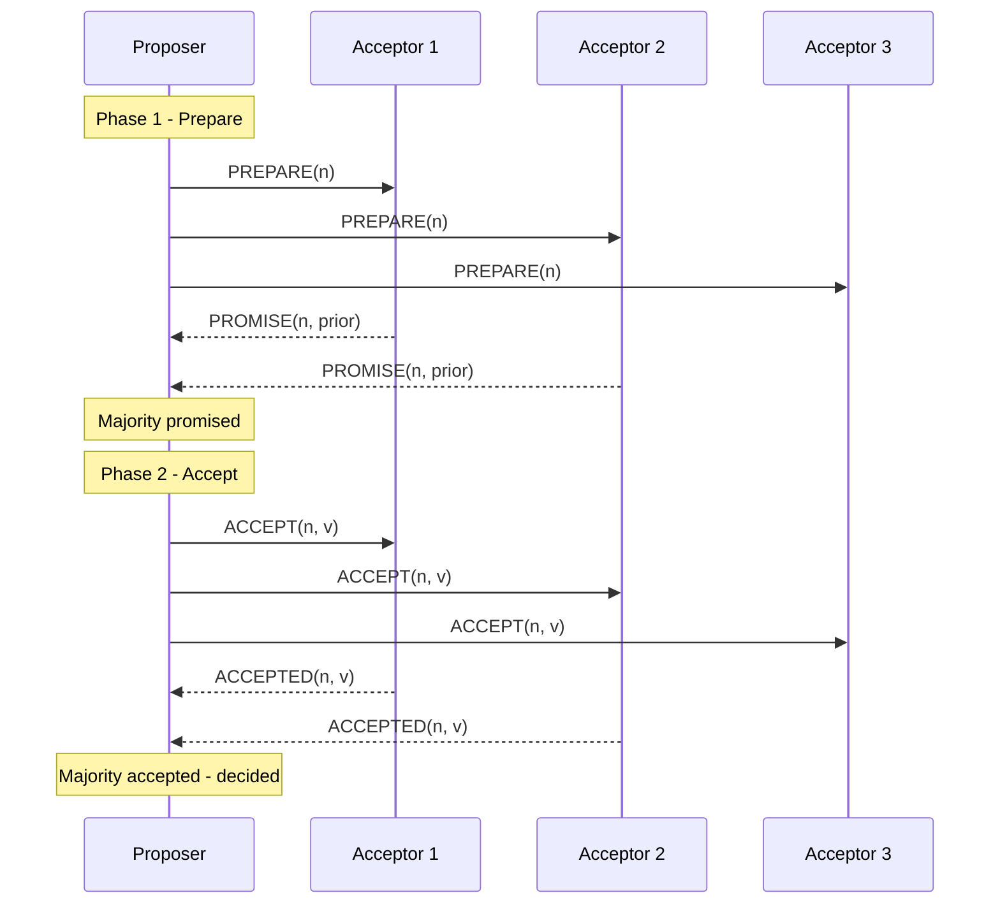
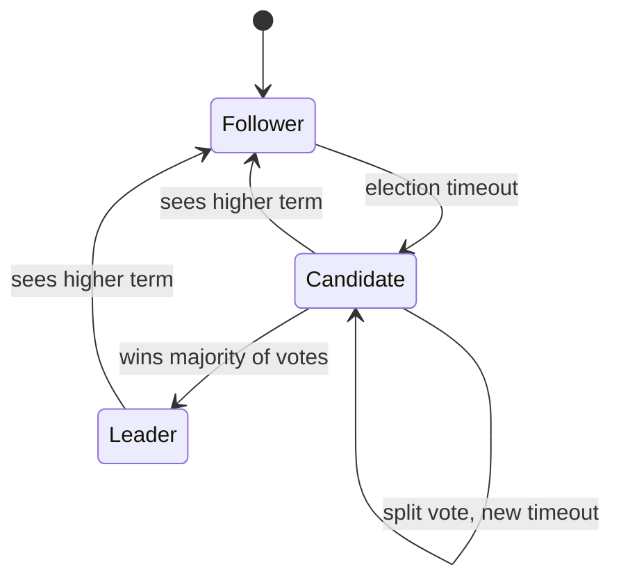
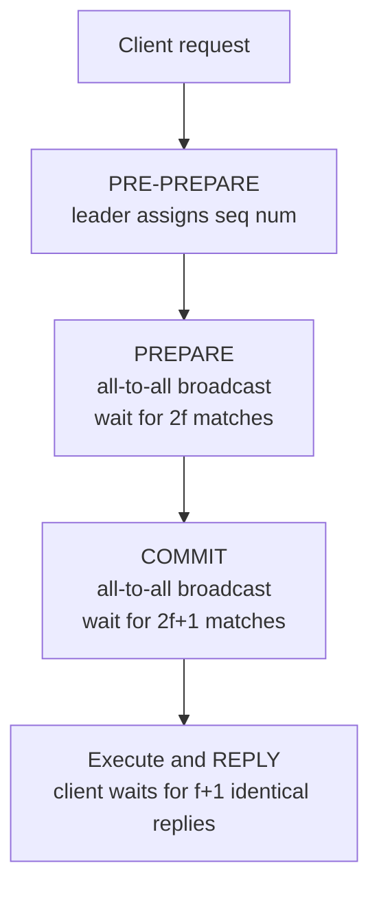
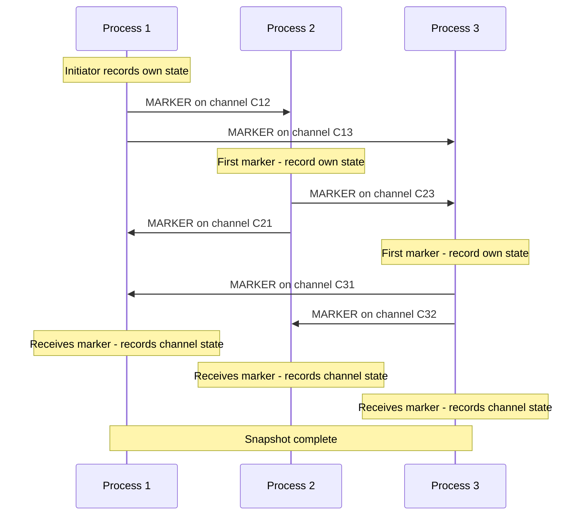

# Distributed Algorithms

## Overview

This page is the **unifying tour** of Section 19 — the algorithmic core of distributed
systems. Each family here (consensus, leader election, snapshots, logical clocks,
Byzantine agreement, gossip, distributed transactions, quorum systems, CRDTs) has a
dedicated deep-dive page elsewhere under [`src/distributed/`](./). This page states the
**problem** each family solves, the **key ideas** of the canonical algorithm, a
**comparison table** across variants, and cross-references to the full pages.

The families cluster around three concerns: **agreement** (consensus, BFT, leader
election, transactions, quorums — "how do independent nodes decide on the same thing?"),
**ordering** (logical clocks, snapshots — "without a global clock, how do we order events
and reconstruct state?"), and **dissemination** (gossip, anti-entropy, CRDTs — "how do
updates spread without a coordinator and still converge?"). The [FLP impossibility
result](./flp.md) hangs over all of agreement: deterministic consensus is impossible in
a purely asynchronous system with even one crash, so every practical algorithm here
bypasses FLP with partial synchrony, failure detectors, or randomization.

## The Algorithm Landscape

```mermaid
graph TD
    ROOT["Distributed Algorithms"] --> ORDER["Ordering and Time"]
    ROOT --> CONSENSUS["Consensus"]
    ROOT --> BFT["Byzantine Agreement"]
    ROOT --> LEADER["Leader Election"]
    ROOT --> SNAP["Snapshots"]
    ROOT --> GOSSIP["Gossip and Anti-Entropy"]
    ROOT --> TXN["Distributed Transactions"]
    ROOT --> QUORUM["Quorum Systems"]
    ROOT --> CRDT["CRDTs"]

    ORDER --> LAMPORT["Lamport clocks"]
    ORDER --> VECTOR["Vector clocks"]
    ORDER --> DOTTED["Dotted version vectors"]
    CONSENSUS --> PAXOS["Paxos / Multi-Paxos / Fast Paxos"]
    CONSENSUS --> RAFT["Raft"]
    CONSENSUS --> EPAXOS["EPaxos"]
    BFT --> PBFT["PBFT"]
    BFT --> HOTSTUFF["HotStuff"]
    BFT --> TENDERMINT["Tendermint"]
    LEADER --> BULLY["Bully"]
    LEADER --> RING["Chang-Roberts ring"]
    SNAP --> CL["Chandy-Lamport"]
    SNAP --> LAITYANG["Lai-Yang"]
    GOSSIP --> SWIM["SWIM"]
    GOSSIP --> HYPAR["hyParView"]
    TXN --> TXNS["2PC / 3PC / Saga"]
```

## Logical Clocks and Causal Ordering

Lamport (1978) defined the **happens-before** relation \\( \rightarrow \\): on the same
process \\( a \rightarrow b \\) if \\( a \\) precedes \\( b \\); across processes if
\\( a \\) is the send of a message and \\( b \\) its receive; transitively composed.
Two events are **concurrent** (\\( a \parallel b \\)) when neither
\\( a \rightarrow b \\) nor \\( b \rightarrow a \\).

**Lamport clocks** assign each process an integer counter, increment on every event, and
on receive set \\( C \leftarrow \max(C, t) + 1 \\). They satisfy the clock condition
\\( a \rightarrow b \Rightarrow C(a) < C(b) \\) but the converse is **not** true —
\\( C(a) < C(b) \\) does not imply causality. See [Lamport Clocks](./lamport.md).

**Vector clocks** (Mattern 1989, Fidge 1988) extend this to a vector \\( V[1..N] \\), one
entry per process. Comparison is componentwise: \\( V_1 < V_2 \\) iff every
\\( V_1[j] \le V_2[j] \\) and at least one is strictly less. If neither dominates, the
events are concurrent — vector clocks detect concurrency, Lamport clocks cannot. See
[Vector Clocks](./vector-clocks.md).

**Dotted version vectors** (Almeida et al., 2014) fix a subtle bug when a node crashes
and restarts with a reset counter: they split each entry into a base vector plus a scalar
**dot** for a single event, transferred on merge. Used in Riak and CouchDB.

| Clock Type | Detects Happens-Before | Detects Concurrency | Size | Typical Use |
|------------|----------------------|---------------------|------|-------------|
| Lamport scalar | Yes | No | \\( O(1) \\) | Order within a single service, total-order broadcast |
| Vector | Yes | Yes | \\( O(N) \\) | Causal consistency, Dynamo-style conflict detection |
| Dotted version vector | Yes | Yes | \\( O(N) + 1 \\) | Causality with node restarts (Riak) |
| Version vector (per-key) | Yes (per key) | Yes (per key) | \\( O(N) \\) | Per-key causality in key-value stores |
| Hybrid Logical Clock (HLC) | Yes | No | \\( O(1) \\) + physical | Spanner-style cross-DC ordering (CockroachDB, YugabyteDB) |

HLCs (Kulkarni et al., 2014) pair a physical timestamp with a logical counter to preserve
happens-before while staying close to wall-clock time. A protocol is **causally ordered**
if a message \\( m_2 \\) causally after \\( m_1 \\) is delivered after \\( m_1 \\);
**total-order (atomic) broadcast** is stronger — all processes deliver in the same order,
as Raft's log replication provides.

## Consensus

\\( N \\) processes each propose a value. A consensus protocol must satisfy **agreement**
(no two correct processes decide differently), **validity** (the decided value was
proposed), and **termination** (every correct process eventually decides). The [FLP
theorem](./flp.md) rules out a deterministic solution in a purely asynchronous system;
practical algorithms assume **partial synchrony** (Dwork, Lynch, Stockmeyer, 1988) and
use **failure detectors** (Chandra & Toueg, 1996).

### Paxos

Lamport's Paxos (1998; "Paxos Made Simple" 2001) uses three roles — proposer, acceptor,
learner — and runs in two phases per value:

In **Phase 1 (Prepare)** the proposer asks acceptors to promise not to accept any proposal
numbered less than \\( n \\); acceptors reply with the highest-numbered proposal they
have already accepted (if any). In **Phase 2 (Accept)** the proposer picks a value — the
highest-numbered previously accepted value, or its own if none — and asks acceptors to
accept \\( (n, v) \\). A value is chosen when a majority accepts it. See
[Paxos](../consensus/paxos.md).

**Multi-Paxos** runs a sequence of Paxos instances (one per log slot). A stable
**distinguished proposer** (leader) skips Phase 1 for every subsequent entry after the
first, collapsing per-entry cost from two round trips to one. **Fast Paxos** (Lamport,
2004) lets clients send `ACCEPT-FAST` directly to acceptors, saving a round trip on the
common path but requiring a larger quorum \\( \\lceil 3N/4 \\rceil + 1 \\) to recover from
collisions; the leader falls back to classic Paxos to break ties.

### Raft

Raft (Ongaro & Ousterhout, USENIX ATC 2014) was designed for understandability. It
decomposes consensus into leader election, log replication, and safety, and rotates
through **terms** (monotonically numbered epochs). Each term has at most one leader.

A leader appends each client command to its log, replicates it via `AppendEntries`, and
commits once a majority acknowledges. Raft's safety invariants — election safety, leader
completeness, log matching, and state machine safety — together ensure two leaders in
different terms can never commit conflicting entries. See [Raft](../consensus/raft.md).

### EPaxos

**EPaxos** (SOSP 2013) removes the leader bottleneck for non-conflicting commands. Each
replica proposes commands directly; the conflict detector uses the command's dependency
set (key-based conflict analysis) to determine ordering. Non-conflicting commands commit
in a single round trip (leaderless); conflicting commands pay one extra round (the "slow
path"). For low-conflict workloads EPaxos gives ~2× lower latency than Multi-Paxos across
multiple data centers.

### Consensus Algorithm Comparison

| Algorithm | Fault Model | Nodes Needed | Leader | Rounds (common path) | Message Complexity | Used By |
|-----------|-------------|--------------|--------|----------------------|--------------------|---------|
| Paxos (basic) | Crash | \\( 2f+1 \\) | Per-instance | 2 | \\( O(N) \\) | Textbook, Chubby |
| Multi-Paxos | Crash | \\( 2f+1 \\) | Stable | 1 (after election) | \\( O(N) \\) | Spanner, Cassandra LWT |
| Fast Paxos | Crash | \\( 2f+1 \\) | Optional | 1 (collision-free) | \\( O(N) \\), large quorum | Research |
| Raft | Crash | \\( 2f+1 \\) | Required | 1 (after election) | \\( O(N) \\) | etcd, Consul, TiKV, CockroachDB |
| EPaxos | Crash | \\( 2f+1 \\) | None | 1 (no conflict) / 2 (conflict) | \\( O(N) \\) to \\( O(N^2) \\) | Research, prototypes |
| PBFT | Byzantine | \\( 3f+1 \\) | Required | 3 | \\( O(N^2) \\) | Hyperledger Fabric (early) |
| HotStuff | Byzantine | \\( 3f+1 \\) | Rotating | 4 (or 3 with pipeline) | \\( O(N) \\) per round | Diem/Libra |
| Tendermint | Byzantine | \\( 3f+1 \\) | Rotating | 3 | \\( O(N^2) \\) | Cosmos |

## Byzantine Fault Tolerance

A **Byzantine** fault is arbitrary behaviour — a node can lie, send conflicting messages,
or collude. Lamport, Shostak, and Pease (1982) proved Byzantine agreement requires
\\( N \ge 3f+1 \\) to tolerate \\( f \\) faults (see [Byzantine Faults](./byzantine-faults.md)).
The threshold is tighter than crash-fault consensus because faulty nodes can equivocate,
so honest nodes must exchange enough messages to detect the inconsistency.

### PBFT

Castro and Liskov's **PBFT** (OSDI 1999; TOCS 2002) was the first practical BFT protocol.
It introduced the now-standard three-phase structure:

1. **Pre-prepare**: the primary (leader) assigns a sequence number and broadcasts the
   request.
2. **Prepare**: each replica broadcasts its prepare; once it has \\( 2f \\) prepares from
   others (\\( 2f+1 \\) including itself), it is **prepared**.
3. **Commit**: each replica broadcasts a commit; once it has \\( 2f+1 \\) commits, it
   executes and replies to the client.

The prepare phase guarantees all honest nodes agree on the ordering within a view; the
commit phase guarantees enough honest nodes have recorded that agreement so a view change
cannot pick a different ordering. PBFT's \\( O(N^2) \\) complexity caps it at ~20–100
replicas. See [PBFT](../consensus/pbft.md).

### HotStuff

HotStuff (Yin et al., PODC 2019) reframes BFT consensus around a **rotating leader** and
**linear** message-complexity voting using threshold signatures. Each replica signs one
**quorum certificate** (QC) per round; aggregation collapses what would have been
\\( O(N^2) \\) votes into a constant-size artifact. The four phases — Prepare, Pre-commit,
Commit, Decide — add an extra phase relative to PBFT, but **each is linear** in messages.
Pipelining collapses three phases into one round trip in steady state. HotStuff powers
DiemBFT (LibraBFT) and AptosBFT.

### Tendermint

Tendermint (Buchman, 2016) is the consensus engine behind Cosmos. It uses a rotating
leader, three phases (Propose, Prevote, Precommit), and locks to prevent equivocation
across rounds. Like PBFT it is \\( O(N^2) \\), but it adds **Proof-of-Stake** validator
selection on top — the canonical "permissioned BFT + PoS" design.

### BFT Protocol Comparison

| Protocol | Phases | Per-round Messages | Leader | Linear View Change | Threshold Sig | Used In |
|----------|--------|-------------------|--------|-------------------|---------------|---------|
| PBFT | 3 (PP/Prep/Commit) | \\( O(N^2) \\) | Stable until view change | No (costly) | No | Hyperledger Fabric (early) |
| Tendermint | 3 (Propose/Prevote/Precommit) | \\( O(N^2) \\) | Rotating per round | No | No | Cosmos |
| HotStuff | 4 (Prep/PreCommit/Commit/Decide) | \\( O(N) \\) per phase | Rotating, pipelined | Yes | Yes | Diem, Aptos |
| Zyzzyva | Speculative 1-phase, fallback 3 | \\( O(N) \\) common, \\( O(N^2) \\) recovery | Stable | No | No | Research |
| DiemBFT (HotStuff variant) | 3 (pipelined) | \\( O(N) \\) | Rotating | Yes | Yes | Diem blockchain |

## Leader Election

Leader election picks a single coordinator from a set of processes — a building block for
Paxos's distinguished proposer, Raft's leader, and PBFT's primary. Two classic
crash-fault algorithms anchor the design space.

**Bully Algorithm** (Garcia-Molina, 1982). When \\( P \\) notices the current leader is
unresponsive, it sends an **ELECTION** message to all higher-ID processes. If none
respond, \\( P \\) declares itself leader and notifies lower-ID processes; otherwise
\\( P \\) waits for a higher-ID process to take over. The highest-ID live process always
wins — hence "bully". Message complexity is \\( O(N^2) \\) worst case; the algorithm
tolerates crash-stop failures and assumes reliable failure detection (synchronous
timeouts).

**Chang-Roberts Ring** (1979). Processes are arranged in a logical ring; each knows only
its successor. \\( P \\) sends an ELECTION message containing its own ID to its
successor; each recipient appends its ID and forwards. When the message returns to the
initiator, the highest ID in the list is elected; a second LEADER message announces the
result around the ring. Message complexity: \\( O(N^2) \\) worst case, \\( O(N \log N) \\)
average.

| Algorithm | Topology | Message Complexity | Failures Tolerated | Notable Property |
|-----------|----------|-------------------|--------------------|------------------|
| Bully | Complete graph | \\( O(N^2) \\) | Crash-stop | Highest-ID wins deterministically |
| Chang-Roberts | Unidirectional ring | \\( O(N^2) \\) worst, \\( O(N \log N) \\) avg | Crash-stop | Each node needs only successor pointer |
| Hirschberg-Sinclair | Bidirectional ring | \\( O(N \log N) \\) | Crash-stop | Optimal logarithmic messages |
| Raft leader election | Complete graph | \\( O(N) \\) per term | Crash-stop | Randomized timeouts avoid livelock |
| PBFT view change | Complete graph | \\( O(N^2) \\) | Byzantine | Byzantine-tolerant leader rotation |

## Distributed Snapshots

A **distributed snapshot** records a consistent global state with no global clock or
shared memory. The recorded state must be a **consistent cut**: if event \\( b \\) is in
the cut and \\( a \rightarrow b \\), then \\( a \\) is also in the cut — no message is
"received" without being "sent".

**Chandy-Lamport** (1985). The initiator records its own state and sends a **marker** on
every outgoing channel. When a process receives a marker on channel \\( c \\):

- If it has not yet recorded its state, it records its state **first**, records the state
  of \\( c \\) as empty, and sends a marker on every outgoing channel.
- If it has already recorded its state, it records the state of \\( c \\) as the sequence
  of messages received on \\( c \\) between its snapshot and the marker.

The algorithm terminates when every process has received a marker on every incoming
channel. No in-flight message can be lost in the snapshot — every message is either in
the sender's state, the receiver's state, or the recorded channel state between them.
Chandy-Lamport underpins checkpointing in Flink, Spark Structured Streaming, and
distributed deadlock detection. **Lai-Yang** (1987) generalizes it to **non-FIFO**
channels by piggybacking a colour (snapshot epoch) on every application message.

## Gossip and Anti-Entropy

Gossip (epidemic) protocols disseminate information without a central coordinator; each
node periodically exchanges state with a small random subset of peers. Convergence is
\\( O(\log N) \\) rounds with high probability. See [Gossip Protocol](./gossip.md).

**SWIM** (Gupta, Aguilera, van Renesse, DSN 2002) decouples failure detection from
dissemination. Each member pings one random peer per round; on no ack, it asks \\( k \\)
random intermediaries to probe the same target — **indirect probing** distinguishes a
slow node from a partitioned one. A suspected node enters a **suspicion** state with a
timeout; only after the timeout does membership mark it as down. SWIM powers HashiCorp
Consul, Nomad, and memberlist.

**hyParView** (Matos et al., DSN 2007) maintains a small **active view** (constant) plus
a larger **passive view** of candidate replacements; the passive view repairs the active
view when a peer fails. hyParView sustains gossip on clusters of thousands of nodes
without any node needing a full membership list, and pairs with **Plumtree** for
efficient tree-based broadcast.

Gossip is probabilistic — some updates may be slow to reach every node. Systems pair
gossip with **anti-entropy** mechanisms that guarantee eventual convergence:

| Mechanism | How It Works | Cost | Used By |
|-----------|-------------|------|---------|
| **Merkle tree repair** | Hash tree of key ranges; peers compare roots and re-sync differing subtrees | \\( O(\log N) \\) per repair | Cassandra, Riak, DynamoDB |
| **Read repair** | On a quorum read, the coordinator repairs the stale replica in the background | One extra write per stale read | Cassandra, Dynamo, Riak |
| **Hinted handoff** | If a replica is down, the coordinator stores the write as a "hint" for that node and replays it when the node recovers | Disk space proportional to downtime | Cassandra, DynamoDB, Kafka |
| **Full anti-entropy scan** | Periodic full-state comparison | \\( O(N \cdot S) \\) per round | Riak's active anti-entropy |

The combination — gossip for fast propagation, Merkle/read repair for deterministic
convergence — is the design pattern of every Dynamo-style store.

## Quorum Systems

A **quorum system** is a collection of subsets (quorums) of replicas such that any two
quorums intersect. Reads and writes contact a quorum; intersection guarantees reads see
the latest write.

| Quorum Type | Configuration | Read/Write Sizes | Fault Tolerance | Use Case |
|-------------|--------------|----------------|-----------------|----------|
| **Majority** | \\( N = 2f+1 \\), quorum \\( = \lceil N/2 \rceil + 1 \\) | \\( R + W > N \\) | \\( f < N/2 \\) crash | Dynamo, Cassandra default |
| **Byzantine** | \\( N = 3f+1 \\), quorum \\( = 2f+1 \\) | \\( R + W > 2N/3 \\) for safety | \\( f < N/3 \\) Byzantine | PBFT, HotStuff, Tendermint |
| **Static** (grid / tree) | Replicas in a 2D grid or hierarchical tree | Smaller quorums (\\( O(\sqrt{N}) \\)) | Lower — design-dependent | Read-heavy systems |
| **Dynamic** | Quorum set recomputed per epoch | Variable | Survives configuration changes | Raft joint-consensus, Spanner |
| **Byzantine quorum with trusted client** | Client writes to all replicas, reads from \\( f+1 \\) | \\( W = N \\), \\( R = f+1 \\) | \\( f < N/3 \\) | Some blockchain light clients |

The **read-write quorum intersection** \\( R + W > N \\) (crash-fault) is the workhorse
rule; for Byzantine quorums the analogous rule is \\( R + W > 2N/3 \\) when
\\( W > N/3 \\), because the write quorum must overrule up to \\( f \\) lying replicas in
every read. See [Quorum Replication](../replication/quorum.md) and Gifford (1979) for the
original quorum consensus paper.

## Distributed Transactions

A distributed transaction commits updates across multiple resource managers. The two
classic approaches are **atomic commit** (2PC, 3PC) — strong, locks resources, blocks on
coordinator failure — and **eventually-consistent compensation** (sagas) — weaker
isolation, no blocking, but no automatic rollback.

**Two-Phase Commit (2PC)** — Gray (1978), Lampson & Sturgis (1979). A coordinator drives
two phases: (1) **Prepare** — asks every participant to vote YES/NO; a YES means the
participant has written the update to stable storage and **locks** the resource until
told otherwise. (2) **Commit/Abort** — if all vote YES, the coordinator sends COMMIT;
otherwise ABORT. If the coordinator crashes after some participants voted YES but before
the decision, those participants **block** holding their locks — the classic blocking 2PC
problem. The coordinator is also a single point of failure unless itself replicated
(usually with Paxos/Raft, as in Spanner's Paxos group per shard).

**Three-Phase Commit (3PC)** — Skeen & Stonebraker (1983). Adds a **PreCommit** phase so
a participant can determine the coordinator's decision even if the coordinator crashes:
(1) CanCommit? (vote), (2) PreCommit (acknowledged but not applied), (3) DoCommit
(finalize). If the coordinator crashes after PreCommit, the survivors can hold an
election and decide among themselves (they all know a majority voted YES). 3PC eliminates
the blocking failure of 2PC — **but only under the synchronous network assumption**.
Under partitions 3PC can still violate safety (two disjoint partitions may independently
decide), so it is rarely used in production; the more common fix is "Paxos-commit"
(consensus on the commit decision, as in Spanner).

**Saga** (Garcia-Molina & Salem, 1987). Splits a long-running transaction into a sequence
of local transactions \\( T_1, T_2, \ldots, T_n \\), each committing independently. For
every \\( T_i \\) the system defines a **compensating transaction** \\( C_i \\) that
semantically undoes its effect (e.g., "refund payment", "release inventory"). If the saga
fails at \\( T_k \\), the system runs \\( C_{k-1}, C_{k-2}, \ldots, C_1 \\) in reverse.
No isolation between steps, but no global lock — preferred for microservices that value
availability over strict isolation.

| Protocol | Atomicity | Isolation | Blocking on Coordinator Failure | Network Assumption | Used In |
|----------|----------|-----------|--------------------------------|--------------------|---------|
| 2PC | Strong (atomic commit) | Strong (locks held) | Yes — participants block | Asynchronous | XA, Spanner (with Paxos), Kafka transactions |
| 3PC | Strong | Strong | No (under sync) | **Synchronous** (bounded delays) | Rarely used in production |
| Saga | Eventual (compensating) | None (steps visible) | No | Asynchronous | Microservices choreography, Temporal, Camunda |
| Paxos Commit | Strong | Strong | No (consensus on commit) | Partially synchronous | Spanner, CockroachDB |
| TCC (Try-Confirm-Cancel) | Strong (per-resource) | Strong (per-resource reservation) | Resource-level only | Asynchronous | E-commerce payments, booking systems |

## CRDTs (Brief)

Conflict-Free Replicated Data Types (Shapiro et al., 2011) trade strong consistency for
**strong eventual consistency**: replicas that have received the same set of updates are
guaranteed to converge without coordination. The merge operation must be **commutative,
associative, and idempotent** — so order of delivery and duplicates do not affect the
result. Common CRDTs: G-Counter, PN-Counter, LWW-register, add-wins / remove-wins sets.
See [CRDTs](./crdts.md). Production users include Riak, Redis CRDT, and Yjs / Automerge
for collaborative editing.

## Interview Questions

### Q1: Why does Paxos need a majority quorum, and why is \\( 2f+1 \\) the minimum?

Any two majorities must intersect in at least one node. That intersecting node ensures a
value accepted by an earlier majority is visible to every later majority, preserving
safety. The minimum \\( 2f+1 \\) follows because \\( f \\) nodes may crash; a majority of
\\( 2f+1 \\) is \\( f+1 \\), and any two \\( f+1 \\)-subsets of a \\( 2f+1 \\)-set share
at least one element. With \\( 2f \\) nodes this fails — two disjoint \\( f \\)-subsets
could each be a "majority" with no overlap.

### Q2: How does EPaxos avoid the leader bottleneck that Multi-Paxos has?

Multi-Paxos routes every command through a stable leader, limiting throughput to what one
node can sequence. EPaxos exploits **commutativity**: if two commands touch disjoint keys
they can be proposed by different replicas in parallel with no coordination. Each replica
proposes directly to a fast quorum \\( \\lceil 3N/4 \\rceil + 1 \\); the command commits
in one round trip if no conflict is detected. Conflicting commands trigger a slow-path
dependency-graph resolution taking one extra round. For low-conflict workloads EPaxos
gives ~2× lower latency than Multi-Paxos across multiple data centers.

### Q3: Walk through a Chandy-Lamport snapshot when a message is in flight.

Suppose \\( P_1 \\) sends application message \\( m \\) to \\( P_2 \\) on channel
\\( C_{12} \\), then \\( P_1 \\) initiates a snapshot. \\( P_1 \\) records its state
(post-send) and sends a marker on \\( C_{12} \\). Two cases:

- If \\( m \\) arrives at \\( P_2 \\) **before** the marker, \\( P_2 \\) records its
  state after receiving \\( m \\); \\( C_{12} \\) is recorded as empty. \\( m \\) is
  captured in \\( P_2 \\)'s state.
- If the marker arrives at \\( P_2 \\) **before** \\( m \\), \\( P_2 \\) records its
  state (pre-\\( m \\)) and starts recording \\( C_{12} \\); when \\( m \\) arrives
  later, \\( m \\) becomes part of the recorded channel state.

Either way \\( m \\) appears in exactly one place in the snapshot — sent but not lost.

### Q4: Why is HotStuff's view change linear when PBFT's is quadratic?

PBFT's view change requires every replica to broadcast its prepared state to every other
replica — \\( O(N^2) \\) messages — so the new leader can prove a quorum agreed on each
prepared sequence number. HotStuff instead uses **threshold signatures**: each replica
signs a single quorum certificate (QC) per round, and aggregation collapses those \\( N \\)
signatures into one constant-size artifact. The new leader collects \\( 2f+1 \\) signed
QCs (linear in messages) and forwards the aggregated QC, which any replica can verify in
constant time. This is what makes HotStuff practical for hundreds of validators.

### Q5: Compare 2PC and 3PC under a coordinator crash.

In 2PC, if the coordinator crashes after some participants have voted YES but before
sending COMMIT/ABORT, those participants block holding locks — they cannot independently
decide because they don't know if other participants voted YES or NO. In 3PC, the extra
PreCommit phase means if the coordinator crashes **after** PreCommit, every live
participant already knows a quorum voted YES, so they can hold an election and proceed to
commit. 3PC therefore avoids blocking failures — but only under the **synchronous
network** assumption. In a real asynchronous network, 3PC can violate safety: two
partitions can each decide independently (one commits, one aborts), corrupting the data.
The production fix is to run the commit decision through consensus (Paxos Commit in
Spanner) so it survives both crashes and partitions.

### Q6: When would you choose a Saga over 2PC?

Choose a saga when (a) the transaction spans multiple services owned by different teams
with no shared coordinator; (b) you need high availability and cannot afford to hold
locks across services while a coordinator commits; (c) the business can tolerate eventual
consistency and explicit compensating actions (e.g., refund, release reservation). Choose
2PC when participants are within a single trust boundary (one database cluster, like
Spanner), strong isolation is required (e.g., financial ledger updates that must
atomically credit and debit), and the latency of two-phase commit is acceptable.

### Q7: Why do BFT protocols need \\( 3f+1 \\) nodes when crash-fault protocols only need \\( 2f+1 \\)?

In crash-fault consensus the \\( f \\) crashed nodes simply don't respond and the live
nodes proceed with a majority of \\( f+1 \\) out of \\( 2f+1 \\). In Byzantine agreement,
faulty nodes can actively lie and equivocate — send different values to different peers.
To outvote \\( f \\) liars, the honest nodes need \\( 2f+1 \\) matching messages, of
which at most \\( f \\) could be from faulty nodes, leaving at least \\( f+1 \\) honest.
For \\( 2f+1 \\) honest nodes to exist in the system, the total must be at least
\\( 3f+1 \\) (\\( 2f+1 \\) honest + \\( f \\) faulty). Below that threshold the liars
can fork honest nodes into incompatible views.

### Q8: How does a hybrid logical clock (HLC) improve on Lamport clocks?

A Lamport clock preserves happens-before but bears no relation to wall-clock time — two
events seconds apart may have logical timestamps differing by 1. A hybrid logical clock
(Kulkarni et al., 2014) pairs a physical timestamp \\( p \\) with a logical counter
\\( l \\). On every event, the node sets \\( p \leftarrow \max(p_{\text{local}},
p_{\text{recv}}) \\); if the physical component is unchanged, it increments \\( l \\),
otherwise it resets \\( l \\) to 0. The result preserves
\\( a \rightarrow b \Rightarrow \text{HLC}(a) < \text{HLC}(b) \\) **and** stays close to
wall-clock time, which lets systems like CockroachDB and YugabyteDB implement
serializable cross-shard transactions with bounded clock-skew uncertainty — the same role
TrueTime plays in Spanner, but without GPS/atomic clocks.

## Cross References

- [Distributed Systems Overview](../overview.md)
- [Fundamentals README](./README.md) — CAP, FLP, consistency models at a glance
- [Lamport Clocks](./lamport.md) · [Vector Clocks](./vector-clocks.md) · [FLP Impossibility](./flp.md)
- [Byzantine Faults](./byzantine-faults.md) · [Gossip Protocol](./gossip.md) · [CRDTs](./crdts.md)
- [Consensus README](../consensus/README.md) · [Paxos](../consensus/paxos.md) · [Raft](../consensus/raft.md) · [PBFT](../consensus/pbft.md)
- [Quorum Replication](../replication/quorum.md) · [Consistency Models](./consistency.md)
- [Distributed Transactions](../../backend/patterns/distributed-transactions.md) — 2PC deep dive

## References

- Lamport, L. — *Time, Clocks, and the Ordering of Events in a Distributed System* (CACM 1978) — https://lamport.azurewebsites.net/pubs/time-clocks.pdf
- Lamport, L. — *The Part-Time Parliament* (TOCS 1998) — https://lamport.azurewebsites.net/pubs/lamport-paxos.pdf
- Lamport, L. — *Paxos Made Simple* (2001) — https://lamport.azurewebsites.net/pubs/paxos-simple.pdf
- Lamport, L. — *Fast Paxos* (2004) — https://lamport.azurewebsites.net/pubs/fast-paxos.pdf
- Ongaro, D., Ousterhout, J. — *In Search of an Understandable Consensus Algorithm (Raft)* (USENIX ATC 2014) — https://raft.github.io/raft.pdf
- Fischer, M., Lynch, N., Paterson, M. — *Impossibility of Distributed Consensus with One Faulty Process* (JACM 1985) — https://groups.csail.mit.edu/tds/papers/Lynch/jacm85.pdf
- Castro, M., Liskov, B. — *Practical Byzantine Fault Tolerance* (OSDI 1999; TOCS 2002) — https://pmg.csail.mit.edu/papers/osdi99.pdf
- Yin, M. et al. — *HotStuff: BFT Consensus with Linearity and Responsiveness* (PODC 2019) — https://arxiv.org/abs/1803.05069
- Buchman, E. — *Tendermint: Byzantine Fault Tolerance in the Age of Blockchains* (M.Sc. thesis, 2016) — https://allquantor.at/blockchainbib/pdf/buchman2016.pdf
- Chandy, K. M., Lamport, L. — *Distributed Snapshots: Determining Global States of Distributed Systems* (TOCS 1985) — https://lamport.azurewebsites.net/pubs/chandy-lamport.pdf
- Lai, T., Yang, T. — *On Distributed Snapshots* (1987)
- Garcia-Molina, H. — *Elections in a Distributed Computing System* (IEEE TC 1982); Chang, E., Roberts, R. — *Decentralized Extrema-Finding in Circular Configurations* (CACM 1979)
- Lamport, L., Shostak, R., Pease, M. — *The Byzantine Generals Problem* (TOPLAS 1982) — https://lamport.azurewebsites.net/pubs/byz.pdf
- Demers, A. et al. — *Epidemic Algorithms for Replicated Database Maintenance* (PODC 1987) — https://dl.acm.org/doi/10.1145/41840.41841
- Gupta, I., Aguilera, M. K., van Renesse, R. — *SWIM* (DSN 2002) — https://www.cs.cornell.edu/~asdas/research/dsn02-SWIM.pdf; Matos, M. et al. — *hyParView* (DSN 2007)
- Almeida, P. S. et al. — *Dotted Version Vectors* (DAIS 2014); Kulkarni, S. et al. — *Logical Physical Clocks (HLC)* (OPODIS 2014) — https://www.cse.buffalo.edu/tech-reports/2014-04.pdf
- Shapiro, M. et al. — *Conflict-Free Replicated Data Types* (SSS 2011) — https://hal.inria.fr/inria-00609399/document
- Dwork, C., Lynch, N., Stockmeyer, L. — *Consensus in the Presence of Partial Synchrony* (JACM 1988); Chandra, T. D., Toueg, S. — *Unreliable Failure Detectors for Reliable Distributed Systems* (JACM 1996)
- Gray, J. — *Notes on Data Base Operating Systems* (1978, original 2PC); Skeen, D., Stonebraker, M. — *A Formal Model of Crash Recovery in a Distributed System* (1983, 3PC)
- Garcia-Molina, H., Salem, K. — *Sagas* (SIGMOD 1987) — https://www.cs.cornell.edu/andru/cs711/2002fa/reading/sagas.pdf; Gifford, D. K. — *Weighted Voting for Replicated Data* (SOSP 1979)
- Lynch, N. — *Distributed Algorithms* (Morgan Kaufmann, 1996); Cachin, C., Guerraoui, R., Rodrigues, L. — *Introduction to Reliable and Secure Distributed Programming* (2nd ed., Springer, 2011)
