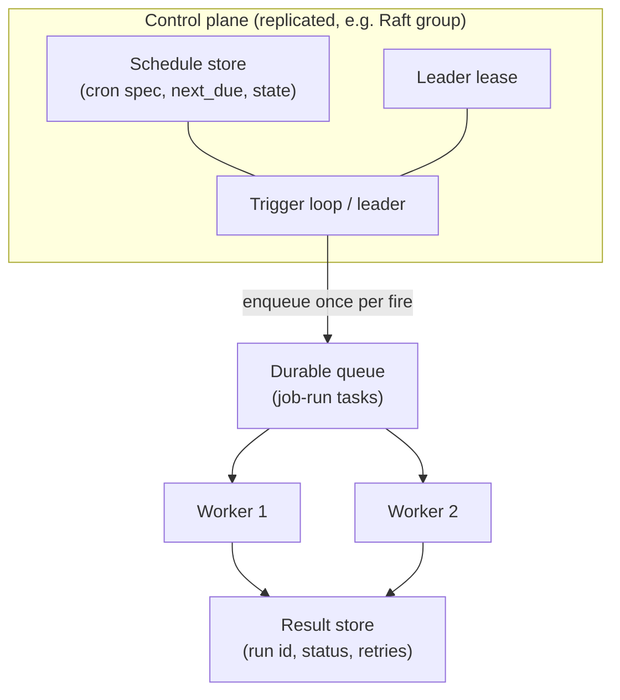

# Distributed Cron: Scheduling Jobs Across a Cluster

A single-node `cron` daemon guarantees "this job runs once per schedule"
because there is exactly one machine and one clock. The moment the scheduler
becomes a *cluster* — for availability, for scale, or because the jobs
themselves are distributed — that guarantee must be re-built from primitives
that are individually unreliable: multiple nodes with skewed
[clocks](./time.md), a leader that can fail mid-fire, jobs that take longer
than their interval, and a message layer that delivers at-least-once. A
distributed-cron design is a systems-interview staple because it composes
[leader election](./bully.md), [leases](../advanced/leases.md),
[idempotency](../advanced/distributed-transactions.md), and
exactly-once thinking into one concrete component.

## What can go wrong with naive cluster cron

```text
N workers, each with its own crontab of the same job, say "every hour":

  00:00  worker1 fires ✓        worker2 fires ✓     → DOUBLE RUN
  01:00  worker1 crashed        worker2 fires ✓     → lucky
  02:00  worker1 crashed        worker2 crashed     → MISSED RUN
  03:00  worker1 restarted, clock drifts 47s ahead        → boundary chaos
```

Four failure classes fall out immediately:

1. **Double execution** — every node fires independently (no coordination).
2. **Missed execution** — the one node responsible is down (no availability).
3. **Skew and drift** — nodes disagree on when "hourly" fires (see
   [Time and Ordering](./time.md)); wall-clock "23:59 vs 00:01" is a coin flip.
4. **Overlap** — the 00:00 run is still going at 01:00 and a second run starts.

Any design must answer all four, plus a fifth question single-node cron never
faces: *what happens to a fire whose node dies mid-execution?*

## The standard design: a coordination plane + workers



Components and their invariants:

- **Schedule store** holds the cron spec and, critically, a materialized
  `next_due` timestamp per schedule. The trigger loop fires by *advancing
  `next_due` transactionally* — the fire is the state transition, not a
  wall-clock observation. This is how the design absorbs both duplicate
  triggers (compare-and-set on `next_due`) and missed triggers (on startup,
  the loop sees `next_due < now` and fires late — **catch-up** is a query,
  not a heuristic).
- **Leader election with a lease**: one trigger loop runs at a time; the
  lease (a fencing-token'd [distributed lock](./distributed-locks.md)) is
  renewed before each enqueue. If the leader stalls, the lease expires and a
  follower takes over — the fencing token prevents a zombie leader from
  enqueuing a second copy after the handoff. Liveness during partition is
  bounded by lease length: this is exactly the
  [CAP](./cap.md) trade, usually resolved CP.
- **Durable queue + idempotent workers**: fire = "task appeared in queue",
  execution is decoupled from triggering. Workers deduplicate on a
  `(schedule_id, due_time)` run id — at-least-once delivery becomes
  effectively-once execution (see
  [Distributed Transactions: idempotency](../advanced/distributed-transactions.md)).
- **Result store** records terminal state; the trigger loop must not
  re-fire an already-running or succeeded run unless the policy says retry.

The decomposition matters more than the diagram: *triggering* (when), *task
delivery* (what), and *execution bookkeeping* (did it happen?) are three
separate stores with separate consistency needs. Fusing them into "the
scheduler process" is where designs collapse.

## The overlap question: no-overlap policies

"Every minute" is trivial; "every 5 minutes, job takes 6 minutes" needs
policy. Options, in increasing strictness:

| Policy | Mechanism | Cost |
|---|---|---|
| Fire-and-forget | no check | unbounded parallel runs |
| Skip-if-running | check result store before enqueue; race if two enqueuers | needs the leader for safety |
| Serialize per schedule | per-schedule token/queue ordering | head-of-line blocking |
| Timeout + kill | running run declared dead after `T`, then re-fire | needs fencing + worker cancellation |

The interview-grade subtlety: **skip-if-running is racy without a single
serializing point**. Two schedulers checking the result store can both see
"not running" and both enqueue. The lease in the control plane provides that
point — the same reason [distributed mutex](./distributed-mutex.md)
algorithms require a known primary.

## Cron semantics: what you inherit from cron(8)

The single-node semantics are the contract users expect, and each has a
distributed translation ([cron(8)](https://man7.org/linux/man-pages/man8/cron.8.html)):

- **Daylight-saving boundaries.** `0 2 * * *` does not exist on one spring
  day and happens twice in autumn in naive wall-clock schedulers. Decide
  explicitly: fire in UTC (stable interval, human-wrong labels) or local
  time (human-correct, impossible-hour edge cases). Vixie cron's answer —
  recompute next fire *after* each run against the local calendar — is the
  defensible default.
- **Missed-fire policy.** Classic cron skips missed fires while it was
  down; `anacron` and many job systems instead run-once-on-recovery. A
  distributed scheduler makes this a per-schedule setting (`SKIP`,
  `RUN_ALL_PENDING`, `FIRE_LATEST`) — the same vocabulary as
  catch-up/backfill policies in [Backfilling Schedulers](../../hpc/backfilling-schedulers.md).
- **Minimum interval and drift.** Interval specs (`*/5 * * * *`) anchor to
  the clock, not to run completion — so run duration drift compounds
  nothing, but a slow run plus a no-overlap policy silently stretches the
  effective period. Making that visible (per-schedule effective interval
  metric) is part of the component's observability contract.

## Production-grade features and real systems

Real schedulers are the design above plus operational maturity:

- **[Kubernetes CronJobs](https://kubernetes.io/docs/concepts/workloads/controllers/cron-jobs/)**:
  the kube-controller-manager is the (elected) trigger loop; `concurrencyPolicy`
  (`Allow` / `Forbid` / `Replace`) and `startingDeadlineSeconds` are exactly
  the no-overlap and catch-up knobs, API-server watch semantics provide the
  durable schedule store.
- **[Quartz clustered mode](https://www.quartz-scheduler.org/documentation/quartz-2.3.0/tutorials/tutorial-lesson-09.html)**:
  many scheduler nodes share a database; triggers are claimed via row locks
  (`SELECT ... FOR UPDATE`) — a "control plane via DB transactions" variant,
  simple and battle-tested, at the cost of write contention on the trigger
  tables.
- **[Airflow scheduler](https://airflow.apache.org/docs/apache-airflow/stable/administration-and-deployment/scheduler.html)**:
  HA schedulers compete for task-creation via DB locks over a DAG-run
  state store; catch-up/backfill is a first-class concept because analytics
  DAGs are *idempotent, date-keyed* — the design assumption that makes
  re-running missed intervals safe.
- **[Temporal schedules](https://docs.temporal.io/evaluate/development-production-features/schedules) / [cron workflows](https://docs.temporal.io/cron-job)**:
  the durable-workflow engine absorbs the whole control plane — the schedule
  is a state machine in replicated durable storage, "fire" starts a workflow
  with a deduplicated run id, overlap policy and catch-up window are API
  parameters. This is the "buy instead of build" end of the spectrum, and
  worth knowing as the answer to "how do you avoid rebuilding this?"

The common denominator: **durable, transactional schedule state + a
single serializing trigger point + at-least-once delivery with
run-id deduplication**. Systems differ in which store provides each.

## Design-decision recap (interview walkthrough)

1. Double-run protection → `next_due` compare-and-swap in the schedule
   store + `(schedule, due_time)` run-id dedup in workers.
2. Scheduler availability → leader lease with fencing; leadership is about
   *triggering*, execution is always distributed.
3. Missed fires → materialized `next_due` + explicit catch-up policy per
   schedule, reconciled on startup and after lease handoff.
4. Clock skew → anchor fires to one clock (the control plane's, or UTC
   calendar semantics), never to each worker's wall clock.
5. Overlap → per-schedule concurrency policy, with the kill-timeout variant
   documented as requiring fencing and cancellation propagation.
6. Idempotency of the *job body* remains the last line of defense —
   schedulers prevent duplicate *triggers*; they cannot make a non-idempotent
   job safe (the broader lesson in
   [Exactly-once vs Effectively-once](../messaging/README.md)).

## Key Takeaways

- Distributed cron = trigger loop (leased, single) + durable schedule state
  (transactional `next_due`) + at-least-once task delivery + run-id
  deduplication + per-schedule overlap and catch-up policy.
- The fire must be a state transition, not a wall-clock event; missed fires
  then become catch-up queries and double fires become CAS conflicts.
- Fencing tokens protect against zombie leaders; job-body idempotency is
  still mandatory because delivery is at-least-once.
- Cron's local-time semantics (DST, skipped hours) are a *product decision*
  in a distributed scheduler — know what your engine chose.

## Cross-References

- [Distributed Locks and Fencing Tokens](./distributed-locks.md) — leader lease safety.
- [Fencing Tokens](./fencing-tokens.md) — enforcing single-fire at the store.
- [Time and Ordering](./time.md) — clock skew and drift fundamentals.
- [Bully Leader Election](./bully.md) and [ZooKeeper](./zookeeper.md) — leader election mechanics.
- [Backfilling Schedulers](../../hpc/backfilling-schedulers.md) — batch-side scheduling theory.
- [Distributed Transactions: Sagas and Outbox](../advanced/distributed-transactions.md) — idempotency and outbox patterns underlying fire-once.

## References

- Linux man-pages, [cron(8)](https://man7.org/linux/man-pages/man8/cron.8.html) and [crontab(5)](https://man7.org/linux/man-pages/man5/crontab.5.html) — the single-node semantics any distributed version must preserve or deliberately change.
- Quartz Scheduler Documentation, "[Lesson 9: Job Scheduling in Clustered Mode](https://www.quartz-scheduler.org/documentation/quartz-2.3.0/tutorials/tutorial-lesson-09.html)" — DB-transaction-based clustered triggering.
- Kubernetes Documentation, "[CronJob](https://kubernetes.io/docs/concepts/workloads/controllers/cron-jobs/)" — `concurrencyPolicy`, `startingDeadlineSeconds`, and controller-based triggering.
- Apache Airflow Documentation, "[Scheduler and HA](https://airflow.apache.org/docs/apache-airflow/stable/administration-and-deployment/scheduler.html)" — high-availability scheduling and catch-up semantics.
- Temporal Documentation, "[Schedules](https://docs.temporal.io/evaluate/development-production-features/schedules)" and "[Cron Jobs](https://docs.temporal.io/cron-job)" — durable-execution-native scheduling with overlap policies.
