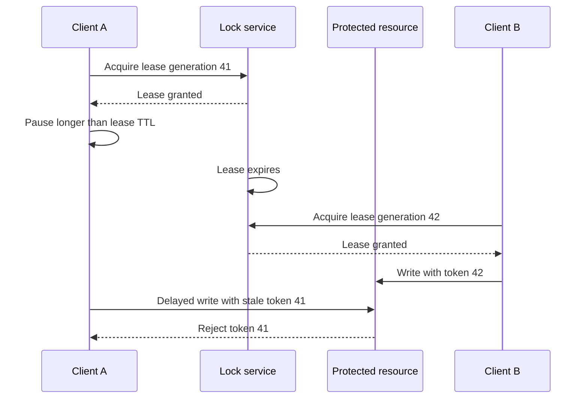

# Distributed Locks and Fencing Tokens

A distributed lock coordinates clients that run on different processes or
machines. It is easy to build a lock that works in the happy path and hard to
build one that remains safe when clients pause, networks partition, clocks
skew, servers restart, or leases expire.

Start by classifying the lock:

- **Efficiency lock:** duplicate work is undesirable but harmless. A fast
  best-effort lock may be sufficient.
- **Correctness lock:** two writers must never corrupt a resource or violate an
  invariant. The protected resource must validate a fencing token or enforce
  its own linearizable compare-and-swap.

## The lease expiration race

A lease can expire while its client is paused by a long garbage collection,
CPU starvation, process freeze, or network partition. Another client acquires
the lease. The old client resumes and still writes to the protected resource.

The **fencing token** is a monotonically increasing generation. The resource
stores the highest token accepted and rejects lower tokens. A random lock value
can safely identify the owner for release, but it is not a fencing token
because it has no ordering.

## Consensus-backed locks

ZooKeeper and etcd use replicated consensus state to provide strong ordering
for lock metadata. A typical ZooKeeper recipe is:

1. Create an ephemeral sequential node under the resource lock path.
2. List contenders and sort by sequence number.
3. The lowest sequence owns the lock.
4. Other contenders watch only their immediate predecessor.
5. If the predecessor disappears, re-list and try again.

Watching only the predecessor avoids a thundering herd when one lock releases.
The ephemeral node disappears when the session expires. A ZooKeeper transaction
ID or version can be used as a fencing value when the protected resource
validates it.

etcd exposes leases, transactions, watches, and concurrency APIs over a
linearizable replicated key space. A resource outside etcd still needs to
receive and validate the revision or another fencing token; an etcd mutex by
itself cannot physically stop a stale client from writing to an unrelated
system.

## Redis locks and Redlock

A single Redis instance can implement a fast lease using `SET key value NX PX`
and a compare-value release script. This is often appropriate for efficiency
locks when duplicate work is safe.

The Redis Redlock algorithm uses multiple independent Redis masters and a
quorum. Its official design describes safety and liveness assumptions, but
correctness-critical users must analyze pauses, clock/TTL assumptions, failover,
persistence, and the absence of resource-side fencing. Do not call a lease
“correctness-safe” merely because it has a quorum or a TTL.

Use Redis locks with:

- Idempotent jobs or a downstream deduplication key.
- A bounded lease and renewal policy.
- Safe compare-value release.
- Explicit behavior when renewal fails.
- Metrics for contention, expiry, renewal failures, and duplicate work.

For a correctness-critical write, prefer a resource-native version check,
consensus service plus fencing, or an idempotency/transaction design that makes
the lock unnecessary.

## PostgreSQL and application alternatives

A single PostgreSQL deployment can use transaction-scoped or session-scoped
advisory locks. They are useful when the protected resource is already in the
same database and the transaction boundary is clear. They do not coordinate
arbitrary external resources unless the application creates an additional
fencing and failure protocol.

Before adding a distributed lock, consider:

- A unique constraint or conditional update.
- Optimistic versioning: `UPDATE ... WHERE version = expected`.
- An idempotency key and durable result table.
- A partitioned queue where one consumer owns a partition.
- A workflow/saga with compensating actions.
- A database transaction or transactional outbox.

Locks are often used to paper over a missing invariant in the protected
resource. Put the final safety check as close to the resource as possible.

## Availability and liveness

A lock design should state its guarantees:

| Property | Question |
|---|---|
| Mutual exclusion | Can two clients both pass the lock protocol? |
| Fencing | Can the resource reject a stale holder's operation? |
| Deadlock freedom | Does a crashed holder eventually stop blocking progress? |
| Fault tolerance | How many coordination failures can be tolerated? |
| Lease semantics | What happens when renewal or clocks fail? |
| Fairness | Can one contender starve? |
| Reentrancy | Can the same client acquire recursively? |
| Observability | Can operators see owner, age, contention, and expiry? |

A lease improves liveness by recovering from crashed clients, but its expiry
creates a stale-holder risk. A long lease reduces false expiry but increases
recovery time. Renewal is not proof of ownership at the resource unless the
resource validates the generation.

## Interview questions

**Why are distributed locks harder than mutexes?**

A process mutex relies on shared memory and a scheduler. A distributed lock
must handle message delay, partitions, process pauses, clock behavior, service
restarts, and incomplete failure detection.

**What is a fencing token?**

A monotonically increasing generation supplied on each lock acquisition. The
protected resource remembers the greatest accepted token and rejects stale
operations from an old holder.

**Is Redlock always unsafe?**

The answer depends on the failure model and whether the lock is for efficiency
or correctness. It can be a pragmatic efficiency lock, but correctness-critical
resources need stronger coordination and resource-side fencing.

**Why watch a predecessor in ZooKeeper?**

It wakes only the next contender and avoids every waiter waking for every
release. Each contender rechecks the ordered sequence after the watch fires.

**When should you avoid a distributed lock?**

When a conditional write, unique constraint, idempotency key, partitioned
queue, or transactional outbox can enforce the invariant more directly.

## Cross-references

- [Consensus](../consensus/README.md)
- [Raft](../consensus/raft.md)
- [Leases and time](./time.md)
- [Replication and quorums](../replication/quorum.md)
- [Transactional Outbox](../../backend/patterns/cdc-outbox.md)
- [Idempotency](../../backend/patterns/idempotency.md)
- [ABA and safe memory reclamation](../../concurrency/aba-problem.md)
- [Rate limiting](../../backend/api/rate-limiting.md)

## References

- [Redis distributed locks](https://redis.io/docs/latest/develop/clients/patterns/distributed-locks/)
- [etcd coordination and lock notes](https://etcd.io/docs/v3.5/learning/why/)
- [Apache ZooKeeper lock recipe](https://zookeeper.apache.org/doc/r3.8.5/recipes.html)
- [Martin Kleppmann: How to do distributed locking](https://martin.kleppmann.com/2016/02/08/how-to-do-distributed-locking.html)
- [PostgreSQL advisory locks](https://www.postgresql.org/docs/current/explicit-locking.html#ADVISORY-LOCKS)
