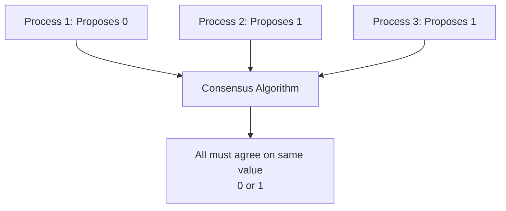
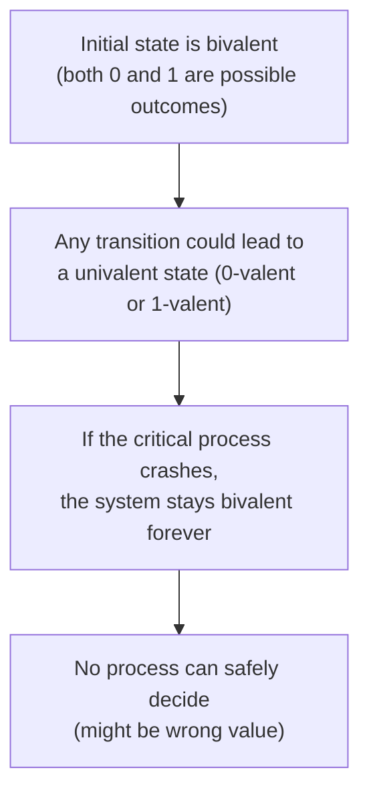

# FLP Impossibility

## Overview

The **FLP Impossibility** result (Fischer, Lynch, Paterson, 1985) proves that in an asynchronous distributed system, **no deterministic consensus algorithm can guarantee termination if even one process may crash**. This is one of the most important theoretical results in distributed computing, showing the fundamental limits of what's achievable.

## Detailed Explanation

### The Problem: Consensus



**Consensus requirements:**
1. **Agreement**: All correct processes decide the same value
2. **Validity**: The decided value must be proposed by some process
3. **Termination**: All correct processes eventually decide

### The Model

FLP assumes an **asynchronous** system:

```
Asynchronous system:
  - No bound on message delivery time
  - No bound on process execution speed
  - No global clock
  - Messages may be delayed but not lost (fair-loss)

Crash failure:
  - A process may stop executing at any time
  - Other processes can't distinguish "slow" from "crashed"
```

### The Theorem

```
FLP Impossibility Theorem:
  In an asynchronous system, no deterministic algorithm can solve
  consensus if even one process may crash.

  More precisely: Every consensus protocol that terminates in a 
  crash-free execution must have some execution with one crash 
  that doesn't terminate.
```

### Why Can't We Just Wait?

```
The fundamental problem:
  Process P1 sends message to P2
  P1 doesn't receive a response
  
  Is P2:
    (a) Slow (will respond eventually)?
    (b) Crashed (will never respond)?
  
  In an asynchronous system, there's NO way to distinguish (a) from (b).
  
  If we wait forever → violates termination
  If we proceed without P2 → might violate agreement
```

### The Intuition



```
Key insight:
  1. Consensus starts in a "bivalent" state (outcome could be 0 or 1)
  2. To decide, the system must reach a "univalent" state (outcome determined)
  3. In an asynchronous system, a crash at the wrong moment can prevent
     the system from ever reaching a univalent state
  4. No deterministic algorithm can guarantee this transition
```

### What FLP Does NOT Say

```
FLP does NOT say:
  ✗ Consensus is impossible
  ✗ Practical systems can't work
  ✗ We should give up

FLP DOES say:
  ✓ No DETERMINISTIC algorithm GUARANTEES termination
  ✓ With one crash, some executions may not terminate
  ✓ The impossibility is about worst-case guarantees

Practical solutions:
  - Use randomized algorithms (termination with probability 1)
  - Use failure detectors (partially synchronous model)
  - Use timeouts (practical synchrony)
  - Accept that some executions may not terminate (liveness)
```

### How Real Systems Solve Consensus

Despite FLP, practical consensus is achievable:

| Approach | How It Bypasses FLP | Example |
|----------|-------------------|---------|
| **Failure Detectors** | Use unreliable failure detectors (timeouts) to suspect crashes | Paxos, Raft |
| **Partial Synchrony** | Assume the system is eventually synchronous | Most practical protocols |
| **Randomization** | Use random choices to guarantee termination with probability 1 | Ben-Or's algorithm |
| **Leader Election** | Elect a leader to coordinate; leader failure triggers re-election | Raft, ZAB |

```
Raft's approach:
  - Uses election timeouts to detect leader failure
  - If timeout expires → assume leader crashed → elect new leader
  - If leader was just slow → old leader steps down when it sees new term
  - This is a practical failure detector, not a perfect one
  - Works in "most" executions, not "all" (bypasses FLP)
```

## Examples

### Example 1: Bivalent Initial State

```
3 processes: P1, P2, P3
Each proposes a value: P1→0, P2→1, P3→1

The system is bivalent: the outcome could be 0 or 1
depending on message ordering and timing.

If all messages arrive instantly:
  P2 and P3 agree on 1 → outcome is 1

If P2's message to P1 is delayed:
  P1 might convince P3 to decide 0 first → outcome is 0

The initial state allows both outcomes → bivalent.
```

### Example 2: The Critical Crash

```
Scenario:
  System is in a state where deciding 0 or 1 depends on P3's message
  P3 crashes before sending the message

  Without P3's message:
    P1 thinks the value should be 0
    P2 thinks the value should be 1
    Neither can safely decide (might disagree with the other)
    
  Result: System is stuck in bivalent state → no decision possible
```

### Example 3: How Timeouts Bypass FLP

```
Raft consensus (practical approach):

  Leader sends heartbeats every 150ms
  Followers expect heartbeat within 300ms
  
  If no heartbeat within 300ms:
    Follower assumes leader crashed
    Starts new election
    New leader elected → consensus continues
  
  What if leader was just slow?
    Old leader eventually responds
    Sees new term → steps down
    New leader's decisions are already committed
    
  This doesn't violate FLP because:
    - Some executions may not terminate (timeout keeps resetting)
    - In practice, timeouts work because systems are partially synchronous
```

### Example 4: Randomized Consensus

```
Ben-Or's Algorithm (1983):

  Each round:
    1. Each process broadcasts its preferred value
    2. If majority agrees → decide
    3. Otherwise, flip a random coin (0 or 1 with 50% probability)
    4. Use coin result as new preferred value
    5. Repeat

  Termination probability: P(decide in round k) ≥ constant > 0
  Expected rounds: finite
  Guaranteed termination: with probability 1 (but no bound on rounds)
  
  This bypasses FLP because it's not deterministic.
```

## Interview Questions

### Q1: What does the FLP impossibility result state?
**Answer**: In an asynchronous distributed system, no deterministic consensus algorithm can guarantee termination if even one process may crash. This is because a crashed process is indistinguishable from a slow process, and the system may be stuck in a bivalent state where no safe decision can be made.

### Q2: How do practical systems like Raft bypass FLP?
**Answer**: They use unreliable failure detectors (timeouts) to detect crashes, operating in a partially synchronous model. If a leader doesn't respond within a timeout, it's assumed crashed and a new leader is elected. This doesn't violate FLP because termination isn't guaranteed in all executions—some may experience repeated timeouts.

### Q3: What is a bivalent state?
**Answer**: A bivalent state is one where both outcomes (deciding 0 or deciding 1) are still possible, depending on future events. The system must transition from bivalent to univalent (one outcome determined) to reach consensus. FLP shows that a crash can prevent this transition.

### Q4: Does FLP mean distributed consensus is impossible?
**Answer**: No. FLP says no deterministic algorithm guarantees termination in all executions with one crash. Practical systems use randomized algorithms, failure detectors, or partial synchrony assumptions to achieve consensus in practice. The result is theoretical—it shows the limits of what can be guaranteed, not what can be achieved.

### Q5: What's the difference between liveness and safety in consensus?
**Answer**: Safety means "nothing bad happens" (agreement: all processes decide the same value). Liveness means "something good eventually happens" (termination: all processes eventually decide). FLP shows that you can't guarantee both simultaneously in an asynchronous system with crashes. Practical protocols guarantee safety always but liveness only eventually.

## Common Mistakes

1. **Thinking FLP makes consensus impossible** — FLP is about worst-case guarantees. Practical consensus algorithms work correctly in virtually all real executions.
2. **Confusing asynchronous with synchronous** — FLP applies to asynchronous systems. In synchronous systems (bounded message delay), consensus is solvable even with crashes.
3. **Ignoring the deterministic requirement** — FLP applies to deterministic algorithms. Randomized algorithms can guarantee termination with probability 1.
4. **Overlooking the "one crash" requirement** — Even a single potential crash makes consensus impossible in the asynchronous model. This is surprisingly restrictive.

## Summary

| Aspect | Detail |
|--------|--------|
| **Theorem** | No deterministic consensus algorithm terminates with one crash in async system |
| **Key Insight** | Can't distinguish slow from crashed |
| **Implication** | Safety and liveness can't both be guaranteed |
| **Practical Solution** | Failure detectors, partial synchrony, randomization |
| **Year** | 1985 (Fischer, Lynch, Paterson) |

## Cross-References

- [CAP Theorem](./cap.md) — Another fundamental impossibility result
- [Consensus](../consensus/README.md) — Algorithms that solve consensus despite FLP
- [Paxos](../consensus/paxos.md) — Classic consensus algorithm
- [Raft](../consensus/raft.md) — Understandable consensus algorithm
- [Time and Ordering](./time.md) — Why time assumptions matter

## Cross References

- [Consensus](../consensus/README.md)
- [CAP Theorem](cap.md)
- [Paxos](../consensus/paxos.md)
