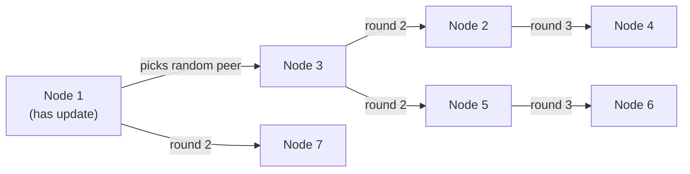

# Gossip Protocol

## Overview

The **gossip protocol** (a.k.a. **epidemic protocol**) is a way for nodes in a distributed system to spread information without a central coordinator. Each node periodically exchanges state with a small number of randomly chosen peers; like a rumor, information spreads exponentially until every node has it.

It powers **membership and failure detection** in systems like Cassandra, DynamoDB, Consul, Nomad, Redis Cluster, and ScyllaDB — and is a classic interview topic because it explains how "eventually consistent" coordination can scale to thousands of nodes.

## How It Works

Each round (e.g., every 1 second), every node:

1. Picks a **random peer** (uniform, or with bias toward under-contacted nodes).
2. Sends its **state** (membership list, failure info, version counters).
3. The peer merges state using **version vectors / generation counters** — the newer version wins.
4. The peer may then spread it further in its own rounds.

Because each node contacts another randomly, the set of informed nodes **doubles roughly every round** — convergence takes **O(log N) rounds** for the whole cluster.

## Push, Pull, Push-Pull

| Mode | What happens | Use |
|---|---|---|
| **Push** | Sender sends its update to the peer | Spreading new info |
| **Pull** | Sender asks peer for *its* updates | Anti-entropy / catching up |
| **Push-Pull** | Both exchange updates, then merge | Fastest convergence (~O(log N) rounds vs O(N)) |

Gossip is **probabilistic**: with high probability every node gets every update, but there is no guarantee for any single message — so systems pair gossip with **periodic full anti-entropy** (compare full state, e.g., with Merkle trees) to heal any divergence. See [Merkle Tree Comparison](../replication/quorum.md) in quorum replication.

## Failure Detection: SWIM

SWIM (Scalable Weakly-consistent Infection-style process group Membership, Gupta et al. 2002) is the protocol behind HashiCorp's **memberlist** (Consul, Nomad, Serf). It replaced the old all-to-all heartbeats of the original gossip approach:

- Each node periodically pings a random node; if no ack, it **indirectly probes** via k random intermediaries (if *they* can't reach it, the node is marked suspect).
- A **suspicion mechanism** avoids flapping — a node isn't declared dead until a timeout after being suspected, and it can refute suspicion while alive.
- Membership changes are propagated by gossip.

This gives **detection latency ~ O(log N)** with **constant load per node** — no all-to-all heartbeat traffic.

## Applications

| System | What gossip provides |
|---|---|
| **Cassandra** | Node membership and state (schema, load, tokens); repair via anti-entropy with Merkle trees |
| **DynamoDB (original Dynamo paper)** | Membership + failure detection |
| **Consul / Nomad (memberlist)** | SWIM-based membership and failure detection |
| **Redis Cluster** | Gossip of slot ownership and node state |
| **ScyllaDB** | Same model as Cassandra |

## Trade-offs

| Pros | Cons |
|---|---|
| No central coordinator (no SPOF, no bottleneck) | **Eventually consistent** membership — transient disagreement |
| Scales to thousands of nodes; per-node load constant | Probabilistic — needs anti-entropy to guarantee convergence |
| Simple, robust to partitions (each partition keeps gossiping) | Higher bandwidth than a centralized registry |
| Naturally self-healing | May briefly route to dead nodes (retries mask this) |

## Gossip vs Centralized Alternatives

| Approach | Example | Trade-off |
|---|---|---|
| **Central registry** | ZooKeeper/etcd service registry, Kubernetes API server | Strong consistency, but a hotspot/SPOF; write scaling bounded |
| **Gossip** | Cassandra, Consul (for members) | No coordinator, eventually consistent, scales out |
| **Hybrid** | Leader + gossip for reads | Common in practice (e.g., leader does authoritative writes, gossip disseminates) |

## Interview Questions

### Q: How does a gossip protocol guarantee every node learns an update?

It doesn't guarantee it for any single message — it's probabilistic. Each round, informed nodes pick random peers, so the informed set roughly doubles each round (O(log N) rounds to cover the cluster). To handle the (unlikely) cases where a node is repeatedly missed, systems add periodic **anti-entropy** — full state comparison (often via Merkle trees) that eventually reconciles any divergence.

### Q: What is the convergence time of gossip?

With push-pull, O(log N) rounds; with push-only it can take O(N) rounds in the worst case. That's why push-pull plus periodic anti-entropy is the common design.

### Q: How does SWIM improve on naive heartbeat gossip?

Naive heartbeat gossip (each node pings everyone) costs O(N) traffic per round — not scalable. SWIM pings only random peers (constant load), uses **indirect probes** to distinguish a dead node from a network partition (if intermediaries can't reach it either, it's suspect), and adds a suspicion timeout to prevent flapping. Detection latency stays O(log N).

### Q: When would you prefer a central registry over gossip?

When you need strong consistency or authoritative, transactional membership (e.g., etcd-backed Kubernetes, ZooKeeper for coordination) and the write scale is modest. Gossip when you need to scale membership to very large clusters, tolerate partitions gracefully, or avoid operating a coordination service.

## References

- Demers et al., *Epidemic Algorithms for Replicated Database Maintenance* (1987) — https://dl.acm.org/doi/10.1145/41840.41841
- Gupta, Aguilera, Renesse, *SWIM: Scalable Weakly-consistent Infection-style process group Membership Protocol* (2002) — https://www.cs.cornell.edu/~asdas/research/dsn02-SWIM.pdf
- HashiCorp memberlist (SWIM implementation) — https://github.com/hashicorp/memberlist
- DeCandia et al., *Dynamo: Amazon's Highly Available Key-value Store* (2007) — https://www.allthingsdistributed.com/files/amazon-dynamo-sosp2007.pdf
- Cassandra documentation: gossip and failure detection — https://cassandra.apache.org/doc/latest/cassandra/architecture/gossip.html

## Related Topics

- [CAP Theorem](./cap.md) — gossip trades consistency for availability/partition tolerance
- [Consistency Models](./consistency.md) — eventual consistency in practice
- [Vector Clocks](./vector-clocks.md) — versioning state exchanged by gossip
- [Leader Election](../consensus/README.md) — how some systems combine leader + gossip
- [Service Discovery](../microservices/discovery.md) — membership use case
- [Quorum and Merkle Trees](../replication/quorum.md) — anti-entropy reconciliation
