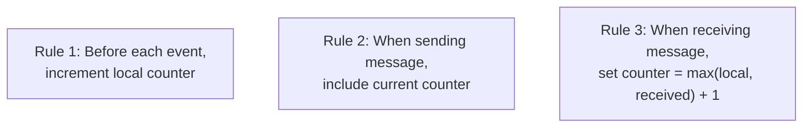
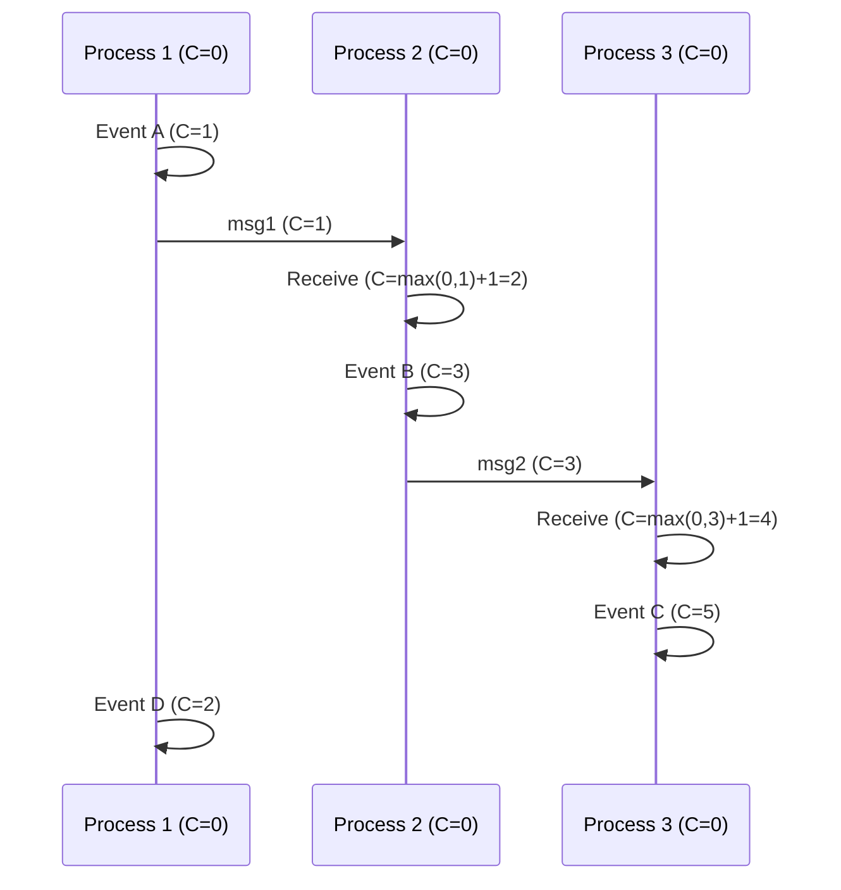

# Lamport Clocks

## Overview

**Lamport clocks** (Leslie Lamport, 1978) are logical clocks that provide a partial ordering of events in a distributed system. They assign a monotonically increasing counter to each event, ensuring that if event A happened before event B, then A's timestamp is less than B's. They're simple, efficient, and foundational to distributed systems.

## Detailed Explanation

### The Algorithm



```
Each process maintains a counter C, initialized to 0.

Rule 1 (Local event):
  Before executing an event, increment C:
  C = C + 1

Rule 2 (Send):
  When sending a message, include the current value of C:
  send(message, C)

Rule 3 (Receive):
  When receiving a message with timestamp C_msg:
  C = max(C, C_msg) + 1
  Deliver the message
```

### Properties

```
Lamport Clock Property:
  If A → B (A happened before B), then L(A) < L(B)

  The converse is NOT true:
  If L(A) < L(B), it does NOT mean A → B
  (A and B might be concurrent)

  Lamport clocks capture a partial ordering:
    - Causally related events: correctly ordered
    - Concurrent events: arbitrarily ordered (may have L(A) < L(B) even if A || B)
```

### Visualization



```
Result:
  L(A) = 1, L(B) = 3, L(C) = 5, L(D) = 2

  A → B → C (causal chain) → L(A) < L(B) < L(C) ✓
  A → D (same process) → L(A) < L(D) ✓
  D || B (concurrent) → L(D)=2 < L(B)=3 (clock says D before B, but they're concurrent!)
```

### Why Lamport Clocks Aren't Enough

```
Limitation: Can't detect concurrency

  If L(A) < L(B): Either A → B OR A || B (can't tell!)
  
  To detect concurrency, you need vector clocks.

Example:
  P1: Event X (L=5)
  P2: Event Y (L=3)
  
  L(Y) < L(X), but X and Y might be concurrent!
  Lamport clocks can't distinguish this from Y → X.
```

## Examples

### Example 1: Basic Lamport Clock

```
Three processes:

P1: C=0 → [A: C=1] → send(1) → [D: C=2]
P2: C=0 → recv(1) → C=2 → [B: C=3] → send(3) → [E: C=4]
P3: C=0 → recv(3) → C=4 → [C: C=5]

Timestamps: A=1, D=2, B=3, E=4, C=5
Causal order: A → B → C (correctly captured by timestamps)
```

### Example 2: Lamport Clock in Mutual Exclusion

```
Distributed mutual exclusion using Lamport timestamps:

1. Process wants to enter critical section (CS):
   - Send REQUEST(ts, pid) to all processes
   - Add to local request queue

2. When receiving REQUEST:
   - Add to local queue
   - Send ACK

3. Enter CS when:
   - Own request is at head of queue
   - Received ACK from all processes

4. Exiting CS:
   - Remove request from queue
   - Send RELEASE to all processes

Lamport timestamps ensure total ordering of requests.
```

### Example 3: Totally Ordered Multicast

```
Using Lamport timestamps for totally ordered broadcast:

1. Process sends message with Lamport timestamp
2. All processes buffer messages
3. Deliver message only when all messages with lower timestamps have been delivered
4. Requires knowing when all processes have received all lower-timestamped messages

Problem: Requires additional protocol to know when it's safe to deliver.
This is why Lamport clocks alone aren't sufficient for total ordering.
```

### Example 4: Implementation

```python
class LamportClock:
    def __init__(self):
        self.counter = 0
    
    def local_event(self):
        self.counter += 1
        return self.counter
    
    def send_message(self):
        self.counter += 1
        return self.counter  # Include in message
    
    def receive_message(self, msg_timestamp):
        self.counter = max(self.counter, msg_timestamp) + 1
        return self.counter

# Usage
p1 = LamportClock()
p2 = LamportClock()

# P1 does local event
t1 = p1.local_event()  # t1 = 1

# P1 sends to P2
send_ts = p1.send_message()  # send_ts = 2

# P2 receives
t2 = p2.receive_message(send_ts)  # t2 = max(0, 2) + 1 = 3
```

## Interview Questions

### Q1: What is a Lamport clock?
**Answer**: A Lamport clock is a logical clock that assigns a monotonically increasing counter to each event in a distributed system. It ensures that if event A happened before event B, then A's timestamp is less than B's. Each process increments its counter on local events and on receiving messages (taking the max of local and received counters).

### Q2: What are the rules for Lamport clocks?
**Answer**: (1) Before each local event, increment the counter; (2) When sending a message, include the current counter; (3) When receiving a message, set counter = max(local counter, received counter) + 1.

### Q3: What's the limitation of Lamport clocks?
**Answer**: Lamport clocks can't detect concurrency. If L(A) < L(B), we can't tell if A happened before B or if they're concurrent. The clock provides a partial ordering but doesn't distinguish between causal relationships and arbitrary ordering of concurrent events. Vector clocks solve this.

### Q4: How are Lamport clocks used in distributed mutual exclusion?
**Answer**: Each process timestamps its request for the critical section. Requests are ordered by timestamp (and process ID for ties). A process enters the critical section when its request is at the head of the queue and it has received acknowledgments from all other processes.

### Q5: How do Lamport clocks compare to vector clocks?
**Answer**: Lamport clocks are simpler (one counter per process) but can't detect concurrency. Vector clocks (one counter per process in each timestamp) can detect concurrency and capture the full causal structure. Lamport clocks are O(1) space; vector clocks are O(n) space where n is the number of processes.

## Common Mistakes

1. **Thinking Lamport clocks capture causality** — They preserve the happened-before relationship but can't detect concurrent events. L(A) < L(B) doesn't mean A → B.
2. **Confusing logical and physical time** — Lamport timestamps don't correspond to real time. Timestamp 100 doesn't take twice as long as timestamp 50.
3. **Forgetting the max in receive** — The receive rule must take max(local, received), not just use the received value. Otherwise, the counter might decrease.
4. **Using Lamport clocks where vector clocks are needed** — If you need to detect concurrency (e.g., for conflict detection in replicated data), use vector clocks instead.

## Summary

| Aspect | Detail |
|--------|--------|
| **What** | Logical clock: single counter per process |
| **Rules** | Increment on event; include in messages; max on receive |
| **Property** | A → B ⟹ L(A) < L(B) (not converse) |
| **Limitation** | Can't detect concurrency |
| **Complexity** | O(1) per process, O(1) message overhead |
| **Used For** | Totally ordered multicast, mutual exclusion, causal ordering |

## Cross-References

- [Vector Clocks](./vector-clocks.md) — Extending Lamport clocks to detect concurrency
- [Time and Ordering](./time.md) — The broader problem of ordering events
- [Consistency Models](./consistency.md) — Causal consistency uses logical clocks
- [Paxos](../consensus/paxos.md) — Uses Lamport-style timestamps for leader ordering
