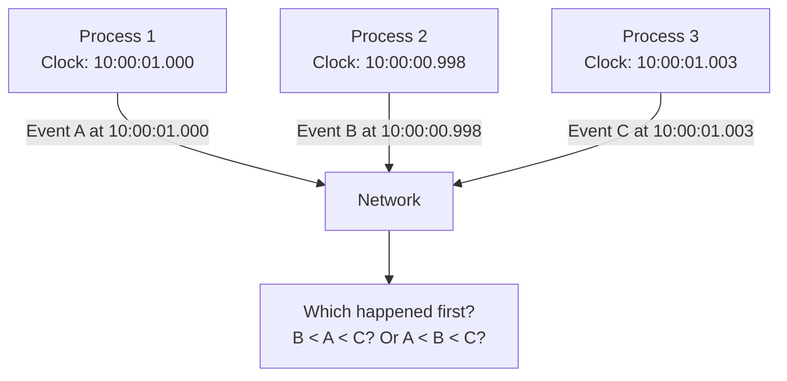
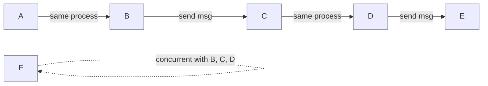

# Time and Ordering

## Overview

In a distributed system, there is **no global clock** that all processes can reference. Each machine has its own local clock, and these clocks drift apart over time. This makes it fundamentally difficult to determine the order of events across different machines. Understanding time and ordering is essential for building correct distributed algorithms.

## Detailed Explanation

### The Problem: No Global Clock



```
Physical clocks are imperfect:
  - Clock drift: ~1-10 seconds per day for quartz oscillators (typical 10-100 ppm)
  - Clock skew: Different machines have different clock values
  - NTP synchronization: Only accurate to ~1-50 ms
  - Leap seconds: Can cause clock jumps

Even with NTP:
  - Event A on Machine 1 at 10:00:01.000
  - Event B on Machine 2 at 10:00:01.001
  - Is A before B? Maybe — Machine 2's clock might be 5ms fast!
```

### Physical Clock Synchronization

**NTP (Network Time Protocol):**
```
How NTP works:
  1. Client sends request at local time t1
  2. Server receives at server time t2
  3. Server responds at server time t3
  4. Client receives at local time t4

  Round-trip delay: δ = (t4 - t1) - (t3 - t2)
  Clock offset: θ = ((t2 - t1) + (t3 - t4)) / 2

  Client adjusts clock by θ

Accuracy: ~1-50 ms over internet, ~1 ms on LAN
```

**Google's TrueTime (Spanner):**
```
TrueTime API:
  TT.now() → [earliest, latest]
  Returns a time interval, not a point
  Guarantees: actual time is within the interval

Implementation:
  - GPS receivers at each datacenter
  - Atomic clocks as backup
  - Time uncertainty: ~1-7 ms typical
  
Spanner uses TrueTime to order transactions:
  If TT.now() returns [t1, t2], and another returns [t3, t4]:
  If t2 < t3: first definitely happened before second
  If intervals overlap: can't determine order → wait until uncertainty resolves
```

### Lamport's Happened-Before Relation

Leslie Lamport (1978) defined a logical ordering that doesn't depend on physical clocks:

```
Happened-before (→):
  1. If A and B are on the same process, and A occurs before B → A → B
  2. If A is sending a message and B is receiving that message → A → B
  3. If A → B and B → C → A → C (transitivity)

Concurrent (||):
  If neither A → B nor B → A, then A and B are concurrent
  (they have no causal relationship)
```



```
Example:
  P1: A → B → (send m1) 
  P2: (receive m1) → C → D → (send m2)
  P3: (receive m2) → E
  
  A → B → C → D → E (transitive chain)
  
  If P1 has another event F after A but concurrent with B:
  A → F, A → B, but F || B (concurrent)
```

### Causal Ordering

Causal ordering ensures that causally related operations are seen in order:

```
If operation A causally precedes operation B:
  All processes must observe A before B

If A and B are concurrent:
  Different processes may observe them in different orders

This is the basis for causal consistency.
```

## Examples

### Example 1: Message Ordering

```
P1: Write(X=1) at t1, Send(msg1) at t2
P2: Receive(msg1) at t3, Write(Y=2) at t4

Causal order: Write(X=1) → Send(msg1) → Receive(msg1) → Write(Y=2)

All processes must see Write(X=1) before Write(Y=2)
because Y=2 causally depends on X=1 (through msg1)
```

### Example 2: Clock Skew Problem

```
P1 clock: 10:00:01.000 (5ms fast)
P2 clock: 10:00:00.998 (3ms slow)

P1: Event A at 10:00:01.000 (actual: 10:00:00.995)
P2: Event B at 10:00:00.998 (actual: 10:00:01.001)

By timestamps: A (10:00:01.000) > B (10:00:00.998) → A after B
By actual time: A (10:00:00.995) < B (10:00:01.001) → A before B

Physical clocks can lie about ordering!
```

### Example 3: TrueTime in Spanner

```
Transaction T1 starts: TT.now() = [10:00:01.000, 10:00:01.005]
Transaction T2 starts: TT.now() = [10:00:01.003, 10:00:01.008]

Intervals overlap: [10:00:01.000, 10:00:01.005] ∩ [10:00:01.003, 10:00:01.008]
= [10:00:01.003, 10:00:01.005]

Can't determine order → Spanner waits (commit-wait) until uncertainty resolves

If T1 commits at TT.now() = [10:00:01.010, 10:00:01.015]
And T2 starts after: TT.now() = [10:00:01.016, 10:00:01.021]
Now: T1's latest (10:00:01.015) < T2's earliest (10:00:01.016)
→ T1 definitely before T2
```

### Example 4: Concurrent Events

```
P1: A → B → C
P2: D → E → F
P3: G → H → I

Messages: B sends to D (B → D), E sends to H (E → H)

Causal chains:
  A → B → D → E → H
  G (no causal connection to others)

Concurrent pairs:
  A || D (before message), A || G, C || F, C || I, G || A, G || C, etc.
  
  P2 might see: D, A, E, B, F  (A and B after D but before E — that's fine!)
  P3 might see: G, A, H, E     (different order of concurrent events)
```

## Interview Questions

### Q1: Why is there no global clock in distributed systems?
**Answer**: Each machine has its own physical clock, and these clocks drift at different rates. NTP synchronization can reduce the difference to ~1-50ms, but can't eliminate it. Network delays make it impossible to synchronize clocks perfectly. This means we can't rely on timestamps alone to order events across machines.

### Q2: What is Lamport's happened-before relation?
**Answer**: It's a logical ordering of events that doesn't depend on physical clocks. A happened-before B if: (1) they're on the same process and A occurs first, (2) A sends a message that B receives, or (3) there's a chain of (1) and (2) connecting them. Events that aren't related by happened-before are concurrent.

### Q3: How does Google Spanner handle time?
**Answer**: Spanner uses TrueTime, which returns a time interval [earliest, latest] instead of a single timestamp. The actual time is guaranteed to be within this interval. When two transactions' intervals overlap, Spanner waits (commit-wait) until the uncertainty resolves, ensuring correct ordering without a perfect global clock.

### Q4: What's the difference between physical and logical clocks?
**Answer**: Physical clocks measure real time (seconds since epoch) but are imperfect (drift, skew). Logical clocks (Lamport clocks, vector clocks) measure causal ordering—they don't tell you the time, but they tell you which event happened before which. Logical clocks are sufficient for most distributed algorithms.

### Q5: Can two events happen at exactly the same time?
**Answer**: In physical time, it's theoretically possible but practically undetectable due to clock imprecision. In logical time (Lamport's model), two events are either related (one happened before the other) or concurrent (no causal relationship). "Same time" isn't meaningful in the logical model.

## Common Mistakes

1. **Relying on physical timestamps for ordering** — Clock skew means timestamps can be wrong. Use logical clocks or consensus for correct ordering.
2. **Confusing concurrency with simultaneity** — Concurrent means "no causal relationship," not "happened at the same time." Two events can be concurrent even if they happened hours apart.
3. **Assuming NTP is sufficient** — NTP provides ~1-50ms accuracy. For many distributed algorithms, this uncertainty window is too large for correct ordering.
4. **Ignoring message delays** — Even if clocks are perfectly synchronized, message delivery takes time. The received timestamp doesn't reflect when the message was sent.

## Summary

| Concept | Description |
|---------|-------------|
| **Physical Clocks** | Imperfect; drift ~1-10 sec/day; NTP accuracy ~1-50ms |
| **TrueTime** | Returns interval [earliest, latest]; used by Spanner |
| **Happened-Before** | Logical ordering; doesn't need physical time |
| **Concurrent** | No causal relationship; order doesn't matter |
| **Causal Ordering** | Causally related events seen in order by all |

## Cross-References

- [Lamport Clocks](./lamport.md) — Implementing happened-before with counters
- [Vector Clocks](./vector-clocks.md) — Capturing full causal relationships
- [Consistency Models](./consistency.md) — Time/ordering affects consistency
- [Raft](../consensus/raft.md) — Uses term numbers as logical clocks
- [Spanner](../replication/primary-backup.md) — TrueTime-based global consistency

## Cross References

- [Lamport Clocks](lamport.md)
- [Vector Clocks](vector-clocks.md)
- [NTP](../../networks/tcp-ip/ip.md)
