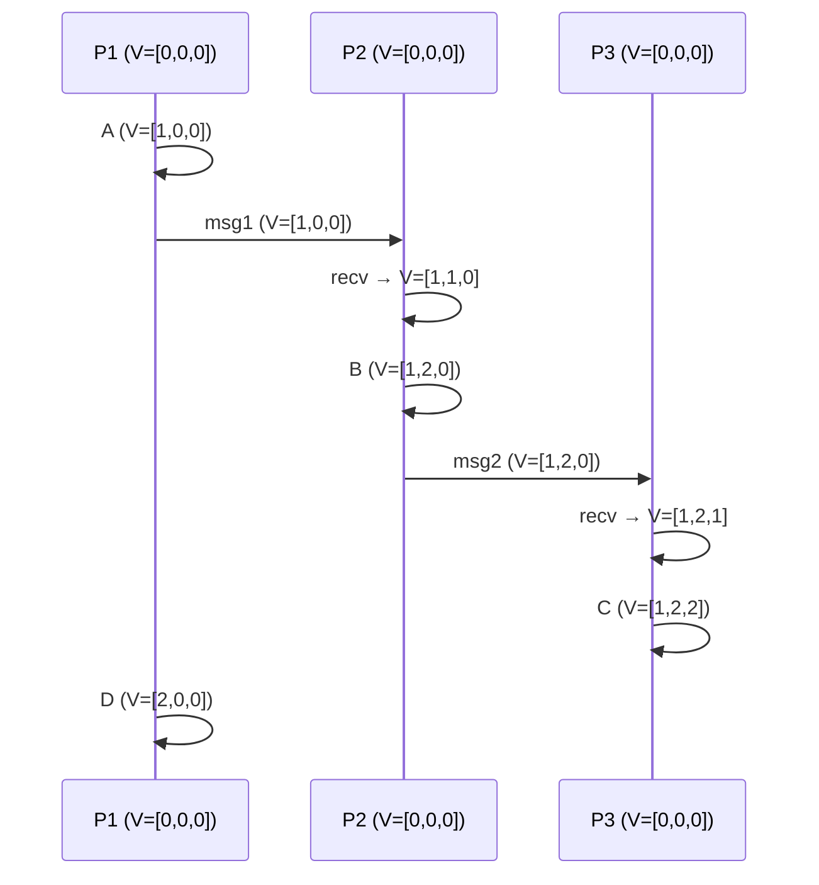

# Vector Clocks

## Overview

**Vector clocks** extend Lamport clocks to capture the full causal structure of a distributed system. While Lamport clocks can tell you that A happened before B (if L(A) < L(B)), they can't tell you if A and B are concurrent. Vector clocks solve this by maintaining a vector of counters—one per process—allowing you to detect both causal ordering and concurrency.

## Detailed Explanation

### The Algorithm

Each process maintains a vector of N counters (one for each process in the system):

```
Process i maintains vector V[1..N], initialized to all zeros.

Rule 1 (Local event):
  Before executing an event, increment own entry:
  V[i] = V[i] + 1

Rule 2 (Send):
  When sending a message, include the entire vector V:
  send(message, V)

Rule 3 (Receive):
  When receiving a message with vector V_msg:
  For each j: V[j] = max(V[j], V_msg[j])
  V[i] = V[i] + 1  (increment own entry)
```

### Comparing Vector Timestamps

```
For two vector timestamps V1 and V2:

V1 < V2 (V1 happened before V2):
  V1[j] ≤ V2[j] for all j, AND V1[i] < V2[i] for at least one i

V1 || V2 (V1 and V2 are concurrent):
  Neither V1 ≤ V2 nor V2 ≤ V1
  (some entries in V1 are larger, some in V2 are larger)

V1 = V2 (identical):
  V1[j] = V2[j] for all j (rare in practice)
```

### Visualization



```
Timestamps:
  A = [1,0,0]
  B = [1,2,0]
  C = [1,2,2]
  D = [2,0,0]

Comparisons:
  A < B: [1,0,0] < [1,2,0] ✓ (1≤1, 0≤2, 0≤0)
  B < C: [1,2,0] < [1,2,2] ✓
  A < C: [1,0,0] < [1,2,2] ✓ (transitive)
  
  D || B: [2,0,0] vs [1,2,0] — D[0]=2 > B[0]=1, but D[1]=0 < B[1]=2
  D || C: concurrent too
  
  D vs A: A → D (same process P1), so D is causally after A. Concurrency check gives A ≤ D (since [1,0,0] ≤ [2,0,0]).
```

### Detecting Concurrency

```
The key power of vector clocks:

To check if V1 and V2 are concurrent:
  1. Check if V1 ≤ V2 (V1 happened before V2)
  2. Check if V2 ≤ V1 (V2 happened before V1)
  3. If neither → they are CONCURRENT

This is impossible with Lamport clocks!
```

### Space and Message Overhead

```
Lamport clock: O(1) per process, O(1) message overhead
Vector clock: O(N) per process, O(N) message overhead

For 1000 processes: vector timestamp = 1000 integers per message!
This is a significant overhead for large systems.

Optimizations:
  - Version vectors (track only replicas, not all processes)
  - Dotted version vectors (more compact representation)
  - Interval-tree clocks (dynamic process sets)
```

## Examples

### Example 1: Conflict Detection in Replicated Data

```
Scenario: Two users edit the same document concurrently

P1: Edit doc (V=[1,0])
P2: Edit doc (V=[0,1])

When the system compares:
  V1=[1,0], V2=[0,1]
  V1 ⊄ V2 and V2 ⊄ V1 → CONCURRENT!

The system knows these edits conflict and must merge them.
With Lamport clocks: L(P1)=1, L(P2)=1 — can't tell if concurrent or causally related.
```

### Example 2: DynamoDB-Style Conflict Detection

```
Amazon Dynamo uses vector clocks (called "version vectors"):

Client writes X=1 to Node A:
  V_A = [1,0,0] (Node A's vector)

Client reads X=1, writes X=2 to Node B:
  V_B = [1,1,0] (includes A's version)

Client reads X=1, writes X=3 to Node C (concurrent!):
  V_C = [1,0,1] (includes A's version but not B's)

When merging:
  V_B=[1,1,0] and V_C=[1,0,1] are concurrent
  → Both X=2 and X=3 are valid → conflict!
  → Application must resolve (e.g., last-writer-wins, merge)
```

### Example 3: Causal Broadcast

```
Using vector clocks for causal message delivery:

When process receives message with timestamp V_msg:
  Deliver message only if V_msg is the "next" expected vector
  (all causally preceding messages have been delivered)

P1 sends m1: V=[1,0]
P2 sends m2: V=[0,1]
P1 sends m3: V=[2,0] (causally after m1)

P3 receives m3 before m1:
  m3's vector [2,0] — P1's entry is 2, but P3 hasn't seen P1=1 yet
  → Buffer m3 until m1 is delivered
  → Ensures causal delivery order
```

### Example 4: Implementation

```python
class VectorClock:
    def __init__(self, process_id, num_processes):
        self.process_id = process_id
        self.vector = [0] * num_processes
    
    def local_event(self):
        self.vector[self.process_id] += 1
        return self.vector.copy()
    
    def send_message(self):
        self.vector[self.process_id] += 1
        return self.vector.copy()
    
    def receive_message(self, msg_vector):
        for i in range(len(self.vector)):
            self.vector[i] = max(self.vector[i], msg_vector[i])
        self.vector[self.process_id] += 1
        return self.vector.copy()
    
    def compare(self, other):
        """Returns: 'before', 'after', 'concurrent', or 'equal'"""
        less = False
        greater = False
        for a, b in zip(self.vector, other.vector):
            if a < b: less = True
            if a > b: greater = True
        if less and not greater: return 'before'
        if greater and not less: return 'after'
        if not less and not greater: return 'equal'
        return 'concurrent'

# Usage
p0 = VectorClock(0, 3)
p1 = VectorClock(1, 3)
p2 = VectorClock(2, 3)

# P0 does event, sends to P1
ts_a = p0.local_event()  # [1,0,0]
ts_send = p0.send_message()  # [2,0,0]

# P1 receives
p1.receive_message(ts_send)  # P1: [2,1,0]

# P2 does event independently
ts_c = p2.local_event()  # [0,0,1]

# Compare P1 and P2
print(p1.compare(p2))  # 'concurrent'
```

## Interview Questions

### Q1: What are vector clocks?
**Answer**: Vector clocks are logical clocks that maintain a vector of counters—one per process. They capture the full causal structure of a distributed system. By comparing vector timestamps, you can determine if one event happened before another, or if they're concurrent. This is impossible with Lamport clocks.

### Q2: How do you detect concurrency with vector clocks?
**Answer**: Compare two vector timestamps V1 and V2. If V1[j] ≤ V2[j] for all j (with at least one strict inequality), then V1 happened before V2. If neither V1 ≤ V2 nor V2 ≤ V1, the events are concurrent. The presence of conflicting entries (some larger in V1, some larger in V2) indicates concurrency.

### Q3: What's the difference between Lamport clocks and vector clocks?
**Answer**: Lamport clocks use a single counter per process—simple and O(1), but can't detect concurrency. Vector clocks use a vector of N counters per process—O(N) space/overhead, but can detect both causal ordering and concurrency. Choose Lamport for simple ordering, vector clocks for conflict detection.

### Q4: What are the trade-offs of vector clocks?
**Answer**: Advantages: capture full causality, detect concurrency, enable conflict detection. Disadvantages: O(N) space per timestamp, O(N) message overhead, doesn't scale well with many processes (1000 processes = 4KB per timestamp). Solutions: version vectors (track replicas only), dotted version vectors, interval-tree clocks.

### Q5: How does DynamoDB use vector clocks?
**Answer**: DynamoDB uses version vectors (a form of vector clocks) to track causality of writes. When a client reads a value and writes it back, the vector clock is included. If two concurrent writes create conflicting versions (neither vector dominates), the conflict is detected and the application must resolve it (e.g., merge, last-writer-wins).

## Common Mistakes

1. **Confusing vector clocks with Lamport clocks** — They're different! Lamport clocks can't detect concurrency; vector clocks can. Don't use Lamport clocks when you need conflict detection.
2. **Forgetting to increment own entry on receive** — After merging the received vector, you must increment your own entry. Otherwise, your next event won't be distinguishable from the receive.
3. **Not scaling with process count** — Vector clocks grow with the number of processes. For large systems, consider version vectors (track replicas, not all processes) or other compact representations.
4. **Thinking vector clocks capture physical time** — They capture causal ordering, not wall-clock time. Two events with timestamps [1,0] and [0,1] might have happened hours apart.

## Summary

| Aspect | Detail |
|--------|--------|
| **What** | Vector of N counters, one per process |
| **Rules** | Increment on event; include in messages; max + increment on receive |
| **Property** | Can detect causality AND concurrency |
| **Comparison** | V1 < V2: all entries ≤ with at least one < |
| **Complexity** | O(N) space per process, O(N) message overhead |
| **Used For** | Conflict detection, causal broadcast, replicated data consistency |

## Cross-References

- [Lamport Clocks](./lamport.md) — Simpler logical clocks (no concurrency detection)
- [Time and Ordering](./time.md) — The broader problem of ordering events
- [Consistency Models](./consistency.md) — Causal consistency uses vector clocks
- [Quorum Replication](../replication/quorum.md) — Version vectors in Dynamo-style systems
- [Multi-Primary Replication](../replication/multi-primary.md) — Conflict detection with vector clocks
