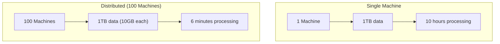
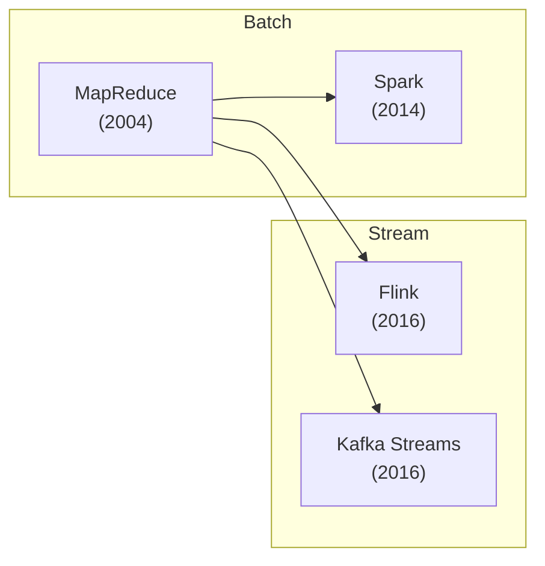
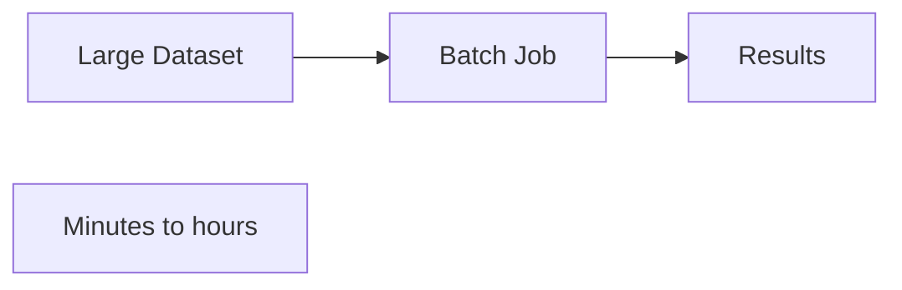
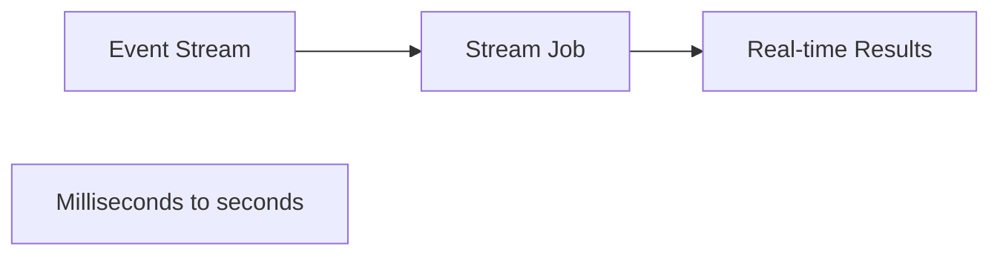
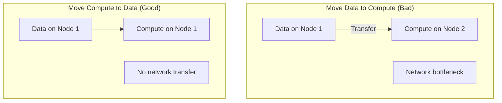
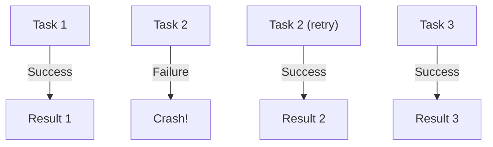
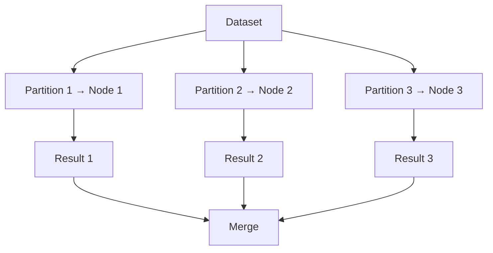

# MapReduce and Distributed Processing

## Overview

Distributed processing frameworks allow computation to be **parallelized across thousands of machines**. This is essential for processing datasets too large for a single machine. The key insight: move computation to data, not data to computation.

## Why Distributed Processing?

| Benefit | Description |
|---------|-------------|
| **Speed** | Parallel processing across many machines |
| **Scale** | Process petabytes of data |
| **Fault tolerance** | Recompute failed tasks on other machines |
| **Cost** | Use commodity hardware |

## Evolution of Processing Frameworks

| Framework | Type | Key Innovation |
|-----------|------|----------------|
| **MapReduce** | Batch | Simple map/shuffle/reduce paradigm |
| **Spark** | Batch/Stream | In-memory processing, RDDs |
| **Flink** | Stream/Batch | True streaming, event time |
| **Kafka Streams** | Stream | Library (no cluster needed) |

## Processing Models

### Batch Processing

Process large datasets with bounded input:

### Stream Processing

Process unbounded data streams in real-time:

## Key Concepts

### Data Locality

### Fault Tolerance

### Data Partitioning

## Comparison

| Aspect | MapReduce | Spark | Flink |
|--------|-----------|-------|-------|
| **Model** | Batch | Micro-batch | True streaming |
| **Latency** | High (minutes) | Low (seconds) | Very low (ms) |
| **State** | Stateless | RDDs/DStreams | Stateful |
| **Fault tolerance** | Recompute | Lineage | Checkpoints |
| **Ease of use** | Complex | Moderate | Moderate |

## Interview Questions

1. **What is data locality and why is it important?**
   - Moving computation to where data resides, rather than transferring data over the network. This avoids network bottlenecks and dramatically improves performance.

2. **How do distributed processing frameworks handle failures?**
   - Recompute failed tasks on other machines. MapReduce re-runs map/reduce tasks. Spark uses RDD lineage to reconstruct lost data. Flink uses checkpoints.

3. **When would you use batch vs. stream processing?**
   - Batch: when you can wait for results (daily reports, training ML models). Stream: when you need real-time results (fraud detection, live dashboards).

## Summary

Distributed processing enables computation at scale by parallelizing work across many machines. MapReduce introduced the paradigm, Spark optimized it with in-memory processing, and Flink/Kafka Streams handle real-time streaming. The choice depends on latency requirements and data characteristics.

## Cross-References

- [MapReduce Framework](mapreduce.md) — The foundational paradigm
- [Apache Spark](spark.md) — In-memory processing
- [Stream Processing](streaming.md) — Real-time processing
- [Partitioning](../partitioning/README.md) — How data is distributed
- [Message Queues](../messaging/queues.md) — Input for stream processing
- [Kafka](../messaging/kafka.md) — Common data source
