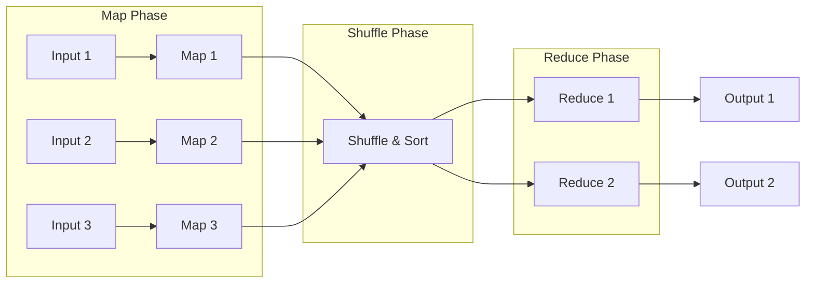
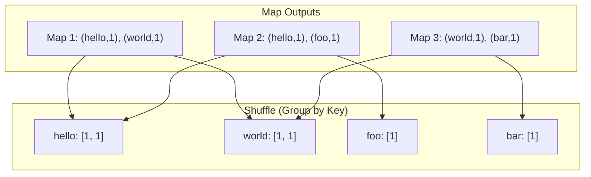
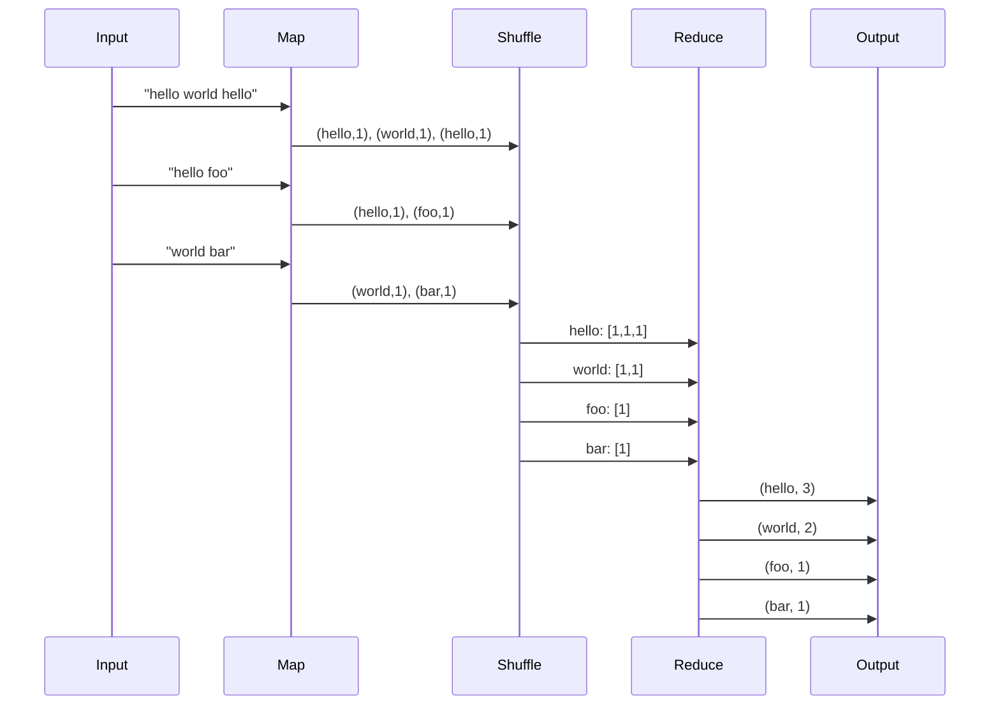
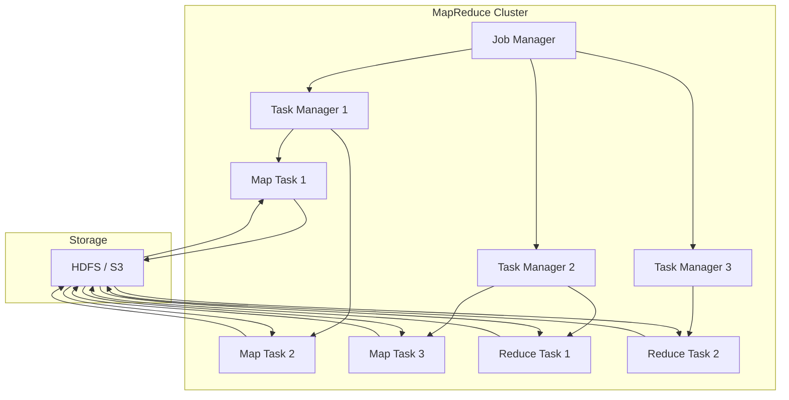
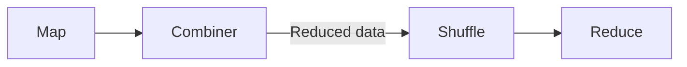
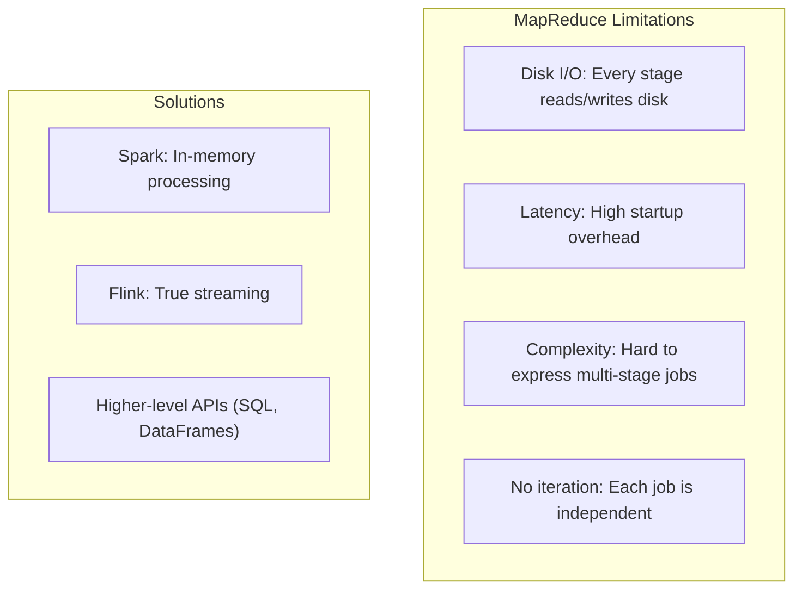

# MapReduce Framework

## Overview

MapReduce is a programming model and processing framework introduced by Google in 2004. It simplifies parallel processing by breaking computation into two phases: **Map** (process individual records) and **Reduce** (aggregate results). Despite being largely superseded by Spark and Flink, MapReduce's concepts remain foundational.

## The MapReduce Paradigm



### Phase 1: Map

```python
def map(key, value):
    """
    Input: A single record (key, value)
    Output: List of intermediate (key, value) pairs
    """
    results = []
    # Process the record
    for word in value.split():
        results.append((word, 1))
    return results
```

### Phase 2: Shuffle & Sort



### Phase 3: Reduce

```python
def reduce(key, values):
    """
    Input: A key and list of all values for that key
    Output: Final (key, value) pair
    """
    return (key, sum(values))
```

## Word Count Example

The classic MapReduce example:



### Complete Implementation

```python
from collections import defaultdict

# Input data (distributed across nodes)
inputs = [
    ("doc1", "hello world hello"),
    ("doc2", "hello foo"),
    ("doc3", "world bar"),
]

# === MAP PHASE ===
map_outputs = []
for key, value in inputs:
    for word in value.split():
        map_outputs.append((word, 1))

# === SHUFFLE PHASE ===
shuffle = defaultdict(list)
for key, value in map_outputs:
    shuffle[key].append(value)

# === REDUCE PHASE ===
results = {}
for key, values in shuffle.items():
    results[key] = sum(values)

print(results)
# {'hello': 3, 'world': 2, 'foo': 1, 'bar': 1}
```

## MapReduce Architecture



### Execution Flow

1. **Input splitting**: Divide input into fixed-size chunks (typically 64MB-256MB)
2. **Map tasks**: One map task per chunk, runs on the node storing the chunk
3. **Shuffle**: Intermediate results are transferred to reducers (grouped by key)
4. **Reduce tasks**: Process grouped data and write output
5. **Commit**: Output written to distributed storage

## Combiner (Local Reduce)

A combiner runs on the mapper node to reduce data transfer:



```python
# Without combiner: sends all (word, 1) pairs
# With combiner: sends (word, count) per mapper

# Combiner is often the same as reducer
def combiner(key, values):
    return (key, sum(values))
```

## Partitioner

The partitioner determines which reducer gets each key:

```python
def partitioner(key, num_reducers):
    return hash(key) % num_reducers
```

## MapReduce Patterns

### Pattern 1: Filtering

```python
def map(key, value):
    if value.temperature > 100:
        yield (key, value)

def reduce(key, values):
    yield (key, list(values))
```

### Pattern 2: Aggregation

```python
def map(key, value):
    yield (value.category, value.amount)

def reduce(key, values):
    yield (key, sum(values))
```

### Pattern 3: Join

```python
# Map side join
def map(key, value):
    if value.source == "users":
        yield (value.user_id, ("user", value))
    elif value.source == "orders":
        yield (value.user_id, ("order", value))

def reduce(key, values):
    users = [v for tag, v in values if tag == "user"]
    orders = [v for tag, v in values if tag == "order"]
    for user in users:
        for order in orders:
            yield (key, (user, order))
```

## Limitations of MapReduce



## Real-World Usage

| System | Usage |
|--------|-------|
| **Hadoop MapReduce** | Original open-source implementation |
| **Google MapReduce** | Internal Google processing |
| **Elasticsearch** | Aggregations use MapReduce-like paradigm |
| **MongoDB** | Aggregation pipeline |

## Interview Questions

1. **Explain the MapReduce paradigm.**
   - Map: process each input record into key-value pairs. Shuffle: group intermediate results by key. Reduce: aggregate all values for each key into final output.

2. **What is the role of the combiner?**
   - A local reducer that runs on the mapper node to reduce data transfer during the shuffle phase. It pre-aggregates results before sending them to reducers.

3. **How does MapReduce handle failures?**
   - MapReduce re-runs failed map or reduce tasks on other nodes. Map task outputs are stored on disk, so they can be re-read. Reduce tasks read from multiple map outputs.

4. **What are the limitations of MapReduce?**
   - High disk I/O (every stage reads/writes disk), high latency (startup overhead), complex multi-stage jobs (no native iteration), and rigid programming model.

5. **How is MapReduce different from Spark?**
   - MapReduce writes intermediate results to disk; Spark keeps them in memory (RDDs). Spark supports iterative algorithms efficiently. Spark has higher-level APIs (DataFrames, SQL).

## Common Mistakes

- Not using **combiners** when possible — increases shuffle data
- Choosing too many or too few **reducers** — affects parallelism and overhead
- Not considering **data skew** — one reducer gets most of the data
- Forgetting that MapReduce is **disk-based** — not suitable for iterative algorithms
- Confusing the **shuffle phase** with network transfer — it includes both transfer and sort

## Summary

MapReduce introduced a simple paradigm for parallel processing: map transforms records, shuffle groups by key, reduce aggregates results. While limited by disk I/O and latency, its concepts remain foundational. Modern frameworks like Spark and Flink build on these ideas with in-memory processing and streaming support.

## Cross-References

- [MapReduce Overview](README.md) — Distributed processing overview
- [Apache Spark](spark.md) — In-memory alternative
- [Stream Processing](streaming.md) — Real-time processing
- [Partitioning](../partitioning/README.md) — How data is distributed to mappers
- [HDFS](../replication/chain.md) — Storage layer for MapReduce

## Cross References

- [Spark](spark.md)
- [Streaming](streaming.md)
- [Partitioning](../partitioning/README.md)
- [Data Pipelines](../../ml/system-design/data-pipeline.md)
