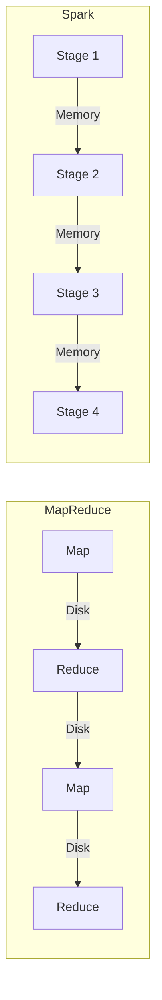
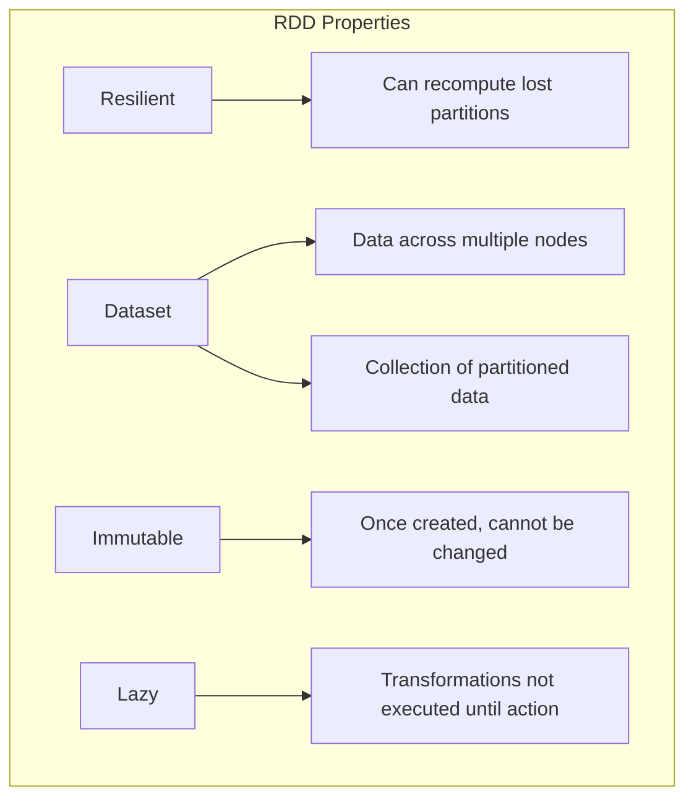
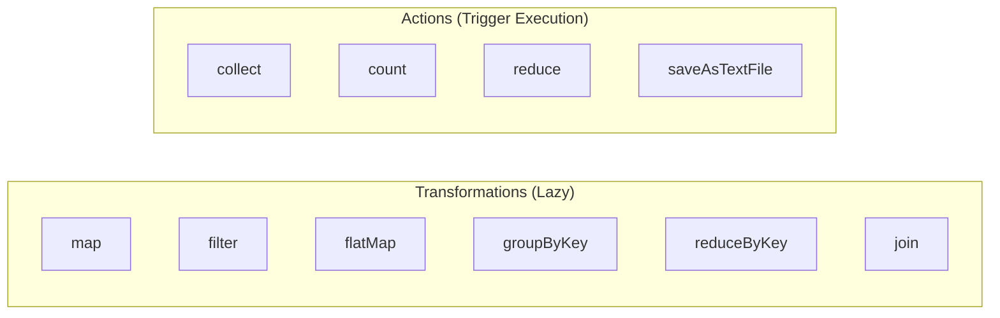
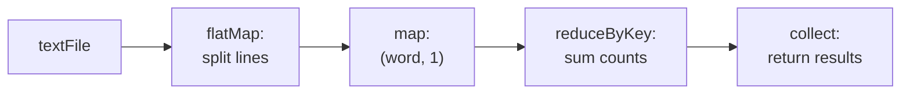
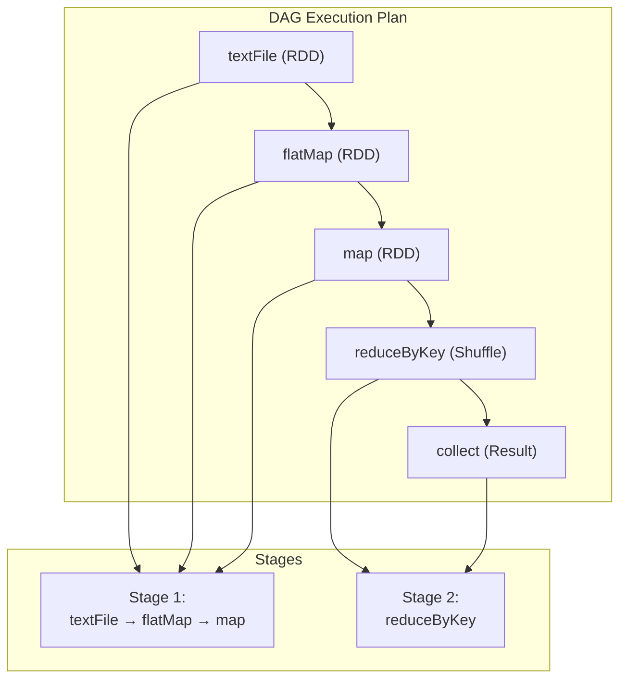
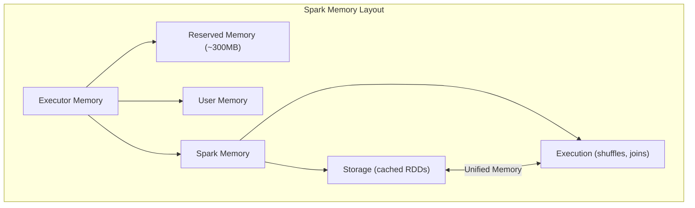
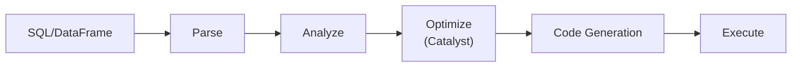
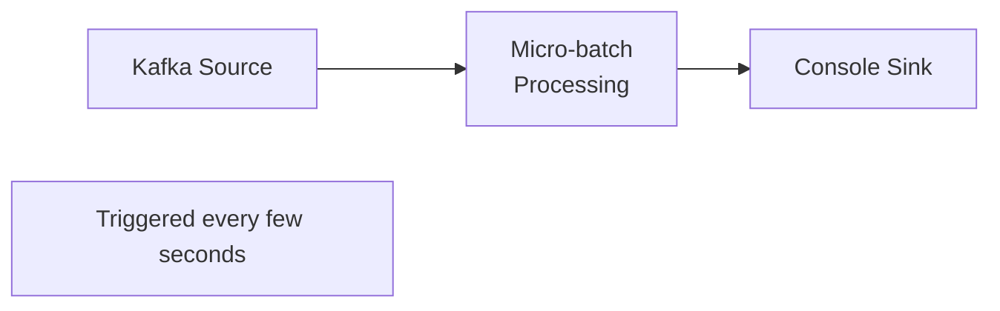
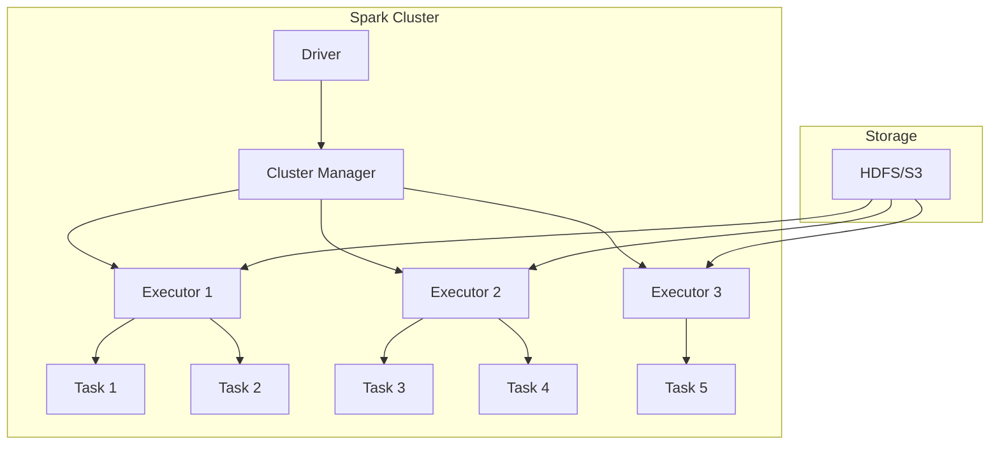

# Apache Spark

## Overview

Apache Spark is a unified analytics engine for large-scale data processing. It was developed at UC Berkeley's AMPLab in 2009 and open-sourced in 2010. Spark's key innovation is **in-memory processing** — keeping intermediate results in memory rather than writing to disk, making it up to 100x faster than Hadoop MapReduce for iterative algorithms.

## Why Spark?



| Feature | MapReduce | Spark |
|---------|-----------|-------|
| **Speed** | Slow (disk I/O) | Fast (in-memory) |
| **Ease of use** | Low-level Java | High-level APIs (Scala, Python, SQL) |
| **Iterative** | Poor (each iteration writes to disk) | Excellent (RDDs stay in memory) |
| **Streaming** | Not native | Structured Streaming |
| **SQL** | Hive (slow) | Spark SQL (fast) |

## Core Abstraction: RDDs

**Resilient Distributed Datasets (RDDs)** are Spark's fundamental data structure:



### RDD Operations



### Example: Word Count with RDDs

```python
from pyspark import SparkContext

sc = SparkContext("local", "WordCount")

# Create RDD from text file
text = sc.textFile("input.txt")

# Transformations (lazy - not executed yet)
words = text.flatMap(lambda line: line.split(" "))
pairs = words.map(lambda word: (word, 1))
counts = pairs.reduceByKey(lambda a, b: a + b)

# Action (triggers execution)
results = counts.collect()
for word, count in results:
    print(f"{word}: {count}")
```



## DAG (Directed Acyclic Graph)

Spark builds a DAG of stages from RDD transformations:



### Stage Boundaries

A new stage starts at each **shuffle** operation (data transfer between partitions):

| Operation | Type | Stage Boundary? |
|-----------|------|----------------|
| `map` | Narrow | No |
| `filter` | Narrow | No |
| `flatMap` | Narrow | No |
| `groupByKey` | Wide | **Yes** |
| `reduceByKey` | Wide | **Yes** |
| `join` | Wide | **Yes** |

## Memory Management



### Storage Levels

| Level | Description | Use Case |
|-------|-------------|----------|
| `MEMORY_ONLY` | Store as deserialized Java objects | Default, fastest |
| `MEMORY_AND_DISK` | Spill to disk if memory full | Large datasets |
| `MEMORY_ONLY_SER` | Store as serialized bytes | Memory-efficient |
| `DISK_ONLY` | Store only on disk | Very large datasets |
| `OFF_HEAP` | Store outside JVM | GC-sensitive apps |

## Spark SQL and DataFrames

```python
from pyspark.sql import SparkSession

spark = SparkSession.builder.appName("Example").getOrCreate()

# Create DataFrame
df = spark.read.json("users.json")

# SQL-like operations
result = df.filter(df.age > 25) \
           .groupBy("city") \
           .count() \
           .orderBy("count", ascending=False)

# Register as temp view and use SQL
df.createOrReplaceTempView("users")
result = spark.sql("SELECT city, COUNT(*) FROM users WHERE age > 25 GROUP BY city")
```

### Catalyst Optimizer



Catalyst optimizes queries by:
- Predicate pushdown
- Column pruning
- Join reordering
- Constant folding

## Structured Streaming

```python
# Read stream
stream = spark.readStream \
    .format("kafka") \
    .option("subscribe", "events") \
    .load()

# Process
counts = stream \
    .groupBy(window("timestamp", "5 minutes"), "event_type") \
    .count()

# Write stream
query = counts.writeStream \
    .outputMode("complete") \
    .format("console") \
    .start()
```



## Spark Architecture



| Component | Role |
|-----------|------|
| **Driver** | Runs main program, creates SparkContext, schedules tasks |
| **Cluster Manager** | Allocates resources (YARN, Mesos, K8s, Standalone) |
| **Executor** | Runs tasks on worker nodes, stores data in memory |
| **Task** | Unit of work, one task per partition |

## Spark vs. MapReduce vs. Flink

| Aspect | MapReduce | Spark | Flink |
|--------|-----------|-------|-------|
| **Processing** | Batch | Micro-batch | True streaming |
| **Latency** | Minutes | Seconds | Milliseconds |
| **State** | Stateless | DStreams/RDDs | Stateful |
| **Fault tolerance** | Recompute | Lineage | Checkpoints |
| **Use case** | ETL | Analytics | Real-time |

## Interview Questions

1. **What are RDDs and why are they important?**
   - Resilient Distributed Datasets: immutable, partitioned collections that can be operated on in parallel. They're resilient because lost partitions can be recomputed from lineage. They enable in-memory processing.

2. **What is the difference between transformations and actions?**
   - Transformations (map, filter, join) are lazy — they build a DAG but don't execute. Actions (collect, count, save) trigger execution of the DAG.

3. **How does Spark achieve fault tolerance?**
   - RDD lineage — each RDD remembers how it was created from other RDDs. If a partition is lost, Spark recomputes it from the source using the lineage.

4. **What is the Catalyst optimizer?**
   - Spark SQL's query optimizer that applies rule-based and cost-based optimizations: predicate pushdown, column pruning, join reordering, and code generation.

5. **How does Spark differ from MapReduce?**
   - Spark keeps intermediate results in memory (MapReduce writes to disk). Spark has higher-level APIs. Spark supports iterative algorithms efficiently. Spark can be 10-100x faster.

6. **What are narrow and wide transformations?**
   - Narrow: each input partition maps to one output partition (map, filter). Wide: each input partition can map to multiple output partitions (groupByKey, join) — requires shuffle.

## Common Mistakes

- Not caching frequently used RDDs — causes recomputation
- Using `collect()` on large datasets — pulls all data to driver, causes OOM
- Too many small partitions or too few large partitions — affects parallelism
- Not understanding shuffle operations — they're expensive and create stage boundaries
- Confusing DataFrames with RDDs — DataFrames have Catalyst optimization

## Summary

Spark revolutionized big data processing with in-memory computing and high-level APIs. RDDs provide fault-tolerant distributed collections, the DAG scheduler optimizes execution, and Catalyst optimizes SQL queries. Spark unifies batch, streaming, SQL, and ML processing in a single framework.

## Cross-References

- [MapReduce Framework](mapreduce.md) — Spark's predecessor
- [Stream Processing](streaming.md) — Spark Streaming vs. Flink
- [Kafka](../messaging/kafka.md) — Common data source for Spark
- [Partitioning](../partitioning/README.md) — How RDDs are partitioned
- [MapReduce Overview](README.md) — Distributed processing context
