# Stream Processing

## Overview

Stream processing handles **unbounded data streams** in real-time, processing events as they arrive rather than in batches. It's essential for use cases requiring low-latency insights: fraud detection, real-time analytics, monitoring, and event-driven architectures. Major frameworks include Apache Flink, Kafka Streams, and Spark Structured Streaming.

## Batch vs. Stream Processing

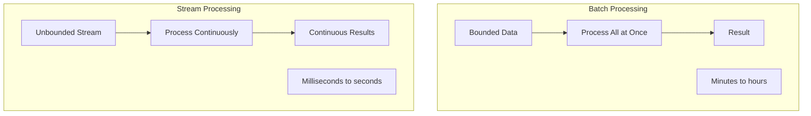

| Aspect | Batch | Stream |
|--------|-------|--------|
| **Data** | Bounded (finite) | Unbounded (infinite) |
| **Latency** | High (minutes+) | Low (ms to seconds) |
| **Completeness** | Full dataset available | Partial data |
| **Use case** | Reports, training | Real-time alerts, monitoring |

## Key Concepts

### Event Time vs. Processing Time

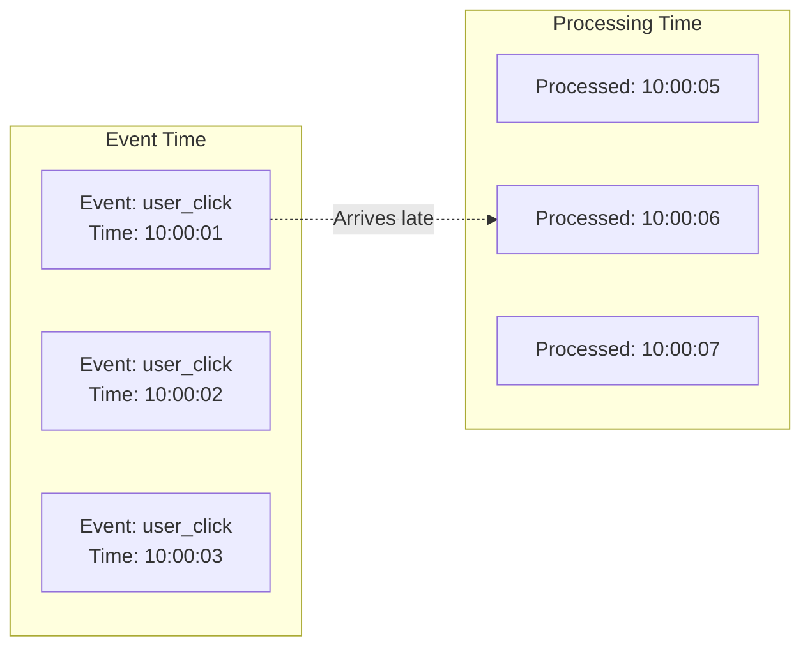

| Time Type | Description | Use Case |
|-----------|-------------|----------|
| **Event time** | When the event actually occurred | Analytics, auditing |
| **Processing time** | When the event is processed | Monitoring, alerts |
| **Ingestion time** | When the event enters the system | Compromise |

### Watermarks

Watermarks track progress in event time, handling late-arriving data:

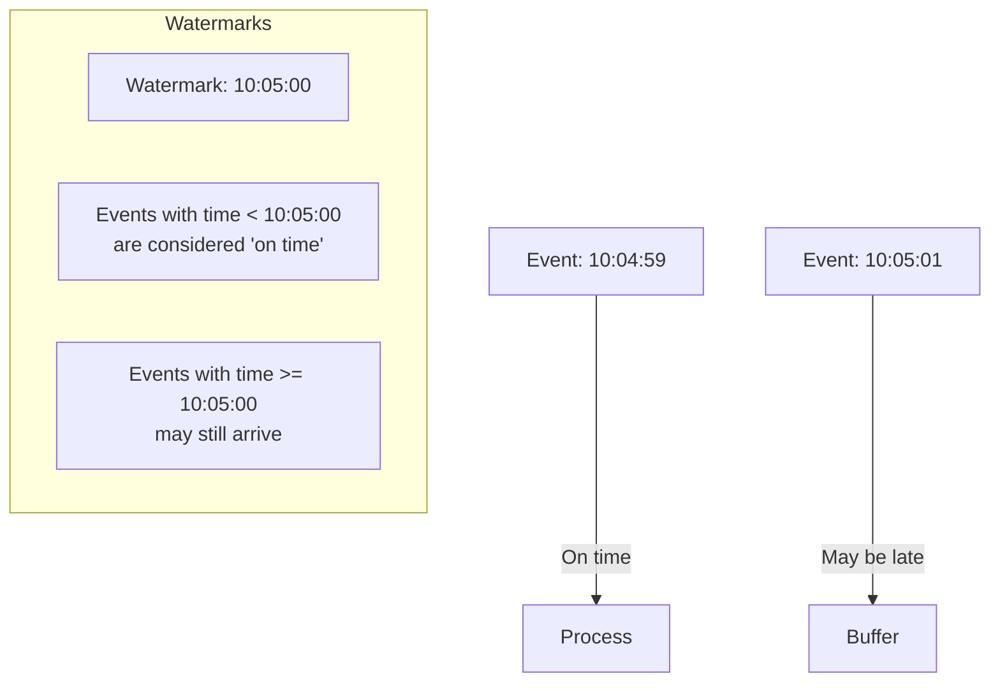

### Windowing

Windows group events for aggregation:

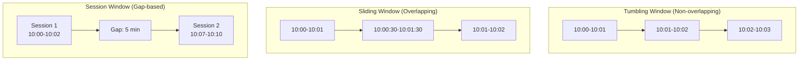

| Window Type | Description | Example |
|-------------|-------------|---------|
| **Tumbling** | Fixed-size, non-overlapping | Count per minute |
| **Sliding** | Fixed-size, overlapping | Moving average |
| **Session** | Variable-size, gap-based | User sessions |
| **Global** | All events | Total count |

## Apache Flink

Flink is a true stream processing framework with batch capabilities:

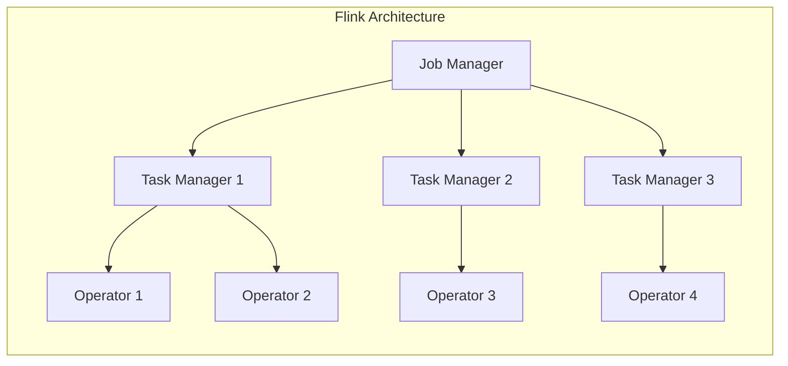

### Flink Example

```java
StreamExecutionEnvironment env = 
    StreamExecutionEnvironment.getExecutionEnvironment();

// Source: Kafka
DataStream<Event> events = env
    .addSource(new FlinkKafkaConsumer<>("events", 
        new EventDeserializer(), properties));

// Processing: Windowed aggregation
DataStream<Result> results = events
    .filter(event -> event.getType().equals("click"))
    .keyBy(event -> event.getUserId())
    .window(TumblingEventTimeWindows.of(Time.minutes(5)))
    .aggregate(new CountAggregate());

// Sink: Database
results.addSink(new JdbcSink(...));

env.execute("Click Counter");
```

### Flink State Management

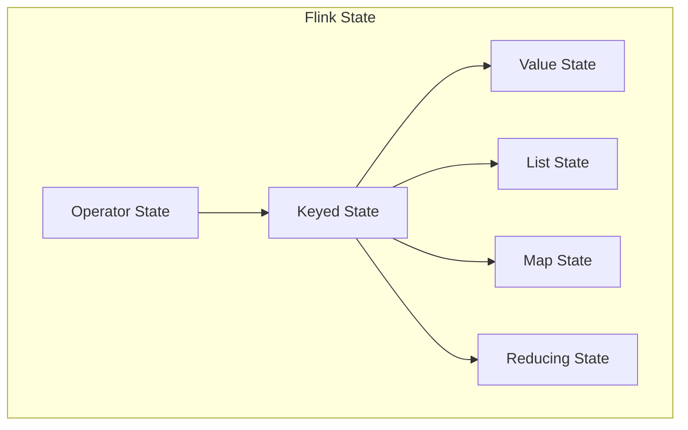

### Flink Checkpointing

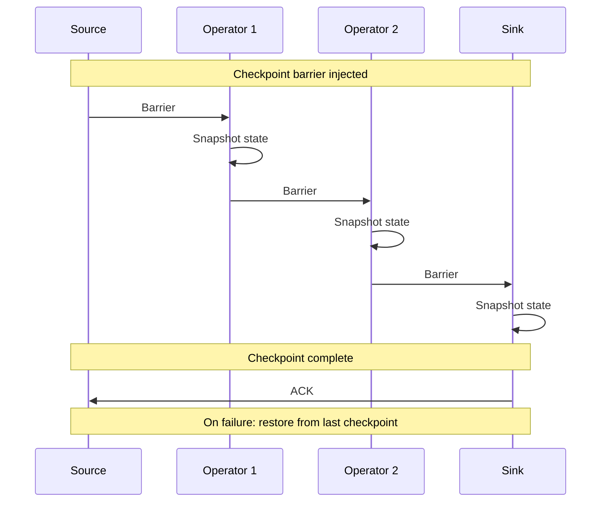

## Kafka Streams

Kafka Streams is a **client library** for stream processing (no separate cluster needed):

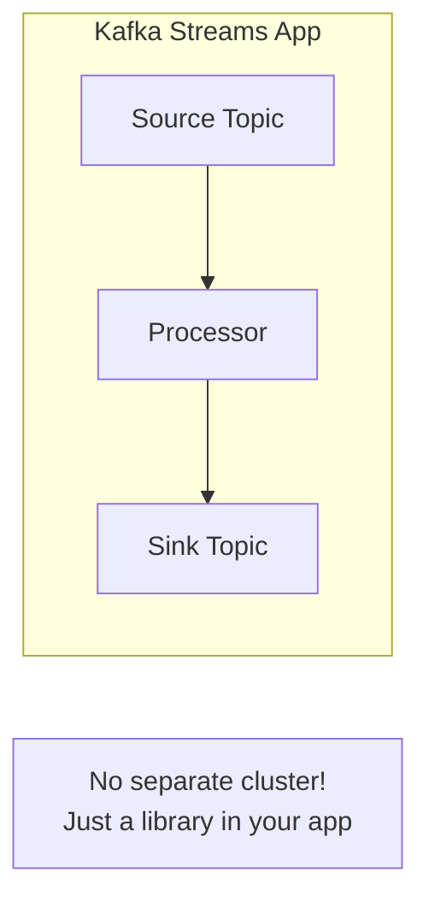

### Kafka Streams Example

```java
StreamsBuilder builder = new StreamsBuilder();

KStream<String, Event> events = builder.stream("events");

KTable<String, Long> counts = events
    .filter((key, event) -> event.getType().equals("click"))
    .groupBy((key, event) -> event.getUserId())
    .windowedBy(TimeWindows.ofSizeWithNoGrace(Duration.ofMinutes(5)))
    .count();

counts.toStream().to("click-counts");

KafkaStreams streams = new KafkaStreams(builder.build(), config);
streams.start();
```

### Kafka Streams Architecture

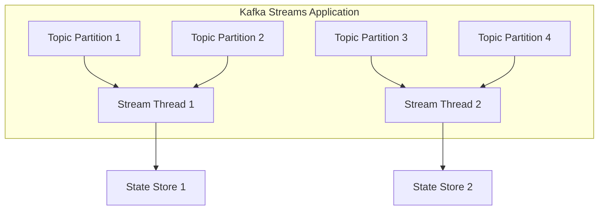

## Comparison: Flink vs. Kafka Streams vs. Spark Streaming

| Aspect | Flink | Kafka Streams | Spark Streaming |
|--------|-------|--------------|-----------------|
| **Type** | Cluster framework | Library | Micro-batch |
| **Latency** | Very low (ms) | Low (ms) | Medium (seconds) |
| **State** | Managed, distributed | Local state stores | DStreams |
| **Fault tolerance** | Checkpoints | Kafka-backed | RDD lineage |
| **Windowing** | Rich (event time) | Basic | Tumbling only |
| **Cluster required** | Yes | No | Yes |
| **Use case** | Complex event processing | Simple Kafka apps | Batch+stream |

## Exactly-Once Semantics

Stream processing must handle failures without duplicating or losing data:

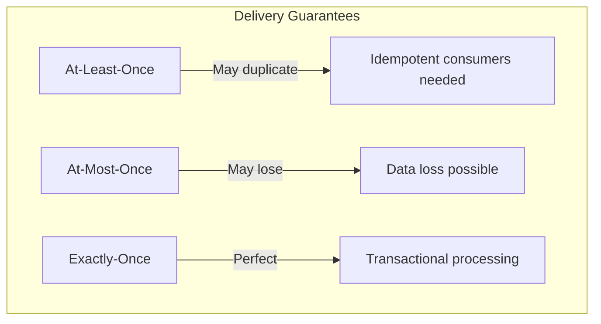

### Exactly-Once Implementation

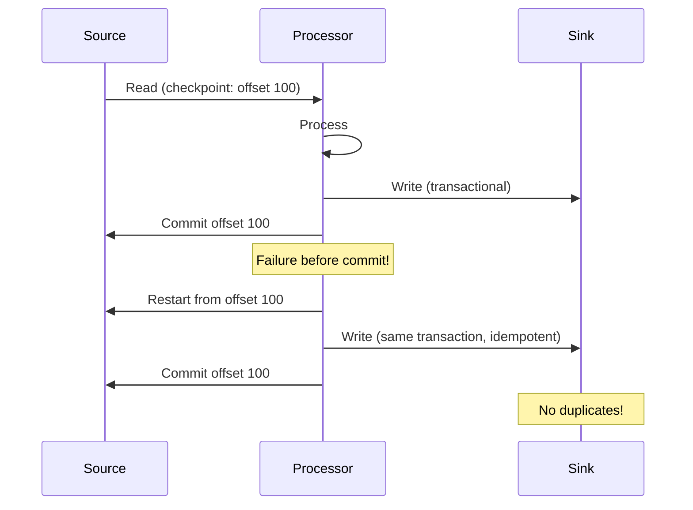

## Interview Questions

1. **What is the difference between event time and processing time?**
   - Event time: when the event actually occurred. Processing time: when it's processed. Event time is important for correctness (handling late data); processing time is simpler but can be misleading.

2. **What are watermarks in stream processing?**
   - Watermarks track progress in event time. A watermark at time T means "no events with time < T are expected." They allow the system to handle late-arriving data.

3. **Explain the different window types.**
   - Tumbling: fixed-size, non-overlapping (1-minute windows). Sliding: fixed-size, overlapping (1-minute window, 30-second slide). Session: variable-size, gap-based (user sessions). Global: all events.

4. **How does Flink achieve exactly-once semantics?**
   - Through checkpointing (distributed snapshots) and transactional sinks. Checkpoints capture the state of all operators. On failure, the system restores from the last checkpoint and reprocesses.

5. **Compare Flink and Kafka Streams.**
   - Flink: cluster framework, rich windowing, managed state, complex event processing. Kafka Streams: client library, simpler, uses Kafka as state store, no separate cluster needed.

6. **What is the difference between narrow and wide transformations in stream processing?**
   - Narrow: each input record produces one output record (map, filter). Wide: input records are grouped/aggregated (groupBy, join) — requires state and potentially repartitioning.

## Common Mistakes

- Ignoring **event time** — processing time can give wrong results with out-of-order events
- Not setting **watermarks** — causes windows to never close
- Choosing **micro-batch** when true streaming is needed
- Not handling **late-arriving data** — use allowed lateness
- Forgetting about **state management** — stateful operations need careful design
- Not considering **exactly-once** requirements — at-least-once can cause duplicates

## Summary

Stream processing handles unbounded data streams in real-time. Key concepts include event time vs. processing time, watermarks, and windowing. Flink provides true streaming with rich features, Kafka Streams offers simplicity as a library, and Spark Structured Streaming bridges batch and stream. Exactly-once semantics requires careful coordination between sources, processors, and sinks.

## Cross-References

- [MapReduce Overview](README.md) — Batch processing context
- [MapReduce Framework](mapreduce.md) — Batch paradigm
- [Apache Spark](spark.md) — Spark Structured Streaming
- [Kafka](../messaging/kafka.md) — Common source/sink
- [Message Queues](../messaging/queues.md) — Delivery guarantees
- [Observability](../microservices/observability.md) — Monitoring stream jobs

## Cross References

- [MapReduce](mapreduce.md)
- [Spark](spark.md)
- [Kafka](../messaging/kafka.md)
- [Pub/Sub](../messaging/pubsub.md)
