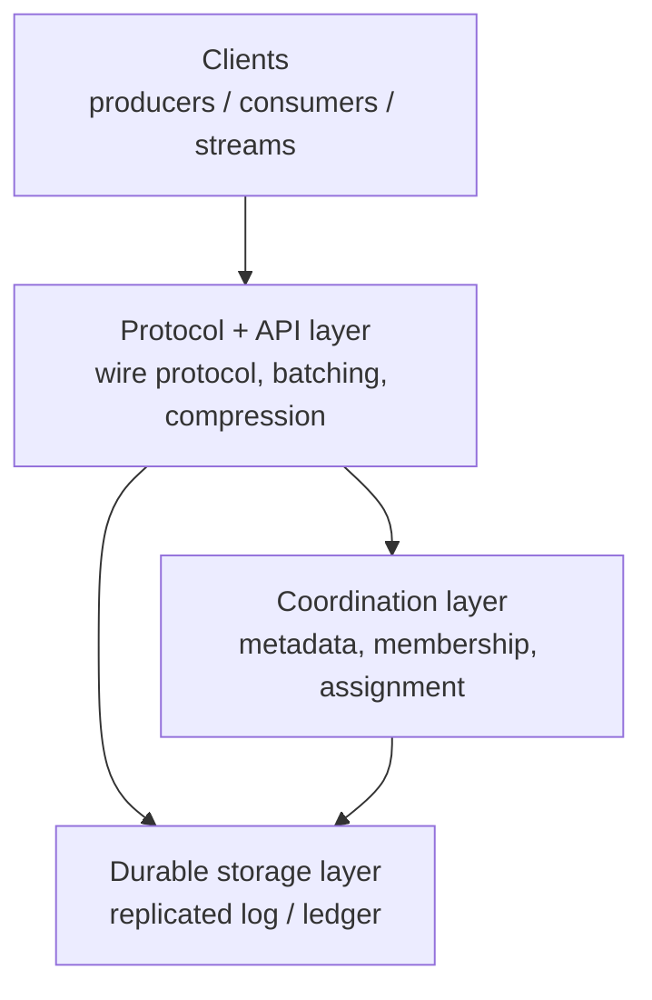

# Messaging Internals: Which Message System When

## Overview

The messaging overview pages in this book explain what Kafka, Pulsar, RabbitMQ, and NATS are; this folder explains **how they work inside** — log segments and indexes, group coordination wire protocols, BookKeeper quorums, thread-per-core schedulers — and **which system to pick** given a concrete constraint set. Internals matter in interviews because every senior-level question ("why is Kafka fast?", "why did you pick Pulsar over Kafka?", "what breaks during rebalancing?") is answered at the mechanism level, not the feature level. Start here for the decision map, then descend into the page that matches the question.

## Which Message System When

Pick by dominant constraint, not by feature checklist. Throughput numbers below are order-of-magnitude figures for commodity hardware from vendor-neutral benchmarks (OpenMessagingBenchmark-style 3-node clusters); real deployments vary by payload size, durability settings, and client choice.

| Constraint / requirement | Best fit | Why | Runner-up |
|---|---|---|---|
| Sustained high throughput (hundreds of MB/s per broker), replayable event log | **Kafka** | Sequential append + page cache + batching; offsets make replay free | Redpanda |
| Huge fan-out with independent consumption positions per subscriber | **Kafka** | Consumer groups keep per-group offsets in one shared log | Pulsar |
| Multi-tenant cluster, many small topics (10k+), quotas per tenant | **Pulsar** | Namespace bundles + stateless brokers isolate tenants; Kafka partitions are broker-local directories | Kafka (carefully tuned) |
| Independent scaling of compute and storage, elastic topic growth | **Pulsar** | Brokers own nothing; BookKeeper stores ledgers | Kafka + KIP-405 tiered storage (read-only tier) |
| Multi-region active-active replication built in | **Pulsar** | Per-topic async geo-replication is a first-class feature | Kafka + MirrorMaker 2 (operational overhead) |
| Kafka API with no JVM/GC tail-latency concerns | **Redpanda** | C++ thread-per-core, same wire protocol | Kafka on Java 17+ with tuned GC |
| Tiny footprint at the edge (single binary, <100 MB RAM, intermittent connectivity) | **NATS** | One ~20 MB binary; leaf nodes synthesize global message graph | MQTT brokers |
| Fire-and-forget fan-out at microsecond latency, no persistence | **NATS core** | Interest-based routing, zero storage on the hot path | Redis pub/sub |
| Durable streaming but far less operational surface than Kafka | **NATS JetStream** | Streams + consumers with Raft-replicated metadata; single system | Kafka |
| Task queue with rich routing, per-message ack, TTL, priorities | **RabbitMQ** | AMQP exchanges/bindings; messages deleted on ack | Pulsar (shared/key_shared subscriptions) |
| Request/reply RPC over messaging | **NATS core** | One-line `Request()` with inbox subjects and timeouts | RabbitMQ (direct reply-to) |
| Exactly-once end-to-end within one ecosystem | **Kafka** (transactions) or **NATS JetStream** (dedup window) | Idempotent producer + `read_committed` vs Nats-Msg-Id window | Pulsar transactions |

Two systems are deliberately absent from this table: **BookKeeper** is not a message system at all (it is the replicated write-ahead-log storage layer under Pulsar — see [BookKeeper internals](bookkeeper-internals.md)), and **Redis Streams** is covered in the backend Redis page.

## Component Map

Every system in this folder splits into the same four layers; implementations differ in where they place the durable storage and who computes assignments.

| Layer | Kafka | Pulsar | Redpanda | NATS JetStream | RabbitMQ |
|---|---|---|---|---|---|
| Protocol/API | Kafka binary protocol (librdkafka, Java client) | Pulsar binary protocol | **Kafka wire protocol (reused)** | NATS text protocol + JetStream API | AMQP 0-9-1 |
| Durable storage | Broker-local segment files (coupled) | BookKeeper ledgers (decoupled) | Broker-local, Raft-replicated | Stream message blocks (file or memory) | Per-queue files (msg_store) |
| Coordination | KRaft (Raft metadata quorum, KIP-500) | ZooKeeper (migrating to Oxia) | Embedded Raft controller group | Raft meta-group (3/5 servers) | Erlang distribution / quorum queues via Raft |
| Assignment owner | Client-side: group leader consumer (v1) → broker-side (KIP-848) | Broker owns topic-bundle; server-side dispatch | Broker-side, Kafka-compatible | Server-side interest graph | Broker queues |
| Compute/storage coupling | Coupled — moving a partition copies data | Decoupled — broker owns a pointer | Coupled, Raft-replicated | Coupled to stream's Raft group | Coupled to queue's node |

The coupling row is the load-bearing one. In Kafka a partition-replica lives in a broker's local filesystem, so a broker failure forces leader election plus (for permanent failures) data re-replication across the network. In Pulsar a broker holds only an ownership lease on a namespace bundle; a failed broker's topics are re-owned by survivors in seconds because the bytes were already committed to BookKeeper's quorums. That trade buys elasticity at the price of one more always-on component — the operational question to ask in any "Kafka vs Pulsar" interview answer.

## Internals Index

Read the page that matches the interview question being asked:

| Page | Read when asked about... |
|---|---|
| [Kafka log internals](kafka-log-internals.md) | Segment files, `.index`/`.timeindex`, zero-copy sendfile, ISR + `acks=all` path, high watermark vs leader epoch, fetch session cache |
| [Kafka consumer rebalancing](kafka-consumer-rebalancing.md) | JoinGroup/SyncGroup, generation IDs, eager vs cooperative, static membership, KIP-848 server-side assignment, rebalance storms |
| [Pulsar internals](pulsar-internals.md) | Stateless brokers, namespace bundles and splits, BookKeeper ensemble/write/ack quorums, geo-replication, latency model |
| [BookKeeper internals](bookkeeper-internals.md) | Journal vs entry log vs index, LAC fencing, ensemble reconfiguration, autorecovery, why Kafka's tiered storage is different (KIP-405) |
| [Redpanda and thread-per-core](redpanda-and-thread-per-core.md) | Seastar shard-per-core, Raft-native metadata (vs KRaft), no GC, tiered storage, honest benchmark caveats |
| [NATS and JetStream](nats-jetstream.md) | Core NATS interest graph, streams/consumers, retention modes, dedup-based exactly-once, mirror/source streams, edge use cases |
| [Exactly-once semantics](exactly-once-semantics.md) | Idempotent producer (PID + sequence), transactions and `__transaction_state`, LSO and `read_committed`, what EOS does **not** cover |
| [Backpressure and flow control](backpressure-and-flow-control.md) | Producer quotas, consumer lag, reactive/R2DBC, TCP window interplay, broker throttling, load-shedding hierarchies |

## Cross-Cutting Dimensions

When comparing two systems in an interview, score them on five dimensions in this order. Most candidate answers fail by comparing features ("Pulsar has key_shared") instead of mechanisms.

1. **Where the log lives.** Broker-local file (Kafka, Redpanda) vs third-quorum storage (Pulsar/BookKeeper) vs Raft-replicated per stream (JetStream). This single decision determines failure behavior, elasticity, and tail latency.
2. **Who computes assignment.** Client-side protocols leak complexity into every client library and make rebalances slow (Kafka ≤3.x); server-side assignment (KIP-848, Pulsar, NATS) makes the broker the single source of truth.
3. **Delivery-semantics machinery.** At-least-once is the default everywhere; exactly-once is always a *mechanism* — Kafka transactions, NATS dedup windows, Pulsar transactions — never a checkbox. See [exactly-once semantics](exactly-once-semantics.md).
4. **Flow-control model.** Pull-based (Kafka fetch, JetStream pull consumers) naturally backpressures; push-based (RabbitMQ, JetStream push) needs explicit credit/prefetch controls. See [backpressure](backpressure-and-flow-control.md).
5. **Operational topology.** Number of always-running components (Kafka: 1, Pulsar: 2-3, JetStream: 1) and blast radius of a node failure (data movement vs ownership transfer).

## Rapid Comparison Cheat Sheet

Order-of-magnitude defaults for the four systems this folder dissects. Numbers assume default configs on 3-node clusters with local NVMe — enough precision for interview answers, not for capacity planning.

| Property | Kafka | Pulsar | Redpanda | NATS JetStream |
|---|---|---|---|---|
| Storage unit | Segment files in broker's FS | BookKeeper ledgers | Segment files (Raft log) | Message blocks (file/memory) |
| Default durability | `acks=all` + RF 3 (ISR) | E=3, Qw=3, Qa=2 per ledger | Raft majority per partition | R3 Raft stream (or R1) |
| Typical produce latency (persisted) | 5–20 ms | 5–15 ms | 2–10 ms | 1–10 ms |
| Sustained per-broker throughput | 100s MB/s | 50–200 MB/s | 100s MB/s (claim) | 10s–100 MB/s |
| Ordering | Per partition | Per partition (per-key on key_shared) | Per partition | Per stream (per subject) |
| Replay | Offset-based, unlimited with retention | Cursor-based, unlimited with retention | Offset-based | Sequence-based per stream |
| Wildcard subscribe | No | No | No | Yes (`*`, `>`) |
| Consumer protocol | Group coordinator (v1 → KIP-848) | Broker-side dispatch | Kafka-compatible | Server-side cursor + ack |
| External metadata | None (KRaft internal) | ZooKeeper (→ Oxia migration work) | None | None |
| License | Apache 2.0 | Apache 2.0 | Source-available (community + enterprise) | Apache 2.0 |

Three rows deserve attention in any comparison answer. **Durability defaults are not comparable directly**: Kafka's `acks=all` counts *replica acks* without fsync, while BookKeeper's Qa counts *journal fsyncs* on remote bookies — Pulsar's ack is slower per byte but gives a stronger per-bookie durability floor. **Ordering scope differs**: NATS's wildcard subject subscriptions have no Kafka analog, and Pulsar's `key_shared` gives per-key ordering without partition pinning. **The license row is a real procurement constraint** for Redpanda, unlike the Apache 2.0 systems.

## Common Interview Threads

The folder is organized so each recurring interview thread has one anchor page. Follow the thread rather than reading linearly:

1. **"Why is Kafka so fast?"** → [log internals](kafka-log-internals.md): sequential appends, page cache, sparse indexes, zero-copy `sendfile`, batching. The follow-up "when does it get slow?" lands on TLS (no sendfile), down-conversion, and small-message churn.
2. **"What happens when a consumer dies?"** → [rebalancing](kafka-consumer-rebalancing.md): coordinator detects via session timeout, generation ID bumps, eager revoke-all, and how cooperative/KIP-848 change the answer.
3. **"Kafka vs Pulsar"** → [pulsar internals](pulsar-internals.md) + [BookKeeper internals](bookkeeper-internals.md): storage coupling vs decoupling, E/Qw/Qa vs ISR, bundle lease vs replica move.
4. **"Could you make Kafka faster / what would you redesign?"** → [Redpanda and thread-per-core](redpanda-and-thread-per-core.md): Seastar shards, Raft-native replication, GC absence — with the benchmark caveats attached.
5. **"How do you get exactly-once?"** → [exactly-once semantics](exactly-once-semantics.md): idempotent producer mechanics, transactional two-phase commit, LSO, and the boundary at the broker's edge.
6. **"Our consumers keep falling behind / the queue keeps growing"** → [backpressure and flow control](backpressure-and-flow-control.md): quotas, fetch windows, pause/resume, and the shedding hierarchy.

## How This Folder Fits the Rest of the Book

The overview pages stay authoritative for basics: [Kafka overview](../messaging/kafka.md), [Pulsar overview](../messaging/pulsar.md), [queues](../messaging/queues.md), and the backend-level [Kafka](../../backend/messaging/kafka.md) and [NATS](../../backend/messaging/nats.md) pages. Ecosystem tooling lives in [Kafka Connect](../messaging/kafka-connect.md) and [Kafka Streams](../messaging/kafka-streams.md); the decision landscape across systems is in [messaging vs streaming](../messaging/messaging-streaming.md). When an internals answer touches consensus, link back to [Raft](../consensus/raft.md) and [ZooKeeper](../fundamentals/zookeeper.md) rather than re-explaining the protocol.

## Interview Questions

1. **When would you choose Pulsar over Kafka, and what do you pay for it?**
   Choose Pulsar when the dominant requirements are multi-tenancy (thousands of small topics with per-tenant quotas), independent compute/storage scaling, or built-in geo-replication. Brokers are stateless: they own namespace bundles via leases, and a broker failure is a pointer re-assignment, not a data move. You pay with an always-on storage tier (BookKeeper bookies) plus a metadata store, so the minimum production footprint is larger and the number of failure modes grows. Kafka couples compute and storage but runs as one system, which is why small and mid-size deployments usually standardize on it.

2. **Why does Redpanda claim lower tail latency than Kafka, and what is the honest caveat?**
   Redpanda is C++ on Seastar's thread-per-core model: each core owns a subset of partitions with no cross-core locks, so no request queues behind another core's work, and there is no JVM garbage collector to produce stop-the-world pauses. The honest caveats: Kafka's tail latency has narrowed substantially on modern JVMs and KRaft, vendor benchmarks choose favorable settings (for example, `fsync=false` durability vs `acks=all`), and ecosystem maturity — Kafka Connect, Streams, monitoring — still favors Kafka. Treat the comparison as workload-specific and demand the benchmark config.

3. **Two systems both say "exactly-once." Is that the same guarantee?**
   No. Kafka's transactions give exactly-once within the Kafka ecosystem only: idempotent producer (PID + per-partition sequence), atomic offsets-and-outputs commit, and `read_committed` consumers. NATS JetStream's exactly-once is a producer-side dedup window (`Nats-Msg-Id` with a `duplicate_window`) plus double-ack, scoped per stream. Neither covers side effects outside the system — writing to a database, calling an API — which still needs sink idempotency or a transactional outbox. Any "exactly-once" claim must be qualified by its scope boundaries.

4. **What is the single most consequential architectural difference between Kafka and Pulsar?**
   Storage coupling. Kafka stores partition replicas in the broker's own filesystem, so scaling storage means scaling brokers and moving data; a broker replacement re-copies gigabytes. Pulsar brokers own nothing durable — ledgers live in BookKeeper bookies with configurable ensemble/write/ack quorums — so brokers can start, crash, or scale in seconds while data stays put. The cost is one more distributed system to run, monitor, and upgrade. Everything else (bundles, tiered storage ease, failover speed) follows from this decision.

5. **Which system for a fleet of 50,000 small IoT gateways that intermittently connect?**
   NATS, typically with leaf nodes on the gateways. A leaf node connects into a NATS supercluster and synthesizes the global subject graph locally, so gateways see only subjects they care about over slow links; the binary is a few tens of MB and runs in <100 MB RAM. Kafka assumes well-connected clients with substantial client-side state (metadata, index files, buffers), and its per-partition model fits poorly with 50k intermittent publishers. JetStream adds durable retention only where it is needed, keeping the edge cheap.

## Key Takeaways

- Score systems on five mechanisms — log placement, assignment owner, delivery machinery, flow control, operational topology — never on feature lists.
- Kafka's coupled storage makes it a single-system win; Pulsar's BookKeeper decoupling makes it the elasticity and multi-tenancy win; the trade is always extra always-on components.
- Redpanda reuses the Kafka wire protocol but changes the engine: thread-per-core scheduling, Raft-native metadata, no GC — verify benchmarks against your durability settings.
- Exactly-once is a scoped mechanism, not a property: Kafka transactions end at the broker boundary; NATS dedup ends at the stream window; side effects always need their own idempotency.
- JetStream streams, Kafka topics, and Pulsar ledgers are all "partitioned durable logs" — the interesting interview content is how each replicates and fences writers.
- BookKeeper is storage infrastructure, not a message system; understanding it explains both Pulsar's behavior and Kafka's KIP-405 tiered-storage design.
- Backpressure is a system property spanning producer batching, broker quotas, consumer lag, and the TCP window — no single knob implements it.

## References

- Apache Kafka documentation (design + implementation sections): [kafka.apache.org/documentation](https://kafka.apache.org/documentation/)
- Apache Pulsar documentation: [pulsar.apache.org/docs](https://pulsar.apache.org/docs/)
- Apache BookKeeper overview: [bookkeeper.apache.org/docs/overview](https://bookkeeper.apache.org/docs/overview/)
- NATS documentation: [docs.nats.io](https://docs.nats.io/)
- Redpanda documentation: [docs.redpanda.com](https://docs.redpanda.com/)
- Seastar framework: [seastar.io](https://seastar.io/), source: [github.com/scylladb/seastar](https://github.com/scylladb/seastar)
- Kreps, Narkhede, Rao — "Kafka: a Distributed Messaging System for Log Processing," NetDB Workshop, 2011 (cite title + venue)
- Hunt, Konar, Junqueira, Reed — "ZooKeeper: Wait-free Coordination for Internet-scale Systems," USENIX ATC 2010 (cite title + venue)

## Cross-References

- [Kafka Overview](../messaging/kafka.md) — basics of topics, partitions, consumer groups
- [Apache Pulsar](../messaging/pulsar.md) — subscription types, functions, feature comparison
- [Kafka Connect](../messaging/kafka-connect.md) — source/sink framework whose idempotency EOS does not cover
- [Kafka Streams](../messaging/kafka-streams.md) — the canonical consume-transform-produce loop
- [Kafka (Backend)](../../backend/messaging/kafka.md) — producer/consumer API-level treatment
- [NATS (Backend)](../../backend/messaging/nats.md) — core NATS subjects, queue groups, request/reply
- [Raft](../consensus/raft.md) — consensus behind KRaft, Redpanda metadata, JetStream meta-groups
- [Backpressure](../../interview/system-design/backpressure.md) — system-design-level load management
