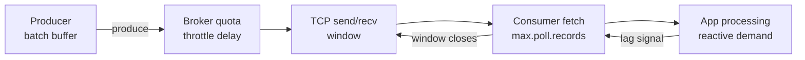

# Backpressure and Flow Control in Messaging Systems

## Overview

Backpressure is the mechanism by which a slow consumer makes its slowness felt upstream instead of accumulating unbounded work in the middle. In messaging systems it is not one knob but a chain: producer batching and quotas, broker throttling, TCP flow control, fetch/poll windows, and finally the application's own reactive demand signals. This page assembles that chain end to end with Kafka's concrete mechanisms (quotas, `pause()/resume()`, lag) and the Reactive Streams/R2DBC model, then covers load-shedding hierarchies for when pressure exceeds what buffering can absorb. The system-design-level treatment of load management lives in [Backpressure](../../interview/system-design/backpressure.md) and [Backpressure Pattern](../../backend/patterns/backpressure-pattern.md); this page is the messaging-internals layer underneath them.

## A Queue Is Not Backpressure

The most common design error is calling an unbounded queue "backpressure." A queue only **moves** the overflow point downstream: memory fills at the broker (or in the client's accumulator) instead of at the slow service. Real backpressure means demand propagates *against* the data flow, so each stage only pulls what the next stage can process. The three honest options at any overloaded boundary are **buffer a bounded amount, shed, or slow down the producer** — and every mechanism below is one of these three wearing different clothes.



Kafka is naturally pull-shaped end to end: consumers fetch only what they ask for, so backpressure exists by default up to the fetch boundary — the engineering question is what happens above and below it. Push-based systems (RabbitMQ, JetStream push consumers) must *build* the same effect with credit windows (`prefetch`, `max_ack_pending`).

## Producer-Side: Batching, Buffer Limits, Quotas

The producer is the first buffer and the first place pressure becomes policy:

| Knob | Default | Behavior under pressure |
|---|---|---|
| `buffer.memory` | 32 MiB | Total unsent bytes; full buffer **blocks** `send()` up to `max.block.ms` (60 s), then throws — the producer's own backpressure valve |
| `linger.ms` / `batch.size` | 0 / 16 KiB | Batches coalesce; higher values trade latency for throughput but enlarge the buffering window |
| `compression.type` | none | Compresses per batch — CPU for bandwidth, useful when the bottleneck is network |
| `max.in.flight` | 5 | Unacked request window; with idempotence, ordering survives retries (see [exactly-once](exactly-once-semantics.md)) |

**Broker-side producer quotas** make the broker the arbiter instead of the producer: `quota.producer.byte-rate` (bytes/s per client, default 10 MB/s) and `request.percentage` limits. Enforcement is *throttling by delay*: the broker computes a client's over-quora rate, returns responses immediately but attaches a **throttle-time**, and then delays *future* responses until the client's window average decays below quota — the queue of delayed operations lives broker-side, so an abusive producer cannot consume broker threads, only its own. Quotas are set per client-id or user principal (ZK/KRaft stored), which is the per-tenant fairness story in multi-tenant clusters. The replication paths have their own quotas (`leader.replication.throttled.rate`, `follower.replication.throttled.rate`) so partition reassignment and recovery cannot starve client traffic — the operational guardrail for the data-movement scenarios described in [log internals](kafka-log-internals.md).

## Consumer-Side: Lag, Fetch Windows, Pause/Resume

A consumer's health metric is **lag** — `log-end-offset − committed offset` per partition. Lag is simultaneously the backpressure signal, the autoscaling input, and the incident dashboard; treating it as a first-class SLO (e.g., "p99 lag < 30 s") is what makes a pull-based system manageable.

| Knob | Effect |
|---|---|
| `fetch.min.bytes` / `fetch.max.wait.ms` | Broker holds a fetch until data or timeout — long-poll that smooths request load |
| `max.partition.fetch.bytes` / `fetch.max.bytes` | Max bytes per fetch round; the consumer's receive window |
| `max.poll.records` | Records returned per `poll()` — bounds work per loop iteration and protects `max.poll.interval.ms` |
| `enable.auto.commit=false` + manual commit | Commit only after processing: the processing rate, not the network, paces the pipeline |

**Pause/resume** is the idiomatic in-process backpressure for Kafka: when a downstream dependency is slow or the local buffer is full, pause the topic-partition assignments and keep calling `poll()` (empty) so heartbeats continue and no rebalance is triggered; resume when capacity returns:

```java
if (sink.overloaded()) {
    consumer.pause(consumer.assignment());   // stop delivery, keep heartbeats alive
} else {
    consumer.resume(consumer.paused());
}
// poll() loop continues either way — never stop polling
```

The failure mode to avoid is stopping the poll loop itself: with `max.poll.interval.ms` exceeded, the consumer leaves the group and you get a rebalance storm (the failure analysis in [consumer rebalancing](kafka-consumer-rebalancing.md)). Push-based analogues: RabbitMQ `prefetch` counts, JetStream `max_ack_pending`, gRPC HTTP/2 flow windows — all the same credit-window shape.

## Reactive Backpressure: Reactive Streams and R2DBC

Below the messaging layer, the application needs its own demand signaling, standardized by **Reactive Streams** (java.util.concurrent.Flow, adopted by Reactor, RxJava, Akka Streams): a subscriber must request demand explicitly via `request(n)` on `Subscription`, and a publisher may not emit more `onNext` than requested. That makes "how many records can I accept right now" a value that flows *upstream* through the pipeline rather than being enforced by a thread-block.

```java
Flux.fromIterable(records)
    .flatMap(this::callDownstream, /*concurrency=*/ 8)   // demand = 8 in flight
    .onBackpressureBuffer(1000)                          // bounded buffer, else error/drop
    .subscribe(sink::write);
```

Operators give explicit over-pressure policies: `onBackpressureBuffer(n)` (bounded queue), `onBackpressureDrop()` (shed silently), `onBackpressureLatest()` (keep newest) — precisely the shed hierarchies below, formalized at the operator level. **R2DBC** applies the same model to databases: a non-blocking driver where the connection/transaction pool is a reactive demand source, instead of JDBC's blocking call that pins a thread per in-flight query. The messaging connection: a Kafka consumer loop calling JDBC synchronously inside `poll()` processing converts the reactive chain back to thread-blocking — the integration seam (consumer thread-pool feeding a bounded reactive pipeline, or R2DBC throughout) is where designs leak backpressure, and it is a favorite interview follow-up.

## TCP Flow Control: the Silent Partner

Beneath everything sits kernel flow control (RFC 9293): every TCP connection has a **receive window** advertised by the receiver; a consumer whose application stops reading fills its socket buffer, the window goes to zero, and the sender (the broker) must stop writing. This is backpressure you get for free — and its failure modes matter:

- **A stalled consumer throttles its broker's network thread**, which is correct backpressure but can extend to the broker's response queue if the broker ignores per-connection fairness — one reason brokers guard request handling with quotas and idle-connection timeouts.
- **Large buffers can hide the signal.** `socket.buffer.size` tuning (Kafka's `receive.buffer.bytes`/`send.buffer.bytes`, -1 = OS default with autotuning) trades buffering depth for visibility: fat buffers absorb bursts but delay the zero-window signal that would trigger pause/resume.
- **Congestion control is a second, slower loop** (see [congestion control](../../networks/tcp/congestion-control.md)) reacting to loss and ECN-marked delay — message-level systems should not fight it by hoarding retries; bounded retry with exponential backoff keeps the two loops stable (the fundamentals in [TCP flow control](../../networks/tcp/flow-control.md)).

The layered picture to give in interviews: application demand (Reactive Streams) → messaging windows (fetch/ack credits) → transport windows (TCP rwnd/cwnd) → device queues. Each layer's buffer must be *bounded and measured*, or the slow-consumer problem resurfaces at the deepest unbounded buffer.

## Load-Shedding Hierarchies

When demand exceeds capacity despite buffering, shedding must be deliberate and ordered. Design the hierarchy before the incident:

| Level | Action | Where | Example |
|---|---|---|---|
| 0. Absorb | Bounded buffers (batch, prefetch, rwnd) | All layers | `buffer.memory`, `max_ack_pending` |
| 1. Defer | Queue with TTL; dead-letter on expiry | Broker | Kafka retention + DLQ topic |
| 2. Degrade | Reduce fidelity: sample, coalesce, batch harder | Producer/app | 1-in-N metrics sampling, aggregate-before-publish |
| 3. Shed | Drop with a signal (counter, header) | Producer (early!) | `onBackpressureDrop`, reject at API gateway |
| 4. Reject | Fail fast, return overload error | Ingress | HTTP 503 + `Retry-After`, client backoff |

Rules that keep the hierarchy honest: **shed as early as possible** (rejecting at ingress is cheaper than processing then dropping), **make shedding observable** (drop counters, shed-rate metrics per tenant), and **prioritize work** (separate topics or quotas per criticality class instead of one FIFO buffer where a flood of debug telemetry starves payment events). The system-design consequences — overload vs deadlock, retry storms, circuit breakers — are the subject of the dedicated [backpressure pattern](../../backend/patterns/backpressure-pattern.md) page.

## Measuring Lag and Driving Autoscaling

Consumer lag is only useful if it is measured per partition and converted into action. The mechanisms:

| Signal | Source | Use |
|---|---|---|
| Per-partition `records-lag` | Consumer JMX / `kafka-consumer-groups.sh` | Incident detection; the number on the dashboard |
| Log-end-offset vs committed offset | Admin client (`ListOffsets` + `ListConsumerGroupOffsets`) | Lag without deploying consumer instrumentation |
| Seconds-behind estimate | Lag ÷ measured consumption rate | SLO framing ("30 min of backlog") |
| Delivery rate trend | Consumption rate over time | Distinguishes "growing lag" from "steady backlog" |

Lag-driven autoscaling needs two guardrails. **Scale by seconds-behind, not raw records** — a 1M-record backlog at 100k rec/s is 10 s of work, while 10k records at 10 rec/s is 16 minutes. **Cap scale-out at partition count** — the 20th consumer on a 16-partition topic idles, so before adding consumers beyond partitions, add partitions (a rebalance event, see [rebalancing](kafka-consumer-rebalancing.md)) or make processing faster. The mature pattern is a controller that watches *burn-down rate*: lag rising for N minutes → scale out; lag at zero for M minutes → scale in, hysteresis included so the group does not flap (every scale event is a rebalance).

## Credit Windows in Push-Based Systems

Push brokers need explicit credits because the network path alone does not reflect application readiness:

| System | Credit mechanism | Default behavior |
|---|---|---|
| RabbitMQ | `basic.qos` prefetch count | Unacked in-flight cap per consumer; 0 = unbounded (dangerous) |
| NATS JetStream push | `max_ack_pending` | Max unacked messages before delivery stalls |
| NATS JetStream pull | Explicit `fetch(batch)` | The application sizes its own windows |
| gRPC / HTTP/2 | Per-stream flow-control windows | Kernel-level credits between proxies and services |
| Redis Streams | `XREADGROUP COUNT` | Consumer asks for N per call — pull by construction |

The design lesson generalizing across all of them: **the window must be bounded in *work units the application understands*** (records, messages), not bytes alone, because the slow resource is usually per-item processing (a DB call per record), not bandwidth. Byte-based windows (TCP) and item-based windows (prefetch) must be tuned together — a 100-record prefetch of 1 MB images is a different problem from 100-record prefetch of 100-byte heartbeats.

## Sizing the Buffers: A Worked Example

A pipeline produces 50 MB/s and the downstream service tolerates 10 s of pause. How much buffer does each layer need?

- **Producer accumulator:** at 50 MB/s, `buffer.memory` = 32 MiB default covers only ~0.6 s of produce if the broker stalls; raising to 256 MiB gives ~5 s of absorbency without changing semantics.
- **Broker retention:** the real buffer — 1 hour of retention is 180 GB per partition-per-day-of-traffic; this is where "buffering" belongs, because it is durable and replayable.
- **Consumer window:** `max.poll.records` × record size × in-flight processing threads: 500 records × 1 KiB × 4 threads ≈ 2 MiB — trivial; the real constraint is `max.poll.interval.ms` = 5 min ÷ (500 records × 50 ms/record ÷ 4 threads) ≈ fine at 6.25 s per poll cycle.
- **TCP socket buffers:** at 50 MB/s over 50 ms RTT, bandwidth-delay product ≈ 2.5 MB per connection — the OS autotuned buffers need at least that, or throughput caps regardless of application tuning.

The interview takeaway: buffer *capacity* should live in the durable layer (retention), while the in-memory layers only need enough to absorb scheduling jitter. Teams that set huge client-side buffers get memory-pressure incidents instead of backpressure.

## Retries, Backoff, and Poison Messages

Retry logic is backpressure's evil twin: unbounded retries *amplify* load exactly when the system is overloaded, turning an outage into a retry storm.

- **Bound attempts** (`max_deliver` in JetStream, `max.poll`-level retries in app code) and use **exponential backoff with jitter** so retries spread out instead of synchronizing (thundering herd).
- **Retry topics with delay** (Kafka pattern: `orders-retry-5m`, `orders-retry-30m` topics) keep failing work out of the hot loop while preserving at-least-once; DLQ is the terminal state after the retry ladder.
- **Poison messages** (records that always throw) must be identified *before* they block a partition: catch-deserialize-fail-forward, move to DLQ with the failure reason in headers, and alert — never let one record stall the partition's committed progress indefinitely.
- **Distinguish failure classes:** retryable (network, timeout), non-retryable (schema mismatch, poison), and capacity (queue full). Only the first belongs in automatic retry; the other two need routing and alerting.

The end-to-end rule: every retry budget must be paired with a shedding budget — when the retry ladder exhausts, something concrete happens (DLQ + alert + continue), not silent accumulation.

## Interview Questions

1. **Where does backpressure exist in a Kafka pipeline, and where can it break?**
   It exists naturally from the fetch boundary down: consumers pull bounded bytes (`fetch.max.bytes`, `max.poll.records`), and a stalled consumer's TCP window closes, stalling the broker's socket writes. It breaks above the fetch boundary whenever processing is not actually gated — auto-committing offsets ahead of work, `max.poll.records` larger than real capacity, or synchronous JDBC inside the poll loop converting a reactive design back to thread-blocking. Producer-side it only exists if `buffer.memory` + `max.block.ms` are allowed to block rather than the app spawning more producers.

2. **How do Kafka quotas throttle without queueing requests on the broker?**
   The broker tracks each client's byte-rate (or request-time fraction) over a window and, when over quota, responds immediately but with a throttle-time, then parks that client's *subsequent* responses in a delayed-operation queue until the average decays below the quota. The abusive client waits, not the broker's network threads, so fairness is enforced without head-of-line blocking of other tenants. Quotas attach to user principals and client-ids, giving multi-tenant clusters per-producer/consumer byte-rate caps plus separate replication quotas for reassignment traffic.

3. **Why is pause/resume better than stopping the poll loop when a downstream is slow?**
   Paused partitions stop delivering records while continued (empty) `poll()` calls keep the consumer's heartbeats and `max.poll.interval.ms` clock alive, so the group state is untouched and processing resumes instantly when capacity returns. Stopping the poll loop instead means the coordinator eventually evicts the consumer, triggering a stop-the-world rebalance and — with eager assignment — freezing every member, which is exactly the rebalance-storm failure mode. Pause/resume expresses "I want less input" without threatening group membership.

4. **Explain how Reactive Streams' request(n) models backpressure.**
   Every subscriber owns a subscription and signals demand with `request(n)`; the publisher is contractually forbidden from delivering more `onNext` signals than the sum of outstanding requests. Demand composes: an operator's request to upstream equals its capacity to process downstream, so a slow database call propagates as reduced demand all the way to the source. Over-pressure policies (`onBackpressureBuffer/Drop/Latest`) define what happens when a source cannot honor demand, mapping directly onto the shed-or-buffer decision.

5. **How does TCP flow control interact with a messaging consumer?**
   Each connection's receive window advertises free socket-buffer space; a consumer that stops reading fills it, the window hits zero, and the broker's OS blocks further sends on that connection — automatic, correct backpressure with no application code. The traps are buffering depth and fairness: fat socket buffers delay the zero-window signal (hiding the problem until memory pressure), and a broker must still bound per-connection work so one stalled consumer cannot monopolize its request threads. Congestion control then reacts on slower timescales, so application retries need backoff to avoid fighting it.

6. **Design the shedding strategy for a telemetry pipeline whose consumers occasionally fall behind.**
   Order the levers: bounded producer batching first, then degrade (coalesce metrics per host, sample low-value series), then shed at the producer with a drop counter — never at the consumer after paying processing cost. Broker-side, give telemetry its own topic with short retention and a producer quota so it cannot starve transactional topics, and dead-letter expired messages so deferral is bounded. The key principle is priority separation: critical events live on a different path with different quotas, so overload of one class degrades only that class.

## Key Takeaways

- Backpressure is demand flowing upstream; an unbounded queue just relocates the overflow point and hides the signal.
- Kafka is pull-shaped by default: fetch/poll windows plus TCP's receive window give free backpressure up to the consumer boundary; producer `buffer.memory` + `max.block.ms` closes the loop on the produce side.
- Broker quotas throttle by delaying responses to over-quota clients, not by queueing — per-tenant fairness without head-of-line blocking.
- Pause/resume on the consumer expresses reduced demand without triggering rebalances; never stop polling to slow down.
- Reactive Streams formalizes demand with `request(n)`; R2DBC extends it to databases — the integration seam with blocking JDBC is where designs leak pressure.
- Shed hierarchies (absorb → defer → degrade → shed → reject) must be designed, measured, and applied as early as possible, with priority lanes per workload class.

## References

- Apache Kafka documentation — producer/consumer configs and quotas: [kafka.apache.org/documentation](https://kafka.apache.org/documentation/)
- Reactive Streams specification: [reactive-streams.org](https://www.reactive-streams.org/)
- R2DBC — Reactive Relational Database Connectivity: [r2dbc.io](https://r2dbc.io/)
- Project Reactor (Flux/Mono, backpressure operators): [projectreactor.io](https://projectreactor.io/)
- RFC 9293, "Transmission Control Protocol (TCP)" — [datatracker.ietf.org/doc/rfc9293](https://datatracker.ietf.org/doc/rfc9293/)
- NATS JetStream `max_ack_pending` / pull consumer docs: [docs.nats.io](https://docs.nats.io/)

## Cross-References

- [Backpressure (System Design)](../../interview/system-design/backpressure.md) — overload management at the architecture level
- [Backpressure Pattern](../../backend/patterns/backpressure-pattern.md) — the application-pattern view
- [TCP Flow Control](../../networks/tcp/flow-control.md) — receive-window mechanics underneath
- [TCP Congestion Control](../../networks/tcp/congestion-control.md) — the slower loss/delay-driven loop
- [HTTP/2](../../networks/http/http2.md) — per-stream flow-control windows behind gRPC
- [gRPC](../../networks/http/grpc.md) — where HTTP/2 flow control meets service-level backpressure
- [Kafka Overview](../messaging/kafka.md) — producer/consumer configuration baseline
- [Kafka Consumer Rebalancing](kafka-consumer-rebalancing.md) — what happens when consumers stall too long
