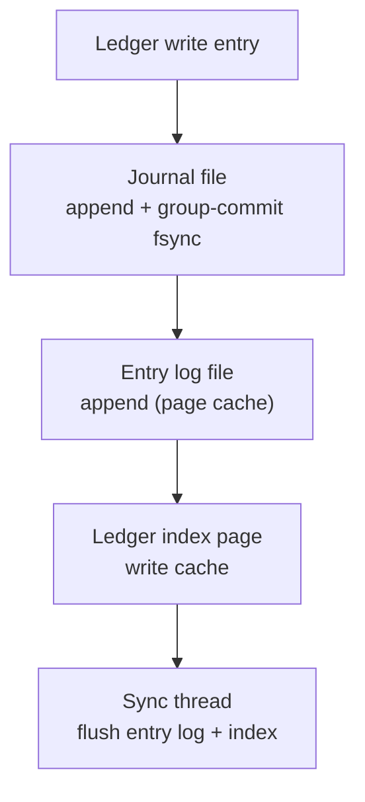
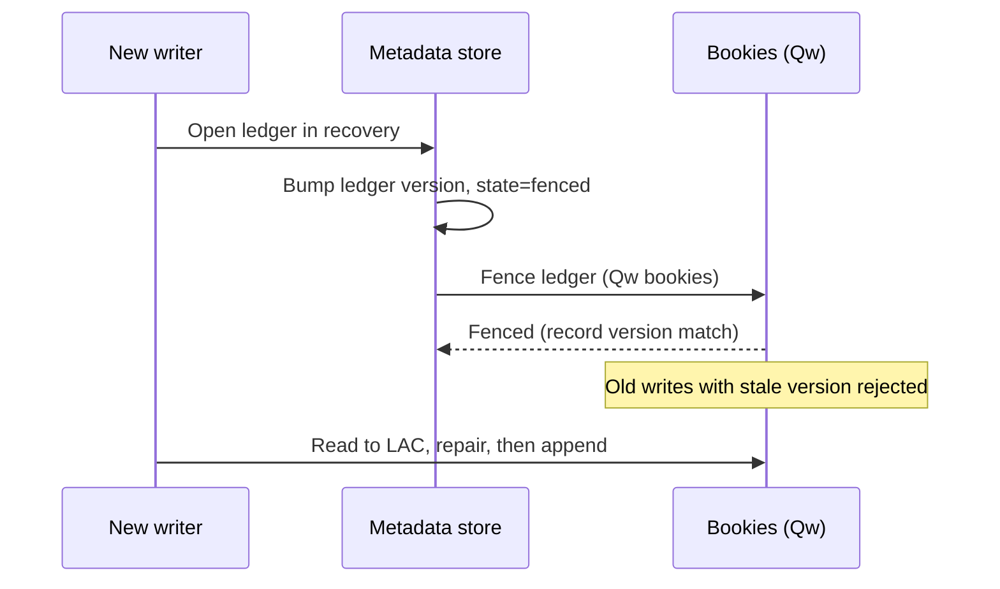

# BookKeeper Internals: Journals, Entry Logs, and Fenced Recovery

## Overview

Apache BookKeeper is a replicated append-only log storage service — not a message system — that Pulsar uses as its storage tier and that stands behind several other systems (e.g., Apache Pulsar Functions state, older DistributedLog deployments). Understanding it explains Pulsar's latency behavior and, just as usefully, clarifies why Kafka's tiered storage (KIP-405) chose object storage instead of "BookKeeper for Kafka." This page covers the bookie's three on-disk structures and the write path, the LastAddConfirmed (LAC) protocol that lets readers skip the writer's frontier, ledger fencing during recovery, ensemble reconfiguration on bookie failure, and the autorecovery daemons. The Pulsar-side quorum model (E/Qw/Qa) is in [Pulsar internals](pulsar-internals.md); quorum theory is in [quorum replication](../replication/quorum.md).

## The Data Model: Ledgers, Entries, and Metadata

A **ledger** is an immutable-on-close, append-only sequence of **entries**, identified globally by `(ledgerId, entryId)`. A ledger has a single writer at a time and a fixed replication configuration (ensemble E, write quorum Qw, ack quorum Qa). Ledger **metadata** — list of bookies in the ensemble, quorum sizes, state (open/closed), and the final entry count — lives in the metadata store (ZooKeeper in classic deployments), not on the bookies; bookies are deliberately metadata-blind and stateless between entries, which is what allows ensemble changes without global coordination.

| Object | Analogy in a WAL | Key property |
|---|---|---|
| Ledger | One write-ahead log segment | Single writer; fixed quorum config; sealed on close |
| Entry | One WAL record | Addressable as `(ledgerId, entryId)`; self-describing with length + LAC |
| LAC | Committed prefix watermark | Readers may read only entries ≤ LAC — the writer's frontier, not the storage's |
| Bookie | A log-storage node | Stores journal + entry log + index for many ledgers |

The LAC is BookKeeper's most distinctive idea. Each entry a writer sends carries the entry ID of the **last entry acknowledged before it**, so any bookie holding entry `n` also knows entry `LAC(n)` was acked. A reader opening a ledger sees the metadata's LAC (for closed ledgers) or the highest LAC stamped on read entries (for open ones) and never serves data beyond it — partially-written entries from a dying writer are invisible by construction, without any reader-side coordination.

## The Bookie Write Path: Journal + Entry Log + Index

A bookie splits each write across three structures with deliberately different fsync disciplines:

| Structure | Layout | Sync discipline | Serves |
|---|---|---|---|
| **Journal** | Per-bookie WAL of entries in arrival order | `fsync` on the write path, **group commit** batching many entries per sync | Durability; replay on crash |
| **Entry log** | One large shared append-only file for **all** ledgers | Buffered in page cache, flushed by the background sync thread | Sequential bulk storage of entry payloads |
| **Ledger index** | Per-ledger offset index (page cache + flush to disk file) | Flushed with the sync thread | `(entryId → position in entry log)` reads |

The design rationale is disk-parallelism. Durability requires exactly one synchronous write — the journal fsync, amortized by group commit — while the entry log and index absorb the bulk data asynchronously on separate disks. This is why Pulsar deployments pin journals to their own NVMe devices: the produce tail latency is the journal fsync tail (as modeled in [Pulsar internals](pulsar-internals.md)), and everything else is cache-friendly sequential work. Compare this to Kafka, where the single append-into-page-cache is the whole write path and replication substitutes for fsync — BookKeeper instead prices durability *per bookie* and lets the Qa quorum decide how many fsync waits an ack must survive.

## Ledger Fencing and Recovery

The dangerous moment for any single-writer log is writer failure with a survivor claiming the writer role: the old writer might still be alive (GC pause, partitioned) and appending a "zombie" tail. BookKeeper's answer is **ledger fencing**, which upgrades the metadata store record to fencing state before recovery proceeds:

Fencing is enforced via **metadata version checks**: the fence operation bumps the ledger's metadata version, and bookies reject subsequent write requests whose request version does not match — a zombie writer using a stale view fails on every bookie. The surviving writer then runs **recovery**:

1. **Discover the frontier:** read entries across the ensemble to find the highest LAC.
2. **Repair the gap:** entries between LAC and the highest locally-written entry may exist on only some bookies; the recovery writer re-issues them through the normal Qw/Qa quorum write so the prefix becomes uniformly replicated.
3. **Resume or close:** recovery can continue the ledger (new ensemble if needed) or seal it.

This is the same conceptual machinery as Kafka's leader epochs truncating zombie tails ([log internals](kafka-log-internals.md)) and the epoch/fencing-token family in [fencing tokens](../fundamentals/fencing-tokens.md) — but enforced at the storage layer with bookie-side version checks rather than by replicas comparing leader terms.

## Ensemble Reconfiguration

When a bookie fails or is decommissioned, the ledgers striped onto it must restore their ensemble integrity. BookKeeper handles this at two granularities:

- **In-flight (ensemble change):** on a write failure, the writer asks the metadata store for a replacement bookie and reconfigures the ensemble *for subsequent entries only*; the ledger metadata records the ensemble switch point. No existing entry is moved — the stripe just rotates its tail onto the new bookie. Because entries are individually replicated to Qw bookies, durability never drops below Qa during the change.
- **Post-failure (rereplication):** a background system restores Qw copies for entries that lost a bookie, by reading from a surviving copy and writing to a new bookie. Recovery reads fan out over the ensemble, since any single intact copy suffices as a source.

The economics differ from Kafka's replication: Kafka re-replicates **whole partition logs** (segments stream in order), while BookKeeper rereplicates **individual entries** spread across the whole fleet, so recovery IO is distributed across every bookie rather than concentrated on the partitions that happened to live on the dead node. The trade is that BookKeeper's per-entry indirection (index lookups, many small files' worth of ledger fragments) makes sequential-scan workloads — replaying a whole topic from the start — less cache-friendly than Kafka's contiguous segment files.

## Autorecovery: Auditor and ReplicationWorker

Autorecovery is BookKeeper's built-in self-healing subsystem, two daemons that can run on bookies or a dedicated box:

| Component | Job | Trigger |
|---|---|---|
| **Auditor** | Periodically scans ledger metadata, elects itself via ZK, detects underreplicated/lost ledgers, publishes audit reports | Bookie death, ledger below Qw copies |
| **ReplicationWorker** | Reads audited ledgers, rereplicates entries to new bookies until Qw copies exist again | Auditor's underreplicated list |
| **Placement policy** (Rackaware/Regionaware) | Chooses ensembles spread across racks/regions so one rack failure cannot kill a ledger's quorum | Ledger creation + re-replication |

Operators rely on this for decommissioning (`autorecovery` drains a bookie before removal) and for silent corruption handling — bookies verify per-entry checksums (CRC32C) on read, and corrupted entries are treated as missing and rereplicated from a good copy. The operational caveat: autorecovery is itself a distributed workflow over ZooKeeper, and a thundering bookie loss can overwhelm the replication workers' bandwidth budget, which is why production configs throttle rereplication rates just as Kafka admins throttle partition reassignment.

## Why Not BookKeeper for Kafka? (KIP-405 Context)

Kafka's tiered storage proposal (KIP-405, shipping gradually from Kafka 3.6) faced exactly the problem Pulsar solved with BookKeeper: unbounded retention making broker disks the constraint. Kafka chose **read-only remote segments in object storage** rather than a live quorum storage layer:

| Dimension | Kafka + KIP-405 | Kafka on BookKeeper-style tier (rejected design) | Pulsar + BookKeeper |
|---|---|---|---|
| Hot path unchanged | Yes — local append + ISR replication | Would insert quorum writes on every produce | Yes — quorum writes are the hot path |
| Cold tier | Read-only, immutable segments in S3 | Would remain writable/recoverable | Bookies always writable; object storage is the cold tier instead |
| Failure model | Leader election still needed for hot data | Storage quorum survives broker loss | **No** leader election for data — pointer re-ownership only |
| Complexity | Object storage only at the boundary | A second always-on distributed system | Same second system, from day one |

The Kafka team's reasoning: adopting a quorum storage layer would have converted Kafka's simplest strength (one system, local disks, ISR durability) into the Pulsar topology — brokers + bookies + metadata — while the dominant need (cheap long retention) is satisfied by immutable-segment offload. This is a useful interview contrast: **BookKeeper is the answer when storage must stay writable while compute is stateless; object storage is the answer when the cold tier is read-only by definition.**

## Entry Format and the Read Path

Entries are self-describing on the wire and on disk. A written entry carries, in order: its **ledger ID and entry ID**, the **length**, the **LAC at the time of writing**, the entry payload, and a **checksum** (CRC32C) the bookie verifies on both write and read. Because every bookie receives the full entry (BookKeeper replicates entries whole — no erasure coding in the classic path), any single bookie can serve any read independently.

The read path then splits by use case:

| Read type | Path | Mechanism |
|---|---|---|
| Tail reads (live consumers) | Broker memory → bookie journal cache / entry log | Bookies serve recent entries from write cache; often no disk touch |
| Random/seek reads (replay, recovery) | Index lookup → entry log position | Page-cache miss hits the shared entry log file |
| Long-poll waits | Bookie holds request until entry arrives | `WaitForLAC` semantics: read at LAC+1 blocks until the writer advances |
| Recovery reads | Fan out across ensemble | Any one intact copy per entry suffices as source |

The **long-poll** primitive is what lets Pulsar implement efficient push-style consumers without busy polling: a cursor read past the ledger's LAC parks on the bookie and completes the moment the writer's next entry raises the LAC. It is the BookKeeper-level analog of Kafka's `fetch.min.bytes` long-poll from [log internals](kafka-log-internals.md).

## Ledger Metadata States

A ledger's metadata record cycles through states that fence and recovery depend on:

| State | Set by | Writers allowed | Readers see |
|---|---|---|---|
| `Open` | Creator / recovery writer | The single current writer | Data up to LAC |
| `InRecovery` | Recovery tooling after writer loss | None (fenced) | Data up to LAC |
| `Fenced` (version bump) | Fence operation | None — old writes rejected | Data up to final LAC |
| `Closed` | Successful close or recovery completion | None (sealed) | All entries, final count in metadata |

The version check underlying `Fenced` is the load-bearing trick: bookies compare the metadata version attached to each write request against the store's current version, so a stale writer fails on every attempt without needing to be told why. Applications surface this as `LedgerFencedException` — the signal to abandon the incarnation, exactly the `ProducerFencedException` pattern in Kafka's transactional API.

## Worked fsync Accounting

Why the journal/entry-log split matters is clearest in numbers. Take a produce stream of 10,000 entries/s, each 1 KiB, Qw=3, Qa=2:

| Cost | Without split (fsync payload everywhere) | With journal + entry log |
|---|---|---|
| Synchronous writes per entry | 3 payload fsyncs | 1 journal fsync per bookie, **group commit** across entries |
| Effective fsyncs/s per bookie | 30,000 | ≈100–1,000 (batch window dependent) |
| Payload placement | Written once, synchronous | Written async to entry log; index flushed lazily |
| Tail latency driver | Slowest of 3 fsyncs, per entry | Qa-th fastest journal fsync, amortized |

Group commit is the multiplier: the journal batches whatever entries arrive during one fsync's duration, so throughput scales with batch depth while latency stays near one fsync time. This is the same amortization trick databases use for WAL group commit — and the same reason journal-device latency (not bandwidth) dominates produce tail latency in Pulsar clusters.

## Entry Log Compaction (Garbage Collection)

The shared entry log would grow forever if ledgers could not be removed from it. When a ledger is **deleted** (all its data expired or the topic dropped), its entries remain as holes inside entry log files. BookKeeper's **entry log compaction** rewrites live entries from fragmented files into fresh ones and deletes the old files:

1. The garbage collector identifies entry log files whose live-byte ratio falls below a threshold (`compactionRate`/`gcWaitTime` govern it).
2. Live entries are read and re-written through a *new* write path — including journal appends and index updates — so compaction consumes real write bandwidth.
3. Metadata (`entry log metadata`) tracks per-file live-byte counts; after rewrite the old file is unlinked and the index points at new locations.

Throttling is mandatory in production: unthrottled compaction competes with the journal for disk IO and shows up as produce-latency spikes — the same class of problem as Kafka's unthrottled log cleaning or unthrottled partition reassignment.

## Operational Runbook

| Task | Steps | Watch for |
|---|---|---|
| Decommission a bookie | Enable autorecovery → let ReplicationWorker drain ledgers → remove from ensemble policy → stop | Rereplication bandwidth throttling; listener vs advertised address mismatches |
| Add a bookie | Start with ensemble policy updated | Old ledgers keep old ensembles — new writes rotate onto the new bookie only |
| Journal disk degradation | Monitor `JOURNAL_QUEUED_WRITES`, fsync latency percentiles | Move journals to dedicated NVMe before raising Qa |
| Ledger loss alarm | Auditor report of ledgers below Qa | If copies < 2, stop and investigate before any bookie churn |
| Metadata store outage | Bookies and writers stall on new ledger ops | Running ledgers continue; new ledger creation is the cliff |

## Interview Questions

1. **What are the three structures on a bookie, and why three?**
   The journal (per-bookie WAL, fsynced with group commit on the write path), the entry log (one shared append-only file holding all ledgers' payloads, flushed asynchronously), and the per-ledger index (entry ID → position in the entry log). The split lets durability cost exactly one synchronous write while bulk data lands on different disks asynchronously, so journal devices can be tuned independently from storage capacity. Reads touch only the entry log and index, never the journal.

2. **Explain LAC and why readers can trust it.**
   LastAddConfirmed is the entry ID of the last acked write, stamped by the writer into every subsequent entry and into ledger metadata. A reader may serve only entries up to LAC, so entries partially written by a crashed writer — present on one bookie but never acked — are invisible without coordination. The frontier travels with the data, which is what lets any bookie serve reads for any Qw subset without knowing the writer's state.

3. **How does fencing prevent a zombie writer from corrupting a recovering ledger?**
   Before recovery writes anything, the recovery process fences the ledger: the metadata version is bumped and Qw bookies record the new version. Any write from the old writer carries its stale version and is rejected by every bookie it tries — the storage layer enforces single-writer-ness instead of trusting the writer to self-terminate. Kafka solves the same problem with leader epochs and follower truncation; BookKeeper pushes enforcement down into the bookies themselves.

4. **What happens to in-flight writes when a bookie dies mid-ledger?**
   The writer gets a write error, obtains a replacement bookie from the metadata store, and reconfigures the ensemble for subsequent entries only — existing entries stay where they are, and the metadata records the switch point. Durability is unaffected because each entry already sits on Qw bookies; only the stripe rotation changes. Separately, autorecovery's Auditor detects ledgers below Qw copies and the ReplicationWorker rereplicates the affected entries from surviving copies.

5. **Why did Kafka's tiered storage (KIP-405) choose object storage instead of a BookKeeper-like layer?**
   The dominant requirement was cheap unbounded retention, which is read-mostly by definition — immutable segments in object storage satisfy it without touching the hot path of local appends and ISR replication. A live quorum storage layer would have added a second always-on distributed system and changed Kafka's failure model (data no longer tied to broker disks) to solve a cold-tier cost problem. Pulsar needs the writable decoupled tier because its brokers are stateless by design; Kafka's brokers are stateful by design, so its tiered storage only offloads the read-only tail.

6. **How does BookKeeper's recovery IO pattern differ from Kafka's replication?**
   BookKeeper rereplicates individual entries spread across the entire fleet, so recovering a dead bookie distributes read and write IO over every other bookie rather than streaming a few whole partition logs. Kafka re-replicates entire partition replicas sequentially, which is more disk- and network-efficient per byte but concentrates load on the partitions that lived on the failed broker. BookKeeper's fragmentation also makes whole-log replay less cache-friendly, which is one reason Kafka keeps its contiguous segment layout.

## Key Takeaways

- A bookie writes every entry twice-ish: one journal fsync (group-committed, on the latency path) plus async entry log + index flushes — disk isolation is the main tuning lever.
- LAC is a data-carried watermark: readers see only the acked prefix, so partial writes are invisible without coordination.
- Fencing bumps metadata version and bookies enforce it — zombie writers fail at the storage layer, not by protocol politeness.
- Ensemble changes rotate the stripe for future entries; rereplication restores quorums entry-by-entry across the fleet.
- Autorecovery = Auditor (detect) + ReplicationWorker (repair) + placement policies (rack/region awareness).
- KIP-405's object-storage tier vs BookKeeper's live quorum tier is the cleanest illustration of "read-only cold storage" vs "stateless compute" as different requirements.

## References

- Apache BookKeeper documentation and overview: [bookkeeper.apache.org/docs/overview](https://bookkeeper.apache.org/docs/overview/)
- BookKeeper API-level overview: [bookkeeper.apache.org/docs/api/overview](https://bookkeeper.apache.org/docs/api/overview)
- BookKeeper source (journal, entry log, autorecovery): [github.com/apache/bookkeeper](https://github.com/apache/bookkeeper)
- Apache Pulsar documentation (managed ledger layer): [pulsar.apache.org/docs](https://pulsar.apache.org/docs/)
- Jepsen analysis of Apache BookKeeper (2018) — [jepsen.io/analyses/bookkeeper](https://jepsen.io/analyses/bookkeeper)
- KIP-405: Kafka Tiered Storage — cite by number, Apache Kafka KIP archive

## Cross-References

- [Pulsar Internals](pulsar-internals.md) — the broker-side quorum model and latency model
- [Pulsar Overview](../messaging/pulsar.md) — where BookKeeper sits in Pulsar's feature set
- [Kafka Log Internals](kafka-log-internals.md) — the single-writer log machinery this contrasts with
- [Quorum Replication](../replication/quorum.md) — read/write quorum theory behind E/Qw/Qa
- [Fencing Tokens](../fundamentals/fencing-tokens.md) — the fencing family this implements
- [Jepsen](../testing/jepsen.md) — how BookKeeper's guarantees were empirically probed
