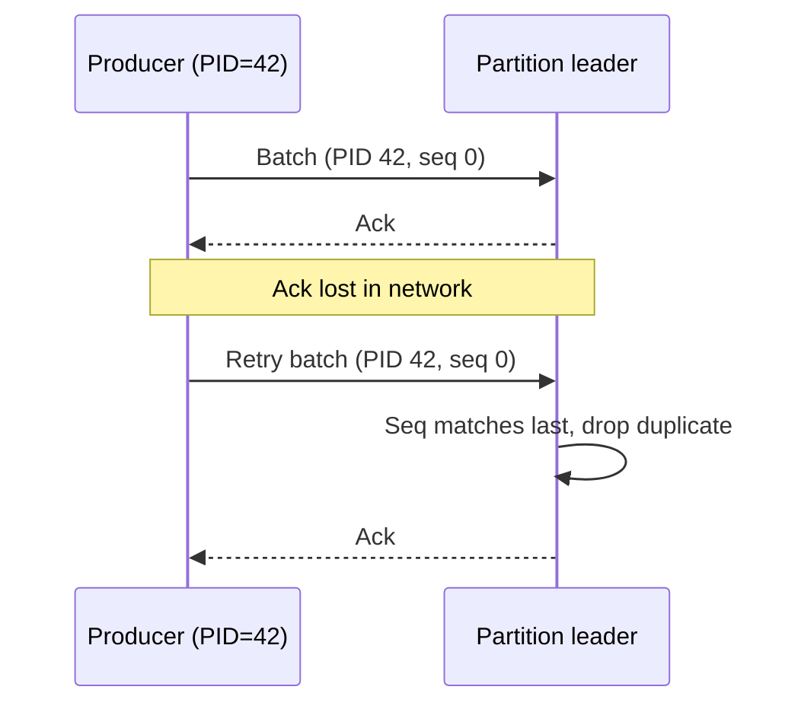
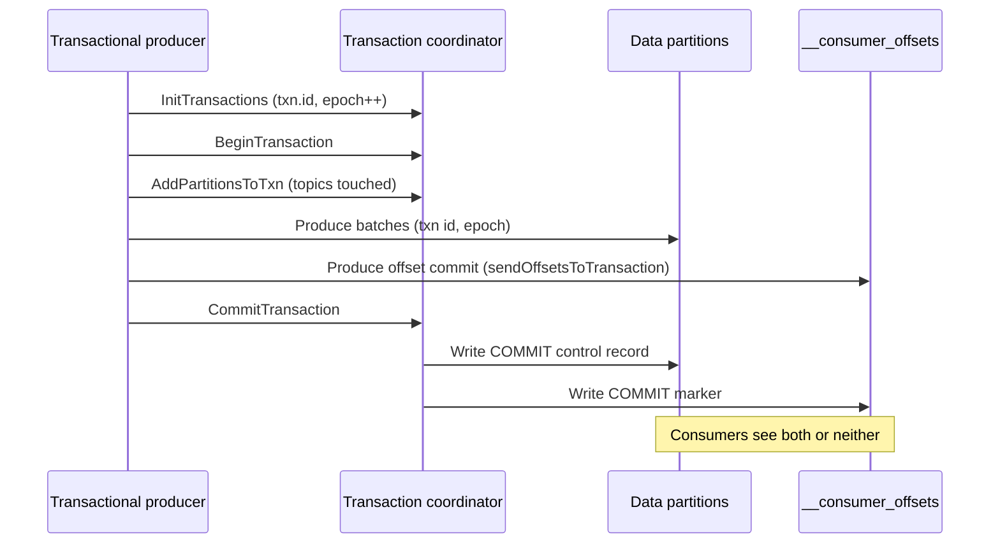

# Exactly-Once Semantics: Idempotent Producers, Transactions, and Their Boundaries

## Overview

"Exactly-once" in Kafka is not a delivery guarantee — it is a small set of mechanisms that remove *specific* duplicate-loss windows: the idempotent producer kills broker-side duplicates from retries, and transactions make a batch of writes plus consumer offsets commit or fail atomically. This page covers both mechanisms at protocol level (PID + sequence numbers, `transactional.id` fencing, two-phase commit into `__transaction_state`), the consume-transform-produce loop that ties them together, `read_committed` isolation and the Last Stable Offset, and — the part senior interviewers actually probe — what exactly-once does **not** cover. The overview-level treatment and code snippets live in [Kafka overview](../messaging/kafka.md) and [Kafka (backend)](../../backend/messaging/kafka.md).

## Why Retries Break "Once"

A producer that sends a batch, times out, and retries cannot know whether the first attempt was lost or merely unacknowledged — the classic two-generals situation. Naive retry therefore produces **duplicates**, and every at-least-once system inherits them:

| Failure moment | Naive result |
|---|---|
| Broker persisted, ack lost in network | Retry → duplicate in the log |
| Broker persisted, then crashed before ack | Retry to new leader → duplicate |
| Client committed offsets, then re-consumed after crash | Duplicate *processing* |

Kafka attacks the first two cases with the idempotent producer and the third with transactions that bind processing position to output. Nothing here touches the fourth category — side effects outside the broker — which is where most real-world duplicate bugs live.

## The Idempotent Producer: PID + Sequence Numbers

With `enable.idempotence=true` (the default since Kafka 3.0, forcing `acks=all`, `retries` > 0, and `max.in.flight ≤ 5`), the broker assigns each producer session a **producer ID (PID)** and the producer stamps each batch with a per-partition **sequence number** starting at 0:



The broker keeps the **last 5 sequence numbers per (PID, partition)** — batches matching an already-stored sequence are silently discarded, so retries are safe and ordering is preserved even with up to 5 in-flight batches. Two boundaries define the mechanism's scope:

1. **Session scope:** the PID is ephemeral. A producer restart gets a new PID, and its first batches have fresh sequences — so idempotence does not deduplicate *across* application restarts. Only `transactional.id` (below) provides a stable identity.
2. **Partition scope:** sequences are per partition, so idempotence gives exactly-once *into one partition*, never across a multi-partition write set. That composition is the transaction layer's job.

## Transactions: transactional.id and Two-Phase Commit

A transactional producer declares a stable `transactional.id` (one per logical producer instance — per Kafka Streams task, per connector source task). `initTransactions()` registers the id with the **transaction coordinator** (a broker role), which bumps the **producer epoch**, fencing any zombie instance of the same id still writing from a previous incarnation — the epoch-fencing pattern from [fencing tokens](../fundamentals/fencing-tokens.md).



The coordinator persists transaction state in the **`__transaction_state`** internal topic (compacted, RF 3, 50 partitions by default) and drives the two-phase commit: prepare markers to every data partition the transaction touched, then commit. Data partitions store **control records** (commit/abort markers) inline in the log and maintain a **transaction index** per segment (`.txnindex`) listing aborted offsets, so consumers can filter aborted records without scanning. Transaction timeout (`transaction.timeout.ms`, default 60 s) bounds how long a hung producer can hold partitions hostage before the coordinator aborts on its behalf.

| Config | Default | Role |
|---|---|---|
| `transactional.id` | null | Stable identity; required for transactions |
| `transaction.timeout.ms` | 60000 | Max open-transaction age before coordinator abort |
| `transaction.state.log.replication.factor` | 3 | Durability of the txn state itself |
| `isolation.level` (consumer) | `read_uncommitted` | `read_committed` filters uncommitted + aborted |

## The Consume-Transform-Produce Loop

The canonical EOS application reads a record, transforms it, produces the output, and commits the input offset — and the only safe ordering is: produce outputs and offset commit **inside one transaction**, then commit:

```java
producer.initTransactions();
while (running) {
    ConsumerRecords<K, V> in = consumer.poll(Duration.ofSeconds(1));
    producer.beginTransaction();
    try {
        for (var r : in) producer.send(transform(r));
        producer.sendOffsetsToTransaction(consumer.groupMetadata().offsets(), consumer.groupMetadata());
        producer.commitTransaction();          // offsets + outputs atomically visible
    } catch (ProducerFencedException | OutOfOrderSequenceException e) {
        producer.close();                      // zombie: die, let a new instance take the id
    }
}
```

Consumers of the output must use `isolation.level=read_committed` to respect the boundary. [Kafka Streams](../messaging/kafka-streams.md) implements this loop internally (EOS v2, with KIP-447 making `transactional.id` per input-task for scalability), which is why "Streams with `processing.guarantee=exactly_once_v2`" is the correct production answer for stateful EOS processing — the state store's changelog topic participates in the same transaction, so state and output stay consistent.

## Read Committed and the Last Stable Offset

`read_committed` consumers may read only up to the **LSO (last stable offset)**: the offset of the first message of the earliest still-open transaction, or the high watermark if none is open. Everything above the LSO — including records from *unrelated* partitions' transactions interleaved on the same partition — is invisible until its transaction resolves. Consequences interviewers expect:

- **A long-running transaction freezes consumers.** A 10-minute open transaction on a busy topic parks the LSO, stalling `read_committed` consumers for the duration (then `transaction.timeout.ms` aborts it and the LSO jumps).
- **Aborted records are filtered, not invisible:** consumers receive commit/abort metadata and skip aborted ranges via the segment's transaction index; the bytes remain in the log and count toward retention.
- **LSO ≤ HW always,** and consumers see neither aborts nor uncommitted data, so a partition under continuous transactions settles slightly behind `read_uncommitted` peers.

## What Exactly-Once Does NOT Cover

This list is the interview separator — every item is a real duplicate/loss story that EOS semantics allow:

| Not covered | Why | Fix |
|---|---|---|
| **External side effects** (emails, API calls, charges) | Kafka cannot roll back another system | Idempotent sink APIs, dedup keys, or a transactional outbox |
| **Non-idempotent sinks** (plain INSERT, append-to-file) | Committed offsets say nothing about what the sink did | Upserts/`INSERT ... ON CONFLICT`, keyed writes, sink-side dedup |
| **Different producer instances writing the "same logical record"** | PID dedup is per session; two app instances are two PIDs | Application-level idempotency (keyed compaction, version fields) |
| **Consumer reads without transactions** | `read_committed` is opt-in; `read_uncommitted` sees aborted data | Set `isolation.level=read_committed` explicitly |
| **Cross-cluster / DR failover** | Transactions are cluster-local; MirrorMaker does not carry them | Design sinks to tolerate replay from the DR cluster |
| **State outside the transaction** (caches, external stores) | Only Kafka writes are atomic | Write-behind state through changelog topics |

The general principle: **exactly-once holds for the records inside Kafka and ends at the broker boundary.** Anything past it — the reason [Kafka Connect](../messaging/kafka-connect.md) sink connectors emphasize idempotent upserts and why exactly-once *source* support (KIP-618) required connector-side work — needs its own idempotency design.

## Myths vs Reality

| Myth | Reality |
|---|---|
| `enable.idempotence=true` gives exactly-once | It gives exactly-once **produce** per partition per session; ordering + dedup only |
| Transactions make processing exactly-once | They make output+offset commits atomic; processing side effects are still outside |
| EOS means no duplicates ever reach consumers | `read_committed` consumers skip aborted records, but uncommitted reads and non-transactional producers still duplicate |
| EOS is free | Transactions add latency (markers), LSO stalls under long transactions, and coordinator load |
| EOS covers the whole pipeline | It covers Kafka-to-Kafka; sinks, side effects, and DR replay need separate designs |

## Read Uncommitted vs Read Committed

| Behavior | `read_uncommitted` (default) | `read_committed` |
|---|---|---|
| Read bound | High watermark | Last Stable Offset |
| Aborted records | **Visible** (with markers) | Filtered via txn index + control records |
| Records of open transactions | Visible immediately | Invisible until resolve |
| Non-transactional producers | Visible | Visible (mixed-workload caveat: they bypass txn gating) |
| Latency cost | None | LSO lag under long transactions |

The mixed-workload caveat is worth stating: `read_committed` filters *transactional* aborted records, but a plain (non-transactional) producer's records on the same partition are always visible and never deduplicated — a partition with both producer types does not get a composed guarantee.

## Failure Matrix: Crash Points and Outcomes

| Crash at | Idempotent producer | Transactional loop |
|---|---|---|
| Before broker append | Retry with same sequence → no dup | Transaction open, later aborted → invisible |
| After broker append, before ack | Retry deduped by sequence → no dup | Batches written, markers pending → aborted or committed atomically |
| After commit markers | n/a | Offsets + outputs visible together; crash before offset commit means reprocessing *with* outputs still consistent (offsets were in the txn) |
| Consumer processed work, crash before txn commit | Duplicate processing on replay | On replay, offsets replayed; outputs from the aborted txn invisible — no partial state |
| Zombie producer still alive after crash | Old PID writes race new PID (both visible) | Old epoch fenced by `ProducerFencedException` → zombies cannot commit |

The transactional column is the entire value proposition: at every crash point, the visible outcome is either "all outputs + all offsets" or "none," which is precisely the failure atomicity the naive at-least-once loop lacks.

## Transaction Coordinator Lifecycle

The coordinator (a broker role elected per `transactional.id` hash onto `__transaction_state` partitions) advances transaction state through persisted epochs:

1. **Init:** the producer's `InitProducerId` request either creates a new epoch for an existing id or allocates a fresh PID; concurrent inits fence older epochs immediately.
2. **Ongoing:** `AddPartitionsToTxn` registers data partitions (so the coordinator knows where to send markers); produces flow directly to partition leaders carrying the txn id + epoch.
3. **Commit/Abort:** the coordinator writes the decision to `__transaction_state`, then fans markers out to all registered partitions (the slow phase — a 500-partition transaction costs 500 marker writes), completing asynchronously with retries.
4. **Timeout:** if the transaction exceeds `transaction.timeout.ms`, the coordinator aborts unilaterally; the next producer request discovers the abort and fails accordingly.

Because coordinator state is a compacted topic, coordinator failover is a replay, and in-flight transactions are recovered by scanning for unresolved `Ongoing` entries and aborting them — the same replay-not-reconstruct discipline as group coordination in [rebalancing](kafka-consumer-rebalancing.md).

## EOS in Kafka Connect

[Connect](../messaging/kafka-connect.md) implements EOS on both sides with different mechanisms:

- **Source connectors** (KIP-618, Kafka 3.3+): the worker's producer is transactional; source records plus their offsets land in source-offset storage atomically per connector task, so a crash cannot both re-emit records and skip offset updates. Connectors must be written to be re-emittable (deterministic from source state) for this to compose.
- **Sink connectors**: Kafka provides no magic — the sink's own idempotency is required. JDBC sinks use upserts by key, Elasticsearch sinks use document IDs, S3 sinks rely on deterministic object names. This is the clearest production example of "exactly-once ends at the broker boundary."

## Interview Questions

1. **How does the idempotent producer distinguish a retry from a new message?**
   Every producer session receives a broker-assigned PID, and each batch carries a monotonically increasing per-partition sequence number. The broker stores the last 5 sequences per (PID, partition); a retried batch whose sequence matches an already-stored one is discarded, while the next new batch advances the sequence. Because the PID dies with the producer session and sequences are per partition, idempotence covers neither application restarts nor multi-partition writes — hence transactions.

2. **Walk through what happens on commitTransaction.**
   The producer asks the transaction coordinator, which persists the decision in `__transaction_state` and then writes COMMIT control records to every data partition the transaction touched, plus the consumer-offset partitions if offsets were sent. Data partitions record the marker inline and index aborted offsets in `.txnindex`; only after markers land does the LSO advance and `read_committed` consumers observe the records. The two-phase structure guarantees the interleaved records from other transactions remain correctly gated.

3. **What is the LSO and why can it stall consumers?**
   The LSO is the first offset of the earliest open transaction, or the high watermark when none is open; `read_committed` consumers cannot read past it because doing so might expose soon-to-be-aborted records. A single long-running transaction on a busy partition therefore freezes consumer progress for its whole duration — which is why `transaction.timeout.ms` exists and why long batch jobs should chunk their transactions rather than holding one open for minutes.

4. **How does Kafka fence a zombie producer after a session crash?**
   The `transactional.id` is the stable identity: `initTransactions` bumps the producer epoch registered with the coordinator, and any request from an older epoch — say, a paused-but-alive old instance — is rejected with `ProducerFencedException`. The same epoch check protects offset commits made through `sendOffsetsToTransaction`. This is epoch fencing: monotonic tokens making stale writers fail at the coordinator rather than relying on them to notice their own death.

5. **Your service writes to Kafka and sends a confirmation email. Does EOS give you exactly-once email?**
   No. Kafka transactions are atomic over Kafka writes only; the email is an external side effect that cannot participate in the abort path, so a crash between email and commit (or after commit, before some other side effect) yields duplicates or orphans. The standard patterns are: make the downstream action idempotent (dedup on a business key), or use a transactional outbox — write the email request as a Kafka record in the transaction and have a separate worker send emails, deduplicating by record key.

6. **Why does Kafka Streams need KIP-447 for scalable EOS?**
   Originally `transactional.id` was the *instance's* id, so every task on one Streams instance shared a transaction — one big transaction across tasks serializes work and holds the LSO far back. KIP-447 ties `transactional.id` to each input task's partition set, so tasks commit independently, transactions shrink, and fencing stays correct when tasks move between instances during rebalances. It is a good example of EOS design constraints leaking into scheduling decisions.

## Key Takeaways

- Idempotent producer = PID + per-partition sequence + broker-side last-5 dedup: exactly-once *produce*, per partition, per session.
- Transactions add a stable `transactional.id`, epoch fencing of zombies, and two-phase commit over data partitions plus `__consumer_offsets`, state stored in `__transaction_state`.
- The consume-transform-produce loop must commit offsets inside the output transaction; Streams does this for you under `exactly_once_v2`.
- `read_committed` gates reads at the LSO — the first offset of the oldest open transaction — so long transactions stall consumers by design.
- EOS ends at the broker boundary: side effects, non-idempotent sinks, multi-instance logical duplicates, and DR replay all need their own idempotency.
- The costs are real: marker latency, coordinator load, LSO stalls, and per-transaction timeouts that bound open-transaction duration.

## References

- Apache Kafka documentation — producer/consumer/transaction semantics: [kafka.apache.org/documentation](https://kafka.apache.org/documentation/)
- Kafka source (transaction coordinator, idempotence): [github.com/apache/kafka](https://github.com/apache/kafka)
- KIP-98 (exactly-once delivery + transactional API), KIP-129 (streams EOS), KIP-447 (scalable EOS for Streams), KIP-618 (exactly-once source connectors) — cite by number, Apache Kafka KIP archive

## Cross-References

- [Kafka Overview](../messaging/kafka.md) — delivery-guarantee basics and producer configs
- [Kafka Log Internals](kafka-log-internals.md) — watermarks and epochs that the LSO sits on top of
- [Kafka Consumer Rebalancing](kafka-consumer-rebalancing.md) — generation fencing across rebalances
- [Kafka Streams](../messaging/kafka-streams.md) — the framework-level consume-transform-produce loop
- [Kafka Connect](../messaging/kafka-connect.md) — sink idempotency and exactly-once source connectors
- [Distributed Transactions](../advanced/distributed-transactions.md) — two-phase commit theory behind txn markers
