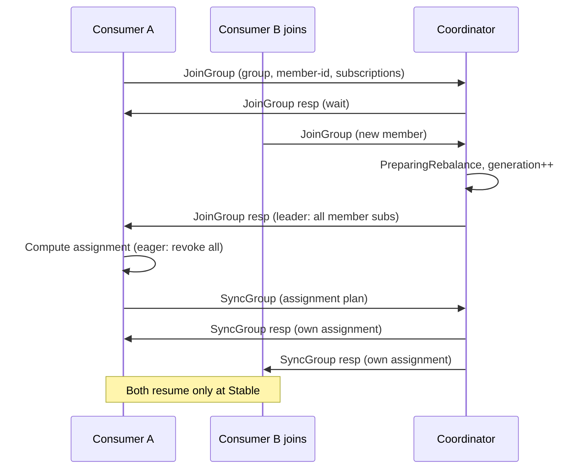
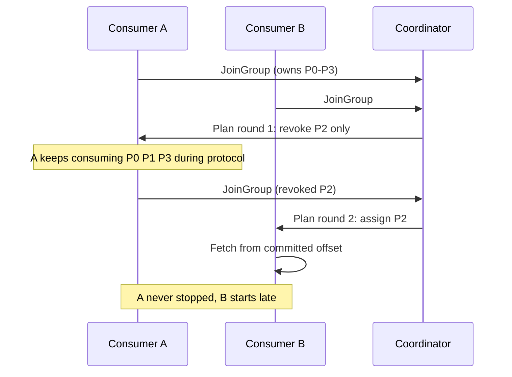

# Kafka Consumer Rebalancing: Group Protocol Internals

## Overview

Kafka's consumer group is a distributed membership protocol hiding inside a client library, and rebalancing is its consensus moment: the instant where partitions change hands and the system must decide who owns what. This page dissects the group coordinator protocol (JoinGroup/SyncGroup, generation IDs), why the classic eager rebalance stops the world, how incremental cooperative rebalancing and static membership attack that cost, what the next-generation protocol (KIP-848) moves into the broker, and how to diagnose rebalance storms. The consumer-facing basics live in [Kafka overview](../messaging/kafka.md) and the backend [Kafka page](../../backend/messaging/kafka.md); here we go to the wire protocol.

## The Group Coordination Actors

One broker per group — chosen by hashing `group.id` onto the `__consumer_offsets` partitions — is the **group coordinator**. It stores group membership as an append-only log in `__consumer_offsets` (compacted), so coordinator failover is a replay, not a reconstruction. Four actors matter:

| Actor | Role |
|---|---|
| **Group coordinator** (broker) | Tracks members, runs the state machine (Empty → PreparingRebalance → CompletingRebalance → Stable), persists membership + offsets |
| **Group leader** (a consumer member) | In the classic protocol, receives all members' subscriptions from JoinGroup response and computes the assignment plan locally |
| **Members** (consumers) | Send JoinGroup, receive their assignment in SyncGroup, heartbeat to stay in, commit offsets |
| **Generation ID** | Integer bumped on every successful rebalance; every subsequent request (offset commits, heartbeats) must carry the current generation or be fenced as stale |

The generation ID is Kafka's fencing token for groups: an offset commit from a member that was evicted in a previous generation is rejected with `ILLEGAL_GENERATION`, exactly the epoch-checked-write pattern from [fencing tokens](../fundamentals/fencing-tokens.md).

## The Classic Protocol: JoinGroup / SyncGroup

Three properties of this design drive everything that follows:

1. **Assignment is client-side.** The coordinator only counts members; the elected leader consumer runs the `PartitionAssignor` and mails the plan back via SyncGroup. Every client library must reimplement the strategy — a portability tax.
2. **Eager rebalance is stop-the-world.** On any membership change, every member **revokes all its partitions** first, so the group consumes nothing while the protocol runs. Rebalance latency is then bounded by the *slowest* member's JoinGroup.
3. **Membership is heartbeat-driven.** A member that stops heartbeating within `session.timeout.ms` (broker-enforced, 45 s default) is evicted; a member that fails to call `poll()` within `max.poll.interval.ms` (5 min default) proactively leaves — the classic source of accidental rebalances when a downstream call blocks for 6 minutes.

The eager flow is one reason [log internals](kafka-log-internals.md) fetch sessions matter here too: after a rebalance every member re-fetches metadata for its new partitions and must re-position from committed offsets, so the storm costs both protocol time and read amplification.

## The Coordinator State Machine

The group coordinator is a small state machine persisted in `__consumer_offsets`. Knowing its states explains every rebalance symptom:

| State | Meaning | Transition trigger |
|---|---|---|
| `Empty` | No members (offsets may still be stored) | All members leave; group created |
| `PreparingRebalance` | Collecting JoinGroups; members stop consuming | Member join/leave, subscription change, session timeout |
| `CompletingRebalance` | Assignment computed, being distributed | All members joined |
| `Stable` | Members actively consuming | Default resting state |
| `Dead` | Group deleted or coordinator lost leadership | Offset-expiration, admin delete, failover |

Two details matter operationally. First, **the coordinator delays PreparingRebalance completion** to gather stragglers: `group.initial.rebalance.delay.ms` (3 s default for the first rebalance of a group) exists purely to let a batch of consumers join together instead of triggering N rebalances during a rolling start. Second, **coordinator failover replays `__consumer_offsets`**, so group membership survives broker restarts — but during the failover window, offset commits fail with `COORDINATOR_NOT_AVAILABLE`, and clients must retry with backoff rather than crash.

### Wire-protocol requests

| Request | Purpose | Rebalance role |
|---|---|---|
| `FindCoordinator` | Hash `group.id` → `__consumer_offsets` partition → owning broker | First call every session |
| `JoinGroup` | Register member, subscriptions, protocols | Begins a rebalance; blocks until all members present |
| `SyncGroup` | Distribute the (leader-computed) assignment | Ends a rebalance; members start fetching |
| `Heartbeat` | Liveness from member's perspective | Response carries rebalance-in-progress flag |
| `LeaveGroup` | Graceful exit | Triggers rebalance without waiting for session timeout |
| `OffsetCommit` / `OffsetFetch` | Persist/read positions, generation-stamped | Fenced by generation ID |

## Assignment Strategies

| Strategy | How it assigns | Pain point |
|---|---|---|
| **RangeAssignor** (old default) | Per-topic, sort members and partitions lexicographically, split sequentially | With multi-topic subscriptions, member 0 accumulates a partition from *every* topic — skew |
| **RoundRobinAssignor** | All topic-partitions in a ring across all members | Fair on average, but any membership change reshuffles nearly everything |
| **StickyAssignor** | Round-robin plus a constraint: keep existing assignments where legal | Minimizes movement in the *eager* protocol, but revocation still releases all partitions first |
| **CooperativeStickyAssignor** (KIP-429) | Sticky plan, but only the **delta** is revoked; assignments are incremental | Two rebalance rounds per change; requires cooperative-aware consumers |

The 2025 default is `CooperativeStickyAssignor` for classic protocol groups that opt in; Range survives only as a compatibility legacy. The rule of thumb: sticky-ness decides *how much* moves; eager-vs-cooperative decides *how much must stop* while it moves.

## Incremental Cooperative Rebalancing (KIP-429)

Cooperative rebalancing splits one stop-the-world event into two short, non-blocking rounds. When member B joins a group where A owns P0–P3 and B should own P2:

The coordinator computes an *incremental* plan: partitions that would keep their owner are untouched; only the disputed set is revoked and re-assigned in a second JoinGroup/SyncGroup pass. Consumers signal support with `cooperative-rebalance` in their JoinGroup — mixing eager and cooperative members is rejected to avoid split-brain assignments. The operational win is measurable: on groups with hundreds of members and large state (Kafka Streams instances rebuilding RocksDB state), cooperative rebalancing turns minutes of zero throughput into a partition-count-sized blip for the affected partitions only.

## Static Membership (KIP-345)

Rolling restarts and Kubernetes pod churn used to trigger full rebalances even when the *same* logical consumer came back. With `group.instance.id` set, membership is keyed by that stable identity instead of the ephemeral `member.id`:

- A restarted consumer with the same `group.instance.id` **reclaims its previous assignment** without a rebalance, as long as it returns within `session.timeout.ms`.
- Coordinator eviction of a static member is delayed: no LeaveGroup is sent on graceful shutdown, so a rolling restart of N members costs zero rebalances if each returns inside the session window.
- The trade: a genuinely-dead static member still holds its partitions until `session.timeout.ms` elapses, so recovery latency for a hard crash is *worse* than dynamic membership. Size the session timeout to your restart time (Kubernetes readiness + JVM startup), not to your failure detector.

## The Next-Generation Protocol: KIP-848

The classic protocol has two structural flaws: assignment lives in clients, and the coordinator's state machine serializes on a single member round trip. KIP-848 ("consumer group protocol v2", GA in Kafka 4.0) rebuilds it server-side:

| Aspect | Classic (v1) | KIP-848 |
|---|---|---|
| Assignment computed by | Leader consumer | **Broker** (target-assignment engine) |
| Rebalance trigger | Coordinator forces PreparingRebalance, all members rejoin | Broker computes a new **target assignment**, members reconcile asynchronously |
| Heartbeats | One heartbeat per member per interval | Batched into a **consumer-group heartbeat RPC** carrying per-member state |
| Partition handoff | Global stop-the-world (eager) or two-phase (cooperative) | Incremental; members **release revoked partitions early** while others still fetch |
| Client libraries | Each must implement assignors | Assignor logic converges server-side; clients stay thin |

The server now persists per-member state and drives members toward the target assignment through their heartbeats — closer to how [Pulsar](pulsar-internals.md) brokers own dispatch and unlike the leader-consumer era. Migration is per-group (`group.protocol=consumer` in client config), and the old protocol remains supported, so the migration risk is behavioral (assignment observability, metrics renames) rather than a flag flip.

## Rebalance Storms: Causes and Mitigations

A rebalance storm is a loop where rebalancing causes the condition that triggers the next rebalance. The canonical loop: rebalance starts → members stop polling → a member exceeds `max.poll.interval.ms` → it gets kicked → *another* rebalance starts. Diagnosis runs through the coordinator's `__consumer_offsets` logs and the `kafka-consumer-groups.sh --describe` output.

| Trigger | Mechanism | Mitigation |
|---|---|---|
| Slow processing between polls | `max.poll.interval.ms` exceeded | Lower `max.poll.records`, raise the interval, or move work off the poll loop |
| GC pauses / pod restarts | `session.timeout.ms` exceeded | Static membership + longer session timeout; JVM tuning |
| Flaky network / rolling deploys | Members flap in and out | Static membership; cooperative assignor to shrink blast radius |
| Client crash without LeaveGroup | Partitions held until session timeout | Tune session timeout down; KIP-848's early release helps |
| Streams state restore storms | Reassigned tasks rebuild state stores | Cooperative + sticky keep tasks on their previous owners (standby replicas help) |
| `num.stream.threads`/capacity mismatch | Lag grows, operators restart consumers | Fix parallelism first; restarting consumers *causes* storms, not cures |

Monitoring: alert on rebalance frequency per group (JMX `kafka.consumer:type=app-info` / coordinator-side group metrics), not just on lag — a group that rebalances hourly is already degraded before lag shows it.

## Kafka Streams: Rebalancing with State

Kafka Streams feels rebalancing harder than plain consumers because moving a task means moving its **state**. Each task owns state stores backed by changelog topics ([Kafka Streams](../messaging/kafka-streams.md) details the DSL); on reassignment the new owner restores the store by replaying the changelog before processing resumes.

- **Task assignment** piggybacks on the group protocol: the Streams instance that becomes group leader computes *task* assignment (thread-level), respecting `standby.replicas` — standby instances keep warm copies of state so failover replays only the post-checkpoint tail of the changelog rather than the whole history.
- **Cooperative rebalancing matters double here**: keeping a task on its previous owner keeps its RocksDB store warm, so the sticky property is not just throughput but avoided state restoration. The rebalance-storm table below lists state-restore storms as their own trigger category for this reason.
- **EOS adds fencing**: under `exactly_once_v2` (KIP-447), task movement must fence the previous owner's transactional producer before the new owner commits — a rebalance now also interacts with the transaction coordinator, covered in [exactly-once semantics](exactly-once-semantics.md).

## Observing and Debugging Rebalances

| Tool / signal | What it shows |
|---|---|
| `kafka-consumer-groups.sh --describe --group X` | Current assignment, lag, coordinator — the first diagnostic |
| Coordinator log lines (`Preparing to rebalance group ...`) | Who triggered each rebalance with timestamps |
| JMX `kafka.server:type=GroupCoordinator` metrics | Rebalance counts and latency per group |
| Client `ConsumerRebalanceListener.onPartitionsRevoked/Assigned` hooks | In-app logging of every movement — cheap and invaluable |
| `__consumer_offsets` partition load | Skewed coordinator hotspots (hash collisions on group.id) |

The debugging order that works: correlate the first rebalance timestamp with deploy/GC/network events, identify whether the trigger was `max.poll.interval.ms` (client self-ejected) or `session.timeout.ms` (coordinator ejected), then check whether the group uses static membership and cooperative assignment. Fixing the *trigger* almost always beats tuning the timeouts upward, because long timeouts delay legitimate failure detection.

## Interview Questions

1. **Walk me through what happens when a consumer joins an existing group.**
   The client sends FindCoordinator (hash of group.id onto `__consumer_offsets`) then JoinGroup; the coordinator moves the group to PreparingRebalance, bumps the generation ID, and waits for all members. The elected leader consumer receives everyone's subscriptions, computes the assignment, and returns it in SyncGroup, after which the coordinator hands each member its slice in the Stable state. With the eager protocol every other member has already revoked its partitions, so the group processes nothing until this completes — the cost KIP-429 and KIP-848 both attack.

2. **Why is the generation ID necessary?**
   It fences stale members. A consumer that was evicted — or that lost a rebalance and wakes up mid-processing — may still try to commit offsets or continue working on partitions it no longer owns. Any request carrying an old generation is rejected with `ILLEGAL_GENERATION`, so a zombie member cannot corrupt the new generation's offset state. This is the same epoch-fencing idea that protects Kafka replication after unclean leader elections.

3. **Compare eager and cooperative rebalancing concretely.**
   Eager: on any membership change all members revoke everything, the group goes dark for the protocol duration, and the plan may move far more partitions than necessary. Cooperative: only the delta changes — members keep consuming everything except the revoked subset, and a second protocol round reassigns exactly what moved. The cost is protocol complexity (two rounds, mixed-member rejection) and per-partition correctness work in the client. For groups with heavy state like Kafka Streams, cooperative is the difference between a minute-long outage and a partition-level blip.

4. **What does KIP-848 change, and why was client-side assignment a problem?**
   KIP-848 moves assignment into the broker: the coordinator computes a target assignment and members reconcile asynchronously via a batched heartbeat RPC, releasing revoked partitions early. Client-side assignment meant every SDK had to reimplement assignors, one slow member stalled the whole rebalance (JoinGroup blocks on all members), and the coordinator could only observe membership, not drive convergence. Server-side assignment makes the broker the single source of truth and shrinks rebalance time to roughly the affected members' reconciliation time.

5. **Your Kafka group rebalances every 20 minutes. What do you check first?**
   First correlate timing with `max.poll.interval.ms` — the most common cause is processing that occasionally exceeds the poll interval, which makes the client leave the group proactively. Check for GC pauses or pod OOM kills against `session.timeout.ms`, look at whether the group uses static membership, and inspect the coordinator logs for who triggered each rebalance. The fix is usually lowering `max.poll.records` or moving slow work off the poll loop; adding consumers or restarting brokers usually makes it worse.

6. **Why does a rolling restart of consumers not rebalance with static membership?**
   Static members are identified by `group.instance.id` rather than an ephemeral member id, and the coordinator holds their assignment across the disconnect. When the restarted instance rejoins with the same instance id inside `session.timeout.ms`, it reclaims its previous partitions with no JoinGroup round at all. The trade is crash-recovery latency: a genuinely dead static member's partitions stay assigned until the session timeout expires, so the timeout must be sized to your normal restart duration.

## Key Takeaways

- The group coordinator runs a state machine in `__consumer_offsets`; generation IDs fence stale members exactly like epoch fencing.
- Classic rebalancing is stop-the-world with client-side assignment: every SDK reimplements it, and the slowest member sets the pace.
- CooperativeSticky (KIP-429) converts one global pause into a two-round delta swap; sticky-ness and cooperative-ness are separate properties.
- Static membership (KIP-345) eliminates rebalances for restarts but delays hard-crash takeover to `session.timeout.ms`.
- KIP-848 moves assignment server-side with batched heartbeats and early revocation — GA in Kafka 4.0 and the end-state of this evolution.
- Most rebalance storms are self-inflicted via `max.poll.interval.ms`; monitor rebalance frequency, not just lag.

## References

- Apache Kafka documentation — consumer group config and `__consumer_offsets`: [kafka.apache.org/documentation](https://kafka.apache.org/documentation/)
- Kafka source (group coordinator + assignors): [github.com/apache/kafka](https://github.com/apache/kafka)
- KIP-429 (incremental cooperative rebalancing), KIP-345 (static membership), KIP-848 (next-gen consumer protocol), KIP-500 (KRaft) — cite by number and title, Apache Kafka KIP archive
- Hunt, Konar, Junqueira, Reed — "ZooKeeper: Wait-free Coordination for Internet-scale Systems," USENIX ATC 2010 (the coordinator-server pattern this replaces)

## Cross-References

- [Kafka Overview](../messaging/kafka.md) — consumer groups and offset management from the top
- [Kafka Log Internals](kafka-log-internals.md) — the fetch path and watermark mechanics underneath
- [Exactly-Once Semantics](exactly-once-semantics.md) — offset commits inside transactions across rebalances
- [Kafka Streams](../messaging/kafka-streams.md) — the state-store consumer most exposed to rebalance storms
- [Fencing Tokens](../fundamentals/fencing-tokens.md) — generation IDs as a fencing-token instance
- [Kafka (Backend)](../../backend/messaging/kafka.md) — client-side poll loop and commit strategies
