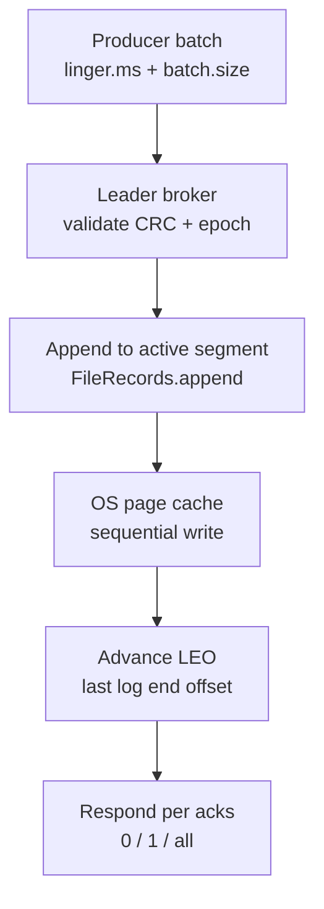
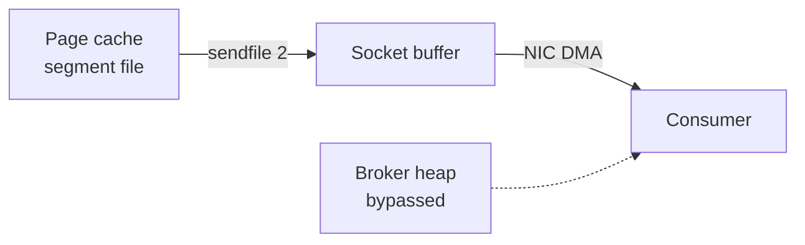
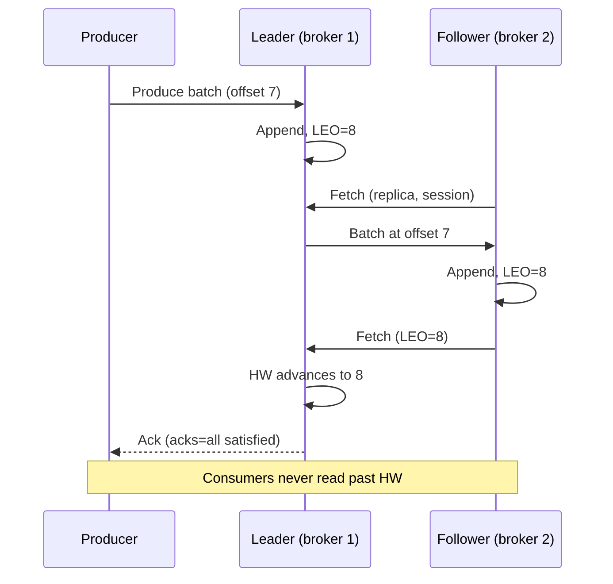

# Kafka Log Internals: Segments, Indexes, Zero-Copy, and the ISR Contract

## Overview

Kafka's performance and durability story is entirely a consequence of how it lays bytes on disk and how the leader tracks what replicas have seen. This page covers the machinery below the "partition = ordered log" abstraction from [Kafka overview](../messaging/kafka.md): segment files and their two index files, the append path through the OS page cache, the `sendfile` zero-copy read path, the in-sync replica (ISR) protocol that makes `acks=all` mean something, the difference between the high watermark and leader epochs, and the fetch session cache that keeps consumer traffic cheap. Read the overview first; this page is the mechanism level that interviews probe with "walk me through a Kafka write."

## The Partition Directory: Segments on Disk

Each topic-partition replica is a **directory** on the broker's local filesystem (Kafka couples compute and storage — the contrast with [Pulsar](pulsar-internals.md) is deliberate). Inside, the log is cut into **segments**, each named by the base offset of its first record, zero-padded to 64 bits:

```text
orders-0/
  00000000000000000000.log          # records for offsets 0 .. 999,999
  00000000000000000000.index        # sparse: relative offset -> file position
  00000000000000000000.timeindex    # sparse: timestamp -> offset
  00000000000000010000.log          # next segment, base offset 1,000,000
  00000000000000010000.index
  00000000000000010000.timeindex
  leader-epoch-checkpoint           # epoch -> end-offset pairs (see below)
  partition.metadata                # topic id (KIP-516), prevents stale replicas
```

| File | Written by | Purpose | Key config |
|---|---|---|---|
| `*.log` | Appender on produce | The records themselves, batched and often compressed as whole batches | `log.segment.bytes` (1 GiB default), `log.roll.ms`/`log.roll.hours` (7 days) |
| `*.index` | Appender (sparse) | Offset → physical position lookup, one entry per `log.index.interval.bytes` (4096 B) of appended data | `log.index.size.max.bytes` (10 MiB) |
| `*.timeindex` | Appender (sparse) | Timestamp → offset, enables "seek to T-1h" and time-based retention | same size cap |
| `leader-epoch-checkpoint` | Controller on election | Leader epochs and the end offset of each (divergence repair, KIP-101) | — |

Segments roll when the active one reaches `log.segment.bytes` or its age passes `log.roll.ms`; a new segment also starts on delete/compact boundaries. Only the **active segment** accepts appends; all older segments are immutable, which is what makes concurrent reads lock-free and retention a cheap file deletion. Immutable segments are also the unit of log compaction, retention deletion, and (in cluster migration tools) the unit that gets streamed between brokers.

### Index lookups

The offset index is **sparse by design**: writing an index entry every record would double metadata traffic. Instead Kafka records a position every ~4 KiB of appended messages. A consumer asking for offset `X` binary-searches the index for the largest entry ≤ `X`, jumps to that file position, and then **scans forward at most one interval** to reach `X`. The `.timeindex` works identically, keyed by timestamp, and backs both `offsetsForTimes()` and age-based deletion. Because index entries are relative to the segment's base offset, they stay 4-byte compact regardless of partition age.

## The Append Path: Page Cache, Not Managed Cache

A produce request to the leader executes a strictly ordered sequence:



Kafka deliberately uses the **OS page cache** instead of an application heap cache. Writes are sequential appends, so the kernel buffers them in RAM and flushes in order; the heap stays small, GC pressure stays low, and a broker restart does not need to "warm up" an application cache because the page cache survives the process. Kafka never calls `fsync` on the hot path — `log.flush.interval.messages` and `log.flush.interval.ms` exist but default to "never force"; durability comes from **replication across brokers**, not from syncing one disk. This is why a broker crash (process death) loses nothing, while a simultaneous multi-broker power loss can lose `acks=1` records — the page cache contents evaporate before the OS flushes them.

Throughput follows from three consequences of this design: sequential disk writes approach the bandwidth of the device (hundreds of MB/s on SSD, tens on HDD), batches are compressed as units (so compression ratio improves with batch size — `compression.type=lz4/zstd`), and the same cached bytes serve many consumer groups, so fan-out reads cost network only.

## Zero-Copy: The sendfile Read Path

A traditional read-then-send costs two userspace copies and two kernel crossings. Kafka's consumer path avoids both with the `sendfile(2)` syscall: the broker asks the kernel to pipe bytes **from the page cache directly to the socket**, so data never enters the JVM heap and the broker CPU does one syscall instead of a read+write cycle.



Three caveats interviewers expect:

| Caveat | Consequence |
|---|---|
| **TLS breaks sendfile** | Encrypted fetches must be copied through userspace to encrypt; zero-copy applies to PLAINTEXT listeners only |
| **Batches must fit** | `sendfile` streams whole file ranges; a fetch bounded by `fetch.max.bytes` may stop at batch boundaries, leaving a cache miss for the next range |
| **Transformations disable it** | Any broker-side rewriting (e.g., older down-conversion of message formats, KIP-500-era topic-id fetches aside) copies data into the heap and is a known source of broker CPU spikes during version-skewed upgrades |

The same design shows up in other high-throughput storage — the [Fast I/O](../../os/advanced/fast-io.md) page covers `sendfile`, `io_uring`, and why page-cache residency dominates random-read workloads.

## The ISR Contract and the acks=all Path

Every replica tracks a **LEO** (log end offset — the next offset it will write). The leader tracks its own LEO plus the LEO of every follower, which followers report implicitly by **fetching**: followers are ordinary consumers of the leader. The **ISR** (in-sync replicas) is the set including the leader whose LEO is within `replica.lag.time.max.ms` (30 s default since Kafka 2.5) of the leader's. A follower that falls behind past the timeout is **shrunk** from the ISR by the leader (without controller involvement, via the standard partition state path); one that catches back up is **expanded** back in. With `min.insync.replicas=2` and `acks=all`, a write that cannot be acknowledged by two replicas **fails with `NOT_ENOUGH_REPLICAS`** — availability is sacrificed for durability, the classic CP posture; with `acks=all` and `min.insync.replicas=1`, a single-node ISR keeps accepting writes and the guarantee degrades to acks=1.



The `acks=all` path is **not** "all replicas" — it is "all ISR members." This distinction is the single most tested Kafka durability fact: if ISR has shrunk to just the leader, `acks=all` is exactly `acks=1`, which is why `min.insync.replicas` must be raised together with `acks=all`. Unclean leader election (`unclean.leader.election.enable=false` default) forbids promoting an out-of-ISR replica, trading availability for the no-data-loss invariant; enabling it trades committed-record loss for uptime.

## High Watermark vs Leader Epoch

The **high watermark (HW)** is the largest offset that **all** ISR members have replicated — consumers may read only offsets below it. It advances lazily: a follower's fetch reveals its LEO, the leader lowers `HW = min(LEO of ISR)`, and the new HW is propagated back in the fetch response. Consequences: there is always a replication delay between "leader accepted" and "consumer visible," and a follower that is otherwise healthy still cannot serve reads (Kafka does not do leaderless reads — consumers always talk to the leader).

The **leader epoch** is a monotonically increasing integer assigned per leader election. The per-partition `leader-epoch-checkpoint` records `(epoch, end-offset)` pairs, and it exists to solve a truncation problem HW alone cannot: after an unclean failover a survivor may contain records the new leader never saw (a "zombie" tail). The repair works in both directions:

- **Replica side (KIP-101):** a restarting follower asks the leader `OffsetsForLeaderEpoch(current epoch)`; the leader replies with the end offset of that epoch, and the follower truncates any bytes beyond it. Divergence is bounded to one leader term.
- **Consumer side (KIP-320):** fetches carry the epoch the consumer last saw; if the log was truncated, the leader responds with the new epoch + offset so the client can reset, preventing consumers from re-reading "phantom" records.

Together HW and epochs give Kafka its ordering-durability story: consumers never see uncommitted-to-ISR data, and replicas converge to byte-identical logs even across repeated crashes — the same guarantee family as the fencing discussed in [fencing tokens](../fundamentals/fencing-tokens.md).

## Fetch Session Cache

Before Kafka 1.1, every consumer fetch listed **all** partitions the consumer followed, even the thousands with no new data — on large clusters, request size and broker CPU were dominated by empty partitions. KIP-227 introduced **incremental fetch requests** with a session cache:

1. First fetch is a full request; the broker allocates a **session ID** and caches the partition set, returning it in the response.
2. Subsequent fetches send only the session ID + epoch and **changed** partitions (new data, error states, partition adds); the broker responds with only partitions that have something to report.
3. Sessions live in a bounded LRU cache — `max.fetch.sessions` (default 500) per broker — and are evicted under pressure, at which point the client transparently falls back to a full fetch.

Sessions also carry the replica's epoch state, so follower fetches piggyback LEO information the leader needs for HW advancement and ISR maintenance. The cache is another reason partition counts in the millions became feasible without consumer-side CPU blowing up — the same goal KRaft pursues for metadata (KIP-500, covered in [Redpanda's Raft-native comparison](redpanda-and-thread-per-core.md) and the consumer-protocol revamp in [rebalancing](kafka-consumer-rebalancing.md)).

## Tuning Summary

| Goal | Knobs | Effect |
|---|---|---|
| Max throughput | `batch.size` ↑, `linger.ms` 5–20, `compression.type=zstd`, `sendfile` via PLAINTEXT | Fewer, larger sequential writes; CPU offload |
| Max durability | `acks=all`, `min.insync.replicas=2`, RF=3, `unclean.leader.election.enable=false` | Write needs quorum of ISR; no stale-leader promotion |
| Bounded latency | `replica.lag.time.max.ms` ↓, small `linger.ms`, partition count sized to load | Faster ISR detection; less batching delay |
| Recovery speed | `log.segment.bytes` ↓, epoch checkpoints healthy | Smaller replay + truncation windows |

## A Worked Watermark Timeline

Concrete numbers make HW/LEO/epoch behavior sticky. Partition with RF=3, replicas R1 (leader), R2, R3; ISR currently `{R1, R2, R3}`:

| Step | Event | R1 LEO | R2 LEO | R3 LEO | HW |
|---|---|---|---|---|---|
| 0 | Steady state | 100 | 100 | 100 | 100 |
| 1 | R3 stops fetching (GC pause) | 100 | 100 | 100 | 100 |
| 2 | Producer writes offsets 100–104; R2 fetches up to 105, R3 silent | 105 | 105 | 100 | 100 |
| 3 | 30 s pass; R3 timed out → ISR = {R1, R2} | 105 | 105 | 100 | 105 |
| 4 | Consumers now read offset 104 (HW advanced with R3 gone) | — | — | — | 105 |
| 5 | `acks=all` produce of offset 105 → `NOT_ENOUGH_REPLICAS` if `min.insync.replicas=3` | — | — | — | — |

Step 4 is the moment interviewers test: with R3 out of the ISR, the HW *jumps forward* because the min is taken over ISR members only — consumers gain visibility precisely because the failure was acknowledged. If R3 then returns at LEO 100, it fetches from 100, catches up, and rejoins; if instead R1 died at step 3 with `unclean.leader.election.enable=true`, R3 could be promoted leader and offsets 100–104 would be **truncated** away — lost records the epoch checkpoint machinery would then reconcile for replicas and consumers.

## Crash Recovery Walkthrough

A broker restart replays a bounded amount of state because Kafka checkpoints the *safety* positions separately from the log itself:

- **`recovery-checkpoint-offset` files** record, per log, the offset up to which the segment files were flushed. On startup, recovery replays only from that checkpoint into the tail segment, validating CRCs and truncating any torn (partially written) trailing batch. Without the checkpoint, restart would scan whole partitions; with it, restart cost is proportional to unflushed bytes, not log size.
- **The cleaner offset checkpoint and log-start-offset files** serve compaction and retention respectively; the leader-epoch checkpoint (above) is carried across restarts to support truncation.
- **Replica state is rebuilt from fetching.** A restarted follower has no memory of its ISR membership; it simply starts fetching from its on-disk LEO, and the leader re-expands it into the ISR once `replica.lag.time.max.ms` of clean fetching passes. This is why broker restarts are usually non-events for `acks=all` traffic — the ISR temporarily shrinks, `min.insync.replicas` must still be satisfiable, and data never depended on the restarting node's memory.

The design point worth stating explicitly: Kafka treats *process* crashes as free (page cache + checkpoints) and *disk* loss as a replication problem. That split explains why `log.flush.*` settings are almost never touched in production tuning, and why rack-aware replica placement matters more than RAID.

## Retention and Compaction Mechanics

Segment immutability is what makes retention cheap: the **log cleaner** and retention checker work at segment granularity on the oldest files.

- **Time/size retention** deletes whole segments whose newest timestamp exceeds `retention.ms` (7 days default) or whose total size exceeds `retention.bytes`; `log.retention.check.interval.ms` (5 min) paces the sweep. Deleting a segment is an OS unlink plus a metadata update — no record-level work.
- **Log compaction** (`cleanup.policy=compact`) is a background rebuild: the cleaner copies the newest record per key from the log head into **cleaned** segment files (`*.log.cleaned`), atomically swaps them in (`.swap` suffix dance), and discards superseded segments. Compaction is throttled (`log.cleaner.io.max.bytes.per.second`) and reserves a fraction of broker disk/threads (`log.cleaner.dedupe.buffer.size`, `log.cleaner.threads`).
- **Compaction preserves offsets** — records are removed but remaining offsets keep their original values, which is why consumers can still use them as stable positions after cleanup.

## Request Types on the Wire

| Request | Direction | Internals relevance |
|---|---|---|
| `Produce` | producer → leader | Append path entry point; carries PID/sequence for idempotence, epoch for transactions |
| `Fetch` | consumers/followers → leader | Fetch session ID/epoch, max bytes, replica fetch parameters |
| `ListOffsets` | client → leader | Offset resolution by timestamp or special values (earliest/latest/max-timestamp) |
| `OffsetsForLeaderEpoch` | replica → leader | Epoch end-offset lookup that powers truncation repair (KIP-101) |
| `DescribeLogDirs` | admin → broker | Per-partition disk usage; used by reassignment tooling |
| `AlterPartitionReassignments` | admin → controller | Moves replicas — the expensive byte-copying operation Pulsar avoids |

## Observability

| Signal | Healthy | Failure story |
|---|---|---|
| `UnderReplicatedPartitions` (broker) | 0 | ISR shrinking; disk/network trouble on a follower |
| `RequestLatencyAvg` p99 for produce/fetch | stable | Page-cache misses, disk saturation, down-conversion CPU |
| `TotalFetchRequestsPerSec` + fetch session hit rate | high hit rate | Clients falling back to full fetches (session eviction) |
| ISR shrink/expand rate | ~0 | `replica.lag.time.max.ms` too tight, or real I/O problems |
| Log end offset vs high watermark delta (per partition) | small | Healthy replication lag in offsets |
| `LogFlushRateAndTimeMs` | near-idle | Someone enabled forced flush — check `log.flush.*` |

## Interview Questions

1. **Why does Kafka not fsync on every write, and when can that lose data?**
   Kafka appends into the OS page cache and relies on replicating each record to the ISR for durability, because a network round trip to another broker's page cache is far cheaper than a disk flush and throughput becomes NIC-bound rather than disk-bound. Process crashes lose nothing — the page cache is owned by the kernel — but a simultaneous power failure across brokers can lose records acknowledged with `acks=1` before the kernel flushed them. With `acks=all` and `min.insync.replicas=2`, loss requires every replica's cache to vanish at once, an acceptable residual risk for most workloads.

2. **Explain the difference between the high watermark and LEO.**
   The LEO is the offset a replica will write next; the leader tracks its own plus every follower's LEO from fetch requests. The high watermark is the minimum LEO across ISR members — the largest offset all in-sync replicas hold — and it caps what consumers may read. This guarantees consumers never observe records that a failover could lose, at the cost of replication-lag latency between produce-ack and visibility.

3. **What problem do leader epochs solve that the high watermark cannot?**
   The HW says nothing about *why* a log ends where it ends. After an unclean leader election, a crashed replica can come back with a tail of records the new leader never accepted; comparing only offsets cannot tell whose tail is legitimate. The epoch checkpoint records where each leader term ended, so a recovering replica asks the leader for its epoch's end offset and truncates beyond it, and epoch-aware fetches (KIP-320) stop consumers from reading truncated-away records.

4. **Walk through what happens when a follower falls 60 seconds behind.**
   The leader observes via fetch requests that the follower's LEO has not advanced within `replica.lag.time.max.ms` (30 s), so it removes the follower from the ISR — a leader-only metadata change, no controller round trip. If the partition runs `min.insync.replicas=2` and the ISR drops to one, further `acks=all` produces fail fast with `NOT_ENOUGH_REPLICAS`. When the follower's I/O recovers and it fetches up to the leader LEO, the leader expands it back into the ISR and writes resume.

5. **Why are the offset index files sparse, and what is the lookup cost?**
   Indexing every record would make index maintenance a significant fraction of write cost. Kafka writes an index entry every `log.index.interval.bytes` (4 KiB) of appended data, so lookups binary-search to the nearest entry at-or-below the target offset, jump into the log file, and scan at most one 4 KiB interval forward — a few microseconds in practice. The `.timeindex` mirrors this with timestamp keys to serve `offsetsForTimes` and time-based retention.

6. **What does the fetch session cache optimize?**
   Empty-partition chatter. Without sessions every fetch enumerated all followed partitions; with KIP-227 the client holds a session ID and sends only changed partitions, and the broker replies only with partitions holding data or errors, bounded by `max.fetch.sessions` LRU slots. This cut fetch bandwidth and broker CPU dramatically on clusters with many idle partitions and is a precondition for the million-partition targets of KRaft.

## Key Takeaways

- A partition is a directory of immutable segments; only the active segment accepts appends, making reads, retention, and compaction concurrency-friendly.
- Both indexes (`.index`, `.timeindex`) are sparse; a lookup is binary search plus a bounded ≤4 KiB scan.
- Durability comes from cross-broker replication over the page cache, not from `fsync`; `acks=all` means "all ISR," so pair it with `min.insync.replicas`.
- Consumers read only below the high watermark; leader epochs bound post-failover truncation for both replicas and consumers.
- Zero-copy `sendfile` moves bytes page-cache→socket, but TLS and message-format down-conversion fall back to heap copies.
- Fetch sessions (KIP-227) make large-partition-count clusters viable by sending only deltas.

## References

- Apache Kafka documentation — design and implementation sections: [kafka.apache.org/documentation](https://kafka.apache.org/documentation/)
- Kafka source (log segment, fetch session, epoch logic): [github.com/apache/kafka](https://github.com/apache/kafka)
- Kreps, Narkhede, Rao — "Kafka: a Distributed Messaging System for Log Processing," NetDB Workshop, 2011 (zero-copy and page-cache rationale)
- Hunt, Konar, Junqueira, Reed — "ZooKeeper: Wait-free Coordination for Internet-scale Systems," USENIX ATC 2010 (controller-side metadata era context)

## Cross-References

- [Kafka Overview](../messaging/kafka.md) — topics, partitions, producer configs from the top
- [Kafka Consumer Rebalancing](kafka-consumer-rebalancing.md) — the group protocol on top of these fetch paths
- [Exactly-Once Semantics](exactly-once-semantics.md) — how transactions gate the watermark story
- [Redpanda and Thread-per-Core](redpanda-and-thread-per-core.md) — a reimplementation of this exact on-disk contract
- [Fencing Tokens](../fundamentals/fencing-tokens.md) — the epoch/fencing family of guarantees
- [Fast I/O](../../os/advanced/fast-io.md) — sendfile, io_uring, and page-cache mechanics
- [Kafka (Backend)](../../backend/messaging/kafka.md) — API-level producer/consumer usage
