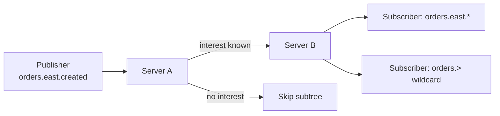
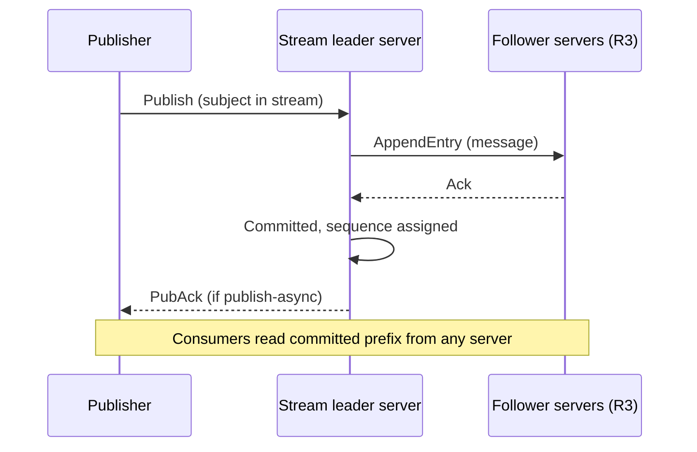

# NATS and JetStream: Interest-Graph Messaging with a Durable Layer

## Overview

NATS is two systems in one binary: **Core NATS**, a subject-routed, fire-and-forget fabric whose only state is the interest graph, and **JetStream**, a durable streaming layer that adds replicated logs, at-least-once delivery, and a dedup-window exactly-once story on top of the same subjects. The comparison interview question is usually "NATS vs Kafka for X" — this page gives you the internal mechanisms to answer it: how interest propagation makes core routing free, what the stream/consumer model persists, how the Raft meta-group and per-stream replication work, how mirror/source streams support DR, and where file vs memory storage trade. The API-level basics (subjects, wildcards, queue groups, code samples) live in [NATS (backend)](../../backend/messaging/nats.md); here we go inside.

## Core NATS: the Interest Graph

Core NATS has no per-topic storage and no broker-side queue: a server holds only a **routing table of subscriptions**. When a client subscribes to `orders.east.*`, the server records the interest and propagates it to neighboring servers over route connections; a published message is forwarded only along paths where an interest exists, and if no subscriber anywhere is interested, the message is **dropped** — at-most-once by construction, with near-zero bookkeeping.



Three mechanisms carry the whole feature set:

| Mechanism | What it provides | Internals |
|---|---|---|
| **Subjects + wildcards** | Hierarchical topics without registration | Token tree match at publish time (`*` one token, `>` tail) |
| **Queue groups** | Load-balanced work distribution among subscribers | Server picks one group member per message — a routing decision, not a queue |
| **Request/reply** | RPC over the same fabric | Publisher subscribes on an ephemeral `_INBOX.<nuid>` subject; the reply-to field carries it — correlation is a subject, not an ID store |

Clustering is gossip-flavored: servers discover each other via seed URLs, exchange routes, and gateways interconnect clusters into a supercluster, with **interest-only propagation** across gateways so a global fabric carries only subscribed traffic. **Leaf nodes** extend this to the edge — a small node behind a firewall or on a device connects up, imports a filtered subject graph, and makes the edge look local; this is the primary reason NATS dominates lightweight-edge comparisons against Kafka, whose clients assume well-connected, stateful operation.

## JetStream: Streams over Subjects

JetStream turns a set of subjects into a durable, ordered-per-subject log called a **stream**. Publishing is unchanged core-NATS messaging; a JetStream-enabled server (or stream's raft group) captures the messages and persists them.

| Object | Role | Key knobs |
|---|---|---|
| **Stream** | Durable capture of messages on subjects | `storage = file \| memory`, `retention = limits \| interest \| workqueue`, replicas `R1/R3/R5` |
| **Consumer** | Ordered cursor over a stream (pull or push) | `durable` vs ephemeral, `ack_policy = explicit \| none \| all`, `max_deliver`, `max_ack_pending` |
| **Message** | Payload + subject + headers (e.g. `Nats-Msg-Id`) | Sequence assigned per stream on capture |
| **KV bucket / Object store** | Key-value and blob APIs built as streams | Latest-value retention and chunked streams under the hood |

Retention semantics are the mental model: `limits` keeps messages until limits (age/size/count) expire regardless of consumption — the Kafka-like log; `interest` keeps a message while *some* consumer interest requires it; `workqueue` keeps it until the first ack — a real queue built from a log. A stream's messages are stored in fixed-size **message blocks** (file) with an index per block, or in memory, and the whole stream state (sequence, first/last, per-consumer ack floors) is checkpointed.

## Replication: Meta-Group and Per-Stream Raft

JetStream is built from two Raft layers (the algorithm in [Raft](../consensus/raft.md)):

1. **Meta-group:** a Raft group (typically 3 or 5 servers in the cluster) owns JetStream *metadata* — stream configs, placement, account limits. One server is the meta leader and coordinates stream creation/moves.
2. **Per-stream Raft group (R3):** each replicated stream elects a leader; publishes route to the leader, entries replicate to followers, and the committed prefix is the stream. Durable consumers get their **own Raft groups** so ack/cursor state survives leader loss.



Publishes can be fire-and-forget (core semantics — stream captures what arrives) or acknowledged (`publish_async` with a `PubAck` carrying stream sequence) — the choice is per call, which is why NATS can serve both "lossy metrics fan-out" and "durable order events" on the same subjects with the same binary.

## Delivery Semantics: Acks and the Dedup Window

- **At-least-once (default):** consumers with `ack_policy=explicit` must ack; unacked messages redeliver after `ack_wait`, bounded by `max_deliver`. `max_ack_pending` is the in-flight window — the consumer-side backpressure dial (see [backpressure](backpressure-and-flow-control.md)).
- **At-most-once:** `ack_policy=none` with auto-ack on delivery, or plain core NATS.
- **Exactly-once, scoped:** producers set a `Nats-Msg-Id` header; the stream keeps a **dedup window** (default 2 minutes, tunable `duplicate_window`) and silently drops re-sent IDs; consumers use **double-ack** (ack after processing, with `ack_sync` awaiting persistence of the ack). Together these give exactly-once *within the stream's dedup window* — the same scoped guarantee analyzed in [exactly-once semantics](exactly-once-semantics.md), and bounded in time rather than transaction-scoped.

The honest framing: Kafka transactions compose offsets + outputs atomically across topics; JetStream's window composes *retries* into idempotent publishes but does not atomically bind a consumer's outputs to its acks — cross-stream workflows still need idempotent sinks.

## Mirror and Source Streams

Disaster recovery and aggregation are stream-to-stream copies:

- **Mirror:** a read-only replica of one upstream stream (optionally filtered by subject), maintained by a dedicated consumer on the source — the JetStream equivalent of [MirrorMaker 2](../messaging/kafka.md) for Kafka, except it is a first-class stream type with its own sequence mapping.
- **Sources:** a stream aggregating several upstream streams (optionally transformed by subject prefix), the standard pattern for multi-region fan-in or service-boundary aggregation.

Because a mirror is itself a stream, consumers are unaware they read a replica; failover to a mirror in another cluster is a config update, and hierarchies (mirror of mirror) are legal. Combined with leaf nodes and gateways, this gives JetStream a native multi-region story that Kafka implements only with external tooling — the same asymmetry noted for [Pulsar](pulsar-internals.md).

## File vs Memory Storage

| Aspect | Memory storage | File storage |
|---|---|---|
| Latency | Microseconds; no disk on path | Disk-append per message block write; page-cache served reads |
| Durability | Cluster replication only (R3) — node loss still recoverable | Survives simultaneous loss of all servers (data on disk) |
| Capacity | Bounded by RAM | Bounded by disk; blocks flushed and indexed |
| Use case | Short-lived buffers, workqueue spooling, hot caches | Event records, KV buckets, audit logs |

R1 memory streams are the "why not just Redis pub/sub" answer: still ordered, still consumer-addressable, still replayable until limits. R3 file streams are the durability tier. Unlike Kafka, there is no compaction-by-key on streams (KV latest-value retention is the closest analog), so long unbounded event history remains Kafka/Pulsar territory.

## NATS vs Kafka for Edge and Lightweight Use Cases

| Dimension | NATS + JetStream | Kafka |
|---|---|---|
| Footprint | Single ~20 MB binary; leaf nodes on devices | JVM per broker; client keeps metadata + buffers |
| Hot-path state | Interest graph only (core) | Partition metadata, fetch sessions, indexes |
| Latency | Sub-ms to low-ms persisted | ms-class persisted; batching trades latency for throughput |
| Throughput | High (millions/s core; 100k-class/s persisted per cluster) | Very high sustained (multi-100 MB/s per broker) |
| Replay | Per-stream replay from sequence | First-class offset replay, compaction |
| Exactly-once | Dedup window + double-ack (per stream) | Transactions + `read_committed` (cross-topic) |
| Wildcard subscriptions | First-class (`orders.>`) | None — fixed partitions |
| Multi-region | Mirrors/sources, gateways, leaf nodes | MirrorMaker 2 / vendor tooling |
| Operational model | One system, config-light | Sizing: partitions, replicas, KRaft, tiered storage |

The decision heuristic: if the workload is **subject-shaped, latency-sensitive, and lightweight-deployed** (device fleets, service-to-service RPC, filtered global fan-out), NATS wins; if it is **volume-shaped and history-shaped** (event sourcing, analytics pipelines, high-fanout durable replay), Kafka wins. They also compose: NATS at the edge feeding Kafka in the core is a common production pattern.

## Consumers in Detail: Modes and Ack Semantics

The consumer object is where delivery semantics actually live, and its options combine into four modes:

| Mode | Config | Behavior |
|---|---|---|
| Ephemeral push | No durable name, `deliver_subject` set | Interest-based: consumer gone = no delivery, buffer bounded by `max_ack_pending` |
| Durable push | `durable` name + `deliver_subject` | Server pushes to the subject; state survives reconnects |
| Durable pull | `durable` + `fetch(batch)` | Application paces explicitly; the scaling-friendly default |
| Ephemeral pull | Plain `fetch` | Scratch reads; no cursor persistence |

Ack protocol details that matter in production: an **ack carries a subject-encoded type** — `+ACK` (processed), `-NAK` (redeliver now), `+WPI` (in-progress heartbeat that resets `ack_wait`), and `+TERM` (terminate: never redeliver, the poison-message exit). `ack_wait` (default 30 s) bounds how long an unacked message waits before redelivery; `max_deliver` bounds redelivery attempts before the consumer gives up (optionally writing to an advisory subject — JetStream's DLQ signal). `ack_policy=all` makes one ack advance all sequences below it — the cumulative-ack path, cheapest for ordered processing.

```mermaid
sequenceDiagram
    participant C as Consumer
    participant S as Stream leader
    S->>C: Deliver msg (deliver count 1)
    Note over C: Processing hangs 45 s
    S->>C: Redeliver after ack_wait (count 2)
    C->>S: +WPI in progress
    S->>C: Hold off redelivery
    C->>S: -NAK or +ACK
    Note over C,S: max_deliver bounds the loop; +TERM exits early
```

## File Storage Internals

JetStream's file store is a page-cache-friendly log like Kafka's, sized down for a lightweight server:

- Messages accumulate in **fixed-size message blocks** (tunable at stream creation); a block is flushed when full or on a sync window, then indexed by an in-memory structure mapping subject + sequence → block and offset.
- **Stream state** (first/last sequence, per-subject counts, consumer ack floors) is checkpointed asynchronously so server restart rebuilds from state + blocks rather than scanning.
- **Sync discipline** is configurable per stream (`SyncInterval`, or `AsyncFlush` semantics); JetStream defaults trade a small crash-window for throughput — the same "replication not fsync" posture as Kafka, softened by R3 Raft replication.
- **Discard policies** (`DiscardOld` vs `DiscardNew`) decide whether limits enforcement drops the oldest or rejects the newest publish — `DiscardNew` + `max_msgs` is how JetStream implements backpressure-to-producer on full streams.

Memory storage shares the same state machine with blocks in RAM; the practical difference is crash durability and capacity ceiling, summarized in the table above.

## Leaf Nodes and the Edge Pattern

The canonical edge deployment uses three NATS properties in combination:

1. A **leaf node** on the device or site connects outbound to the supercluster, authenticates with credentials, and imports only the subjects it needs — the remote side never needs to reach the edge.
2. **Interest-only propagation** across the leaf connection means an idle edge adds no traffic; a disconnected edge buffers locally only where JetStream streams exist on it.
3. A local **R1 file stream** on the leaf can spool measurements during disconnection and have a synchronizer forward them upstream on reconnect — JetStream's mirror/source machinery applied hierarchically.

This pattern is why NATS shows up in fleet-management and IoT designs where Kafka's client footprint (metadata cache, TCP connections per broker, JVM for admin tooling) is a non-starter on constrained devices.

## Interview Questions

1. **What does Core NATS actually store, and what follows from that?**
   Only the interest graph: which subjects have subscribers on which connections. Messages are forwarded along interested routes and dropped when nobody listens, giving at-most-once delivery with microsecond latency and near-zero broker bookkeeping. Everything else — durability, replay, exactly-once — must come from JetStream, which is precisely the layering the designers intended.

2. **How does JetStream persist and replicate a stream?**
   Each stream has a config (subjects, storage, retention, replicas) and, for R3, its own Raft group: publishes go to the stream leader, entries replicate to followers, and the committed prefix is the stream. JetStream metadata (stream/consumer configs) lives in a separate meta-group Raft, and durable consumers keep cursor/ack state in their own Raft groups. So a three-server cluster is one meta-group plus one Raft group per replicated stream, plus consumer-state groups.

3. **Explain JetStream's exactly-once mechanism and its limits.**
   Producers attach a `Nats-Msg-Id`; the stream drops duplicates inside its `duplicate_window` (default 2 minutes), and consumers double-ack — ack after processing with a synchronous ack that persists the cursor — so redelivery after a crash does not duplicate processed work. The limit is scope: exactly-once holds per stream and only within the dedup window, and nothing binds a consumer's *external* side effects to the ack. Cross-topic transactional workflows like Kafka's are out of scope.

4. **When would you pick NATS over Kafka, and when would you be wrong to?**
   Pick NATS for subject-shaped, latency-sensitive, or edge workloads: device fleets via leaf nodes, wildcard global fan-out, request/reply at RPC latency, or modest durable streams where one binary beats a Kafka cluster. You would be wrong for high-volume event history: Kafka's per-partition throughput, compaction, offset replay, and ecosystem (Connect, Streams, Flink connectors) are an order of magnitude more developed for analytics-shaped pipelines. The two compose naturally — NATS edge fabric feeding a Kafka core log.

5. **What are mirror and source streams for?**
   A mirror is a read-only, continuously maintained copy of another stream — typically in another cluster or region — acting as disaster recovery with consumer-transparent failover. Sources aggregate multiple streams into one (optionally rewriting subject prefixes), which is the standard multi-region fan-in or per-tenant aggregation pattern. Both are stream types rather than external tools, so unlike MirrorMaker 2 there is no separate deployment to operate.

6. **How does `max_ack_pending` function as backpressure?**
   It caps the number of unacked in-flight messages per consumer; at the limit the stream stops delivering until acks arrive, converting slow processing into delivery pause rather than unbounded buffering. Combined with `ack_wait` redelivery it bounds both memory and duplicate-processing exposure. This is JetStream's push-consumer credit scheme; pull consumers expose the same control via explicit fetch batches.

## Key Takeaways

- Core NATS = interest graph + subjects + queue groups; at-most-once, no persistence, microsecond latency.
- JetStream adds streams (file/memory, limits/interest/workqueue retention) and consumers with explicit acks over the same subjects.
- Replication is layered Raft: a meta-group for metadata, per-stream groups for data, per-consumer groups for cursor state.
- Exactly-once is scoped: `Nats-Msg-Id` dedup window + double-ack, bounded by time and stream, not transactional across topics.
- Mirrors and sources give first-class DR and aggregation without external tooling; leaf nodes make edge deployment native.
- NATS wins subject-shaped, latency-sensitive, lightweight workloads; Kafka wins volume-shaped, history-shaped pipelines.

## References

- NATS documentation: [docs.nats.io](https://docs.nats.io/)
- NATS developer guide: [docs.nats.io/using-nats/developer](https://docs.nats.io/using-nats/developer)
- NATS server source (JetStream implementation): [github.com/nats-io/nats-server](https://github.com/nats-io/nats-server)
- Ongaro & Ousterhout — "In Search of an Understandable Consensus Algorithm (Raft)," USENIX ATC 2014, [raft.github.io/raft.pdf](https://raft.github.io/raft.pdf)
- Kafka documentation (comparison baseline): [kafka.apache.org/documentation](https://kafka.apache.org/documentation/)

## Cross-References

- [NATS (Backend)](../../backend/messaging/nats.md) — subjects, wildcards, queue groups, and client code
- [Kafka Overview](../messaging/kafka.md) — the streaming-platform counterfactual
- [Exactly-Once Semantics](exactly-once-semantics.md) — how Kafka's scoped guarantee compares
- [Message Queues](../messaging/queues.md) — delivery-guarantee patterns across systems
- [Raft](../consensus/raft.md) — the consensus layer under JetStream
- [Pulsar Internals](pulsar-internals.md) — another "decoupled durable layer" comparison point
