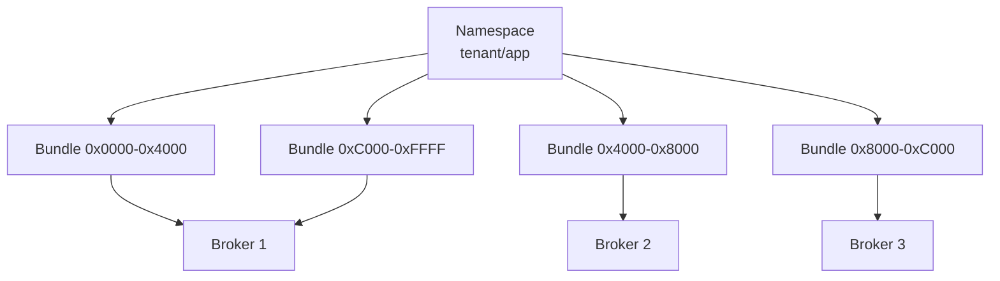
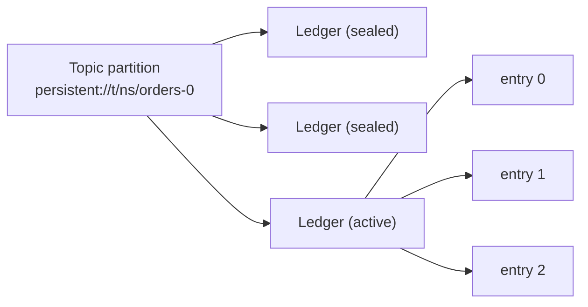
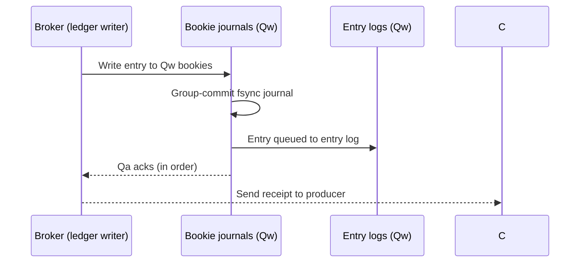
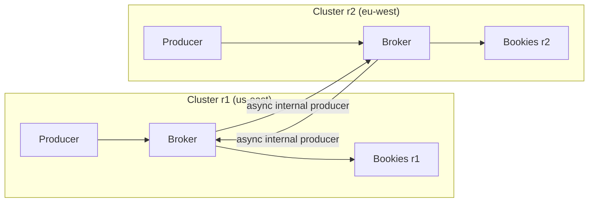

# Pulsar Internals: Stateless Brokers, Bundles, and BookKeeper Quorums

## Overview

Pulsar's architecture makes one bet that shapes everything else: **brokers own nothing durable**. Bytes live in BookKeeper bookies as replicated ledgers; brokers hold only leases on ownership of topic traffic. This page covers that machinery — how a topic partition maps to a namespace bundle, how a produce write crosses the ensemble/write/ack quorums (E, Qw, Qa) of a ledger, why partitions are lists of sealed ledgers rather than single files, and how geo-replication layers on top. The feature-level comparison (subscription types, tiered storage, functions) lives in [Pulsar overview](../messaging/pulsar.md); [BookKeeper internals](bookkeeper-internals.md) goes one layer deeper into the storage engine itself.

## Broker Statelessness and Bundle Ownership

A broker never stores a partition; it stores an **ownership table**. The unit of ownership is the **namespace bundle** — a contiguous range of the 64-bit hash space into which every topic name in a namespace hashes. All topics whose names hash into a bundle are served together by whichever broker currently holds that bundle's lease, recorded in the metadata store (ZooKeeper today, with migration work toward dedicated stores).

Ownership is acquired on demand: a client looking up a topic asks the metadata store who owns its bundle; if unowned, the least-loaded broker claims it. This yields three properties Kafka cannot offer directly:

| Property | Mechanism | Kafka contrast |
|---|---|---|
| Broker failure = pointer move | Lease expires; survivors re-own bundles; ledgers were already quorum-committed | Leader election plus partition *data* lives on the failed node; permanent failure re-copies replicas |
| Load balancing = bundle moves | Bundle unloads transfer ownership without moving bytes | Rebalance moves partition replicas (gigabytes) across brokers |
| Elastic topic growth | Splits increase bundle count (see below) | Partition count is fixed at creation; resharding is manual |

### Namespace bundle splits

A bundle starts as the whole namespace range; when its inbound+outbound+topic+msgRate thresholds are exceeded (`loadManagerSplitBrokerSizes`-style policies, e.g. `maxTopicsPerBundle`), the load manager **splits** it into 2^N sub-ranges and reassigns them independently. Splits are metadata operations — the topics' ledgers never move. This is how Pulsar runs tens of thousands of small topics on a modest broker fleet: granularity of scheduling decouples from granularity of storage, whereas in Kafka each partition is both a scheduling unit *and* a storage unit.

## Ledger Storage: Partition = List of Ledgers

A persistent topic partition is not one file; it is a **cursor-ordered list of BookKeeper ledgers**. When the active ledger hits a rollover policy (`managedLedgerMaxSizePerLedgerMbytes`, `managedLedgerMinLedgerRolloverTimeMinutes`) or a bookie write error, the broker closes it, seals it, and opens a fresh one. Old ledgers are immutable and are the unit of tiered offloading, compaction, and deletion.

An **entry** is one message (or a batch) with its ledger ID + entry ID forming the message ID consumers ack against. Each ledger records its own quorum configuration, so a single tenant can change durability per topic without touching storage topology — a per-ledger decision Kafka cannot express because its replication factor is a per-partition property carried by the whole log.

## The Quorum Math: E, Qw, Qa

Every ledger declares three numbers:

| Parameter | Meaning | Typical | Effect |
|---|---|---|---|
| **Ensemble size E** | Number of distinct bookies the ledger spans | 3 | Stripe width; each entry lands on E bookies in a rotating ensemble |
| **Write quorum Qw** | Bookies each entry is written to (Qw ≤ E) | 3 (or 2) | Replication degree per entry |
| **Ack quorum Qa** | Bookies that must confirm before the write returns (Qa ≤ Qw) | 2 | Durability + latency dial; tolerates Qw − Qa slow/failed bookies |

The write pipeline per entry:

Two consequences interviewers probe. First, **E > Qw spreads the stripe without adding durability per entry** — useful when ledgers are large and read fan-out matters, since readers can select any Qw-order subset. Second, **Qa is the latency knob**: with `Qw=3, Qa=2` a single slow bookie's journal fsync does not gate the ack, but the write is only durable on two bookies — the same shape of trade as Kafka's `min.insync.replicas` with RF=3, applied *per ledger* instead of per partition.

### The latency model: journal + entry log

BookKeeper bookies split writes across two storage structures (detailed in [BookKeeper internals](bookkeeper-internals.md)): the **journal**, a per-bookie write-ahead log that is force-synced on the write path (group commit amortizes many entries into one fsync), and the **entry log**, an append-only shared file flushed lazily with an index for later reads. A produce's end-to-end latency is therefore approximately:

\\[ t_{produce} \approx t_{client\to broker} + t_{quorum} \approx t_{client\to broker} + \max_{i \le Qa}(\, t_{bookie_i} + t_{journal\,fsync} \,) \\]

— the ack waits on the Qa-th fastest bookie, and each bookie's cost is dominated by its journal fsync. This is why Pulsar deployments obsess over journal disk isolation (journal on NVMe, entry log on separate devices) and why increasing Qa from 2 to 3 *doubles* the fsync storm: the ack now waits for the 3rd-fastest bookie. Reads, in contrast, hit the entry log (usually warm in page cache after recovery) and can be served by any single bookie holding the entry — a read path that scales with E rather than Qw.

## Geo-Replication

Geo-replication is broker-side, async, and per-topic: each cluster's broker replicates **its own produced messages** to remote clusters via internal producers, so topic data flows bidirectionally with each region owning the subset it produced.

Properties that matter operationally: consumers in either region see the union stream with per-region message ordering preserved; message IDs are per-cluster (ledger ID space is local), and deduplication + `key_shared` subscriptions govern cross-region behavior. The contrast with Kafka is structural: Kafka cross-cluster is an **external tool** ([MirrorMaker 2](../messaging/kafka.md) or vendor replicators) offsetting into separate topics, while Pulsar's replicator is an in-broker code path — simpler to operate, harder to audit, and coupled to broker upgrades.

## Kafka vs Pulsar: The Storage-Coupling Ledger

| Question | Kafka | Pulsar |
|---|---|---|
| Where do bytes live? | Broker-local segment files; broker *is* the storage node | BookKeeper bookies, decoupled from serving brokers |
| Broker crash recovery | Leader election; if broker is dead permanently, replicas must re-replicate to restore RF | Survivors re-own the bundle in seconds; no data movement at all |
| Scale storage independently | No — storage scales with broker fleet (KIP-405 tiered storage adds a read-only tier) | Yes — add bookies for capacity, brokers for client traffic |
| Rebalance unit | Partition replica (bytes move) | Bundle lease (pointer moves) |
| Minimum production topology | One system (brokers + KRaft) | Brokers + bookies + metadata store (3 always-on components) |
| Durability config granularity | Per-partition RF + `min.insync.replicas` | Per-ledger E / Qw / Qa |
| Write amplification | 1 local append + RF−1 follower copies | Qw journal appends + Qw entry-log appends + index writes |

That last row is the honest cost line: BookKeeper's journal+entrylog design writes every entry more times than Kafka's segment-append-plus-followers does, which is why Pulsar needs more tuning (journal disk separation, group-commit windows, entry log compaction) to hit comparable throughput — and why Kafka's single-system simplicity keeps winning deployments that do not need Pulsar's elasticity.

## Cursors and Subscription State

Subscription positions are themselves durable state stored **as ledgers**. Each subscription owns a **cursor** — a BookKeeper ledger holding the ack positions of the subscription (the *mark-delete* position: everything before it is acked, plus an explicit ack set for out-of-order acks that create holes).

- **Exclusive/failover** subscriptions advance the mark-delete position linearly; **shared** subscriptions keep per-entry acks, and the mark-delete position advances only past the highest contiguous ack — a hole formed by a slow consumer pins the position, which is why shared subscriptions grow cursor ledgers fastest.
- **Cumulative acks** (`acknowledgeCumulative`) move the mark-delete point directly and are the cheap path for at-least-once processing; individual acks are required for shared and key_shared semantics.
- Cursor state is recovered on broker re-ownership by reading the cursor ledger — one more reason broker failover is fast: cursors, like data, live in BookKeeper, not broker memory.

This cursor design is the Pulsar counterpart of Kafka's `__consumer_offsets` and the reason Pulsar can offer shared/ key_shared semantics natively: per-subscription ack bookkeeping is a first-class storage object rather than an offset number.

## Persistent vs Non-Persistent Topics

`non-persistent://` topics bypass BookKeeper entirely: the broker routes messages to connected consumers in memory and acks without storage. Delivery is best-effort — a disconnected consumer misses messages permanently, and a broker failure loses in-flight traffic. The use cases are telemetry and live scores where freshness beats durability; the interview-worthy observation is that both topic types share the same protocol and subscription model, so switching is a URL scheme change, not an architecture change.

## Ledger Rollover and Managed-Ledger Compaction

Beyond rollover (covered above), Pulsar adds a **compaction** layer for long-lived topics where retention would otherwise keep superseded records: the broker builds a **compacted ledger** containing only the latest value per key (for topics written with ordering keys), consumers can read from the compacted view (`readCompacted`), and the original ledgers age out under retention. This is Pulsar's equivalent of Kafka's [log compaction](kafka-log-internals.md) and underlies Pulsar's built-in tableview/State features. Cost model: compaction reads the active ledger set and rewrites a new ledger through the same E/Qw/Qa quorums, so it consumes the same bookie bandwidth as a produce stream of the same size — schedule it like the background IO it is.

## A Worked Write-Cost Example

For one 1 KiB message on a persistent topic, per-config IO at the bookie tier:

| Config | Journal appends | Entry-log appends | Index writes | Network fan-out |
|---|---|---|---|---|
| E=3, Qw=3, Qa=2 | 3 (one per bookie) | 3 (async) | 3 (async) | 1 broker→3 bookies |
| E=3, Qw=2, Qa=2 | 2 | 2 | 2 | 1 broker→2 bookies |
| E=5, Qw=3, Qa=2 | 3 | 3 | 3 | 1 broker→3 bookies (rotating ensemble) |

The table shows why `E=5, Qw=3, Qa=2` is attractive for read-heavy ledgers: read fan-out can spread across 5 bookies while the write cost stays at Qw=3 — and why `Qa=3` is the expensive direction: it converts the async tail into a synchronous third fsync on every produce. Kafka's comparison point: one local append plus RF−1 follower fetches, with no fsync anywhere on the hot path.

## Observability

| Signal | Meaning |
|---|---|
| `pulsar_broker_publish_latency` percentiles | The Qa-th-fsync tail made visible; watch p99.9 not p50 |
| Ledger count per namespace | Rollover policy health; explosion means size thresholds too low |
| Bundle count + split events | Load-manager activity; churn means thresholds mis-tuned |
| Bookie `BOOKIE_JOURNAL_QUEUED_WRITES` | Journal backlog — the classic slow-disk symptom |
| `managedLedger_` write/read errors | Ensemble changes happening on the hot path |
| Replication backlog per cluster (geo-rep) | Cross-region health; growth means remote cluster slowness |

## Interview Questions

1. **Why are Pulsar brokers called stateless, and what do they actually own?**
   A broker owns a lease on a namespace bundle — a hash range of topic names — recorded in the metadata store; the bytes themselves are committed to BookKeeper bookies before the broker acks. If the broker dies, clients reconnect, a survivor claims the bundle, and serving resumes from the ledgers, with no leader election over data and no replica re-replication. "Stateless" is shorthand for "owns pointers, not bytes," which is why broker failure and broker load-balancing are both metadata operations in Pulsar.

2. **Explain ensemble size, write quorum, and ack quorum, and pick values for a 5-bookie cluster.**
   Ensemble size E is how many bookies a ledger stripes across; write quorum Qw is how many copies each entry gets; ack quorum Qa is how many must confirm before the write returns. A common production choice is E=3, Qw=3, Qa=2: every entry on three bookies, acked when two journal fsyncs complete, tolerating one failed bookie for durability and one slow bookie for latency. Raising Qa to 3 makes every write wait on the slowest of three fsyncs — visibly higher tail latency — while E=5 with Qw=3 spreads read load without changing durability.

3. **How does a topic partition grow in Pulsar, and how does that differ from Kafka?**
   In Pulsar the partition is a list of ledgers; the active ledger rolls over by size or time into a fresh sealed ledger, so growth is an append of new segments in BookKeeper with old ones immutable. In Kafka the partition is one directory of segments bound to specific brokers, and adding capacity means adding brokers and *moving replicas*. Pulsar's model is why its tiered storage offload is a per-ledger copy to object storage while Kafka's (KIP-405) restricts the cold tier to read-only remote segments.

4. **Where does produce latency go in Pulsar, and how do you reduce tail latency?**
   The ack waits for the Qa-th fastest bookie's journal fsync, so the tail is dominated by journal device variance; the formula is roughly client RTT plus max over Qa bookies of (bookie latency + fsync). Reductions: isolate journals on their own NVMe devices, keep entry logs on separate disks so flushing never contends with journal syncs, size group commit so bursts share one fsync, and keep Qa=2 with Qw=3. Reading is the mirror image: a read touches one bookie's entry log and is served from cache on a warm path.

5. **Compare Pulsar's geo-replication with MirrorMaker 2.**
   Pulsar replicates inside the broker: each cluster's brokers run internal producers that forward locally-produced messages to remote clusters, per topic, asynchronously, with each region ordering its own production. MirrorMaker 2 is an external Kafka Connect deployment reading source topics and producing into renamed remote topics, with offset translation and its own failure surface. Pulsar's approach is simpler to operate and per-topic toggleable; MM2's approach keeps the brokers simple and the replication auditable — the classic in-band vs out-of-band trade.

6. **A bundle is hot. What happens, and what does not happen?**
   The load manager splits the bundle into two sub-ranges and assigns them to different brokers — a metadata operation, because a bundle is a hash-range lease, not data. The topics' ledgers do not move, bookies are untouched, and no consumer offset changes. What does not happen is the Kafka-style outcome of adding partitions: no data migration, but also no per-partition throughput increase — the split parallelizes *ownership* (connection handling, dispatch) only; the underlying topic partitions and their ledgers are unchanged.

## Key Takeaways

- Pulsar brokers own namespace-bundle leases; BookKeeper owns bytes — broker failure is a pointer move, not data movement.
- Bundles decouple scheduling granularity from storage granularity; splits are pure metadata operations.
- A partition is a list of sealed ledgers; rollover size/time and per-ledger E/Qw/Qa give per-topic durability tuning Kafka cannot match.
- Produce latency ≈ wait for Qa-th fastest journal fsync; journal/entry-log disk isolation is the main tuning lever.
- Geo-replication is an in-broker async path per topic — simpler than MirrorMaker 2, at the cost of in-band coupling.
- The price of decoupling is a 3-component minimum topology and more writes per entry than Kafka's coupled log.

## References

- Apache Pulsar documentation (architecture, concepts): [pulsar.apache.org/docs](https://pulsar.apache.org/docs/)
- Apache BookKeeper overview: [bookkeeper.apache.org/docs/overview](https://bookkeeper.apache.org/docs/overview/)
- Pulsar source (broker ownership, load manager): [github.com/apache/pulsar](https://github.com/apache/pulsar)
- BookKeeper source (journal, entry log): [github.com/apache/bookkeeper](https://github.com/apache/bookkeeper)
- ZooKeeper: Wait-free Coordination for Internet-scale Systems — Hunt, Konar, Junqueira, Reed, USENIX ATC 2010 (metadata-store role)

## Cross-References

- [Pulsar Overview](../messaging/pulsar.md) — subscription types, tiered storage, and feature comparison
- [BookKeeper Internals](bookkeeper-internals.md) — the storage engine under these quorums
- [Kafka Overview](../messaging/kafka.md) — the coupled-storage counterfactual
- [Kafka Log Internals](kafka-log-internals.md) — segment/index machinery to contrast with ledgers
- [ZooKeeper](../fundamentals/zookeeper.md) — the metadata store brokering bundle ownership
- [Quorum Replication](../replication/quorum.md) — the (E, Qw, Qa) read/write-quorum family
