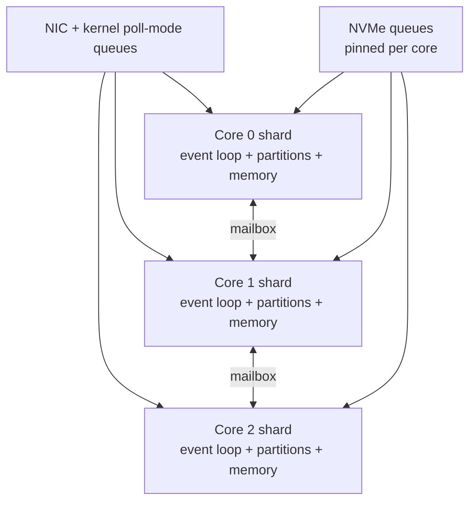

# Redpanda and Thread-per-Core: a Kafka-API Engine Without the JVM

## Overview

Redpanda is a C++ reimplementation of the Kafka engine that speaks the Kafka wire protocol but replaces everything underneath: a thread-per-core (Seastar) scheduler instead of JVM thread pools, Raft instead of ISR-with-ZooKeeper/KRaft-metadata, and per-core memory ownership instead of a shared heap. It is the cleanest available case study in what happens when you keep a protocol and change the execution model — which is why it shows up in interviews as "how would you redesign Kafka today?" This page covers the shard-per-core architecture, the Raft-native metadata design and its KIP-500 cousin, the GC-absence argument with honest caveats, tiered storage, and how to read Redpanda's benchmark claims responsibly. The baseline engine it reimplements is dissected in [Kafka log internals](kafka-log-internals.md).

## Kafka Compatibility: Protocol Yes, Engine No

Redpanda's load-bearing design decision is **protocol-level compatibility**: clients (librdkafka, franz-go, Java clients), Connect, Streams, Flink, and Schema Registry all work unchanged because the binary protocol and semantics — produce/fetch, consumer groups, transactions — are reimplemented, not proxied. What is deliberately *not* reused:

| Layer | Kafka | Redpanda |
|---|---|---|
| Language/runtime | Java, JVM thread pools, OS page cache | C++20, Seastar, explicit memory control |
| Scheduling | Network + request handler threads, shared queues | One shard (event loop) per core, polling |
| Replication | ISR + high watermark + leader epoch | **Raft per partition** (leader election + committed index) |
| Metadata | KRaft (Raft metadata quorum, KIP-500) | Embedded Raft controller group (same idea, from day one) |
| Transactions | Broker transaction coordinator + `__transaction_state` | Reimplemented broker-side, protocol-compatible |
| Tiered storage | KIP-405 remote segments (3.6+) | Cloud-storage upload/download with local retention knobs |

The compatibility line is also the risk line: any place where Kafka's *implementation* leaks semantics (exact `min.insync.replicas` behavior under ISR shrink, offset metadata, group coordinator error codes) must be matched bug-for-bug, and mismatch cases are where migrations break.

## Thread-per-Core: The Seastar Execution Model

Seastar (built for ScyllaDB by the same lineage) assigns every core one **shard**: a single-threaded, polling event loop that owns its partitions, its memory, and its I/O queues. There are no locks between shards because no data is shared; cross-shard communication is explicit message passing over DMA-friendly queues.

Four properties do the work:

1. **Shard-partition affinity.** Each partition-replica belongs to one shard; its produce/fetch traffic is handled entirely by that core, so per-partition throughput scales linearly with cores and a hot partition cannot serialize behind an unrelated one.
2. **No cross-core locks, no shared heap.** Data lives in shard-owned memory; the lock-free property removes both contention stalls and the CPU cache-coherence traffic that dominates JVM brokers at high concurrency.
3. **Polling instead of interrupt-driven work.** Shards busy-poll their NIC and disk queues (the SPDK/DPDK-style stance documented in [Fast I/O](../../os/advanced/fast-io.md)), trading idle-CPU efficiency for a bounded, scheduler-independent request latency.
4. **NUMA awareness.** Cores pin to their NUMA node's memory and local NVMe queues, avoiding cross-socket traffic — a latency source that JVM brokers historically left to the OS scheduler (see [NUMA](../../os/memory/numa.md)).

The model's cost is Rust-like discipline in C++: blocking a shard blocks every partition on it, so blocking syscalls, long CPU work, and unbounded queues are architectural enemies. Where Kafka's request handler threads can degrade gracefully under overload, a Redpanda shard must shed or queue within its loop's budget.

## No ZooKeeper: Raft-Native Metadata

Redpanda never had ZooKeeper. Every partition is a **Raft group** over its replicas (append + committed index replace ISR bookkeeping), and cluster metadata lives in an embedded controller Raft group — structurally the same end-state as Kafka's KRaft (KIP-500) minus the migration decade:

| Aspect | Kafka ISR (classic) | Kafka KRaft (KIP-500) | Redpanda |
|---|---|---|---|
| Partition replication | Leader + followers, ISR set, HW | Unchanged for data path | Raft log per partition, committed index |
| Metadata store | ZooKeeper → KRaft quorum | Raft metadata quorum in Kafka itself | Raft controller group in the same binary |
| Controller failover | ZK session expiry (seconds) | Raft election | Raft election |
| Consistency reasoning | Custom (HW + leader epochs) | Custom (HW + leader epochs) | Standard Raft proofs (see [Raft](../consensus/raft.md)) |

The substantive claim is not "Raft is newer" but **provable correctness reuse**: partition replication inherits Raft's log-matching and election-safety properties, so the unclean-leader-election and zombie-tail arguments ([log internals](kafka-log-internals.md)) reduce to known Raft behavior rather than to a bespoke ISR state machine. Kafka's KRaft moved only metadata to Raft — the data path is still ISR + watermark — so the two systems differ in how much of the correctness argument they delegate to a published algorithm.

## C++ vs JVM: the GC Argument and Its Limits

Redpanda's marketing claim — no GC pauses, hence better tail latency — has a real mechanism behind it: there is no stop-the-world collector, and memory is bounded per shard by explicit allocation rather than by heap sizing. But the honest comparison is narrower than the claim:

- **Modern JVMs narrowed the gap.** Kafka on G1/Java 11 was demonstrably pause-prone at large heaps; Kafka on Java 17+ with ZGC/Shenandoah holds p99.9 pauses in the single-digit milliseconds on the same hardware. The GC argument is strongest against *deployed fleets of older JVM brokers*, not against current Kafka.
- **JIT is a two-sided coin.** Hot-path JIT compilation gives Kafka near-C throughput after warmup; Redpanda pays compile-time optimization for deterministic first-request latency and no JIT deopts.
- **Where C++ genuinely wins:** deterministic memory footprint (no heap sizing/compaction), poll-mode I/O with no interrupt jitter, and NUMA placement without GC-heap locality surprises. These are scheduling and memory *layout* wins, not language-magic wins.

## Tiered Storage

Redpanda ships built-in tiered storage: segment data is uploaded to cloud object storage (S3/GCS/Azure) while the local broker retains a configurable prefix, and retention can be set independently on the local and cloud copies. Reads of cold data are served transparently from object storage through a local cache. Two differences from Kafka's KIP-405 matter in comparison answers: Redpanda's tiering is a first-release-native feature (no per-topic opt-in dance across versions), and because every partition is already a Raft group, **read replica clusters** — read-only regional copies hydrated from cloud storage — fall out of the same object-storage substrate. Both designs share the core limitation discussed in [BookKeeper internals](bookkeeper-internals.md): the cold tier is read-only; only Pulsar-style quorum storage keeps the decoupled tier writable.

## Benchmarks: Reading the Claims Honestly

Redpanda's published numbers (e.g., up to ~6× fewer machines than Kafka for equivalent throughput in vendor-run OpenMessagingBenchmark setups) rest on specific configurations. A responsible evaluation checklist:

| Claim ingredient | What to check |
|---|---|
| Durability settings | Redpanda historically benchmarked with `fsync=false`-style defaults; compare against Kafka `acks=all` + `min.insync.replicas=2` on equal footing |
| Client library | `franz-go` (Go) vs Kafka's Java client — client overhead is often the measured "broker" difference |
| Workload shape | 1 KiB records, many partitions, steady produce — not your bursty, multi-tenant, skewed-key traffic |
| Hardware | Bare metal with local NVMe flatters poll-mode I/O; cloud instances with virtualized NICs narrow the gap |
| Maturity surface | Kafka Connect breadth, Streams, k8s tooling, monitoring integrations, hiring pool — the "throughput per dollar" that benchmarks omit |
| License | Redpanda is source-available (Redpanda Community License), not OSI-open; check which features (e.g., tiered storage tiers, console) are community vs enterprise |

The defensible interview position: Redpanda is a credible engine with a better *architectural* tail-latency story and simpler single-binary operations; Kafka remains the ecosystem and maturity default; and any decision should be settled with your own workload benchmark, not vendor numbers.

## Shard Placement and Partition Balancing

Partition-to-shard placement is an internal scheduling problem Kafka never has (its OS scheduler spreads request-handler threads automatically). Redpanda balances replicas across shards and NUMA nodes at creation and on topology change, with constraints in priority order: keep replicas of one partition on distinct nodes, spread partitions evenly across shards within a node, prefer shard-local NVMe queues. Adding a node triggers rebalancing of *replica leadership* (metadata-light) and, where needed, *replica data* (Raft log transfer), which is the same class of byte-copying operation as Kafka reassignment — thread-per-core removes per-request lock contention but cannot remove physics.

## The Storage Layer

Redpanda's on-disk layout mirrors the Kafka contract ([segment files, sparse indexes, offsets](kafka-log-internals.md)) because clients depend on offsets, but the implementation differs in three ways worth citing:

1. **Raft log identity.** The partition log *is* the Raft log: committed index replaces the high-watermark file, and truncation repair falls out of Raft's log matching rather than leader-epoch checkpoints.
2. **Direct I/O and preallocation.** Seastar's storage stack writes with per-shard queues, avoiding the JVM's randomized page-cache access patterns; segment preallocation bounds metadata churn.
3. **Memory-mapped metadata.** Indexes and Raft metadata ride mmap'd structures managed per shard, keeping the no-shared-heap invariant intact.

Clients cannot see any of this — which is the point: the compatibility boundary is exactly the protocol, so the storage design is free to diverge.

## Transactions and Idempotence Internals

Redpanda implements the Kafka transactional protocol: `transactional.id` registration, producer epochs fencing zombies, control records in partition logs, and a coordinator equivalent for transaction state. The internals differ from Kafka's `__transaction_state` topic: Redpanda keeps transaction metadata in its Raft-replicated internal KV, so the coordinator is not a topic-consuming state machine but a raft-replicated service — one fewer compacted internal topic, with the same wire-level behavior. For interview purposes the semantics match [exactly-once semantics](exactly-once-semantics.md): idempotent produce per partition, transactional atomicity across partitions + offsets, `read_committed` gating.

## Operations: Knobs and Topology

| Concern | Redpanda | Kafka contrast |
|---|---|---|
| Process model | One static binary; `--smp`, `--memory`, `--overprovisioned` Seastar flags | JVM heap + GC flags + broker config surface |
| Memory | Explicit reservation; no heap sizing | Heap vs page-cache balance is a tuning art |
| Kubernetes | Operator; supports Seastar's CPU pinning | Operator (Strimzi etc.); JVM tuning on K8s is fiddly |
| Busy polling | Burns full CPU per core even when idle — visible in cloud bills | JVM brokers idle cheap |
| Upgrades | Raft quorum roll, single binary | KRaft quorum roll + JVM compat matrix |

The busy-polling row is the most under-discussed trade: polling is *why* Redpanda's latency is scheduler-independent, but an idle Redpanda cluster consumes the CPU it reserved, which changes cost math in shared or bursty environments — Seastar's `--idle-poll`/reactor stalls and the `--overprovisioned` flag exist precisely to relax this when co-tenancy demands it.

## When Thread-per-Core Hurts

Honest architecture answers include the failure cases:

- **One hot partition pins one shard.** Parallelism is per-partition-per-shard; a single 100 MB/s partition cannot borrow its neighbors' idle cores (Kafka's thread pools would spread it across threads). Partition count must be sized so shards have work.
- **Blocking anywhere is catastrophic.** A shard that blocks (sync syscall, slow disk stall without async path) stalls all its partitions; every I/O must be Seastar-async. This discipline is the price of lock-freedom.
- **Virtualized/overcommitted environments fight polling.** Under CPU steal, a busy-polling shard loses time slices unpredictably, and latency determinism degrades — the assumption "a core is really mine" only holds on dedicated hardware.
- **C++ operational skills are scarcer than JVM skills.** Core dumps, perf, and allocator tuning on Seastar are specialist work; Kafka's ops talent pool is a real ecosystem advantage.

## A Produce Request's Journey

Tracing one produce end to end shows where the architectural pieces engage:

1. **NIC interrupt mode or poll mode** hands the request bytes to the owning shard's network stack — the shard is chosen by connection affinity, so a client's TCP connection lands on one core for its lifetime.
2. The **shard's event loop** parses the Kafka produce request (protocol state machine, no thread hand-off), checks the partition's leadership: if this shard hosts the leader replica, the batch enters that replica's Raft group append path.
3. **Raft replication:** the leader appends to its log segment, sends AppendEntries to follower replicas (each hosted on some shard of other nodes), and waits for a majority — the committed index advances when quorum acks land, standing in for Kafka's ISR+HW bookkeeping.
4. The **response** is written back on the same shard without cross-core hops; a fetch request for a follower-hosted partition would be redirected per Kafka metadata semantics.

Every step is single-threaded per shard: no request queues shared across cores, no locks around per-partition state, no context switches in the hot path. The same trace on Kafka crosses network-thread → request-queue → handler-thread → replicated-log lock per partition — the contention Redpanda is designed to remove, at the cost of pinning each partition's entire fate to one core.

## Sizing Shards: A Worked Example

Take a 32-core node with 2 NUMA sockets, targeting 500 partitions:

- **Shards per socket:** Seastar spawns 16 reactors per socket, each pinned to a core with memory from that socket's NUMA node — cross-socket traffic appears only in explicit shard messages (Raft follower appends landing on the other socket).
- **Partitions per shard:** 500 leader-or-follower replicas ÷ 32 shards ≈ 16 replicas per shard; a shard saturating at ~200 MB/s of combined segment write means per-replica budget ≈ 12 MB/s before the shard becomes the bottleneck.
- **The hot-partition check:** any single partition expected to exceed ~50–100 MB/s deserves its own shard budget analysis — its shard ceiling caps the partition, no matter how idle the other 31 cores are.

That last bullet is the sizing rule JVM deployments never think about, and the most common Redpanda production surprise after migrating Kafka workloads with a few very hot topics.

## Interview Questions

1. **What is thread-per-core, and why does it fit a log store?**
   Each core runs a single-threaded event loop (a shard) owning its partitions, memory, and I/O queues, with cross-shard communication by explicit message passing. A log store is dominated by per-partition sequential I/O and batching, which shard cleanly — one partition maps to one core, so there are no locks, minimal cache-coherence traffic, and per-partition throughput scales with cores. The cost is that a shard must never block: any blocking syscall or long computation stalls every partition assigned to that core.

2. **Redpanda claims no GC pauses. When is that claim overblown?**
   It is overblown when compared against Kafka on modern JVMs: Java 17+ with ZGC or Shenandoah holds sub-10 ms p99.9 pauses, which for a messaging broker is rarely the dominant tail term versus network and disk. The claim is legitimate against large deployed fleets of G1-tuned brokers and for deterministic worst-case behavior — there is no heap-sizing trap and no JIT deopt variance. The deeper wins are memory layout and poll-mode I/O, not the absence of a garbage collector per se.

3. **How does Redpanda's replication differ from Kafka's ISR model?**
   Each partition is a Raft group: the leader appends entries, followers replicate, and the committed index — not a high watermark — gates visibility, with log matching handling divergence. Kafka's ISR is a bespoke protocol: leader tracks follower lag, advances a high watermark, and uses leader epochs to bound truncation after unclean elections. Redpanda delegates correctness to a published algorithm (election safety, log matching), which simplifies reasoning; Kafka's design predates that choice and remains deliberately compatible with its decades of operational tooling.

4. **Why is wire-protocol compatibility both Redpanda's best feature and its biggest risk?**
   Compatibility means zero client migration — librdkafka, Java clients, Connect, Streams, and Flink work unchanged, which is the entire adoption story. The risk is that protocol semantics are entangled with implementation details: ISR-shrink behavior with `min.insync.replicas`, coordinator error codes, transaction fencing, and offset semantics all had to be matched precisely, and mismatches surface as production incidents in edge cases rather than in benchmarks. Compatibility also caps innovation: adopting a non-Kafka extension requires Kafka to expose the protocol hook first.

5. **How would you evaluate a Redpanda-vs-Kafka decision for a new platform?**
   Re-benchmark with your own workload, matching durability settings (`acks=all` + `min.insync.replicas=2` on both, with Redpanda's fsync posture made explicit) and your real record sizes and key skew. Score the non-throughput axes: operational surface (Redpanda: one binary, no JVM tuning; Kafka: KRaft, mature tooling), ecosystem dependencies (Connect plugins, Streams apps, Schema Registry integrations), licensing and support (source-available vs Apache 2.0), and team skills. Tail latency requirements below ~10 ms p99.9 are where Redpanda's architecture most plausibly wins.

6. **What does "Raft-native" buy that KRaft does not?**
   KRaft moved only cluster metadata into Raft; partition data replication still runs the ISR + high-watermark + leader-epoch machinery. Redpanda uses Raft for both layers, so failover, truncation, and durability arguments for the data path are inherited from Raft's proofs instead of re-derived — a meaningful simplification when you must reason about unclean leader election or cross-region replication. The price is giving up ISR's tuned operational behaviors (e.g., ISR shrink/expand telemetry and semantics) that years of Kafka tooling assume.

## Key Takeaways

- Redpanda keeps the Kafka wire protocol and replaces the engine: C++ + Seastar shards, Raft per partition, embedded Raft controller.
- Thread-per-core eliminates cross-core locks and GC by giving each core exclusive ownership of partitions, memory, and I/O queues — but shards must never block.
- "No GC pauses" is a real but narrowing advantage; modern JVM collectors cut Kafka's tail gap substantially.
- Raft-native replication delegates data-path correctness to a published algorithm, unlike Kafka's KRaft which Rafts only metadata.
- Tiered storage and read-replica clusters fall out of per-partition Raft groups plus object storage; the cold tier is read-only either way.
- Vendor benchmarks encode favorable settings — redo the measurement with your workload and durability config before deciding.

## References

- Redpanda documentation (architecture, tiered storage, Raft): [docs.redpanda.com](https://docs.redpanda.com/)
- Redpanda source: [github.com/redpanda-data/redpanda](https://github.com/redpanda-data/redpanda)
- Seastar framework: [seastar.io](https://seastar.io/), source: [github.com/scylladb/seastar](https://github.com/scylladb/seastar)
- Apache Kafka documentation (KRaft / protocol): [kafka.apache.org/documentation](https://kafka.apache.org/documentation/)
- Ongaro & Ousterhout — "In Search of an Understandable Consensus Algorithm (Raft)," USENIX ATC 2014, [raft.github.io/raft.pdf](https://raft.github.io/raft.pdf)
- KIP-500: Replace ZooKeeper with a Self-Managed Metadata Quorum — cite by number, Apache Kafka KIP archive

## Cross-References

- [Kafka Overview](../messaging/kafka.md) — the API surface Redpanda reimplements
- [Kafka Log Internals](kafka-log-internals.md) — the ISR/watermark engine Redpanda replaces with Raft
- [Exactly-Once Semantics](exactly-once-semantics.md) — protocol-level EOS behavior both must match
- [Raft](../consensus/raft.md) — the algorithm behind Redpanda's partition and controller groups
- [Fast I/O](../../os/advanced/fast-io.md) — poll-mode I/O, io_uring, and the kernel-bypass context
- [Kafka (Backend)](../../backend/messaging/kafka.md) — client-facing behavior the two share
