# Messaging Systems

## Overview

Messaging systems enable **asynchronous communication** between distributed components. Instead of direct calls (synchronous), components exchange messages through a middleware layer. This decouples producers from consumers, enabling scalability, reliability, and flexibility.

## Why Messaging?

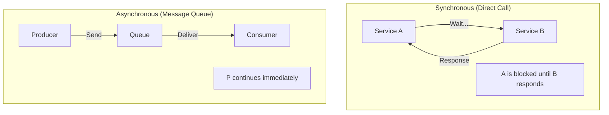

| Benefit | Description |
|---------|-------------|
| **Decoupling** | Producers and consumers are independent |
| **Scalability** | Add consumers to handle load |
| **Reliability** | Messages persist until processed |
| **Buffering** | Handle traffic spikes |
| **Fan-out** | One message to multiple consumers |

## Messaging Patterns

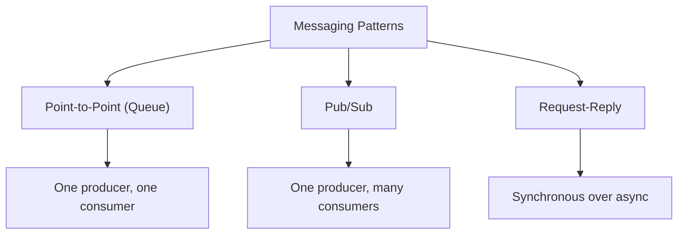

### Point-to-Point (Queue)

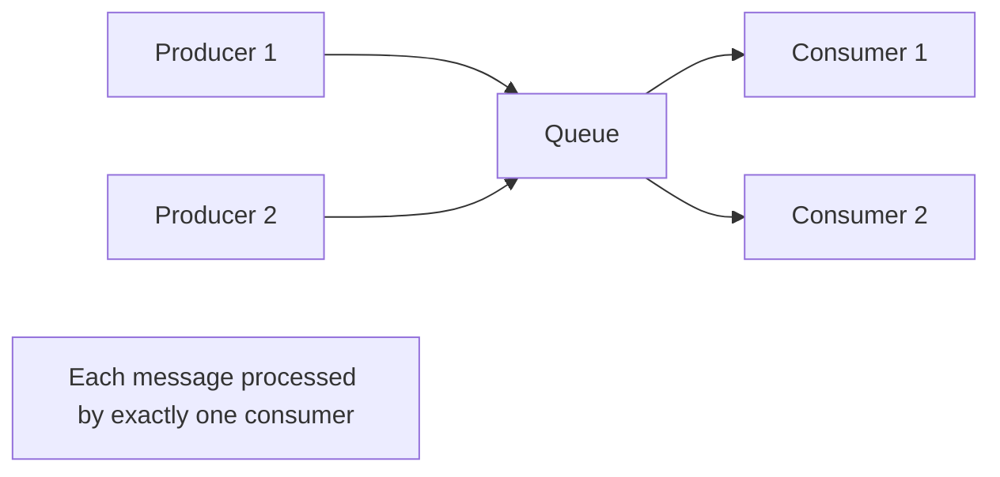

### Pub/Sub

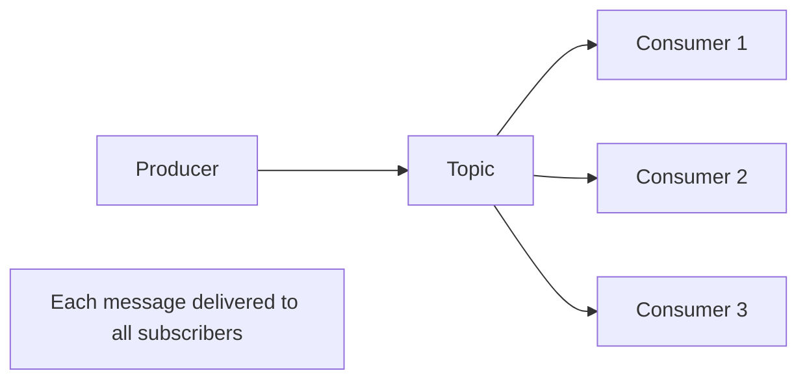

### Request-Reply

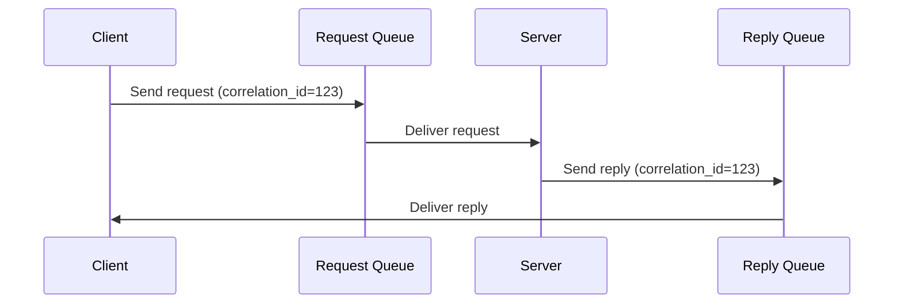

## Delivery Guarantees

### At-Most-Once

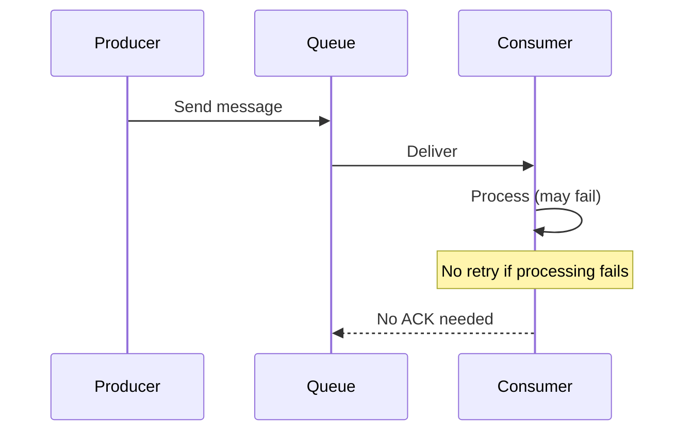

- Message may be lost if consumer crashes during processing
- Simplest to implement
- Use when: data loss is acceptable (telemetry, logs)

### At-Least-Once

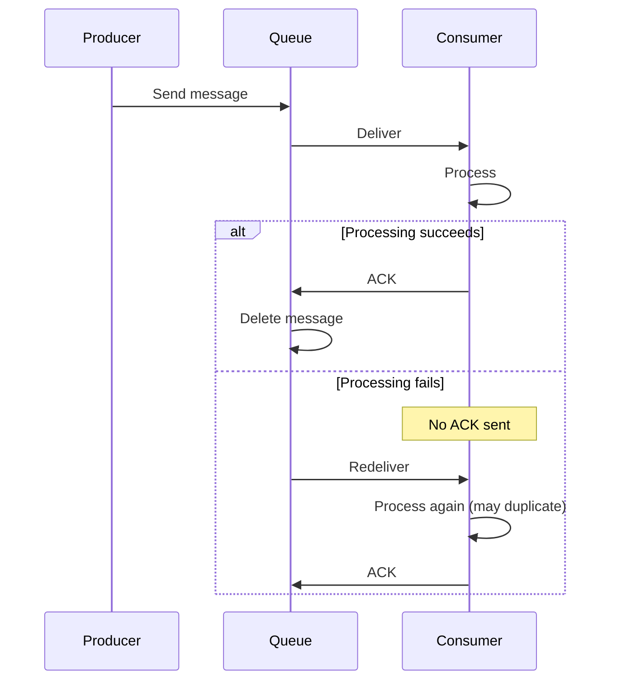

- Messages may be processed multiple times
- Consumer must be **idempotent**
- Use when: duplicates are tolerable or can be handled

### Exactly-Once

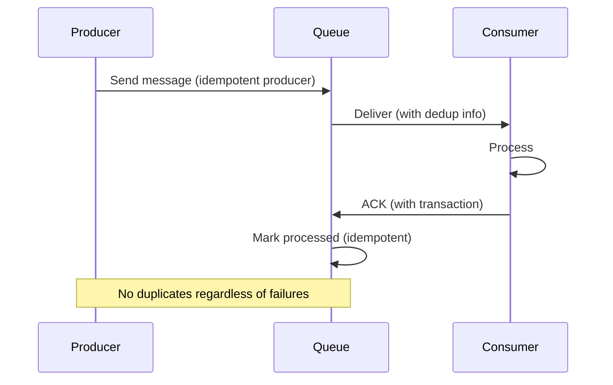

- Messages processed exactly once
- Hardest to implement
- Requires coordination between producer, queue, and consumer
- Use when: financial transactions, order processing

### Comparison

| Guarantee | Duplicates | Data Loss | Complexity | Use Case |
|-----------|-----------|-----------|------------|----------|
| **At-most-once** | No | Possible | Low | Telemetry |
| **At-least-once** | Possible | No | Medium | Logs, events |
| **Exactly-once** | No | No | High | Financial |

## Message Ordering

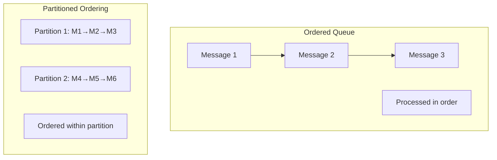

| Ordering | Description | Trade-off |
|----------|-------------|-----------|
| **Global** | All messages in order | Low throughput |
| **Partition** | Ordered within partition | High throughput |
| **None** | No ordering guarantee | Highest throughput |

## Dead Letter Queues

Messages that can't be processed are moved to a dead letter queue (DLQ):

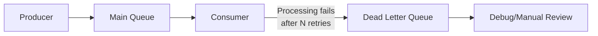

## Message Priority

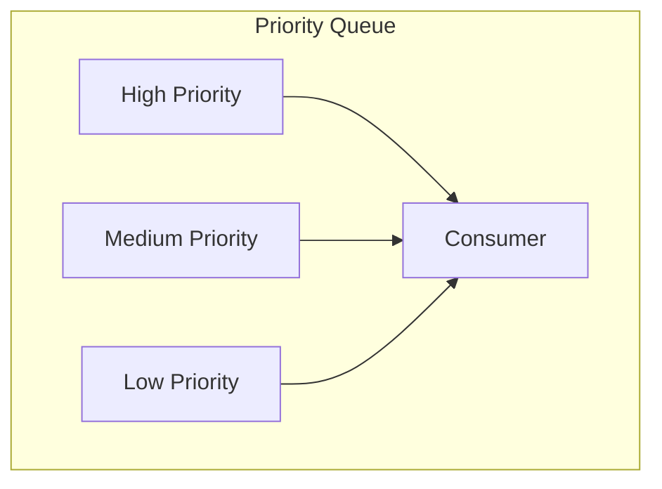

## Interview Questions

1. **What are the main messaging patterns?**
   - Point-to-point (queue): one consumer per message. Pub/sub: all subscribers get each message. Request-reply: synchronous communication over async messaging.

2. **Explain the delivery guarantees.**
   - At-most-once: fire-and-forget, may lose messages. At-least-once: retry until ACK, may duplicate. Exactly-once: processed exactly once (hardest, requires coordination).

3. **When would you use a message queue vs. direct API calls?**
   - Queue: when you need decoupling, buffering, async processing, or fan-out. Direct calls: when you need immediate response, simple request-reply.

4. **What is a dead letter queue?**
   - A queue for messages that can't be processed after multiple retries. Used for debugging, manual review, or reprocessing.

5. **How do you handle message ordering?**
   - Global ordering: single partition (limited throughput). Partition ordering: messages with same key go to same partition (good balance). No ordering: highest throughput.

6. **What is idempotency and why is it important for messaging?**
   - An operation is idempotent if applying it multiple times has the same effect as once. Important because at-least-once delivery may process messages multiple times.

## Common Mistakes

- Not handling **duplicate messages** — assume at-least-once delivery
- Ignoring **message ordering** requirements
- Not using **dead letter queues** — poison messages block the queue
- Making consumers **stateful** — makes scaling and recovery harder
- Not setting **message TTL** — queues grow unbounded
- Forgetting about **backpressure** — fast producers overwhelm slow consumers

## Summary

Messaging systems enable asynchronous, decoupled communication in distributed systems. The choice between queues and pub/sub depends on whether messages should be processed once or by many. Delivery guarantees (at-most-once, at-least-once, exactly-once) trade off between simplicity and reliability. Proper handling of ordering, dead letters, and idempotency is essential for robust systems.

## Cross-References

- [Message Queues](queues.md) — Queue implementations and reliability
- [Apache Kafka](kafka.md) — Distributed streaming platform
- [RabbitMQ](rabbitmq.md) — Traditional message broker
- [Pub/Sub Patterns](pubsub.md) — Publish-subscribe patterns
- [Stream Processing](../mapreduce/streaming.md) — Processing message streams
- [Circuit Breakers](../microservices/circuit-breakers.md) — Handling consumer failures
