# Apache Kafka

## Overview

Apache Kafka is a **distributed streaming platform** originally developed at LinkedIn in 2010. It functions as a distributed commit log, providing durable, high-throughput, fault-tolerant messaging. Kafka is used for real-time data pipelines, event sourcing, log aggregation, and stream processing. It's the backbone of many modern data architectures.

## Architecture

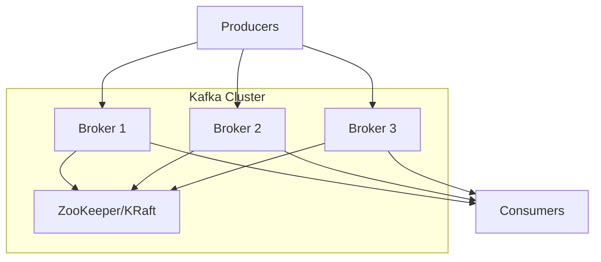

## Core Concepts

### Topics and Partitions

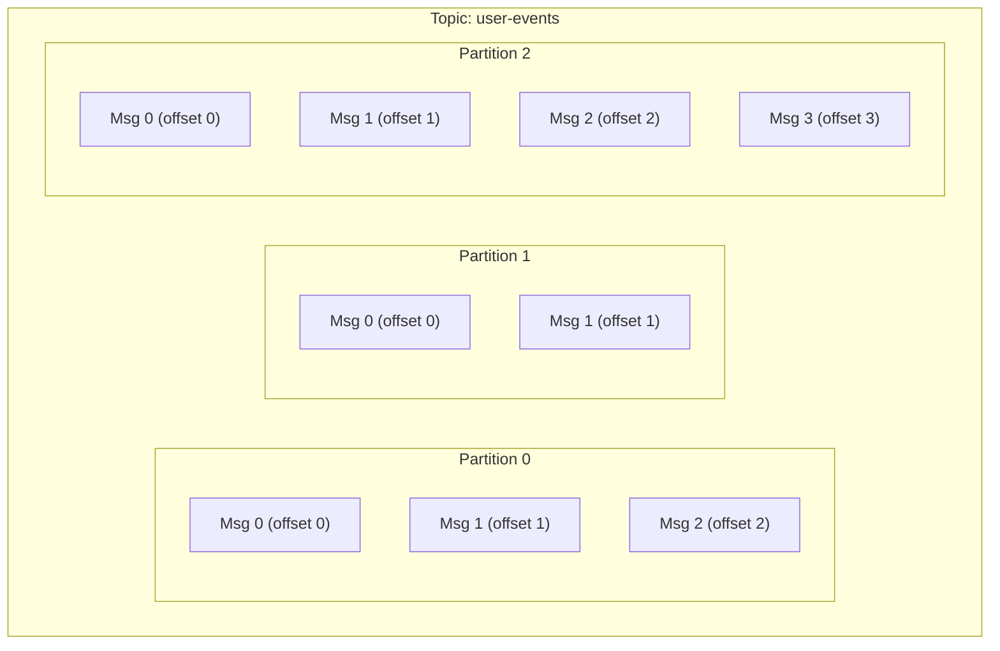

| Concept | Description |
|---------|-------------|
| **Topic** | Named stream of records (like a table) |
| **Partition** | Ordered, immutable sequence of records |
| **Offset** | Unique ID for each record within a partition |
| **Broker** | Server that stores partitions |
| **Replica** | Copy of a partition for fault tolerance |
| **Leader** | Replica that handles reads/writes |
| **Follower** | Replica that replicates from leader |

### Partition Assignment

```python
# Key-based partitioning (same key → same partition)
partition = hash(key) % num_partitions

# No key → round-robin
partition = next_partition_round_robin()
```

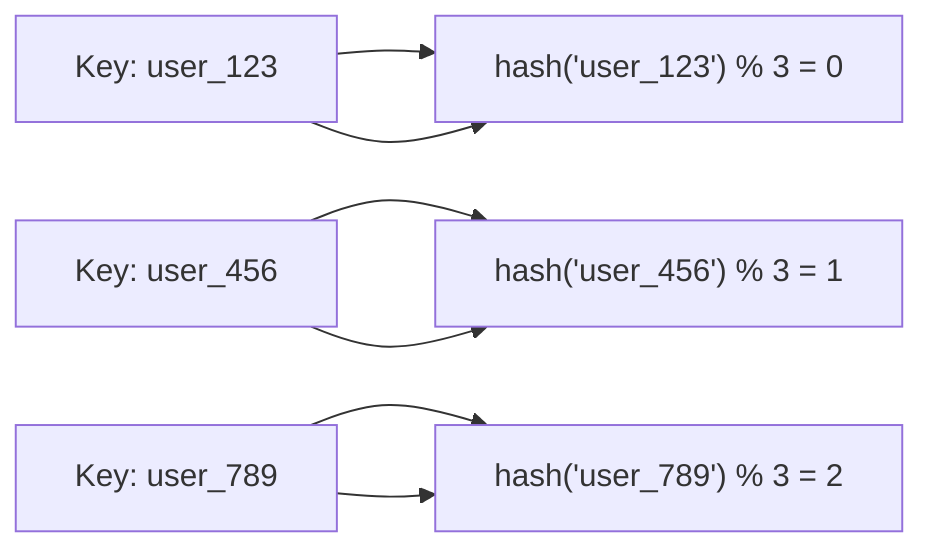

## Replication

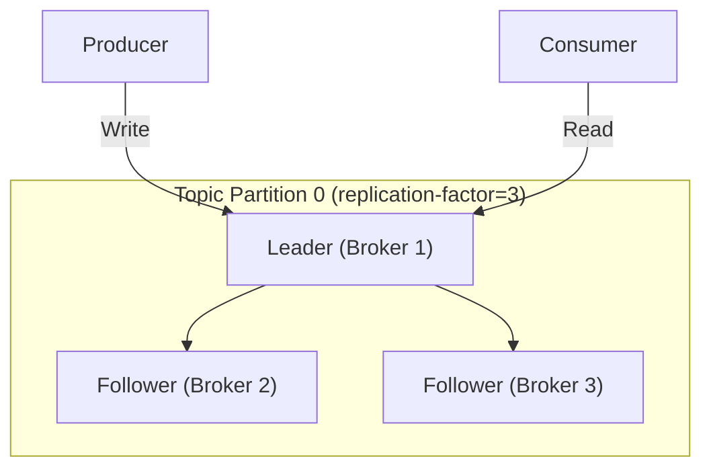

### In-Sync Replicas (ISR)

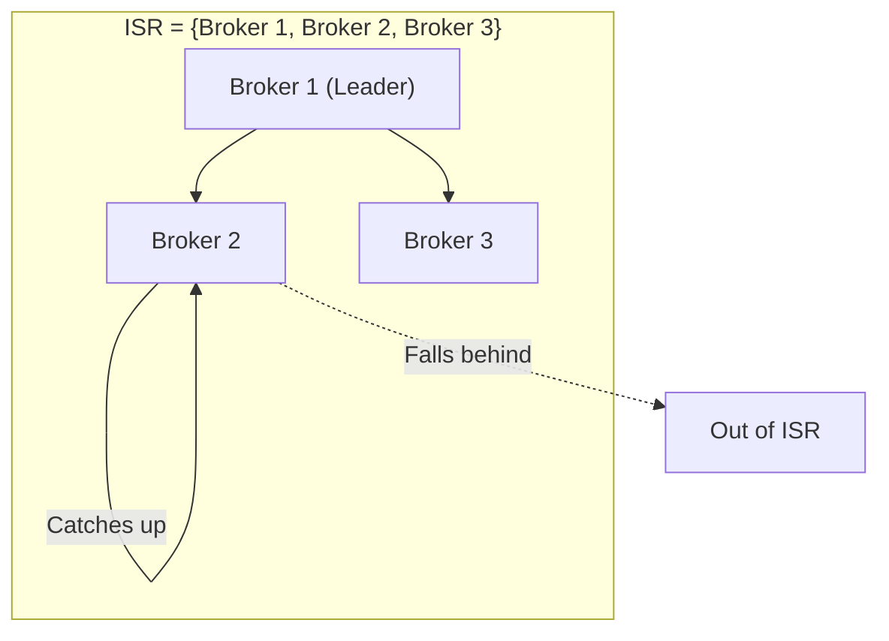

| Config | Description |
|--------|-------------|
| `replication.factor=3` | 3 copies of each partition |
| `min.insync.replicas=2` | At least 2 replicas must ACK |
| `acks=all` | Producer waits for all ISR to ACK |

## Producers

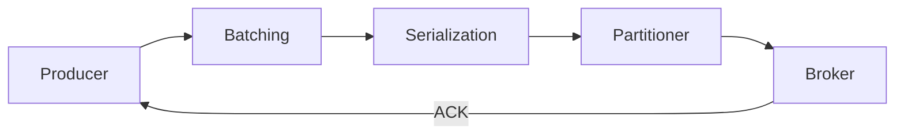

### Producer Configuration

```python
producer = KafkaProducer(
    bootstrap_servers=['broker1:9092', 'broker2:9092'],
    
    # Durability
    acks='all',                    # Wait for all ISR
    retries=3,                     # Retry on failure
    enable_idempotence=True,       # Exactly-once producer
    
    # Performance
    batch_size=16384,              # Batch size in bytes
    linger_ms=10,                  # Wait time for batching
    compression_type='lz4',        # Compression
    
    # Ordering
    max_in_flight_requests_per_connection=5  # With idempotence, order preserved
)
```

### Delivery Guarantees

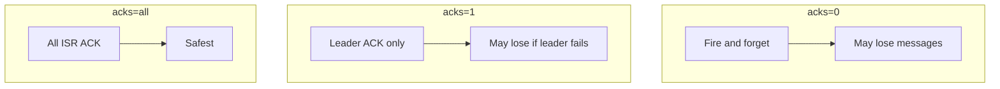

## Consumer Groups

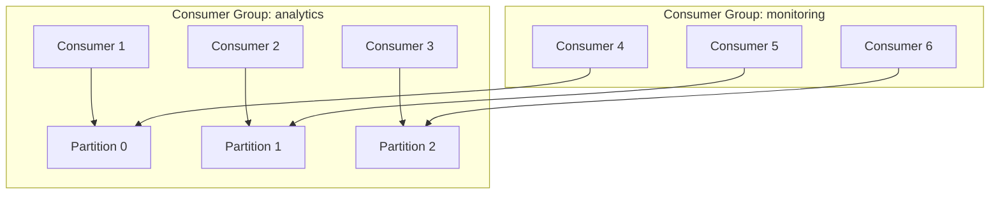

### Consumer Group Rules

1. Each partition is consumed by **exactly one consumer** in a group
2. A consumer can consume **multiple partitions**
3. If consumers > partitions, some consumers are idle
4. Multiple groups can consume the same topic independently

### Consumer Rebalancing

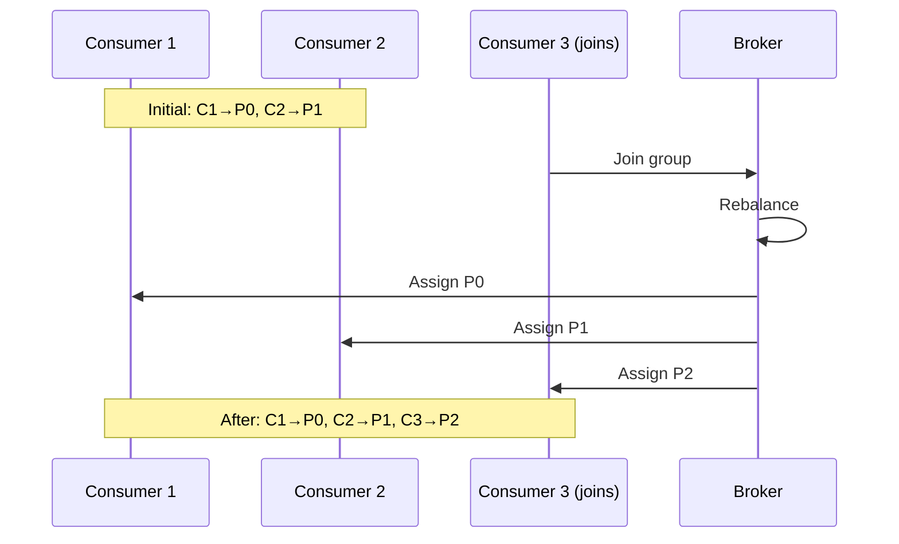

## Offset Management

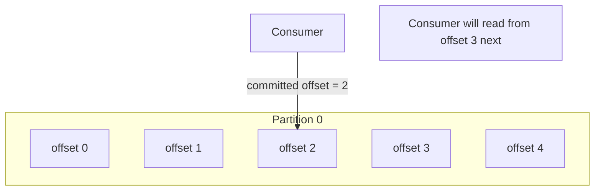

### Offset Commit Strategies

| Strategy | Description | Trade-off |
|----------|-------------|-----------|
| **Auto-commit** | Commit periodically | May lose/duplicate |
| **Manual commit** | Commit after processing | At-least-once |
| **Transactional** | Commit with processing | Exactly-once |

## Exactly-Once Semantics

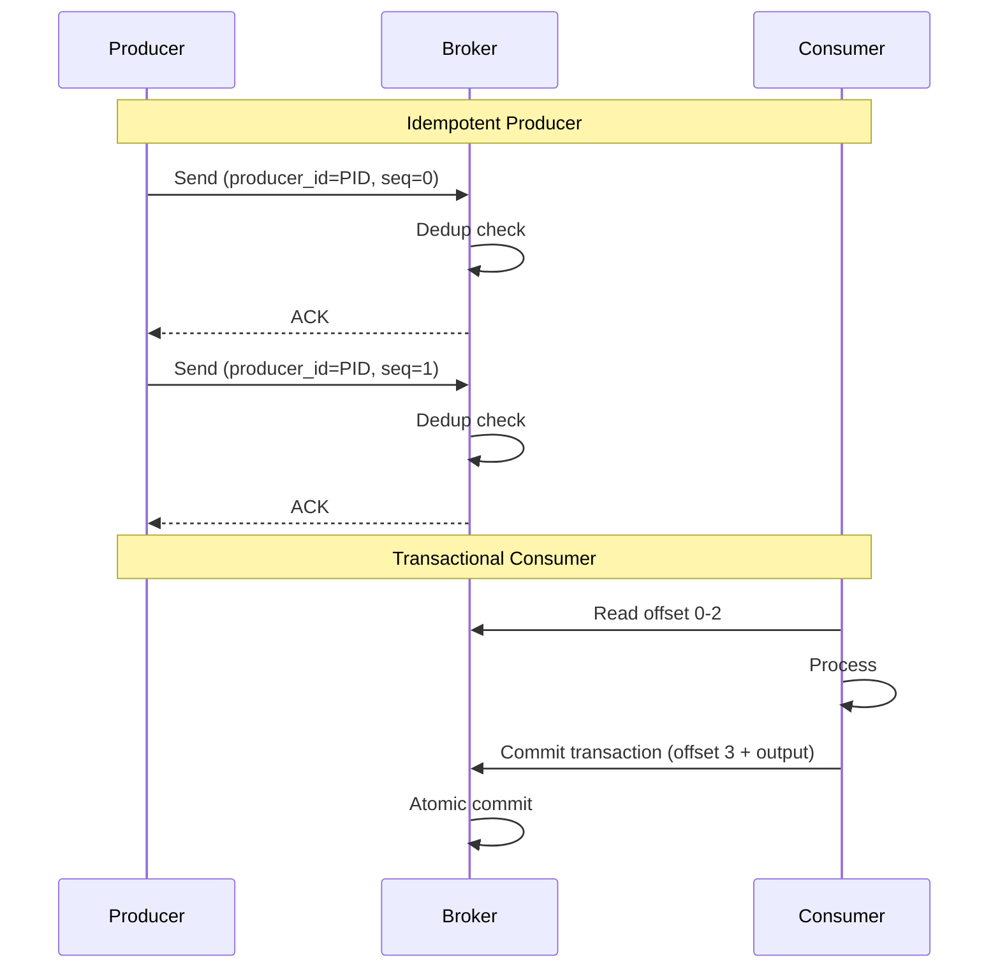

## Log Compaction

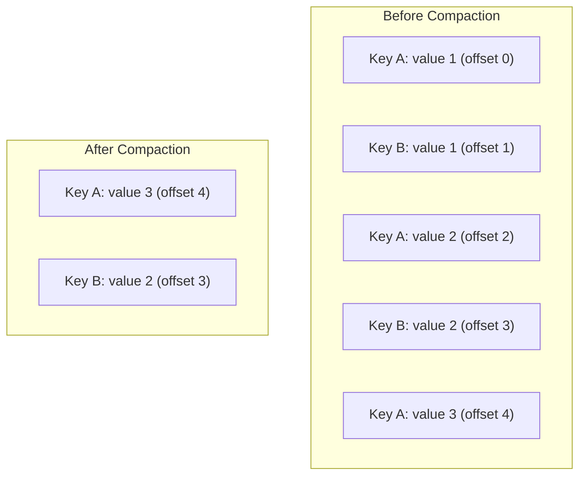

Log compaction retains only the **latest value for each key**, useful for changelogs and event sourcing.

## Kafka Architecture Deep Dive

### Broker and Cluster

A Kafka cluster consists of one or more **brokers** (servers). Each broker stores a subset of partitions:

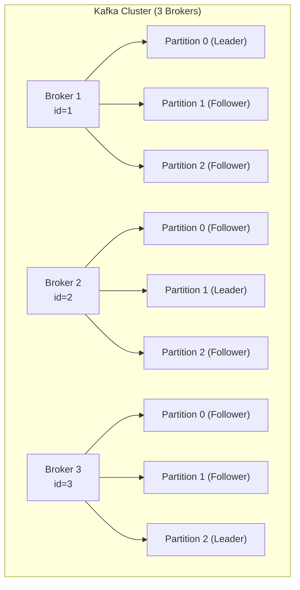

### KRaft (Replacing ZooKeeper)

Kafka 3.3+ uses **KRaft** (Kafka Raft) to replace ZooKeeper for metadata management:

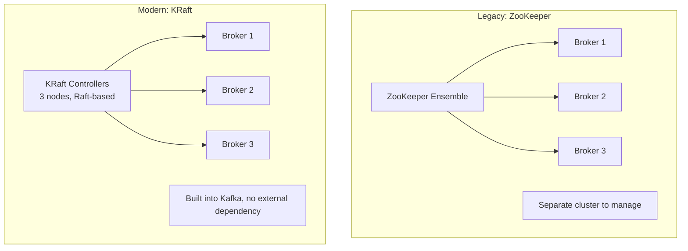

| Aspect | ZooKeeper | KRaft |
|--------|-----------|-------|
| Metadata storage | External ZK cluster | Internal Raft quorum |
| Scalability | Limited (~200K partitions) | Millions of partitions |
| Startup time | Minutes (ZK sync) | Seconds |
| Operations | Two systems to manage | One system |
| Status | Deprecated (3.5+) | Default since Kafka 3.3+ |

### Kafka Storage Internals

Each partition is a **directory** containing segment files:

```
topic-partition-0/
  00000000000000000000.log    # Segment 1 (messages 0-999)
  00000000000000000000.index  # Offset to file position
  00000000000000000000.timeindex  # Timestamp to offset
  000000000000000001000.log   # Segment 2 (messages 1000-1999)
  000000000000000001000.index
```

**Write path**: Messages are appended to the active segment. Sequential writes are very fast (OS page cache, zero-copy transfer).

**Read path**: Consumers read from a specific offset. Kafka uses the index to jump to the right position in the log file.

## Kafka vs. Traditional Message Queues

| Aspect | Kafka | RabbitMQ/ActiveMQ |
|--------|-------|--------------------|
| **Model** | Distributed log | Message broker |
| **Retention** | Time/key-based | Until consumed |
| **Replay** | Yes (from offset) | No |
| **Ordering** | Per-partition | Per-queue |
| **Throughput** | Very high (millions/sec) | Moderate |
| **Use case** | Event streaming, data pipelines | Task queues, RPC |
| **Protocol** | Kafka binary protocol | AMQP, MQTT, STOMP |
| **Message priority** | No (FIFO per partition) | Yes |
| **Routing** | Topic + partition key | Exchanges, bindings, routing keys |

### When to Use Kafka vs RabbitMQ

- **Kafka**: Event streaming, log aggregation, data pipelines, event sourcing, high throughput
- **RabbitMQ**: Task queues, request/reply RPC, message routing, priority queues, low latency

## Interview Questions

1. **What is Kafka and how does it differ from traditional message queues?**
   - Kafka is a distributed commit log. Unlike traditional queues, messages are retained (not deleted after consumption), consumers can replay messages, and it provides per-partition ordering with very high throughput.

2. **Explain Kafka topics, partitions, and offsets.**
   - Topic: named stream of records. Partition: ordered, immutable sequence within a topic. Offset: unique position of each record within a partition. Partitions enable parallelism and ordering per key.

3. **What is a consumer group?**
   - A group of consumers that cooperatively consume a topic. Each partition is assigned to exactly one consumer in the group. Multiple groups can independently consume the same topic.

4. **How does Kafka achieve durability?**
   - Messages are persisted to disk and replicated across brokers. The replication factor determines how many copies exist. ISR (in-sync replicas) must acknowledge writes for durability.

5. **What is the ISR in Kafka?**
   - In-Sync Replicas: the set of replicas that are fully caught up with the leader. `min.insync.replicas` configures how many must be in sync. If a replica falls behind, it's removed from ISR.

6. **How does Kafka handle consumer rebalancing?**
   - When consumers join/leave a group, the broker triggers a rebalance. Partitions are redistributed among consumers. During rebalance, consumption pauses briefly.

## Common Mistakes

- Setting `acks=1` when durability matters — leader failure can lose messages
- Not configuring `min.insync.replicas` — single broker failure can lose data
- Too few partitions — limits consumer parallelism
- Not handling consumer rebalancing — can cause duplicate processing
- Ignoring consumer lag — consumers fall behind producers
- Using Kafka as a task queue — it's designed for streaming, not work distribution

## Summary

Kafka is a distributed streaming platform that provides durable, high-throughput, fault-tolerant messaging. Topics are divided into partitions for parallelism, and consumer groups enable scalable consumption. Key design choices include replication factor, ISR configuration, and acknowledgment settings. Kafka excels at event streaming, log aggregation, and data pipelines.

## Cross-References

- [Messaging Overview](README.md) — Messaging concepts
- [Message Queues](queues.md) — General queue patterns
- [RabbitMQ](rabbitmq.md) — Traditional message broker
- [Pub/Sub](pubsub.md) — Publish-subscribe patterns
- [Stream Processing](../mapreduce/streaming.md) — Kafka Streams
- [Consistent Hashing](../partitioning/consistent-hashing.md) — Partition assignment
