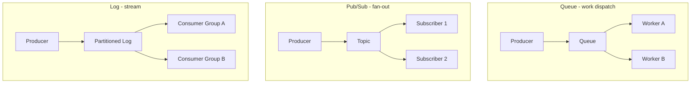
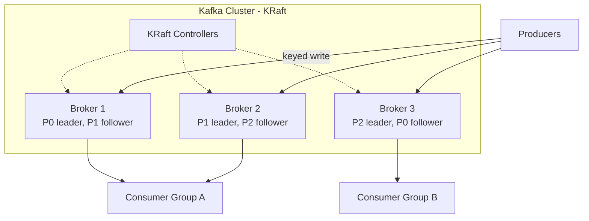
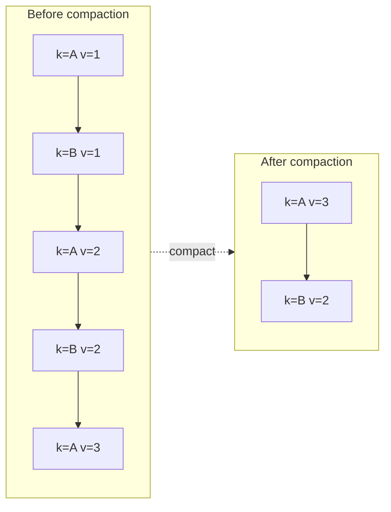
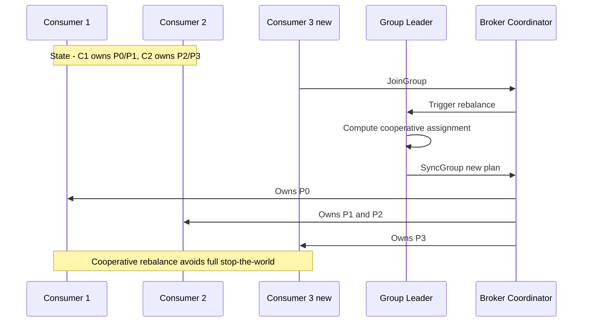
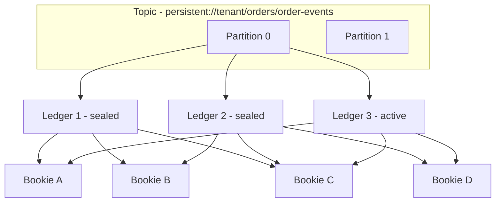
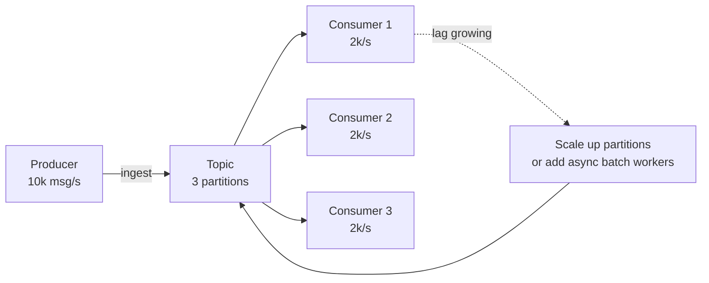
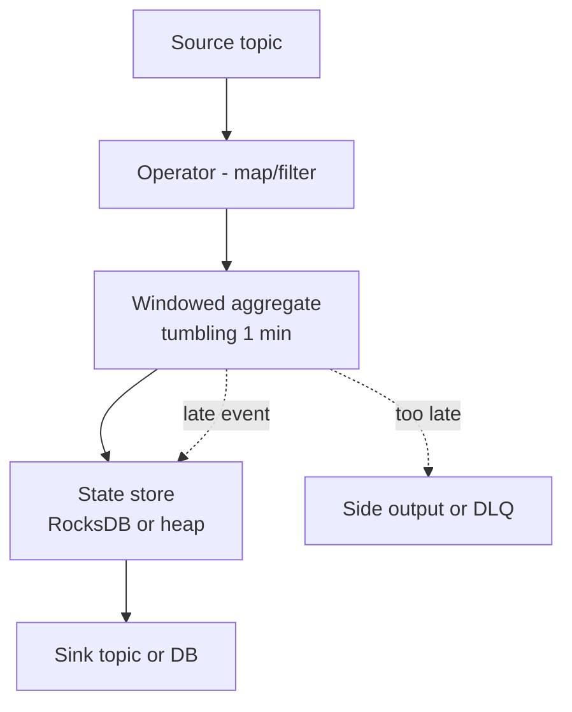
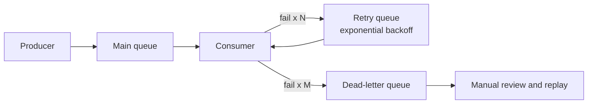

# Messaging / Streaming

> Integrator page for **§20 Messaging / Streaming** of [index.md](../../index.md). It unifies the queue, pub/sub, and distributed-log mental models and cross-references the per-broker deep dives: [Kafka](kafka.md), [Pulsar](pulsar.md), [RabbitMQ](rabbitmq.md), [Pub/Sub](pubsub.md), [Message Queues](queues.md), and [NATS](../../backend/messaging/nats.md).

## Overview

Messaging and streaming systems are the **nervous system** of a distributed architecture. They decouple producers from consumers, buffer bursts, and turn ephemeral RPCs into replayable, durable event streams. The same primitive — *an append-only log with subscribers* — powers log aggregation, event sourcing, stream processing, CDC pipelines, and microservice choreography.

Kleppmann (*Designing Data-Intensive Applications*, Ch. 11) argues that the **log** is the unifying abstraction: a queue is a log with single-consumer delivery, pub/sub is a log with independent cursors per subscriber, and streaming is a log consumed in real time with windowed computation.

## Three Mental Models

| Model | Delivery | Retention | Replay | Ordering | Typical Use |
|-------|----------|-----------|--------|----------|-------------|
| **Message queue** | One consumer per message | Until ACKed | No | Per-queue FIFO | Task dispatch, work distribution |
| **Pub/Sub** | All subscribers | Until delivered | No | Per-topic | Event broadcast, fan-out |
| **Distributed log** | Consumer-group offsets | Time / key-based | Yes (offset) | Per-partition | Event streaming, CDC, audit |

A traditional broker like RabbitMQ exposes the first two; Kafka, Pulsar, Kinesis, and NATS JetStream expose the third (with the first two emulated on top).

## The Distributed Log Abstraction

A distributed log is an **ordered, append-only, replicated sequence of records** partitioned for parallelism. Each record has a monotonically increasing **offset** (Kafka), **sequence ID** (Pulsar, NATS JetStream), or **sequence number** (Kinesis). Consumers store a **cursor** indicating how far they have read, enabling:

- **Replay** — reset the cursor to reprocess history.
- **Multiple independent reads** — each consumer group has its own cursor.
- **Backfill** — new consumers read from the beginning without affecting existing ones.

Retention is decoupled from consumption: data lives for hours to forever (log compaction, tiered storage), so consumers can join late or fall behind and catch up. The throughput of a partition is \\( T_p \\) messages/sec, so a topic with \\( P \\) partitions has aggregate throughput \\( T = P \cdot T_p \\) — the fundamental reason partition count is the primary scalability dial.

## Kafka Internals

Kafka (*Kafka: The Definitive Guide*, Narkhede, Shapira & Palino) is the canonical distributed log. A **topic** is split into **partitions**; each partition is an ordered, replicated append-only log stored as segment files on broker disks.

| Concept | Description |
|---------|-------------|
| **Topic** | Named, partitioned stream (`orders`, `clicks`) |
| **Partition** | Ordered, immutable log; unit of parallelism |
| **Offset** | Monotonic per-partition position of a record |
| **Segment** | On-disk file; active segment is appended to, old ones are sealed |
| **ISR** | In-Sync Replicas — followers caught up to the leader's high-watermark |
| **Leader / Follower** | One replica serves reads/writes; others replicate |
| **Consumer group** | Set of consumers sharing a topic; one partition goes to one consumer |

### Replication and ISR

Writes are sent to the **leader**; followers pull. A replica stays in the **ISR** if it has fetched up to the leader's log-end offset within `replica.lag.time.max.ms`. With `acks=all` and `min.insync.replicas=2`, a write succeeds only when at least two ISR members acknowledge, guaranteeing durability against a single-broker failure. If a follower falls behind, it is dropped from the ISR; if it later catches up, it rejoins.

### Log Compaction

For changelog topics (e.g., a table's CDC stream), Kafka can **compact** the log: for each key, only the latest value is retained. This turns an unbounded event log into a keyed snapshot while preserving replay semantics.

See [kafka.md](kafka.md) for producer config, storage internals, and the KRaft migration.

## Consumer Groups and Rebalancing

A **consumer group** lets N consumers share a topic with P partitions: each partition is assigned to exactly one group member. If a consumer joins, leaves, or crashes, the group **rebalances**.

Rebalance protocols: **eager** (stop-the-world, revoke all then reassign), **sticky** (KIP-54, minimize movement), and **cooperative** (KIP-429, incremental, no full revoke). Long rebalances cause consumer lag; tune `session.timeout.ms` and `max.poll.interval.ms` to avoid spurious kicks during long batches.

## Pulsar: Segmented Log + BookKeeper

Pulsar (per the [Pulsar docs](https://pulsar.apache.org/docs/)) separates **compute** (stateless brokers) from **storage** (BookKeeper bookies). A partition is a sequence of **ledgers**; when the active ledger fills or the owning broker changes, a new ledger is opened. Ledgers are striped across bookies with quorum writes (`ensemble-size`, `write-quorum`, `ack-quorum`).

Because brokers are stateless, **broker failure causes no data loss and no storage rebalance** — clients reconnect to a new broker which reads the same ledgers from BookKeeper. Sealed ledgers can be offloaded to S3/GCS (tiered storage). See [pulsar.md](pulsar.md) for the four subscription types (exclusive, shared, failover, key_shared), geo-replication, and Pulsar Functions.

## NATS: Subject-Based Pub/Sub + JetStream

NATS (per the [NATS docs](https://docs.nats.io/)) is a single-binary, sub-millisecond messaging system. **Core NATS** is fire-and-forget: messages are routed by **subject** with dot hierarchy (`orders.created.us`) and wildcards (`*` matches one token, `>` matches one-or-more tokens). **Queue groups** provide load balancing — subscribers in the same queue group share deliveries.

**JetStream** layers persistence: a **stream** stores messages durably (file or memory); **consumers** track ack state with **durable** cursors. JetStream supports at-least-once delivery with explicit ack, exactly-once via the dedup window + `Nats-Msg-Id`, and stream-to-stream replication via leaf nodes.

| Feature | Core NATS | JetStream |
|---------|-----------|-----------|
| Persistence | None | File / memory |
| Delivery | At-most-once | At-least-once (exactly-once via dedup) |
| Replay | No | Yes (by sequence or time) |
| Acknowledgment | No | Explicit, with redelivery |
| Use case | Real-time fan-out, RPC | Durable streaming, event sourcing |

See [NATS (backend)](../../backend/messaging/nats.md) for subject patterns and code samples.

## RabbitMQ: AMQP Broker

RabbitMQ (per the [RabbitMQ docs](https://www.rabbitmq.com/docs)) is a classic **broker**: producers publish to an **exchange**, which routes to **queues** via **bindings**. Messages are removed once ACKed. Per the AMQP 0-9-1 model:

| Exchange | Routing |
|----------|---------|
| **Direct** | Exact match on routing key |
| **Fanout** | All bound queues |
| **Topic** | Pattern match (`*` one word, `#` zero-or-more words) |
| **Headers** | Match on message headers (`x-match: all/any`) |

RabbitMQ shines for **rich routing**, **priority queues**, **dead-lettering**, and **request/reply RPC**. For high-throughput streaming or replay, prefer a log-based system. See [rabbitmq.md](rabbitmq.md).

## Amazon Kinesis

Kinesis (per the [Kinesis docs](https://docs.aws.amazon.com/kinesis/)) is AWS's managed log. A **stream** has **N shards**; each shard is an ordered log capped at 1 MiB/sec or 1,000 records/sec input. Records are keyed by **partition key** (hashed to a shard), retained 24h to 365 days, and addressed by **sequence number**.

| Variant | Purpose |
|---------|---------|
| **Kinesis Data Streams** | Raw log; consumers (KCL, Lambda, Flink) read shards |
| **Kinesis Data Firehose** | ETL-to-S3/Redshift/ES; no consumer code |
| **Kinesis Data Analytics** | Managed Flink SQL on streams |

Shard count is the throughput dial; resharding (split/merge) is manual or via on-demand mode. Consumers store position in a DynamoDB checkpoint table (KCL) or a Lambda iterator. See [kinesis.md](../../cloud/aws/kinesis.md).

## Broker Comparison

| Feature | Kafka | Pulsar | NATS JetStream | RabbitMQ | Kinesis |
|---------|-------|--------|----------------|----------|---------|
| **Model** | Distributed log | Layered log (broker + BookKeeper) | Subject pub/sub + log | AMQP broker | Sharded log |
| **Persistence** | Broker disk | BookKeeper ledgers | File / memory | Disk + memory | AWS-managed |
| **Throughput** | Millions/sec | Millions/sec | Millions/sec | ~100K/sec | 1 MiB/sec per shard |
| **Latency** | Low ms | 2-5 ms persistent | Sub-ms | Low ms | Low ms + AWS hop |
| **Ordering** | Per-partition | Per-partition | Per-subject | Per-queue | Per-shard |
| **Replay** | Yes (offset) | Yes (cursor) | Yes (seq) | Streams only (3.9+) | Yes (seq) |
| **Consumer groups** | Yes | Subscriptions (4 types) | Queue groups | Competing consumers | KCL lease table |
| **Exactly-once** | Transactions (EOS) | Transactions + dedup | Dedup + idempotent | No (at-least-once) | No (at-least-once) |
| **Multi-tenancy** | ACLs | Built-in (tenant/ns) | Accounts | vhosts | AWS account |
| **Geo-replication** | MirrorMaker 2 | Built-in | Leaf nodes | Federation | Cross-region |
| **Schema registry** | Confluent / Apicurio | Built-in | N/A | N/A | Glue Schema Registry |
| **Operation** | Self-host or Confluent | Self-host or StreamNative | Self-host or Synadia | Self-host | Managed |

## Delivery Semantics

| Guarantee | Duplicates | Loss | Complexity | Implementation |
|-----------|-----------|------|------------|----------------|
| **At-most-once** | No | Possible | Low | Fire-and-forget; no ack |
| **At-least-once** | Possible | No | Medium | Ack after processing; redeliver on failure |
| **Exactly-once** | No | No | High | Idempotent producer + atomic consume-produce |

> "Exactly-once" is **effectively-once** end-to-end: it means no duplicates *and* no loss across producer to broker to consumer to sink, achieved by making consumption idempotent or by making the consume-process-produce step atomic with side effects.

### Exactly-Once Approaches

| Approach | Where | How |
|----------|-------|-----|
| **Idempotent producer** | Kafka 0.11+ | PID + sequence number; broker dedups retries |
| **Transactions** | Kafka EOS, Pulsar 2.6+ | Atomic produce to N partitions + offset commit |
| **Two-phase commit** | XA, JMS XA | Coordinator writes prepared + commit log |
| **Transactional outbox** | App + DB | Write event + state in same DB tx; relay to broker |
| **Consumer-side dedup** | Any | Idempotent sink keyed by (producer, seq) |
| **Dedup window** | NATS JetStream, Kinesis | `Nats-Msg-Id` / partition key + seq; broker drops dup |

## Ordering and Partitioning

Ordering is **per-partition** (or per-shard, per-subject, per-queue). To guarantee per-entity ordering, route all of an entity's events to the same partition.

| Partitioning Strategy | Mechanism | Trade-off |
|-----------------------|-----------|-----------|
| **No key (round-robin)** | Cycle partitions | Even load; no ordering |
| **Key-based (hash)** | `hash(key) mod P` | Per-key order; hot keys skew load |
| **Sticky** | Hash + sticky to last partition | Co-locates related batches |
| **Custom partitioner** | App logic (geo, tenant) | Full control; brittle |
| **Entity-id + sub-key** | Hash entity, order by sub-key | Order per entity, scale per partition |

**Hot partitions**: a single high-volume key (e.g., a viral user) overwhelms one partition. Mitigations: sub-partition by adding a random suffix and coalescing on read, batch coalescing, or a higher-cardinality key.

| Ordering Level | Cost | When |
|---------------|------|------|
| Global | Single partition; no parallelism | Strict sequence (rare) |
| Per-partition | Parallel up to P consumers | Default for logs |
| Per-key | Same key to same partition | Entity updates |
| None | Max throughput | Telemetry, metrics |

## Consumer Groups, Parallelism and Lag

- **Parallelism = min(partitions, consumers-in-group).** Adding consumers beyond partition count yields idle members.
- **Consumer lag** = `log-end-offset - committed-offset`. Monitor per partition; skew means one slow consumer.
- **Backpressure** arises when producers outpace consumers; the queue grows (buffer) or rejects (lossy).

Mitigations: increase partitions, batch consumers, add concurrent workers per consumer, shed load via sampling, or auto-scale on lag.

### Partition Count Sizing

Partition count is the **hardest decision to reverse**: you can add partitions to a Kafka topic, but existing keys may remap to new partitions, breaking per-key ordering and any stateful consumer keyed by partition. Rule of thumb — size for the **2-year peak**: target per-partition ingress under ~25 MB/s (Kafka) or under 1 MB/s (Kinesis shard), and partitions ≥ expected max consumers in the largest group. Pulsar and NATS JetStream allow partition growth with less disruption because cursors are per-subscription, not per-partition-offset-coupled, but key routing still shifts.

## Stream Processing

A **stream processor** consumes a log, applies transformations, and writes to another log or sink. Three time concepts matter (Kleppmann, Ch. 11):

- **Event time** — when the event occurred (in the record payload).
- **Processing time** — when the processor sees it (wall clock).
- **Watermark** — a heuristic upper bound on how late events can arrive.

**Windowing** groups events for aggregation:

| Window | Description |
|--------|-------------|
| **Tumbling** | Fixed, non-overlapping (e.g., 1-min buckets) |
| **Sliding** | Fixed size, overlaps |
| **Session** | Gap-based; an idle period closes a session |

| Engine | Model | State | Exactly-once |
|--------|-------|-------|--------------|
| **Kafka Streams** | Library (in-app) | RocksDB changelog | Yes (transactions) |
| **Flink** | Cluster, event-time | RocksDB + checkpoints | Yes (Chandy-Lamport snapshots) |
| **Spark Streaming** | Micro-batch | RDD checkpoints | Yes (structured streaming) |

Kafka Streams is a library — no separate cluster; Flink offers the strongest event-time and watermark semantics; Spark Structured Streaming is micro-batch (latency in seconds). See [stream processing](../mapreduce/streaming.md) and [Spark](../mapreduce/spark.md).

## Schema Registry

Without a contract, producers and consumers drift on byte layout. A **schema registry** stores Avro / Protobuf / JSON-Schema versions; producers register before publish; consumers fetch by ID embedded in the message payload.

| Aspect | Detail |
|--------|--------|
| **Compatibility** | BACKWARD (new reader reads old), FORWARD (old reader reads new), FULL (both) |
| **Location** | Confluent for Kafka; built-in for Pulsar; Glue for Kinesis; N/A for RabbitMQ/NATS |
| **Evolution** | Add optional fields; never rename or remove without versioning |
| **Format** | Avro (schema + data separated), Protobuf (tagged), JSON Schema (verbose, debuggable) |

## Dead-Letter Queues and Poison Messages

A **DLQ** captures messages that failed processing after N retries, preventing an infinite redelivery loop (a "poison message").

Kafka has no built-in DLQ; apps write to a `*.DLT` topic (often via the Streams `ProductionExceptionHandler`). RabbitMQ has `x-dead-letter-exchange`. SQS has `RedrivePolicy`. Pulsar supports `deadLetterPolicy` on consumers. Make consumers **idempotent** so replayed DLQ messages do not double-apply side effects.

## Backpressure

Backpressure propagates load upstream so a slow consumer does not drown. Strategies:

| Strategy | Mechanism | Trade-off |
|----------|-----------|-----------|
| **Blocking producer** | Producer blocks on full buffer | Simple; ties up producer thread |
| **Drop (lossy)** | Drop oldest / newest / sample | Lossy; OK for telemetry |
| **Buffered** | Bounded queue between stages | Memory cost; latency grows |
| **Credit-based** | Consumer grants credits (Reactive Streams) | Smooth; complex |
| **Rate-limit / shed** | Token bucket at ingress | Predictable; may reject valid work |
| **Reactive Streams** | `Publisher.subscribe(Subscriber)` with `request(n)` | De facto on JVM (Akka, Project Reactor) |

See [Producer-Consumer](../../concurrency/producer-consumer.md) for the classic bounded-buffer primitive that underlies most backpressure schemes.

## Replay and Retention

| Mechanism | Kafka | Pulsar | NATS JS | Kinesis |
|-----------|-------|--------|---------|---------|
| Time retention | `retention.ms` | `retention` policy | `max-age` | 24h to 365d |
| Size retention | `retention.bytes` | Tiered storage | `max-bytes` | N/A |
| Compaction | `cleanup.policy=compact` | Per-key compaction | `max-msgs-per-subject` | N/A |
| Replay from | Offset | Message ID / time | Sequence / time | Sequence / iterator |

## Interview Questions

1. **Queue vs pub/sub vs log — when do you pick which?**
   Queue for work distribution (one consumer per message); pub/sub for fan-out to all subscribers; log when you need replay, multiple independent consumers, or stream processing. Logs subsume queues and pub/sub via consumer groups and offsets, so modern systems often pick a log and emulate the other two on top.

2. **Explain Kafka's ISR and how `acks=all` with `min.insync.replicas=2` achieves durability.**
   ISR is the set of followers caught up to the leader within the lag threshold (`replica.lag.time.max.ms`). `acks=all` waits for all ISR to acknowledge; `min.insync.replicas=2` rejects writes when fewer than two are in sync. Together, a single-broker failure cannot lose a committed write.

3. **How does Kafka achieve exactly-once?**
   An idempotent producer (PID + sequence number) eliminates duplicate retries; transactions make consume-process-produce atomic by committing input offsets and output records in a single transaction. Consumers must set `isolation.level=read_committed` to skip uncommitted records.

4. **Pulsar vs Kafka on broker failure.**
   Pulsar brokers are stateless — data lives in BookKeeper ledgers, so a failed broker simply hands its partitions to another broker with no recovery. Kafka brokers own storage; a leader failover requires ISR election and may need partition reassignment if a broker is lost permanently.

5. **How do you handle hot partitions?**
   Sub-partition the hot key (random suffix, then coalesce on read), increase partition count, batch co-located writes, or use a higher-cardinality partition key. Monitor per-partition ingress rate and consumer lag to detect skew early.

6. **What is the difference between event time and processing time, and why does a watermark matter?**
   Event time is when the event happened (in the payload); processing time is when the operator processes it. Skew from network delay, retries, or replays makes them differ. A watermark is a heuristic upper bound on event-time lag — events older than the watermark are "late" and routed to side output, letting windows close and emit results.

7. **When would you choose NATS JetStream over Kafka?**
   When you want a single lightweight binary, sub-ms latency, simple ops, subject-based routing with wildcards, and at-least-once/exactly-once without a separate ZooKeeper/KRaft cluster. Choose Kafka when you need a massive ecosystem, Kafka Connect, Kafka Streams, and very high partition counts.

8. **Design a DLQ strategy for an order-processing consumer.**
   Retry with exponential backoff (e.g., 1s, 5s, 30s) into a retry topic; after M failures, publish to an `orders.DLT`. Alert on DLT depth; replay after fixing the bug. Make consumers idempotent so replays do not double-charge. Include original timestamp, retry count, and error trace in the DLQ message for triage.

## Common Mistakes

- Treating **exactly-once** as free — it costs throughput and complexity; many workloads only need at-least-once + an idempotent sink.
- **Too few partitions** — caps consumer parallelism forever (you can add partitions but existing keys may remap).
- **Unbounded consumer prefetch** — OOMs consumers; tune `fetch.max.bytes` / `prefetch`.
- **Ignoring consumer lag** — silent SLA breach; alert on lag-percentile, not just average.
- **Using Kafka as a task queue** — work distribution is awkward (no per-message ack, no priority); use RabbitMQ/SQS.
- **Schema drift** — no registry means producers and consumers diverge silently.
- **Hot keys** — a viral entity starves a single partition.
- **Long rebalances** — `max.poll.interval.ms` too low means consumers get kicked mid-batch.

## Summary

Messaging and streaming share one abstraction — the **distributed log** — instantiated across Kafka (broker-owned disks), Pulsar (BookKeeper-ledger layering), NATS JetStream (subject + durable), RabbitMQ (AMQP exchange/queue), and Kinesis (managed shards). The design levers are partitioning (parallelism + ordering), delivery semantics (at-most/at-least/exactly-once), retention/replay (durability), and consumer coordination (groups, cursors, rebalances). Pick the broker that matches your latency, throughput, ops budget, and ecosystem needs; then invest in idempotency, schemas, DLQs, and backpressure to make the pipeline robust.

## References

- Narkhede, Shapira & Palino — *Kafka: The Definitive Guide*, 2nd ed. (O'Reilly, 2021)
- Kleppmann — *Designing Data-Intensive Applications*, Ch. 11 "Stream Processing" (O'Reilly, 2017)
- Apache Pulsar documentation — <https://pulsar.apache.org/docs/>
- NATS / JetStream documentation — <https://docs.nats.io/>
- RabbitMQ documentation (AMQP 0-9-1) — <https://www.rabbitmq.com/docs>
- Amazon Kinesis documentation — <https://docs.aws.amazon.com/kinesis/>

## Cross-References

- [Messaging Overview](README.md) — Patterns, delivery guarantees, DLQs
- [Message Queues](queues.md) — Queue reliability primitives
- [Kafka](kafka.md) — Deep dive: partitions, ISR, log compaction, KRaft
- [RabbitMQ](rabbitmq.md) — AMQP exchanges, bindings, acks
- [Pub/Sub](pubsub.md) — Pub/sub patterns
- [Apache Pulsar](pulsar.md) — BookKeeper, subscriptions, tiered storage
- [NATS](../../backend/messaging/nats.md) — Subject routing, JetStream
- [Redis Streams](../../backend/messaging/redis.md) — Lightweight in-process log
- [Amazon Kinesis](../../cloud/aws/kinesis.md) — Managed sharded log
- [Stream Processing](../mapreduce/streaming.md) — Windowing, watermarks, Flink/Spark
- [Spark](../mapreduce/spark.md) — Structured streaming
- [Consistent Hashing](../partitioning/consistent-hashing.md) — Partition assignment
- [Producer-Consumer](../../concurrency/producer-consumer.md) — Backpressure primitive
