# Pub/Sub Patterns

## Overview

Publish/Subscribe (Pub/Sub) is a messaging pattern where **publishers send messages to topics** and **subscribers receive messages from topics they're interested in**. Unlike point-to-point queues, pub/sub enables one-to-many communication — a single message can be delivered to multiple subscribers. This pattern is fundamental to event-driven architectures.

## Core Concepts

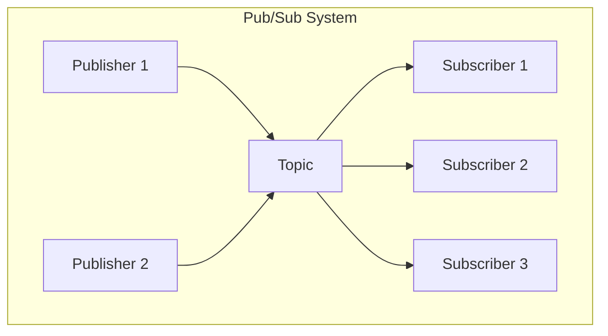

| Concept | Description |
|---------|-------------|
| **Publisher** | Sends messages to a topic |
| **Subscriber** | Receives messages from a topic |
| **Topic** | Named channel for messages |
| **Subscription** | Link between topic and subscriber |
| **Message** | Data payload with optional metadata |

## Pub/Sub vs. Message Queue

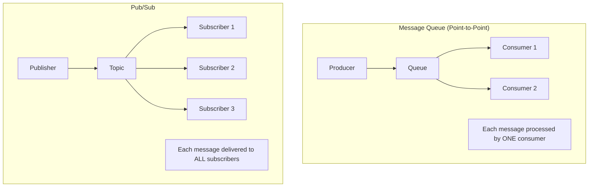

| Aspect | Message Queue | Pub/Sub |
|--------|--------------|---------|
| **Delivery** | One consumer per message | All subscribers |
| **Coupling** | Tight (producer knows queue) | Loose (producer doesn't know subscribers) |
| **Scaling** | Add consumers to queue | Add subscribers to topic |
| **Use case** | Task distribution | Event notification |

## Pub/Sub Models

### Topic-Based Pub/Sub

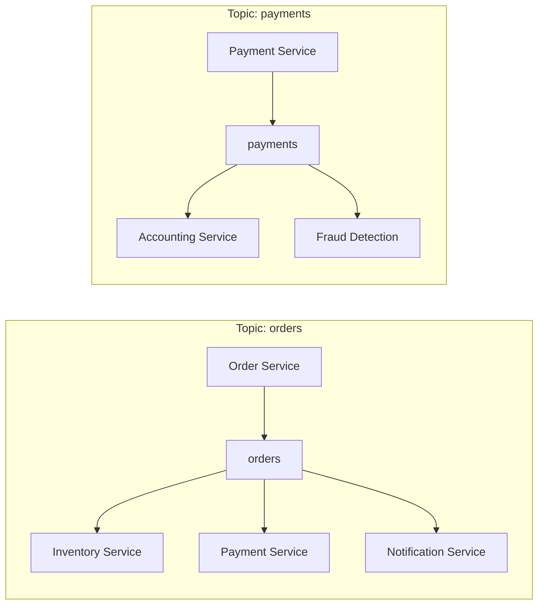

### Content-Based Pub/Sub

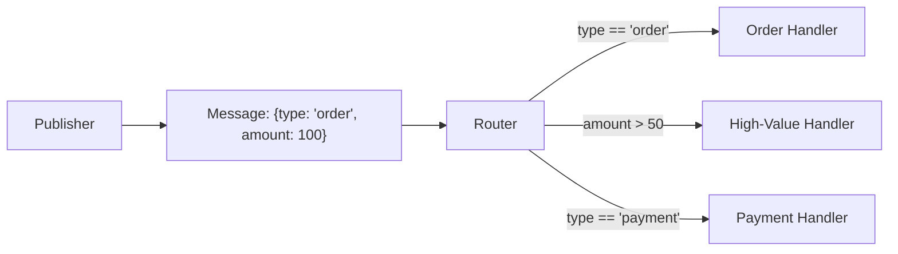

## Fan-Out Patterns

### Basic Fan-Out

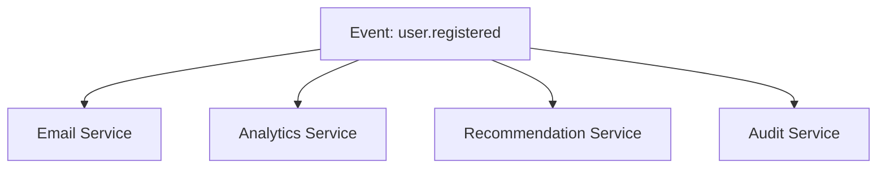

### Fan-Out with Filtering

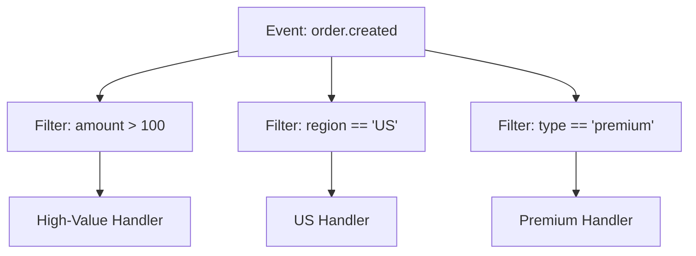

## Subscription Types

### Push Subscription

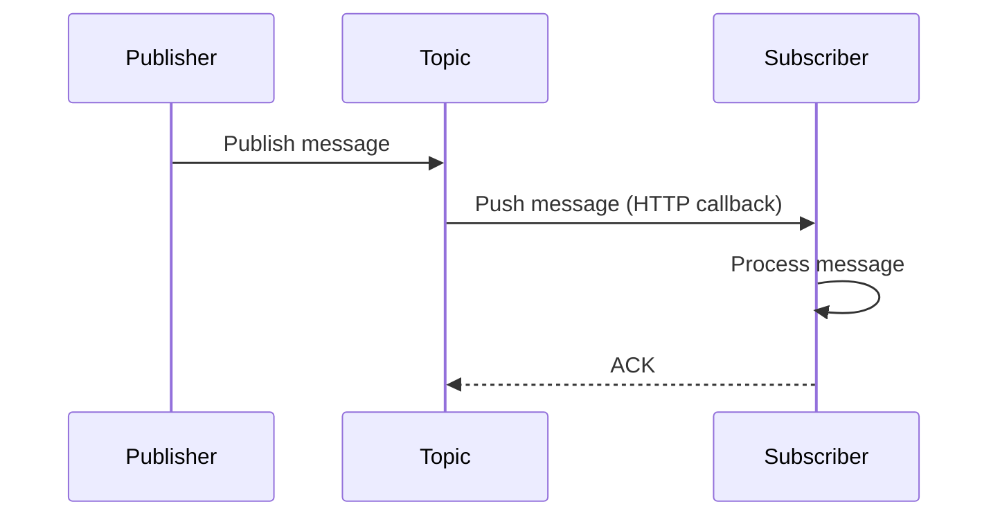

### Pull Subscription

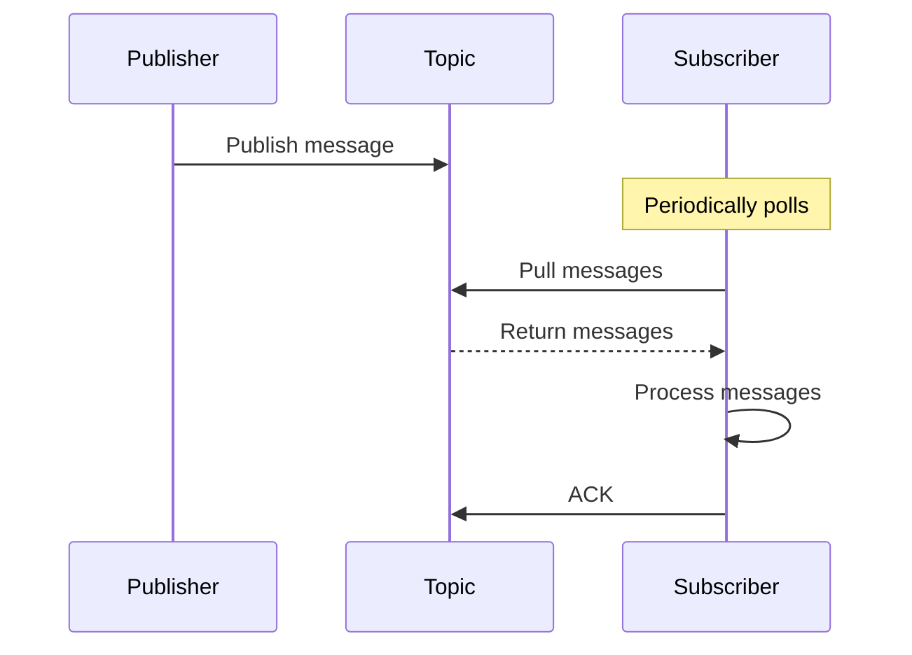

## Event-Driven Architecture

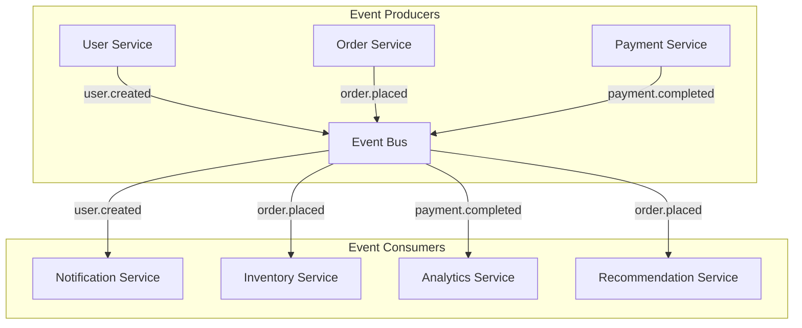

## Cloud Pub/Sub Services

### Google Cloud Pub/Sub

```python
from google.cloud import pubsub_v1

# Publisher
publisher = pubsub_v1.PublisherClient()
topic_path = publisher.topic_path(project_id, "my-topic")
future = publisher.publish(topic_path, data=b"Hello", attr="value")

# Subscriber
subscriber = pubsub_v1.SubscriberClient()
subscription_path = subscriber.subscription_path(project_id, "my-sub")

def callback(message):
    print(f"Received: {message.data}")
    message.ack()

subscriber.subscribe(subscription_path, callback=callback)
```

### Amazon SNS + SQS

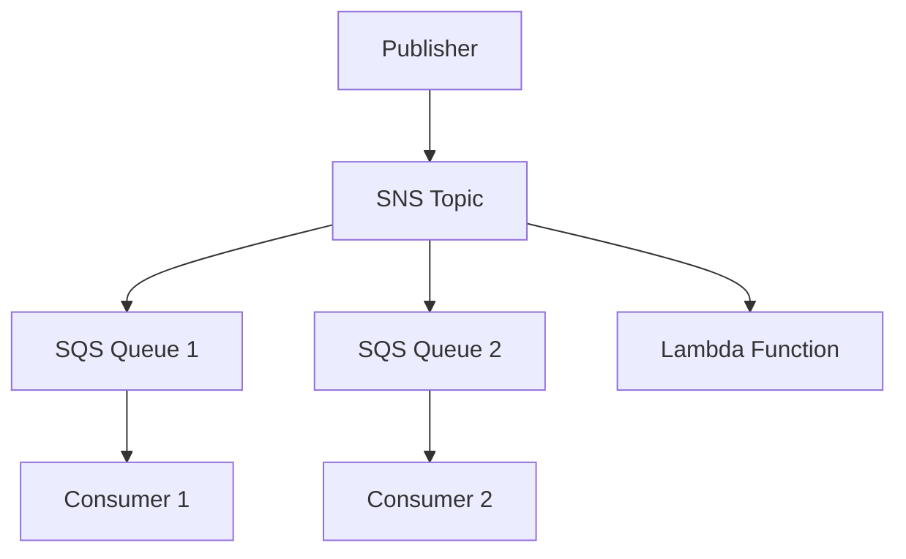

### Azure Service Bus

```python
from azure.servicebus import ServiceBusClient

# Publish
with ServiceBusClient.from_connection_string(conn_str) as client:
    with client.get_topic_sender(topic_name) as sender:
        sender.send_messages(ServiceBusMessage("Hello"))

# Subscribe
with ServiceBusClient.from_connection_string(conn_str) as client:
    with client.get_subscription_receiver(topic_name, sub_name) as receiver:
        for msg in receiver:
            print(str(msg))
            receiver.complete_message(msg)
```

## Pub/Sub with Message Ordering

```mermaid
graph TD
    subgraph "Ordered Pub/Sub"
        P[Publisher] -->|"Key: user_123"| T[Topic]
        T -->|"Partition by key"| S1[Subscriber 1\n(user_123 messages)]
        T -->|"Partition by key"| S2[Subscriber 2\n(user_456 messages)]
    end
```

## Pub/Sub Patterns in Practice

### Event Sourcing

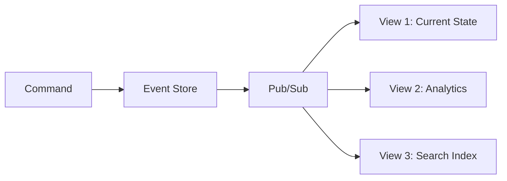

### CQRS (Command Query Responsibility Segregation)

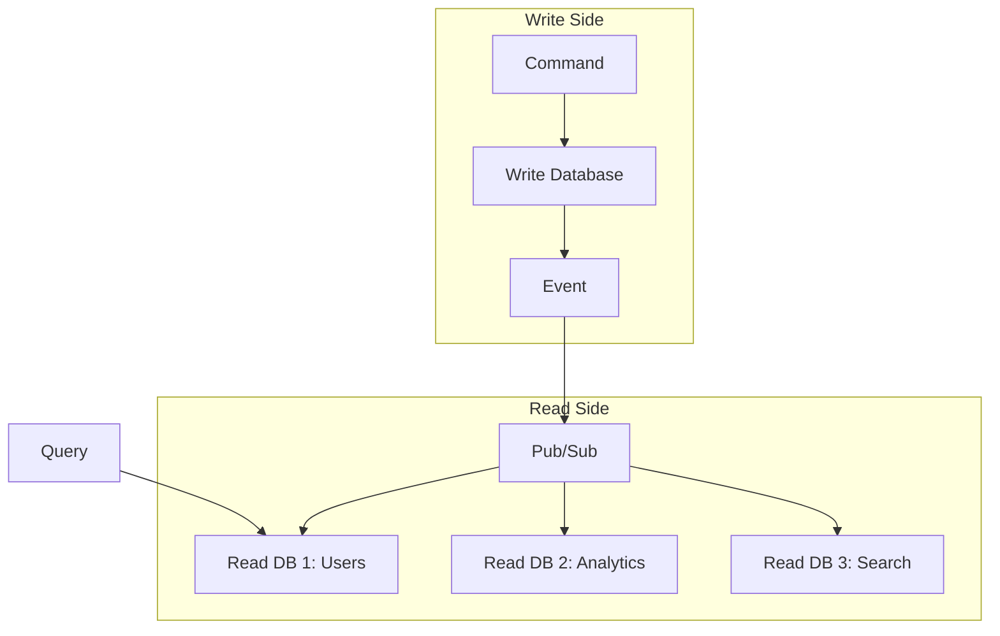

### Saga Pattern

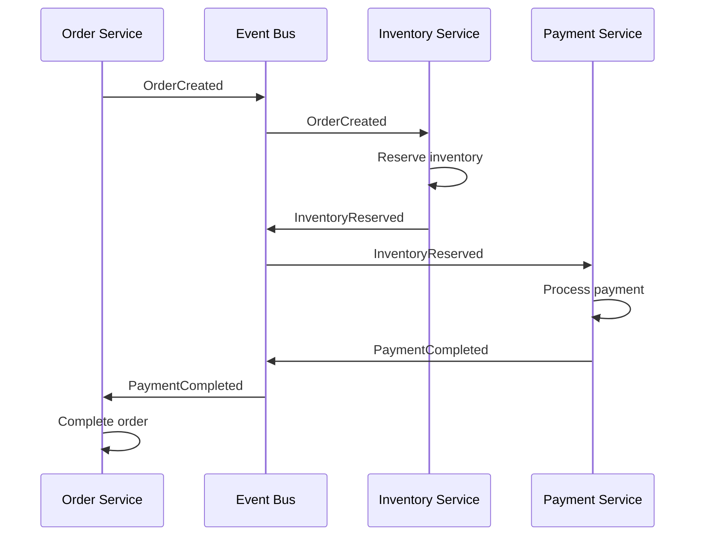

## Interview Questions

1. **What is the pub/sub pattern?**
   - Publishers send messages to topics without knowing subscribers. Subscribers receive messages from topics they've subscribed to. This enables one-to-many, decoupled communication.

2. **How does pub/sub differ from message queues?**
   - Pub/sub: one message to all subscribers (fan-out). Message queue: one message to one consumer (point-to-point). Pub/sub is for event notification; queues are for task distribution.

3. **What is event-driven architecture?**
   - Components communicate through events rather than direct calls. When something happens (e.g., order created), an event is published. Interested services subscribe and react independently.

4. **What is the difference between push and pull subscriptions?**
   - Push: the broker sends messages to the subscriber's endpoint (real-time, but subscriber must be available). Pull: the subscriber polls for messages (subscriber controls pace, but adds latency).

5. **How do you handle message ordering in pub/sub?**
   - Use message keys to ensure ordering per key. Messages with the same key go to the same partition/subscriber. Global ordering is expensive and limits throughput.

6. **What is the saga pattern and how does it use pub/sub?**
   - A distributed transaction pattern where each service publishes events after completing its step. Other services subscribe and react. Compensating events handle failures.

## Common Mistakes

- Not handling **subscriber failures** — messages may be lost
- Creating **tight coupling** through pub/sub (subscribers depend on message format)
- Not considering **message ordering** — events may arrive out of order
- Ignoring **idempotency** — subscribers may receive duplicate messages
- Not using **dead letter topics** for failed messages
- Over-using pub/sub — not everything needs event-driven architecture

## Summary

Pub/Sub enables loose, scalable communication between distributed components. Publishers send events to topics; subscribers react independently. This pattern is essential for event-driven architectures, microservices, and real-time systems. Cloud providers offer managed pub/sub services (Google Cloud Pub/Sub, Amazon SNS, Azure Service Bus) that handle scaling and reliability.

## Cross-References

- [Messaging Overview](README.md) — Messaging concepts
- [Message Queues](queues.md) — Point-to-point alternative
- [Kafka](kafka.md) — Distributed pub/sub implementation
- [RabbitMQ](rabbitmq.md) — Exchange-based pub/sub
- [Microservices](../microservices/README.md) — Event-driven microservices
- [Stream Processing](../mapreduce/streaming.md) — Processing pub/sub events

## Cross References

- [Kafka](kafka.md)
- [WebSocket](../../networks/http/websocket.md)
- [Microservices](../microservices/README.md)
