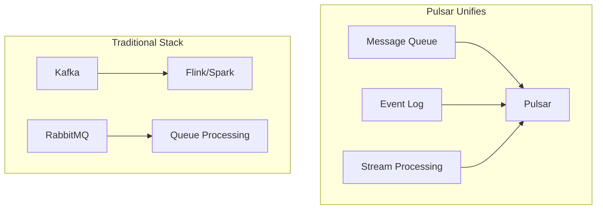
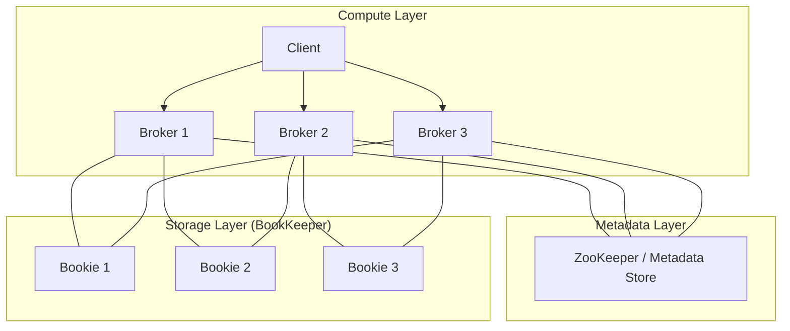
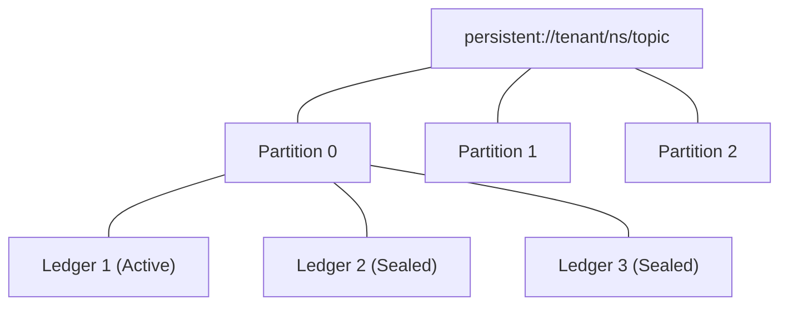
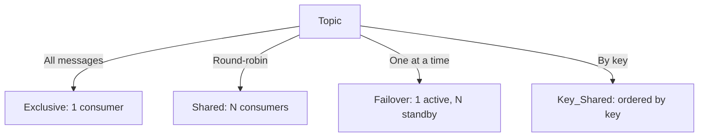
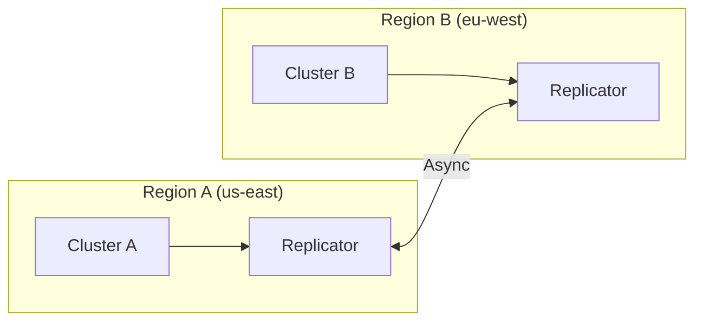
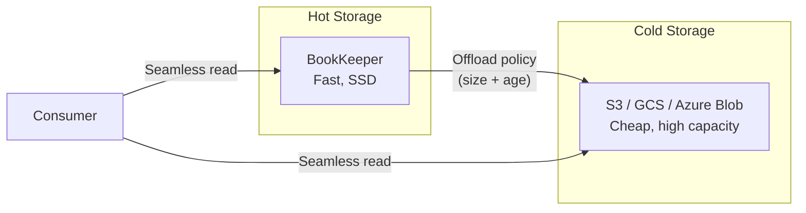

# Apache Pulsar (Distributed Messaging and Streaming)

## Overview

Apache Pulsar is a cloud-native, distributed messaging and streaming platform originally developed at Yahoo and now an Apache top-level project. It combines the flexibility of a pub/sub messaging system with the durability and scalability of a distributed log, offering a unified solution for both queuing and streaming use cases.

## Why Pulsar?



| Pulsar Advantage | Description |
|-------------------|-------------|
| **Geo-replication** | Built-in cross-datacenter replication |
| **Multi-tenancy** | Namespaces isolate tenants with resource quotas |
| **Tiered storage** | Offload old data to S3/GCS transparently |
| **Unified model** | Same API for streaming and queuing |
| **Separation of concerns** | Compute (brokers) and storage (BookKeeper) decoupled |
| **Flexible subscriptions** | Exclusive, shared, failover, key_shared |

## Architecture

### Separation of Compute and Storage



This separation means:
- **Brokers are stateless**: Easy to scale, replace, or upgrade
- **Storage is distributed**: BookKeeper provides durable, replicated ledgers
- **No data loss on broker failure**: Data is already persisted in BookKeeper

### Core Components

| Component | Role |
|-----------|------|
| **Broker** | Handles connections, message routing, schema validation |
| **BookKeeper** | Distributed log storage (durable, replicated ledgers) |
| **ZooKeeper** (or Functions Worker metadata store in newer versions) | Service discovery, configuration, broker coordination |
| **Service Discovery** | Routes clients to active brokers |
| **Proxy** | Optional stateless proxy for authentication/routing at edge |

## Topics, Partitions, and Ledgers



| Concept | Description |
|---------|-------------|
| **Topic** | Named channel for messages (`persistent://tenant/namespace/topic`) |
| **Partition** | Ordered, append-only log within a topic |
| **Ledger** | Segment of a partition stored in BookKeeper |
| **Entry** | Individual message within a ledger |

### Topic Types

| Type | Durability | Use Case |
|------|-----------|----------|
| `persistent://` | Written to disk (BookKeeper) | Critical data, financial transactions |
| `non-persistent://` | In-memory only | Telemetry, metrics, ephemeral data |

## Subscription Types

This is a key differentiator from Kafka, which only supports consumer groups:



| Subscription | Ordering | Delivery | Use Case |
|--------------|----------|-----------|----------|
| **Exclusive** | Per-topic | Single consumer gets all messages | Point-to-point messaging |
| **Shared** | None | Round-robin across consumers | Parallel processing, no ordering needed |
| **Failover** | Per-topic | One active consumer; standby takes over on failure | Ordered processing with HA |
| **Key_Shared** | Per-key | Messages with same key go to same consumer | Order-sensitive by entity (user, order) |

## Message Delivery Guarantees

| Guarantee | Mechanism |
|-----------|-----------|
| **At-most-once** | Send and forget, no ack |
| **At-least-once** | Ack after processing; redelivery on failure |
| **Effectively-once** | Idempotent producer + deduplication at broker |
| **Exactly-once** | Transactions across topics (Pulsar 2.6+) |

### Acknowledgment and Cursor

- Each subscription maintains a **cursor** tracking which messages have been consumed
- Consumers **ack** individual messages or cumulatively (all messages up to a point)
- Unacked messages are redelivered when a consumer disconnects or a timeout expires

## Geo-Replication



- Built-in cross-cluster asynchronous replication
- Policies: active-active, active-passive, aggregation
- Configure at the namespace or topic level
- Automatic conflict resolution (last-write-wins per message ID)

## Tiered Storage



- Offload ledger data to S3/GCS based on size or time
- Consumers read transparently from hot or cold storage
- Reduces cost while keeping data accessible

## Schema Registry

Pulsar has a built-in schema registry (no external dependency like Confluent Schema Registry):

```java
// Producer with schema
Producer<Order> producer = client.newProducer(Schema.AVRO(Order.class))
    .topic("orders")
    .create();

// Consumer with schema
Consumer<Order> consumer = client.newConsumer(Schema.AVRO(Order.class))
    .topic("orders")
    .subscriptionName("orders-sub")
    .subscribe();
```

| Schema Strategy | Behavior |
|-----------------|----------|
| `AUTO_CONSUME` | Deserialize using schema from broker |
| `AUTO_UPDATE` | Auto-register new schema versions |
| `FAILBACK` | Try schema, fall back to raw bytes |
| `AUTO_PRODUCE` | Auto-register schema on first produce |

## Pulsar Functions

Lightweight, serverless compute built into Pulsar:

```java
// A Pulsar Function (deployed to the cluster)
public class WordCountFunction implements Function<String, String> {
    @Override
    public String apply(String input) {
        return input + " [processed at " + Instant.now() + "]";
    }
}
```

| Feature | Details |
|---------|---------|
| Languages | Java, Python, Go | 
| Deployment | Cluster-managed or Kubernetes |
| State | Stateful functions with BookKeeper state storage |
| Windowing | Tumbling, sliding windows |
| Triggers | Message arrival, timer-based |

## Comparison: Pulsar vs Kafka

| Feature | Pulsar | Kafka |
|---------|--------|-------|
| **Architecture** | Layered (compute + storage) | Broker stores data directly |
| **Broker failure** | No data loss (stateless) | Potential data loss, recovery needed |
| **Scaling** | Brokers scale independently of storage | Storage scales with brokers |
| **Subscriptions** | 4 types (exclusive, shared, failover, key_shared) | Consumer groups only |
| **Geo-replication** | Built-in | MirrorMaker 2 (external) |
| **Tiered storage** | Built-in | Tiered Storage (KIP-405) |
| **Schema registry** | Built-in | Confluent (commercial) or Apicurio |
| **Multi-tenancy** | Built-in (namespaces + authz) | Manual (topics + ACLs) |
| **Message dedup** | Built-in (sequence ID) | Idempotent producer (limited) |
| **Retained message size** | Unbounded (tiered storage) | Limited by disk |
| **Operational complexity** | Higher (more components) | Lower (single binary) |
| **Maturity** | Growing | Very mature, wide adoption |

## Comparison: Pulsar vs RabbitMQ

| Feature | Pulsar | RabbitMQ |
|---------|--------|----------|
| **Pattern** | Log-based, streaming | Queue-based, pub/sub |
| **Ordering** | Per-partition | Per-queue |
| **Persistence** | Configurable (persistent/non-persistent) | Durable queues, persistent messages |
| **Throughput** | Millions msg/sec | Hundreds of thousands msg/sec |
| **Streaming** | Native | Not designed for it |
| **Protocol** | Binary (Pulsar protocol) over HTTP/TLS | AMQP 0-9-1, MQTT, STOMP |
| **Routing** | Subscription types | Exchanges + bindings (rich routing) |
| **Use case** | High-throughput streaming + queuing | Complex routing, low-latency task queues |

## Performance Characteristics

| Metric | Typical Value |
|--------|---------------|
| Latency (single message) | 2-5 ms (persistent), <1 ms (non-persistent) |
| Throughput (per broker) | 1-2 million messages/sec |
| End-to-end latency (geo-replicated) | Seconds (depends on distance) |
| Storage overhead | ~1.5x message size (with metadata) |

## Interview Questions

1. **Why would you choose Pulsar over Kafka?** Choose Pulsar when you need: built-in geo-replication, multi-tenancy, multiple subscription types, or independent scaling of compute and storage. Kafka when you need maximum ecosystem maturity and simplicity.

2. **How does Pulsar handle broker failure?** Because brokers are stateless (data is in BookKeeper), a failed broker simply means clients reconnect to another broker. No data recovery, no partition reassignment — the new broker serves the same ledgers from BookKeeper.

3. **Explain the four subscription types.** Exclusive: one consumer gets everything. Shared: round-robin across consumers (no ordering). Failover: one active consumer with standbys. Key_Shared: messages with the same routing key always go to the same consumer.

4. **What is tiered storage and why does it matter?** Tiered storage offloads older data from BookKeeper to cheap object storage (S3/GCS). This enables retaining data for months/years at low cost while keeping recent data fast to access. Kafka has similar capabilities but Pulsar's is more tightly integrated.

5. **How does Pulsar ensure exactly-once semantics?** Through transactions: producers can publish to multiple topics atomically, and consumers can ack from multiple topics atomically. Combined with idempotent producers (message deduplication by sequence ID) and broker-side transaction log.

## Key Takeaways

- Pulsar separates compute (brokers) from storage (BookKeeper) for independent scaling and zero data loss on broker failure
- Four subscription types provide flexibility beyond Kafka's consumer groups
- Built-in geo-replication, multi-tenancy, schema registry, and tiered storage reduce operational complexity
- Pulsar Functions provide lightweight, serverless stream processing
- Growing adoption but Kafka still leads in ecosystem maturity and community size
- Consider Pulsar for new projects needing multi-region, multi-tenant streaming with diverse consumption patterns

## Cross-References

- [Kafka](./kafka.md) — Detailed Kafka comparison
- [RabbitMQ](./rabbitmq.md) — Queue-based alternative
- [Pub/Sub Patterns](./pubsub.md) — Messaging patterns overview
- [Amazon Kinesis](../../cloud/aws/kinesis.md) — AWS managed streaming
- [EventBridge](../../cloud/aws/eventbridge.md) — AWS event routing
- [Consensus (ZooKeeper)](../consensus/zab.md) — Coordination primitives
- [Stream Processing](../../data-engineering/stream-processing.md) — Processing paradigms
