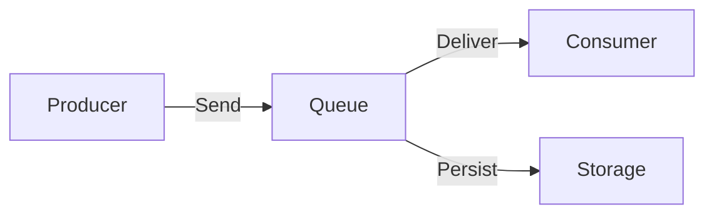
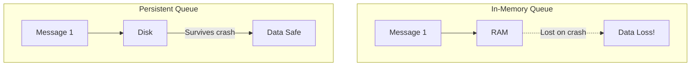
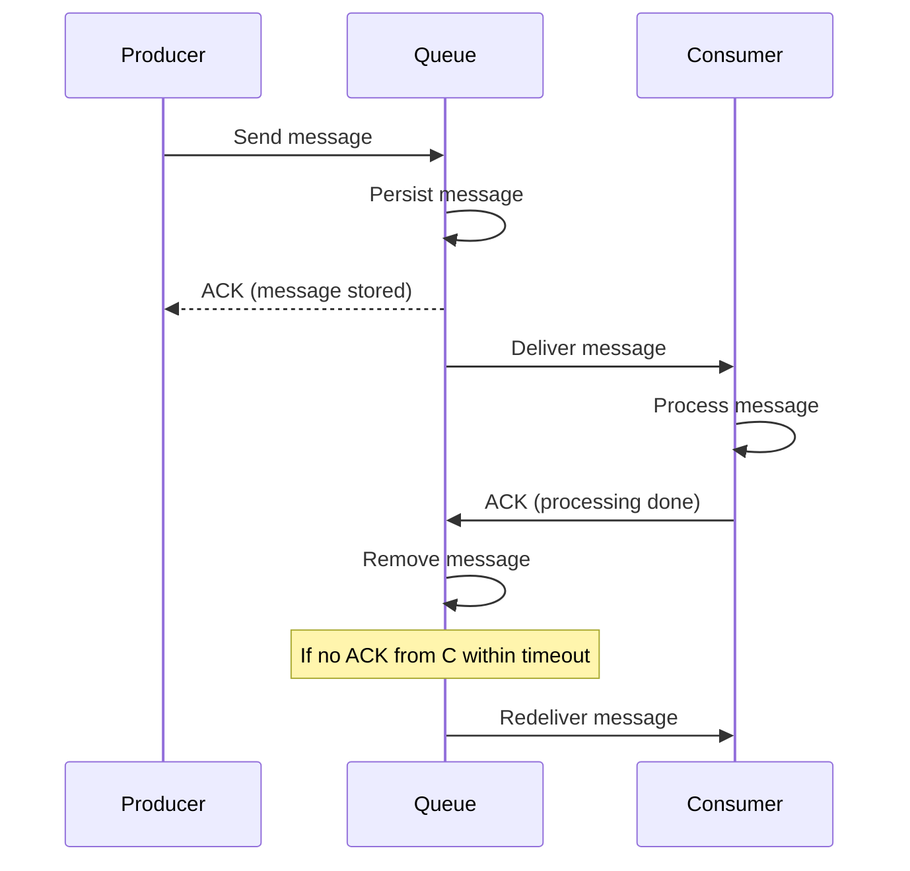
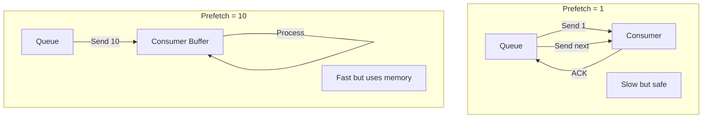
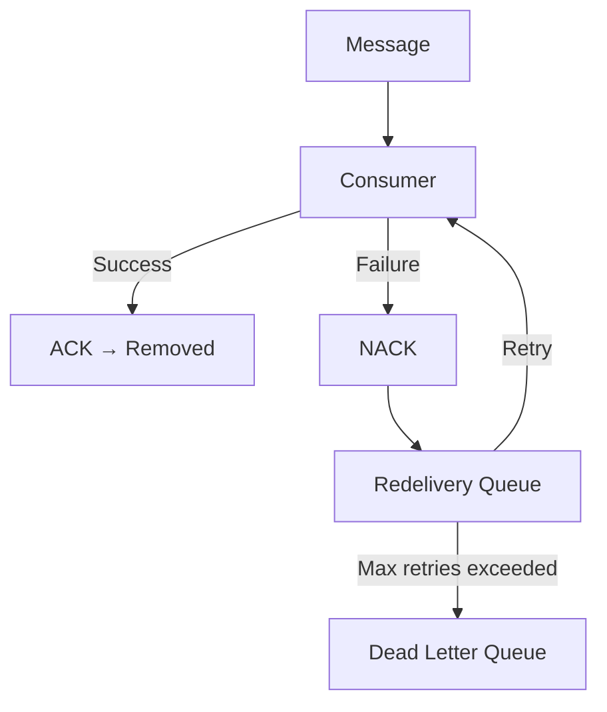
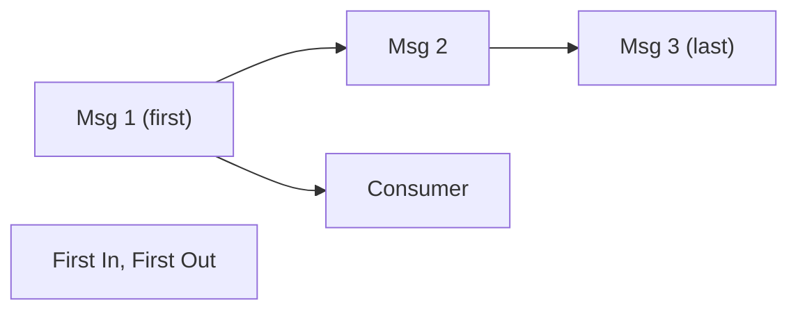
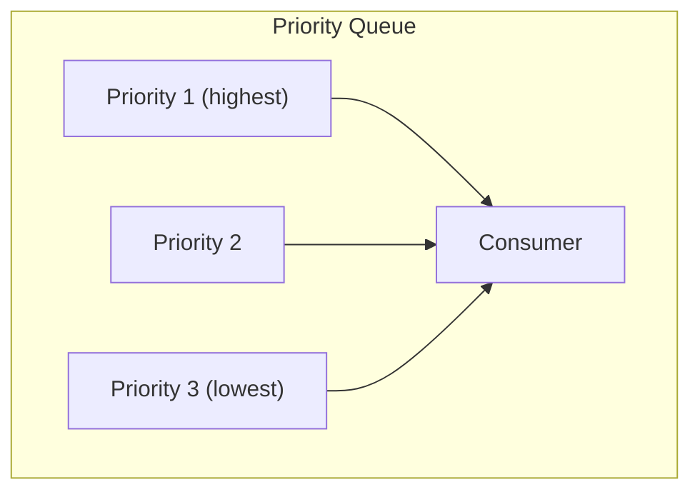
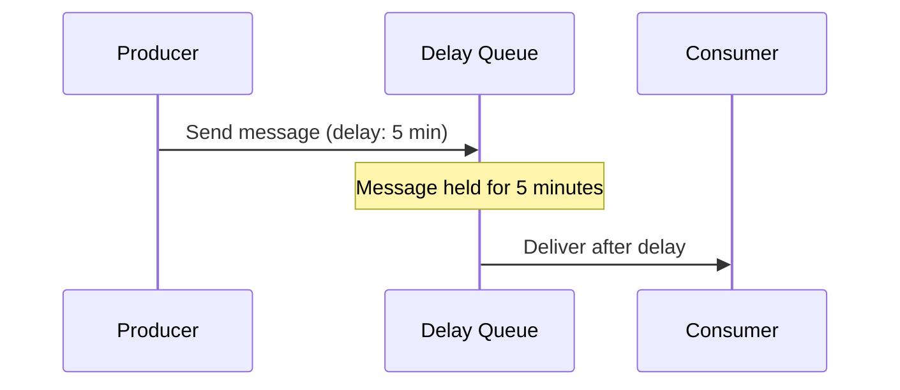
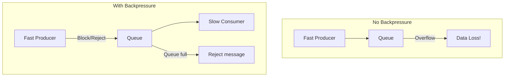
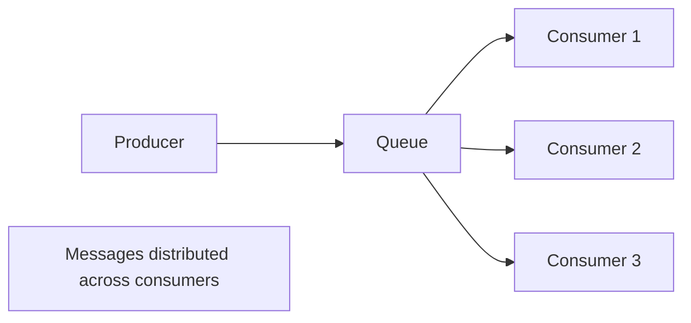

# Message Queues

## Overview

Message queues are middleware that store and forward messages between producers and consumers. They provide **reliable, asynchronous communication** in distributed systems. Unlike direct API calls, message queues decouple components, handle traffic spikes, and ensure message delivery even when consumers are temporarily unavailable.

## Core Concepts



| Concept | Description |
|---------|-------------|
| **Producer** | Creates and sends messages |
| **Queue** | Stores messages until consumed |
| **Consumer** | Receives and processes messages |
| **Acknowledgment** | Consumer confirms successful processing |
| **TTL** | Time-to-live for messages |

## Reliability Mechanisms

### Persistence



### Acknowledgments (ACKs)



### Prefetch / Consumer Window



## Delivery Guarantee Implementation

### At-Most-Once

```python
# Producer: send and forget
channel.basic_publish(exchange='', queue='tasks', body=message)

# Consumer: auto-ack before processing
channel.basic_consume(queue='tasks', auto_ack=True, callback=process)
```

### At-Least-Once

```python
# Producer: send with confirm
channel.confirm_delivery()
channel.basic_publish(exchange='', queue='tasks', body=message)

# Consumer: manual ack after processing
def process(ch, method, properties, body):
    try:
        do_work(body)
        ch.basic_ack(delivery_tag=method.delivery_tag)  # ACK after processing
    except Exception:
        ch.basic_nack(delivery_tag=method.delivery_tag)  # NACK for retry
```

### Exactly-Once

```python
# Producer: idempotent with dedup ID
message_id = generate_unique_id()
channel.basic_publish(
    exchange='', queue='tasks',
    body=message,
    properties=pika.BasicProperties(message_id=message_id)
)

# Consumer: check if already processed
def process(ch, method, properties, body):
    if is_already_processed(properties.message_id):
        ch.basic_ack(delivery_tag=method.delivery_tag)
        return
    
    do_work(body)
    mark_as_processed(properties.message_id)
    ch.basic_ack(delivery_tag=method.delivery_tag)
```

## Message Redelivery



## Queue Types

### FIFO Queue



### Priority Queue



### Delay Queue



## Backpressure

When producers are faster than consumers:



Strategies:
- **Blocking**: Producer waits when queue is full
- **Rejecting**: Return error to producer
- **Dropping**: Drop oldest or lowest-priority messages
- **Sampling**: Process only a fraction of messages

## Competing Consumers



Multiple consumers read from the same queue, enabling horizontal scaling:

| Consumer Count | Throughput | Complexity |
|---------------|-----------|------------|
| 1 | Low | Simple |
| N | N × single | Order per partition |
| Many | High | Load balancing needed |

## Real-World Implementations

| System | Type | Ordering | Delivery |
|--------|------|----------|----------|
| **RabbitMQ** | Traditional broker | Per-queue | At-least-once |
| **Kafka** | Distributed log | Per-partition | At-least-once |
| **Amazon SQS** | Managed queue | Best-effort | At-least-once |
| **Redis Streams** | In-memory log | Per-stream | At-least-once |
| **ZeroMQ** | Library (no broker) | Configurable | At-most-once |

## Interview Questions

1. **What is the difference between at-most-once, at-least-once, and exactly-once delivery?**
   - At-most-once: send once, may lose. At-least-once: retry until ACK, may duplicate. Exactly-once: processed exactly once (requires idempotency and coordination).

2. **How do acknowledgments work in message queues?**
   - Consumer sends ACK after successfully processing a message. If no ACK within timeout, the queue redelivers. This ensures at-least-once delivery.

3. **What is a dead letter queue?**
   - A queue for messages that can't be processed after max retries. Used for debugging, manual review, or reprocessing.

4. **How do you handle message ordering with multiple consumers?**
   - Use partitioned queues (messages with same key go to same partition). Each partition is consumed by one consumer. This maintains ordering per key while scaling.

5. **What is backpressure and how do you handle it?**
   - When producers are faster than consumers. Handle with: blocking producers, rejecting messages, dropping old messages, or sampling.

## Common Mistakes

- Not using **acknowledgments** — messages lost on consumer crash
- Processing before ACKing — if processing fails, message is lost (at-most-once)
- Not handling **duplicate messages** — always assume at-least-once
- Ignoring **dead letter queues** — poison messages block the queue
- Not setting **TTL** — queues grow unbounded
- Using wrong **prefetch count** — too high wastes memory, too low hurts throughput

## Summary

Message queues provide reliable asynchronous communication between distributed components. Key mechanisms include persistence, acknowledgments, and redelivery. The choice between delivery guarantees depends on whether data loss or duplication is acceptable. Competing consumers enable horizontal scaling, and backpressure mechanisms prevent system overload.

## Cross-References

- [Messaging Overview](README.md) — Messaging patterns and concepts
- [Kafka](kafka.md) — Distributed streaming platform
- [RabbitMQ](rabbitmq.md) — Traditional message broker
- [Pub/Sub](pubsub.md) — Publish-subscribe patterns
- [Stream Processing](../mapreduce/streaming.md) — Processing message streams
- [Circuit Breakers](../microservices/circuit-breakers.md) — Handling consumer failures

## Cross References

- [RabbitMQ](rabbitmq.md)
- [Kafka](kafka.md)
- [OS Synchronization](../../os/synchronization/README.md)
- [Concurrency - Producer/Consumer](../../concurrency/producer-consumer.md)
