# RabbitMQ

## Overview

RabbitMQ is an open-source **message broker** that implements the Advanced Message Queuing Protocol (AMQP). Originally developed by Rabbit Technologies in 2007, it's widely used for task queues, microservice communication, and asynchronous processing. Unlike Kafka's log-based model, RabbitMQ is a traditional broker that routes messages through exchanges to queues.

## Architecture

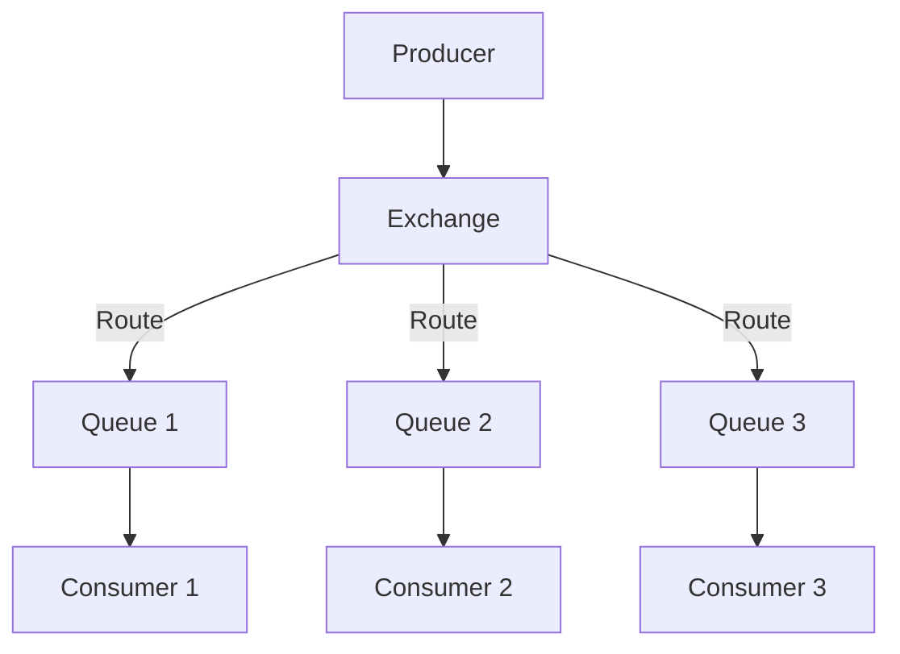

## Core Components

### Exchanges

Exchanges receive messages from producers and route them to queues based on rules:

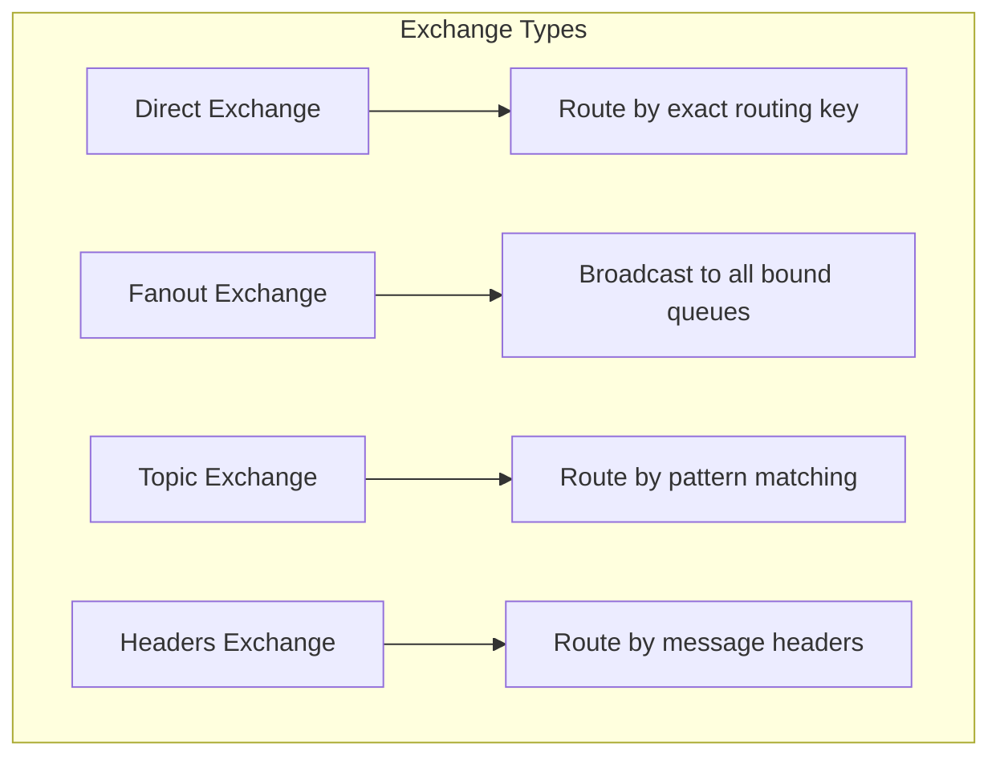

### Direct Exchange

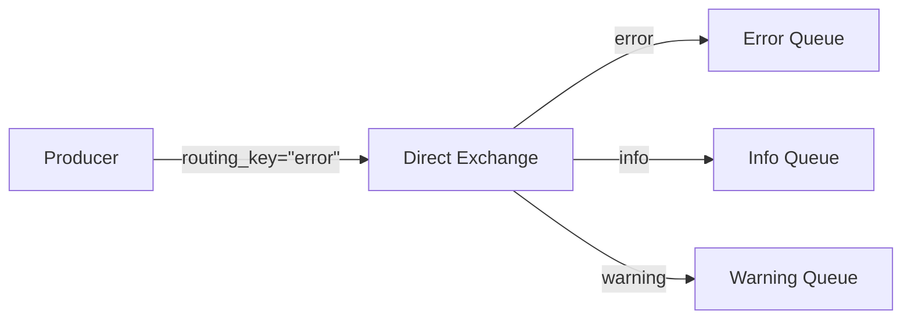

### Fanout Exchange

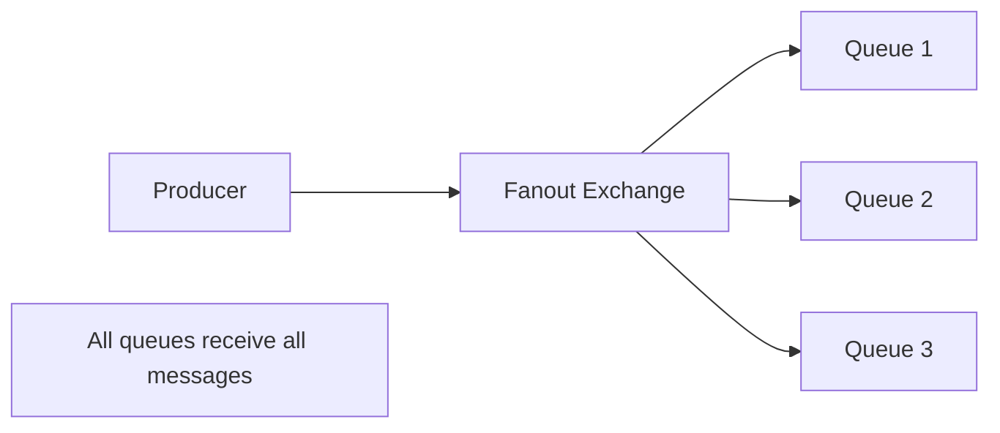

### Topic Exchange

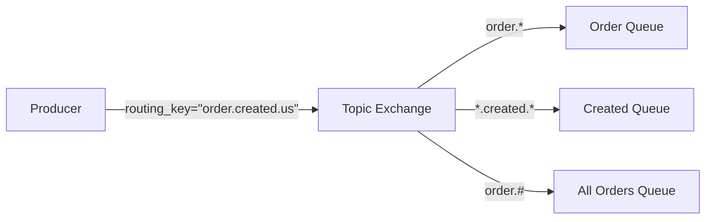

**Pattern matching**:
- `*` matches exactly one word
- `#` matches zero or more words

### Headers Exchange

```python
# Route by message headers
channel.basic_publish(
    exchange='headers-exchange',
    routing_key='',  # Ignored for headers exchange
    body=message,
    properties=pika.BasicProperties(
        headers={'format': 'pdf', 'type': 'report'}
    )
)

# Queue binding with headers
channel.queue_bind(
    exchange='headers-exchange',
    queue='pdf-queue',
    arguments={'x-match': 'all', 'format': 'pdf'}
)
```

## Message Flow

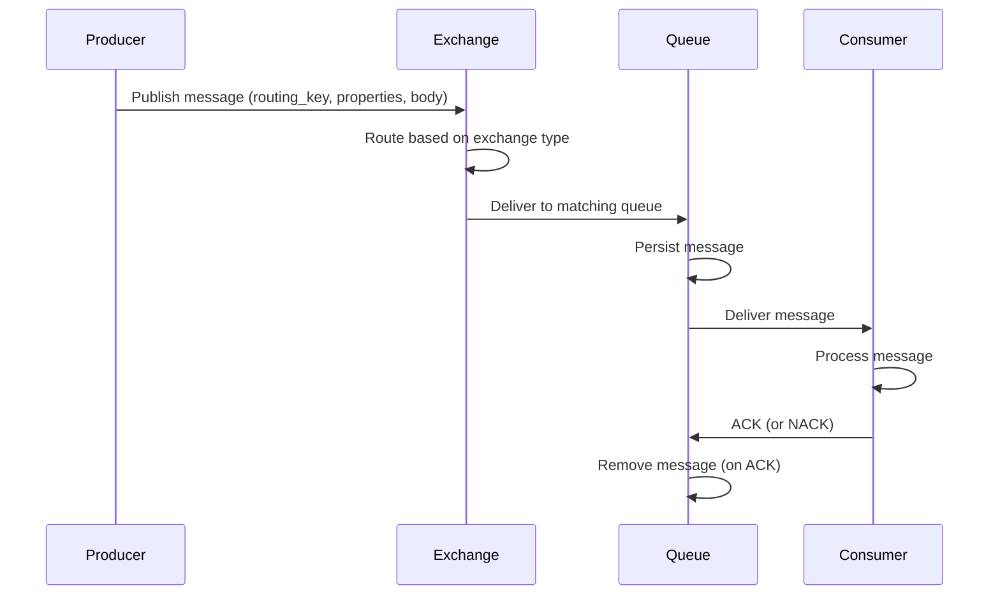

## Acknowledgments

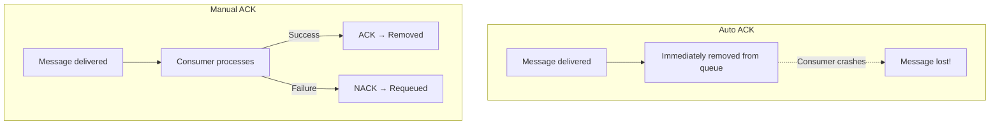

### Consumer Acknowledgment Example

```python
def callback(ch, method, properties, body):
    try:
        process_message(body)
        # ACK: message processed successfully
        ch.basic_ack(delivery_tag=method.delivery_tag)
    except Exception as e:
        # NACK: requeue for retry
        ch.basic_nack(
            delivery_tag=method.delivery_tag,
            requeue=True
        )

channel.basic_consume(queue='tasks', on_message_callback=callback)
```

## Prefetch (QoS)

```python
# Process one message at a time
channel.basic_qos(prefetch_count=1)

# Process up to 10 messages concurrently
channel.basic_qos(prefetch_count=10)
```

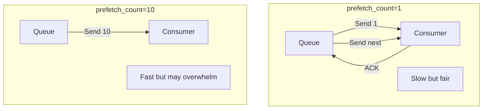

## Dead Letter Exchange (DLX)

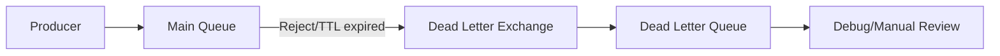

```python
# Declare DLX
channel.exchange_declare(exchange='dlx', exchange_type='direct')

# Declare main queue with DLX
channel.queue_declare(
    queue='main-queue',
    arguments={
        'x-dead-letter-exchange': 'dlx',
        'x-dead-letter-routing-key': 'dlq',
        'x-message-ttl': 60000,  # 60 seconds TTL
        # Note: there is no `x-max-retries` argument in RabbitMQ. To limit retries,
        # track delivery count in the message's `x-death` header (set when a message
        # is dead-lettered) and/or use `x-delivery-limit` (quorum queues only).
        'x-delivery-limit': 3,  # quorum queues only — number of redelivery attempts
    }
)
```

## Clustering and High Availability

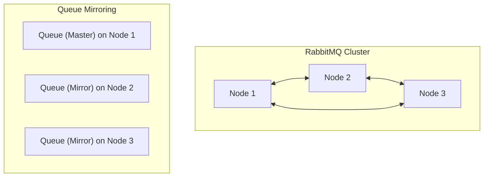

### Quorum Queues (Recommended)

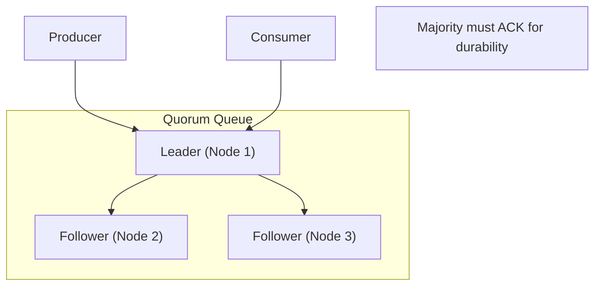

## RabbitMQ vs. Kafka

| Aspect | RabbitMQ | Kafka |
|--------|----------|-------|
| **Model** | Message broker | Distributed log |
| **Routing** | Exchanges + bindings | Topic partitions |
| **Retention** | Until consumed | Time/key-based |
| **Replay** | No | Yes |
| **Throughput** | Moderate (~50K/sec) | Very high (~millions/sec) |
| **Ordering** | Per-queue | Per-partition |
| **Use case** | Task queues, RPC | Event streaming, data pipelines |
| **Protocol** | AMQP, MQTT, STOMP | Custom binary protocol |

## Interview Questions

1. **What is RabbitMQ and how does it differ from Kafka?**
   - RabbitMQ is a traditional message broker using exchanges and queues. Kafka is a distributed commit log. RabbitMQ deletes messages after consumption; Kafka retains them. RabbitMQ is better for task queues; Kafka for event streaming.

2. **Explain the exchange types in RabbitMQ.**
   - Direct: routes by exact routing key. Fanout: broadcasts to all bound queues. Topic: routes by pattern matching (* and # wildcards). Headers: routes by message headers.

3. **How do acknowledgments work in RabbitMQ?**
   - Consumers send ACK after processing. If no ACK within timeout, the message is redelivered. NACK with requeue=True puts the message back in the queue. This ensures at-least-once delivery.

4. **What is a dead letter exchange?**
   - An exchange that receives messages rejected by queues, expired (TTL), or exceeding max length. Used for debugging, monitoring, or reprocessing failed messages.

5. **What are quorum queues in RabbitMQ?**
   - Raft-based replicated queues that provide high availability and data safety. Messages are replicated to a majority of nodes before being acknowledged. Replaces the older mirroring approach.

## Common Mistakes

- Not using **manual acknowledgments** — messages lost on consumer crash
- Setting **prefetch too high** — consumers overwhelmed, messages timeout
- Not configuring **DLX** — poison messages block the queue
- Using **classic mirroring** instead of quorum queues — less reliable
- Not setting **TTL** — queues grow unbounded
- Treating RabbitMQ like Kafka — it's not designed for event replay

## Summary

RabbitMQ is a mature message broker with flexible routing through exchanges. It excels at task queues, request-reply patterns, and microservice communication. The choice between RabbitMQ and Kafka depends on the use case: RabbitMQ for traditional messaging, Kafka for event streaming and data pipelines.

## Cross-References

- [Messaging Overview](README.md) — Messaging concepts
- [Message Queues](queues.md) — General queue patterns
- [Kafka](kafka.md) — Distributed streaming platform
- [Pub/Sub](pubsub.md) — Publish-subscribe patterns
- [Circuit Breakers](../microservices/circuit-breakers.md) — Handling consumer failures
- [API Gateways](../microservices/api-gateways.md) — Message routing
