# Microservices Architecture

## Overview

Microservices is an architectural style where an application is built as a collection of **small, independent services** that communicate over the network. Each service is owned by a single team, can be deployed independently, and is organized around a business capability. This contrasts with monolithic architectures where the entire application is a single deployable unit.

## Monolith vs. Microservices

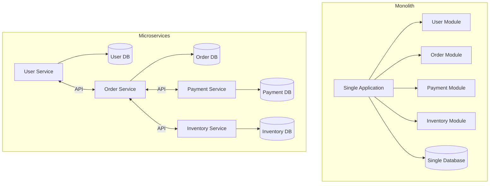

| Aspect | Monolith | Microservices |
|--------|----------|---------------|
| **Deployment** | Single unit | Independent per service |
| **Scaling** | Scale everything | Scale per service |
| **Technology** | Single stack | Polyglot |
| **Team** | Shared codebase | Team ownership |
| **Failure** | Entire app affected | Isolated failures |
| **Complexity** | Simple initially | Distributed complexity |

## Microservices Principles

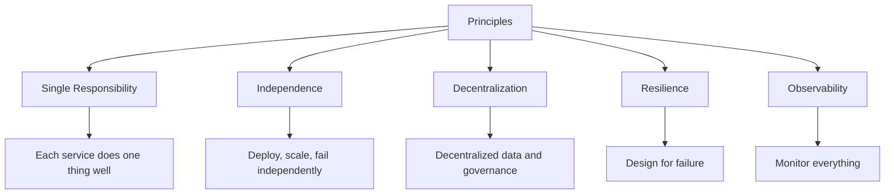

## Communication Patterns

### Synchronous (Request-Response)

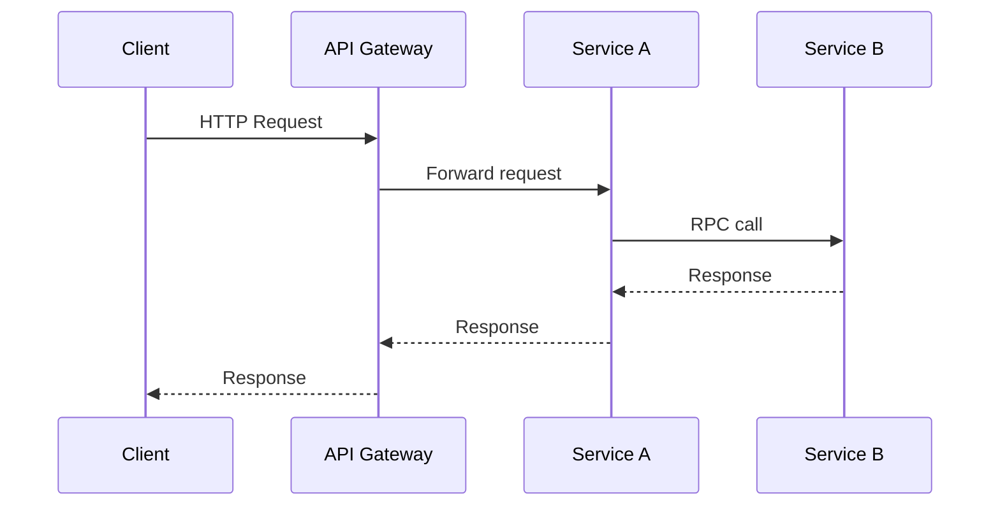

### Asynchronous (Event-Driven)

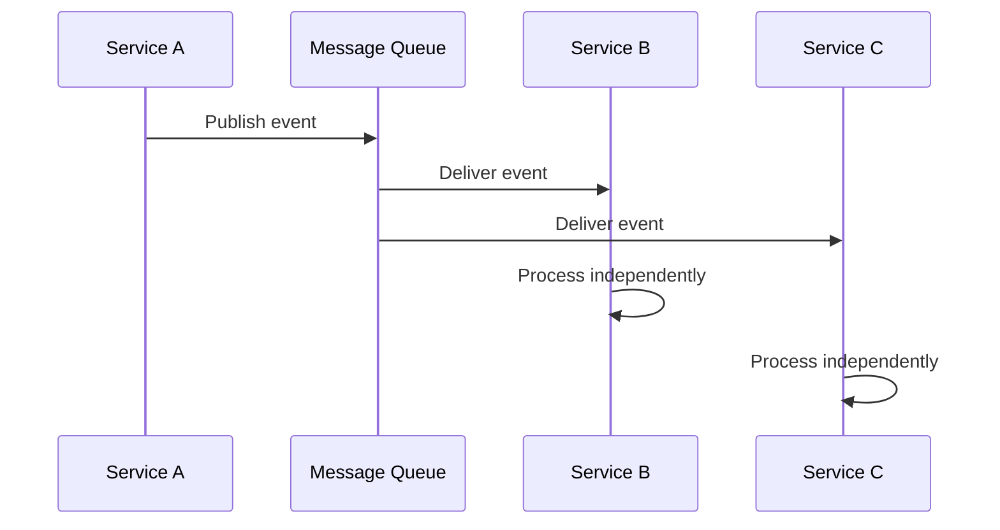

### Comparison

| Aspect | Synchronous | Asynchronous |
|--------|------------|--------------|
| **Coupling** | Tight | Loose |
| **Latency** | Higher (waiting) | Lower (fire-and-forget) |
| **Error handling** | Immediate | Deferred |
| **Use case** | Queries, CRUD | Events, notifications |

## Data Management

### Database per Service

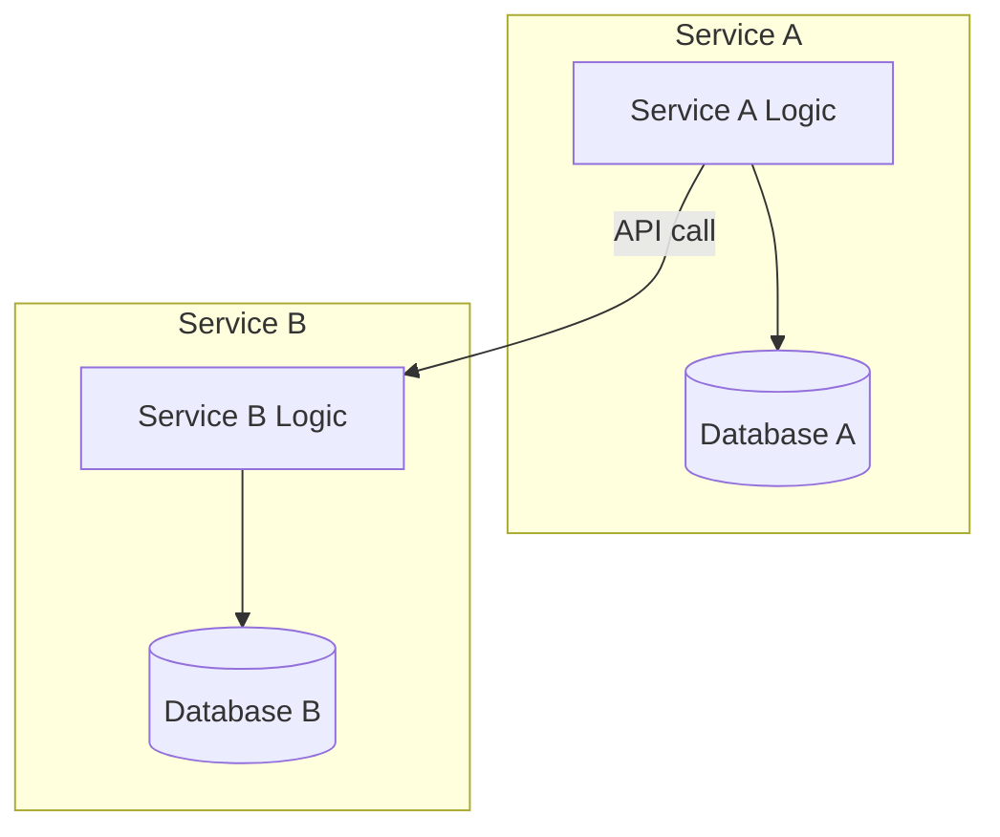

### Saga Pattern (Distributed Transactions)

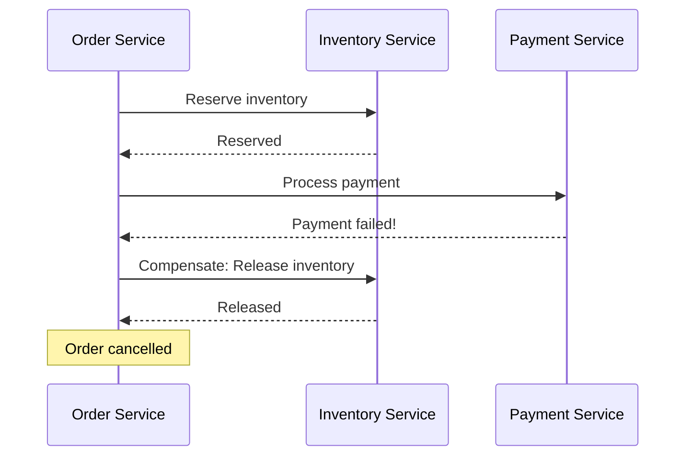

## Service Mesh

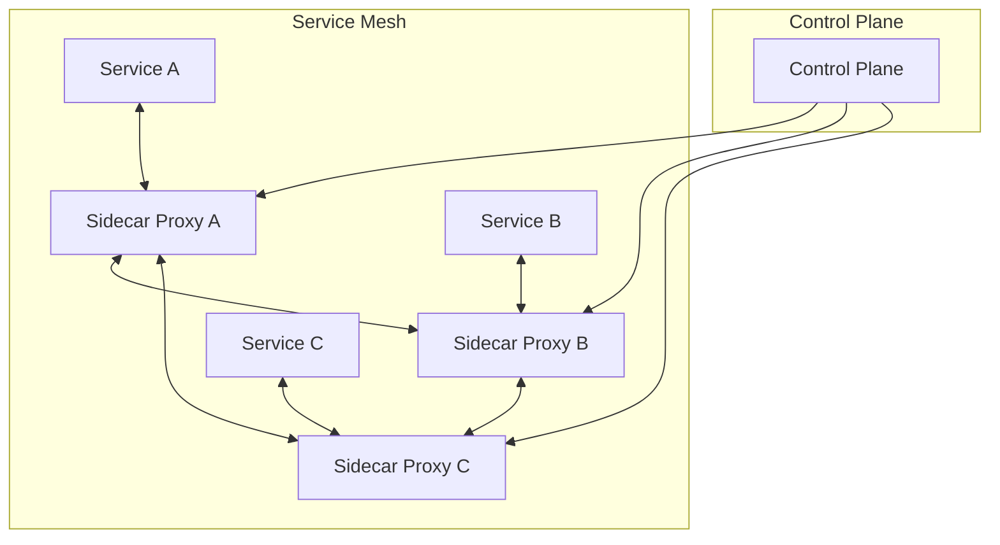

The sidecar proxies handle:
- Service discovery
- Load balancing
- Circuit breaking
- mTLS encryption
- Observability

## Deployment Patterns

### Blue-Green Deployment

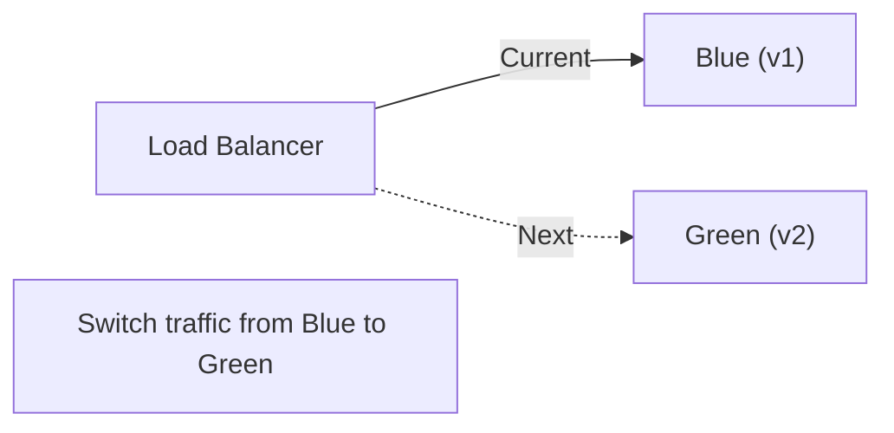

### Canary Deployment

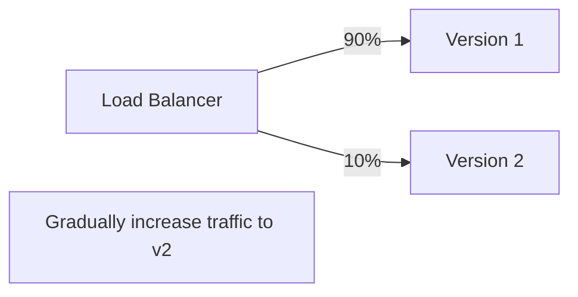

### Rolling Deployment

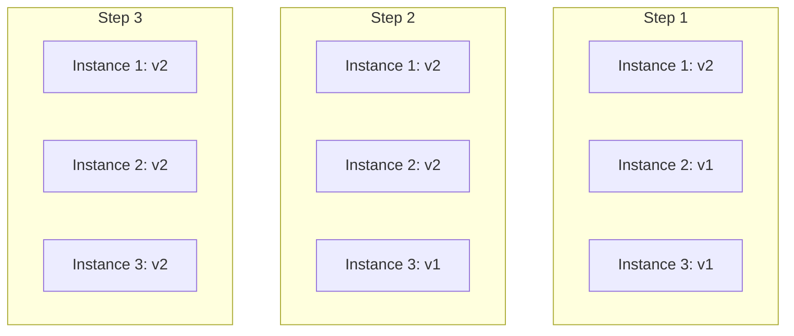

## Challenges

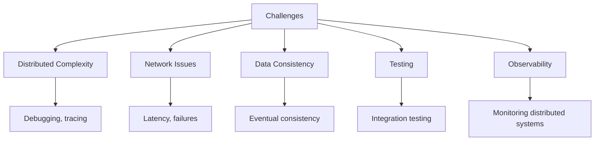

## Interview Questions

1. **What are microservices and how do they differ from monoliths?**
   - Microservices: small, independent services communicating over network. Each service has its own database and can be deployed independently. Monolith: single deployable unit with shared database.

2. **When would you choose microservices over a monolith?**
   - Microservices: large teams, need for independent deployment, polyglot technology, different scaling requirements. Monolith: small teams, simple domain, starting a new project.

3. **How do microservices communicate?**
   - Synchronous: HTTP/REST, gRPC (request-response). Asynchronous: message queues, event streaming (pub/sub). Each has trade-offs in coupling, latency, and error handling.

4. **What is the saga pattern?**
   - A distributed transaction pattern where each service performs its local transaction and publishes events. If one step fails, compensating transactions undo previous steps.

5. **What is a service mesh?**
   - Infrastructure layer that handles service-to-service communication. Sidecar proxies handle routing, load balancing, circuit breaking, and observability. Examples: Istio, Linkerd.

6. **What are the main challenges of microservices?**
   - Distributed complexity (debugging, tracing), network issues (latency, failures), data consistency (eventual consistency), testing (integration), and observability (monitoring).

## Common Mistakes

- Starting with microservices for a **new, small project** — monolith first
- **Too many services** — nano-services create unnecessary complexity
- **Shared databases** between services — defeats the purpose
- Not planning for **failure** — network calls will fail
- Ignoring **observability** — hard to debug without proper monitoring
- **Synchronous chains** — long chains of service calls amplify failures

## Summary

Microservices enable independent development, deployment, and scaling of services. They trade local complexity for distributed complexity. Key patterns include service discovery, circuit breakers, API gateways, and observability. The choice between monolith and microservices depends on team size, domain complexity, and operational maturity.

## Cross-References

- [Service Discovery](discovery.md) — Finding services
- [Circuit Breakers](circuit-breakers.md) — Handling failures
- [API Gateways](api-gateways.md) — Entry point for clients
- [Observability](observability.md) — Monitoring microservices
- [Message Queues](../messaging/queues.md) — Async communication
- [Pub/Sub](../messaging/pubsub.md) — Event-driven patterns

## Cross References

- [API Gateways](api-gateways.md)
- [Service Discovery](discovery.md)
- [Circuit Breakers](circuit-breakers.md)
- [Observability](observability.md)
- [Load Balancing](../../networks/load-balancing/README.md)
