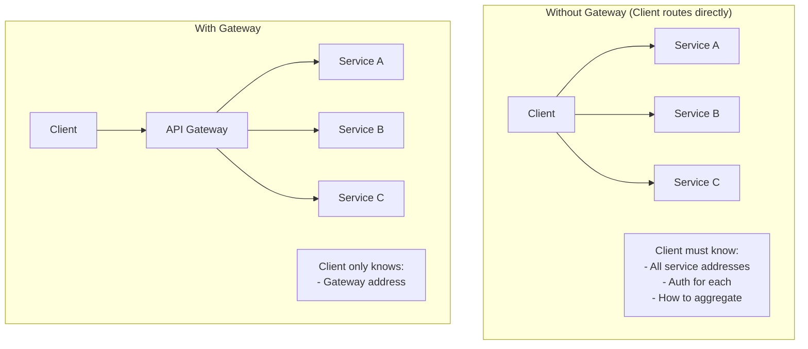
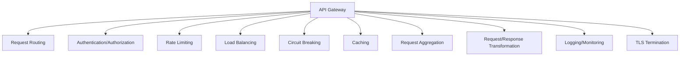
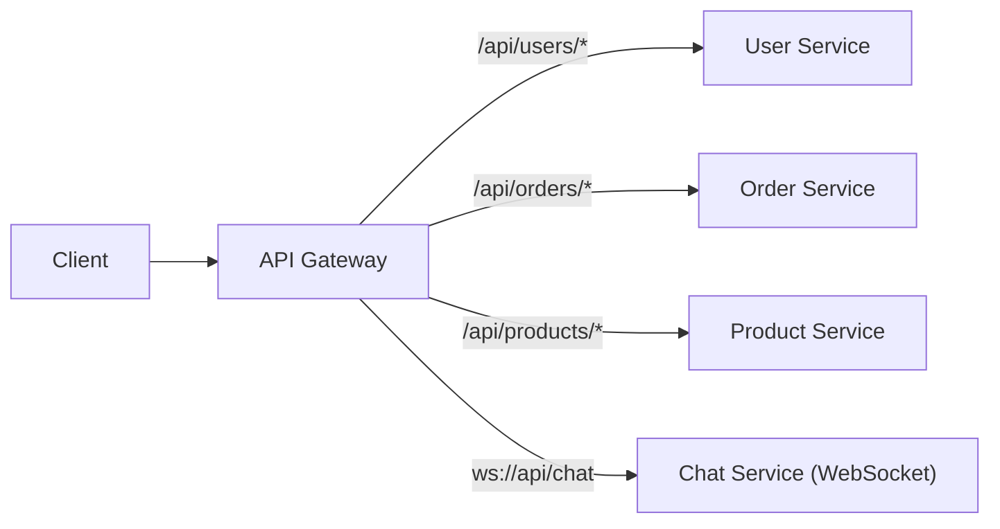
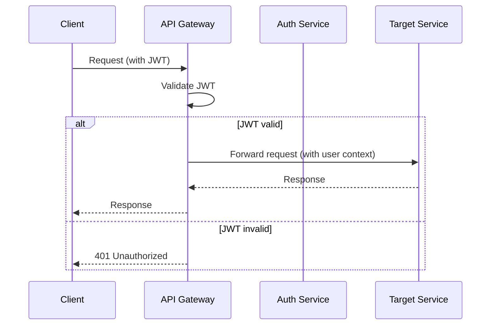
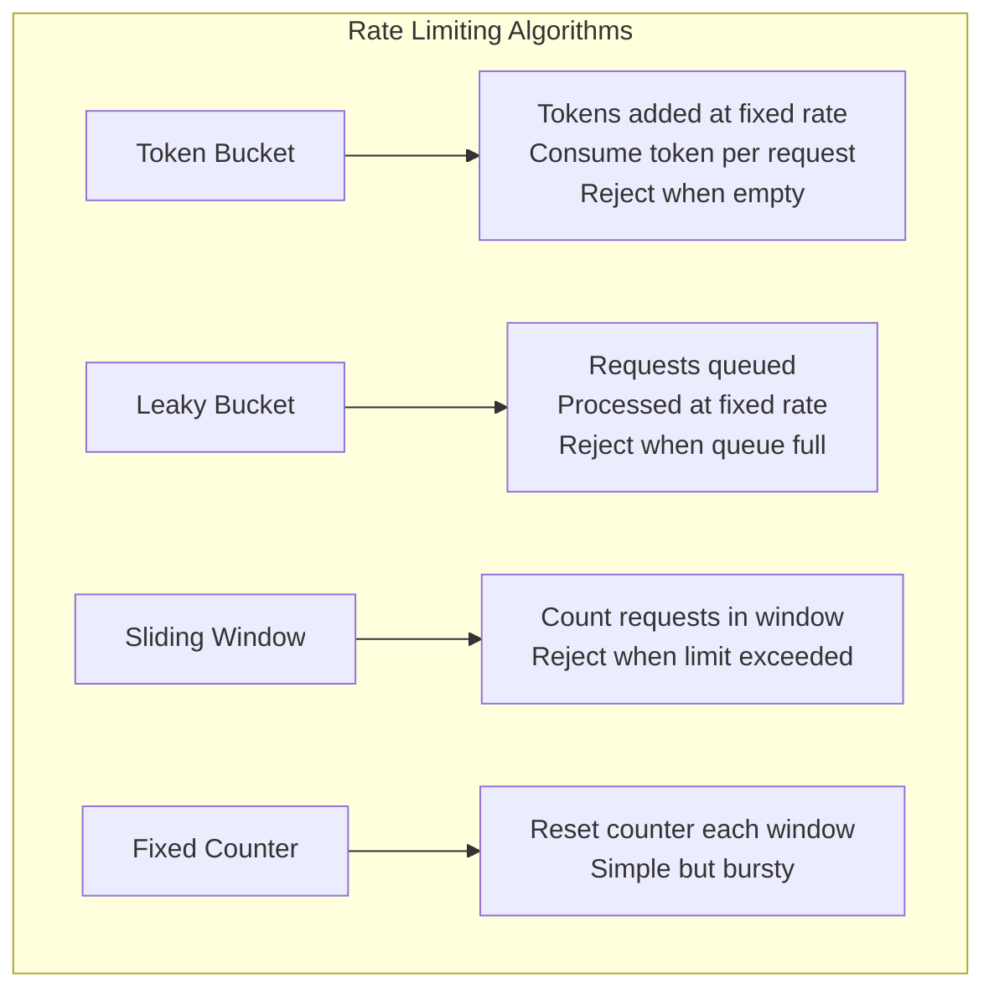
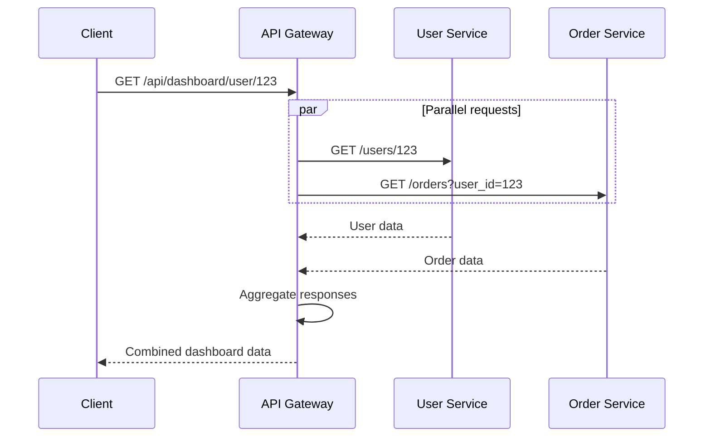
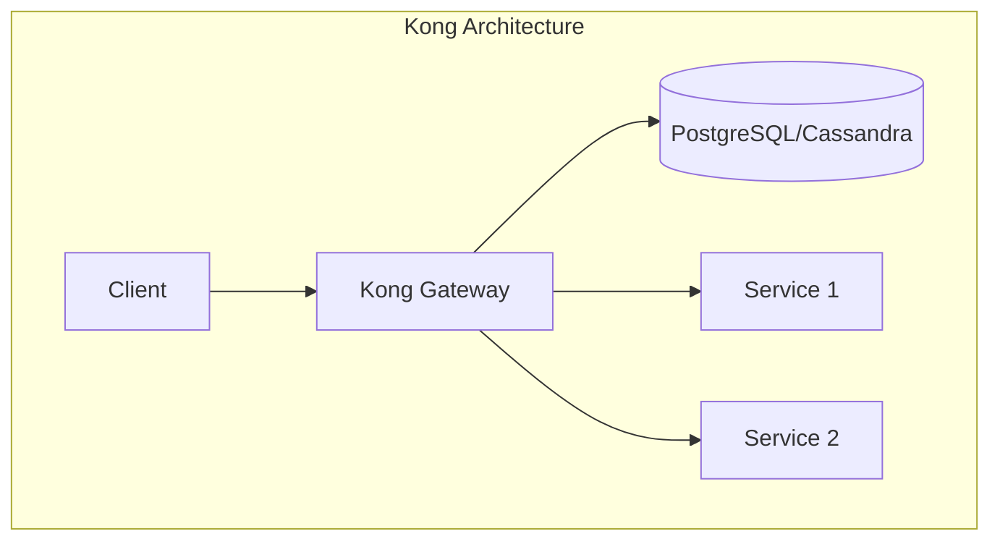
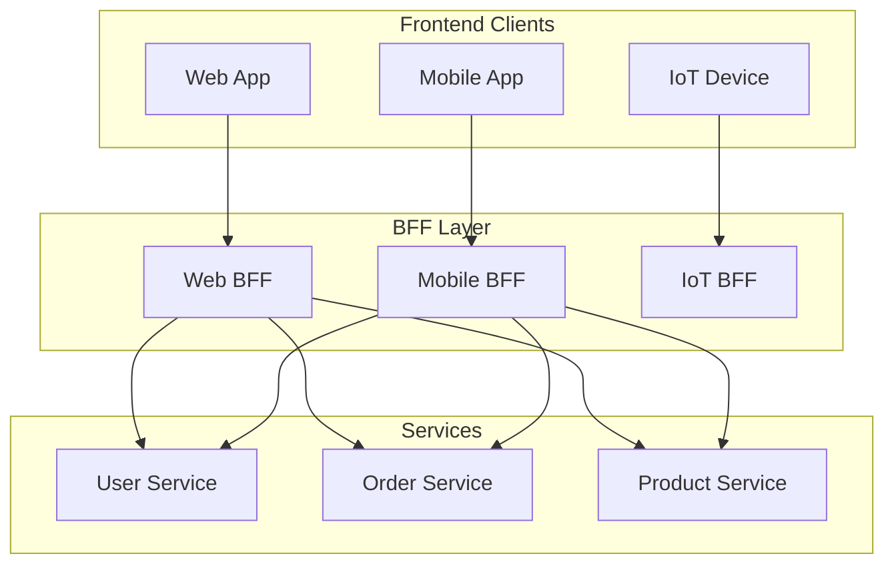

# API Gateways

## Overview

An API gateway is a **single entry point** for all client requests in a microservices architecture. It handles cross-cutting concerns like authentication, rate limiting, load balancing, and request routing, so individual services can focus on business logic. The gateway pattern simplifies client-side code and provides a unified API surface.

## Why API Gateways?



## Core Functions



## Request Routing



```yaml
# NGINX routing configuration
routes:
  - path: /api/users/**
    service: user-service
    port: 8080
  - path: /api/orders/**
    service: order-service
    port: 8081
  - path: /api/products/**
    service: product-service
    port: 8082
```

## Authentication and Authorization



```python
# Gateway middleware
def auth_middleware(request):
    token = request.headers.get('Authorization')
    if not token:
        return Response(status=401)
    
    try:
        payload = jwt.decode(token, SECRET_KEY)
        request.user = payload
        return None  # Continue to next middleware
    except jwt.InvalidTokenError:
        return Response(status=401)
```

## Rate Limiting



### Token Bucket Implementation

```python
import time

class TokenBucket:
    def __init__(self, capacity, refill_rate):
        self.capacity = capacity
        self.tokens = capacity
        self.refill_rate = refill_rate  # tokens per second
        self.last_refill = time.time()
    
    def allow_request(self):
        now = time.time()
        elapsed = now - self.last_refill
        self.tokens = min(self.capacity, 
                         self.tokens + elapsed * self.refill_rate)
        self.last_refill = now
        
        if self.tokens >= 1:
            self.tokens -= 1
            return True
        return False
```

### Rate Limiting Headers

```python
# Response headers
headers = {
    'X-RateLimit-Limit': '100',        # Max requests per window
    'X-RateLimit-Remaining': '42',      # Remaining requests
    'X-RateLimit-Reset': '1625097600',  # Window reset time
    'Retry-After': '30'                 # Seconds to wait (if limited)
}
```

## Request Aggregation



## Popular API Gateways

### Kong



```bash
# Add a service
curl -X POST http://localhost:8001/services/ \
  --data name=user-service \
  --data url=http://user-service:8080

# Add a route
curl -X POST http://localhost:8001/services/user-service/routes \
  --data paths[]=/api/users

# Add rate limiting plugin
curl -X POST http://localhost:8001/services/user-service/plugins \
  --data name=rate-limiting \
  --data config.minute=100
```

**Features**: Plugin-based, supports auth, rate limiting, logging, transformations

### Envoy

```yaml
# Envoy configuration
static_resources:
  listeners:
    - name: listener_0
      address:
        socket_address:
          address: 0.0.0.0
          port_value: 8080
      filter_chains:
        - filters:
            - name: envoy.filters.network.http_connection_manager
              typed_config:
                "@type": type.googleapis.com/envoy.extensions.filters.network.http_connection_manager.v3.HttpConnectionManager
                route_config:
                  virtual_hosts:
                    - name: backend
                      domains: ["*"]
                      routes:
                        - match:
                            prefix: "/api/users"
                          route:
                            cluster: user_service
  clusters:
    - name: user_service
      type: STRICT_DNS
      load_assignment:
        cluster_name: user_service
        endpoints:
          - lb_endpoints:
              - endpoint:
                  address:
                    socket_address:
                      address: user-service
                      port_value: 8080
```

**Features**: High performance, service mesh sidecar, advanced load balancing

### NGINX

```nginx
# NGINX as API Gateway
http {
    upstream user_service {
        server user-service-1:8080;
        server user-service-2:8080;
    }
    
    upstream order_service {
        server order-service-1:8081;
        server order-service-2:8081;
    }
    
    server {
        listen 80;
        
        location /api/users/ {
            proxy_pass http://user_service;
            proxy_set_header X-Real-IP $remote_addr;
            rate_limit zone=api burst=10;
        }
        
        location /api/orders/ {
            proxy_pass http://order_service;
            proxy_set_header X-Real-IP $remote_addr;
        }
    }
}
```

## Comparison

| Gateway | Type | Performance | Extensibility | Use Case |
|---------|------|-------------|---------------|----------|
| **Kong** | Standalone | High | Plugin-based | General purpose |
| **Envoy** | Sidecar/Edge | Very high | xDS API | Service mesh |
| **NGINX** | Reverse proxy | Very high | Modules/Config | High performance |
| **AWS API GW** | Managed | High | Limited | AWS ecosystem |
| **Traefik** | Reverse proxy | High | Labels/Docker | Container-native |

## BFF (Backend for Frontend)



Each BFF tailors responses for its client type (web gets full data, mobile gets minimal data).

## Interview Questions

1. **What is an API gateway and why is it needed?**
   - A single entry point for all client requests in microservices. It handles routing, authentication, rate limiting, and other cross-cutting concerns, simplifying client code and providing a unified API.

2. **What functions does an API gateway provide?**
   - Request routing, authentication/authorization, rate limiting, load balancing, circuit breaking, caching, request aggregation, and logging/monitoring.

3. **What is the BFF pattern?**
   - Backend for Frontend: separate gateway per client type (web, mobile, IoT). Each BFF tailors responses for its client, reducing over-fetching and simplifying client code.

4. **How does rate limiting work in an API gateway?**
   - Algorithms like token bucket, leaky bucket, or sliding window track request counts. When limits are exceeded, the gateway returns 429 Too Many Requests with Retry-After header.

5. **Compare Kong, Envoy, and NGINX as API gateways.**
   - Kong: plugin-based, good for general use. Envoy: high performance, service mesh sidecar. NGINX: very high performance, configuration-based. All support routing, auth, and rate limiting.

6. **How does an API gateway handle authentication?**
   - Validates JWT tokens or API keys in each request. Can integrate with OAuth2 providers. Adds user context to requests before forwarding to services.

## Common Mistakes

- Making the gateway a **single point of failure** — deploy multiple instances
- Putting **business logic** in the gateway — keep it focused on cross-cutting concerns
- Not implementing **circuit breakers** — slow services can block the gateway
- Ignoring **caching** — reduces load on backend services
- Not **versioning APIs** — breaking changes affect all clients
- Over-complicating the gateway — too many plugins add latency

## Summary

API gateways provide a unified entry point for microservices, handling cross-cutting concerns like routing, auth, rate limiting, and load balancing. Popular options include Kong, Envoy, and NGINX. The BFF pattern tailors gateways per client type. Proper configuration and monitoring are essential for reliable operation.

## Cross-References

- [Microservices Overview](README.md) — Microservices architecture
- [Service Discovery](discovery.md) — How gateway finds services
- [Circuit Breakers](circuit-breakers.md) — Failure handling
- [Observability](observability.md) — Monitoring gateways
- [Rate Limiting](circuit-breakers.md) — Rate limiting patterns
- [Pub/Sub](../messaging/pubsub.md) — Event-driven patterns

## Cross References

- [Load Balancing](../../networks/load-balancing/README.md)
- [Reverse Proxy](../../networks/load-balancing/reverse-proxy.md)
- [Service Discovery](discovery.md)
- [Rate Limiting](../../interview/system-design/rate-limiter.md)
