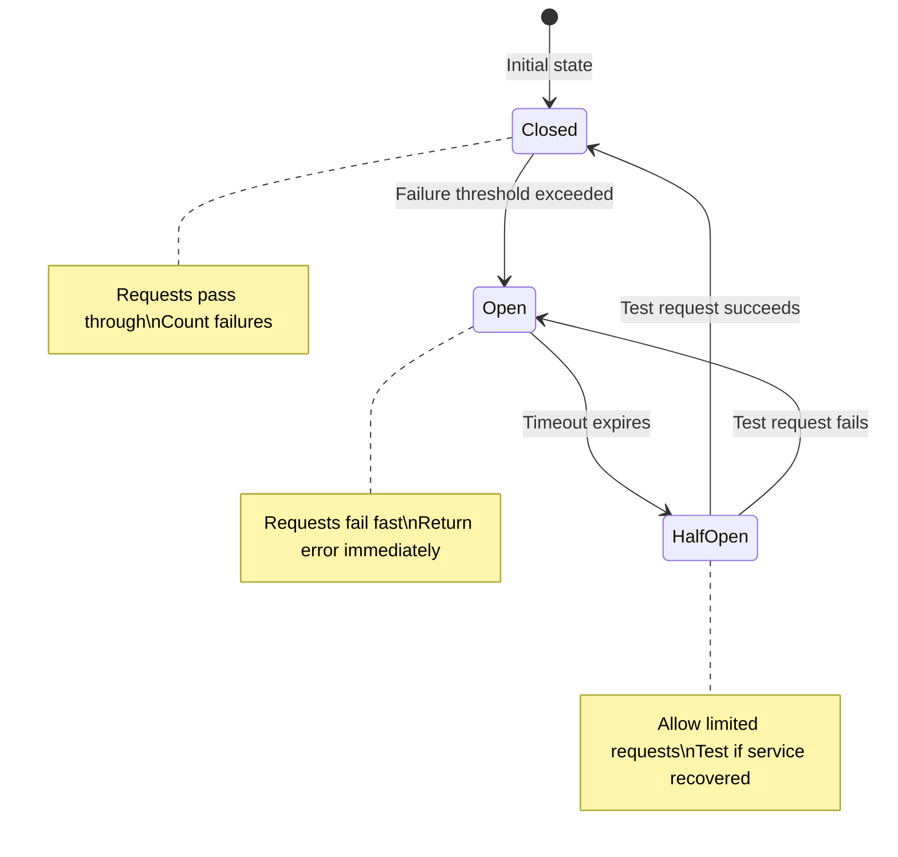
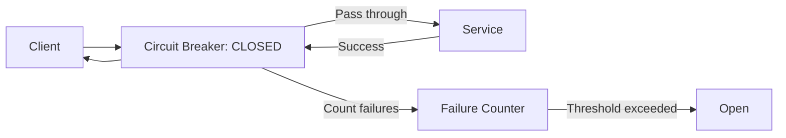
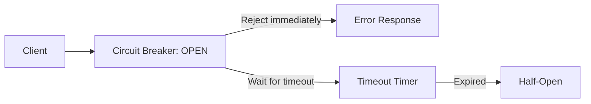
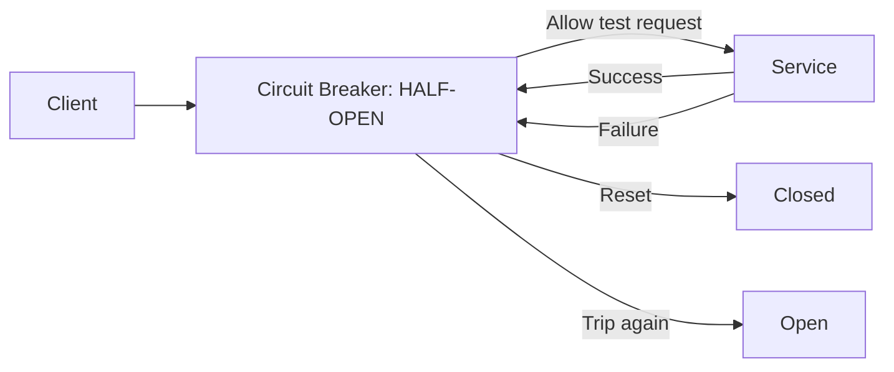
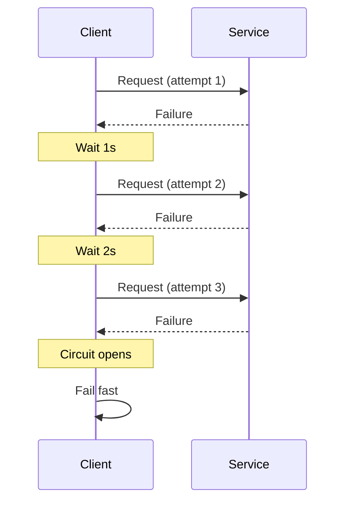
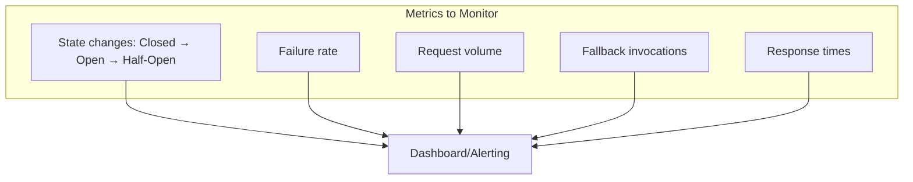

# Circuit Breakers

## Overview

The circuit breaker pattern **prevents cascading failures** in distributed systems by detecting when a service is failing and temporarily stopping requests to it. Like an electrical circuit breaker, it "trips" when too many failures are detected, allowing the failing service time to recover. This pattern is essential for building resilient microservices.

## The Problem

```mermaid
graph TD
    subgraph "Without Circuit Breaker (Cascading Failure)"
        A[Service A] -->|"Call"| B[Service B (failing)]
        B -->|"Timeout 30s"| A
        A -->|"Call"| B
        B -->|"Timeout 30s"| A
        A -->|"Resources exhausted"| X[Service A also fails!]
        X -->|"Call"| C[Service C]
        C -->|"Fails"| X
    end
```

## Circuit Breaker States



### Closed State (Normal Operation)



- All requests pass through to the service
- Failures are counted
- If failures exceed threshold, transition to Open

### Open State (Failing Fast)



- All requests fail immediately without calling the service
- Returns a fallback response
- After timeout, transitions to Half-Open

### Half-Open State (Testing Recovery)



- Allows limited test requests to the service
- If successful, transitions to Closed
- If failed, transitions back to Open

## Implementation

```python
import time
from enum import Enum

class State(Enum):
    CLOSED = "closed"
    OPEN = "open"
    HALF_OPEN = "half_open"

class CircuitBreaker:
    def __init__(self, failure_threshold=5, timeout=30, 
                 half_open_max=3):
        self.state = State.CLOSED
        self.failure_count = 0
        self.failure_threshold = failure_threshold
        self.timeout = timeout
        self.half_open_max = half_open_max
        self.half_open_count = 0
        self.last_failure_time = None
    
    def call(self, func, *args, **kwargs):
        if self.state == State.OPEN:
            if time.time() - self.last_failure_time >= self.timeout:
                self.state = State.HALF_OPEN
                self.half_open_count = 0
            else:
                raise CircuitOpenError("Circuit breaker is OPEN")
        
        if self.state == State.HALF_OPEN:
            if self.half_open_count >= self.half_open_max:
                raise CircuitOpenError("Half-open limit reached")
            self.half_open_count += 1
        
        try:
            result = func(*args, **kwargs)
            self._on_success()
            return result
        except Exception as e:
            self._on_failure()
            raise
    
    def _on_success(self):
        if self.state == State.HALF_OPEN:
            self.state = State.CLOSED
            self.failure_count = 0
    
    def _on_failure(self):
        self.failure_count += 1
        self.last_failure_time = time.time()
        if self.failure_count >= self.failure_threshold:
            self.state = State.OPEN

class CircuitOpenError(Exception):
    pass
```

## Using Circuit Breakers

```python
# With a circuit breaker
breaker = CircuitBreaker(failure_threshold=5, timeout=30)

def get_user(user_id):
    try:
        return breaker.call(requests.get, 
                          f"http://user-service/users/{user_id}")
    except CircuitOpenError:
        # Return cached data or default
        return get_cached_user(user_id)
```

## Libraries

### resilience4j (Java)

```java
CircuitBreakerConfig config = CircuitBreakerConfig.custom()
    .failureRateThreshold(50)
    .waitDurationInOpenState(Duration.ofSeconds(30))
    .slidingWindowSize(10)
    .build();

CircuitBreaker circuitBreaker = CircuitBreaker.of("userService", config);

Supplier<String> decoratedSupplier = CircuitBreaker
    .decorateSupplier(circuitBreaker, () -> userService.getUser(id));

Try<String> result = Try.ofSupplier(decoratedSupplier)
    .recover(CallNotPermittedException.class, e -> "Fallback");
```

### Hystrix (Legacy, Netflix)

```java
@HystrixCommand(fallbackMethod = "getUserFallback",
    commandProperties = {
        @HystrixProperty(name = "circuitBreaker.requestVolumeThreshold", value = "10"),
        @HystrixProperty(name = "circuitBreaker.errorThresholdPercentage", value = "50"),
        @HystrixProperty(name = "circuitBreaker.sleepWindowInMilliseconds", value = "5000")
    })
public User getUser(String id) {
    return restTemplate.getForObject("http://user-service/users/" + id, User.class);
}

public User getUserFallback(String id) {
    return new User(id, "Default User");
}
```

### Polly (C#)

```csharp
var circuitBreakerPolicy = Policy
    .Handle<HttpRequestException>()
    .CircuitBreakerAsync(
        exceptionsAllowedBeforeBreaking: 5,
        durationOfBreak: TimeSpan.FromSeconds(30)
    );

await circuitBreakerPolicy.ExecuteAsync(() => 
    httpClient.GetAsync("http://user-service/users/1"));
```

## Configuration Parameters

| Parameter | Description | Typical Value |
|-----------|-------------|---------------|
| **Failure threshold** | Failures before opening | 5-10 |
| **Error rate threshold** | % errors before opening | 50% |
| **Timeout** | Time in open state | 30-60 seconds |
| **Sliding window** | Sample size for rate | 10-100 requests |
| **Half-open max** | Test requests in half-open | 1-5 |

## Advanced Patterns

### Bulkhead Pattern

```mermaid
graph TD
    subgraph "Bulkhead (Isolation)"
        S1[Service A] --> T1[Thread Pool A (10)]
        S2[Service B] --> T2[Thread Pool B (10)]
        S3[Service C] --> T3[Thread Pool C (10)]
        
        T1 -.->|"Isolated"| T2
        T2 -.->|"Isolated"| T3
    end
```

Isolate failures to prevent one slow service from consuming all resources.

### Retry with Exponential Backoff



### Fallback Strategies

```python
def get_user_with_fallback(user_id):
    try:
        return breaker.call(get_user_from_service, user_id)
    except CircuitOpenError:
        # Strategy 1: Cached data
        cached = cache.get(f"user:{user_id}")
        if cached:
            return cached
        
        # Strategy 2: Default value
        return User(id=user_id, name="Unknown")
        
        # Strategy 3: Degraded response
        return User(id=user_id, name="Service unavailable")
```

## Monitoring Circuit Breakers



## Interview Questions

1. **What is the circuit breaker pattern?**
   - A resilience pattern that prevents cascading failures. When a service fails repeatedly, the circuit "opens" and requests fail fast without calling the service. After a timeout, it "half-opens" to test recovery.

2. **What are the states of a circuit breaker?**
   - Closed: normal operation, counting failures. Open: all requests fail fast. Half-open: limited test requests to check recovery.

3. **How does a circuit breaker differ from a timeout?**
   - Timeout: waits for a response and fails if too slow. Circuit breaker: stops calling the service entirely after too many failures. They complement each other.

4. **What is the bulkhead pattern?**
   - Isolating resources (thread pools, connection pools) per service. If one service is slow, it only consumes its own pool, not affecting other services.

5. **How do you implement fallbacks with circuit breakers?**
   - Return cached data, default values, or degraded responses when the circuit is open. The fallback strategy depends on business requirements.

6. **What is the difference between Hystrix and resilience4j?**
   - Hystrix: Netflix's library (now in maintenance mode). resilience4j: modern replacement with functional API, more configuration options, and better performance.

## Common Mistakes

- Setting **threshold too low** — circuit opens on transient failures
- Setting **timeout too short** — service doesn't have time to recover
- Not implementing **fallbacks** — circuit breaker returns errors without alternatives
- Not **monitoring** circuit breaker state changes
- Using circuit breakers for **every call** — adds overhead for reliable services
- Forgetting about **retry** — combine with exponential backoff

## Summary

Circuit breakers prevent cascading failures by detecting failing services and stopping requests temporarily. The three states (closed, open, half-open) manage the lifecycle of failure detection and recovery. Combined with bulkheads, retries, and fallbacks, circuit breakers are essential for building resilient microservices.

## Cross-References

- [Microservices Overview](README.md) — Microservices architecture
- [Service Discovery](discovery.md) — Finding services
- [API Gateways](api-gateways.md) — Entry point with circuit breakers
- [Observability](observability.md) — Monitoring circuit breakers
- [Message Queues](../messaging/queues.md) — Async alternative to sync calls
