# Service Discovery

## Overview

Service discovery is the mechanism by which services in a distributed system **find and communicate with each other**. In microservices architectures, where services are dynamically deployed, scaled, and replaced, hardcoded addresses don't work. Service discovery provides a registry where services register themselves and look up other services.

## The Problem

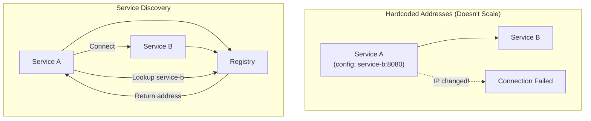

## Service Discovery Patterns

### Client-Side Discovery

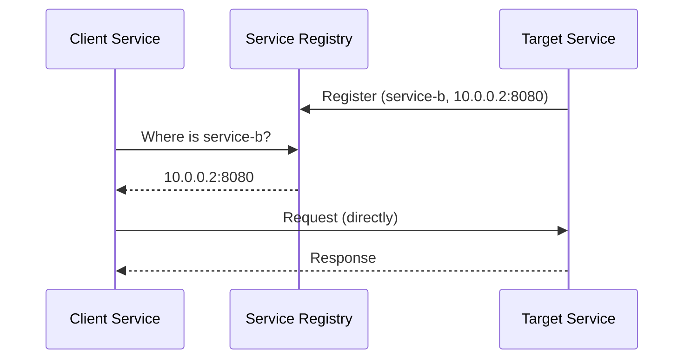

**Pros**: Client can implement custom load balancing
**Cons**: Client coupled to registry; logic in every service

### Server-Side Discovery

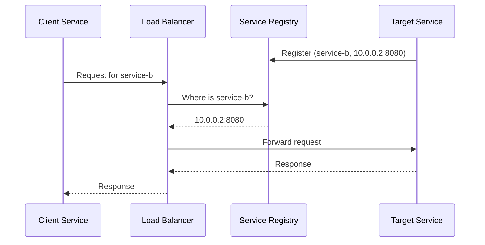

**Pros**: Client is simple; central load balancing
**Cons**: Extra hop; LB is a potential bottleneck

## Registration Methods

### Self-Registration

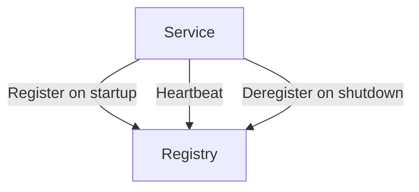

### Third-Party Registration

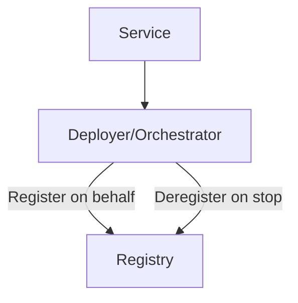

## Health Checking

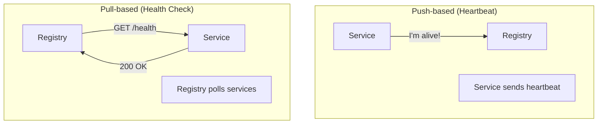

| Method | Pros | Cons |
|--------|------|------|
| **Push** | Low latency detection | Service must be configured |
| **Pull** | Centralized control | Polling interval = detection delay |

## Service Discovery Tools

### Consul

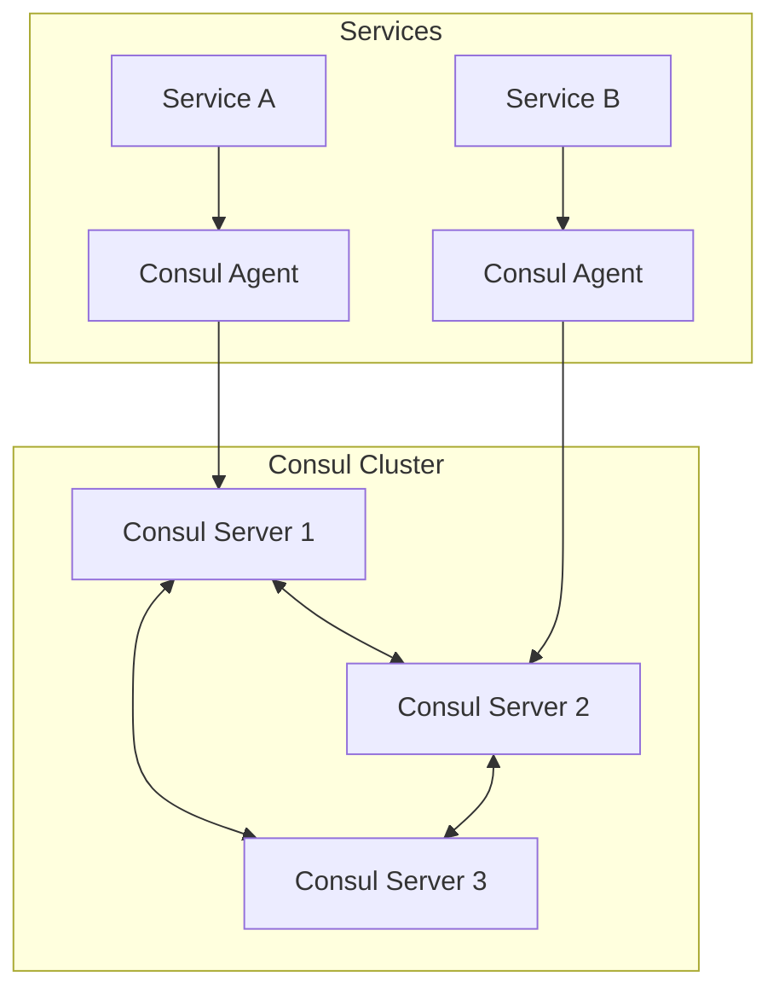

**Features**: Service discovery, health checking, KV store, multi-datacenter

```bash
# Register service
curl -X PUT http://localhost:8500/v1/agent/service/register \
  -d '{"name": "web", "port": 8080, "check": {"http": "http://localhost:8080/health", "interval": "10s"}}'

# Discover service
curl http://localhost:8500/v1/catalog/service/web
```

### Eureka

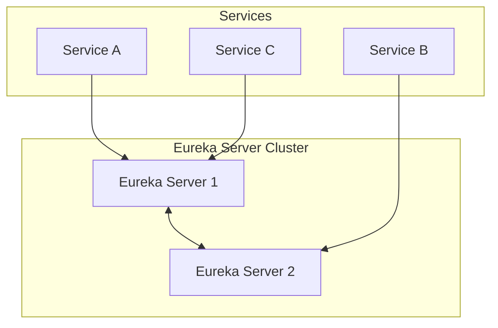

**Features**: Service discovery, health checking, REST-based

```java
// Registration (Spring Boot)
@SpringBootApplication
@EnableEurekaClient
public class ServiceAApplication { }

// Discovery
@Autowired
private DiscoveryClient discoveryClient;

List<ServiceInstance> instances = 
    discoveryClient.getInstances("service-b");
```

### etcd / ZooKeeper

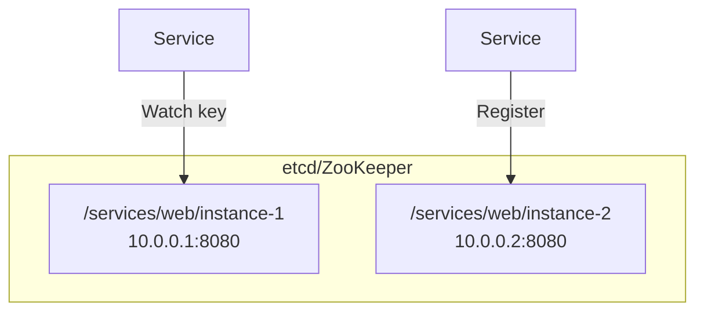

**Features**: Distributed KV store, strong consistency, watches

## DNS-Based Discovery

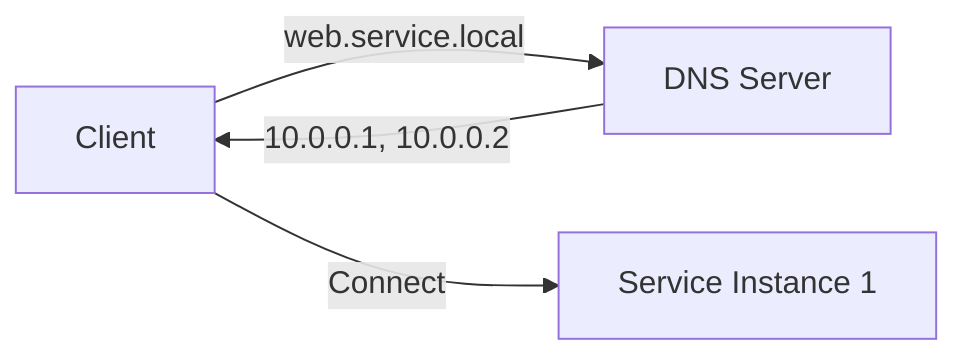

```bash
# SRV record for service discovery
_web._tcp.service.local.  IN SRV 0 0 8080 instance1.service.local.
_web._tcp.service.local.  IN SRV 0 0 8080 instance2.service.local.
```

**Pros**: Works with any language; no SDK needed
**Cons**: DNS caching; TTL-based updates are slow

## Comparison

| Tool | Consistency | Health Check | KV Store | Multi-DC |
|------|------------|--------------|----------|----------|
| **Consul** | Strong (Raft) | Yes | Yes | Yes |
| **Eureka** | Eventual | Yes | No | No |
| **etcd** | Strong (Raft) | TTL-based | Yes | No |
| **ZooKeeper** | Strong (ZAB) | Session-based | Yes | No |
| **DNS** | N/A | No | No | Yes |

## Kubernetes Service Discovery

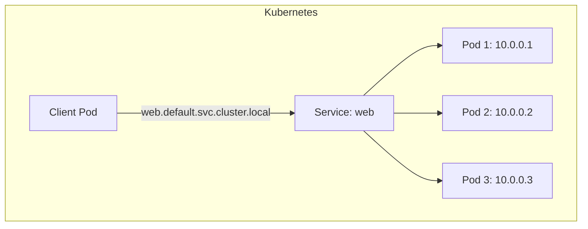

```yaml
# Service definition
apiVersion: v1
kind: Service
metadata:
  name: web
spec:
  selector:
    app: web
  ports:
    - port: 80
      targetPort: 8080
---
# DNS: web.default.svc.cluster.local
```

## Interview Questions

1. **What is service discovery and why is it needed?**
   - The mechanism for services to find each other dynamically. Needed because in microservices, services are deployed, scaled, and replaced dynamically — hardcoded addresses don't work.

2. **What is the difference between client-side and server-side discovery?**
   - Client-side: client queries registry and connects directly (custom load balancing). Server-side: client goes through a load balancer that queries registry (simpler client).

3. **How does Consul handle service discovery?**
   - Services register with Consul agents. Agents perform health checks. Clients query Consul for healthy instances. Consul uses Raft for strong consistency and supports multi-datacenter replication.

4. **What is the role of health checking in service discovery?**
   - Ensures only healthy instances are returned. Push-based: services send heartbeats. Pull-based: registry polls health endpoints. Unhealthy instances are removed from the registry.

5. **How does Kubernetes handle service discovery?**
   - Kubernetes provides built-in service discovery through Services and DNS. Each service gets a DNS name (web.default.svc.cluster.local). kube-proxy handles routing to healthy pods.

## Common Mistakes

- Not implementing **health checks** — registry returns dead instances
- Using **DNS without low TTL** — stale records cause connection failures
- Not handling **registry failures** — service discovery becomes a single point of failure
- **Hardcoding** service addresses in configuration
- Not considering **multi-datacenter** scenarios
- Forgetting about **client-side caching** — reduces registry load but may return stale data

## Summary

Service discovery enables dynamic communication between microservices. Client-side discovery gives clients control over load balancing; server-side discovery simplifies clients. Tools like Consul, Eureka, etcd, and Kubernetes provide different trade-offs in consistency, features, and complexity. Health checking ensures only healthy instances are discoverable.

## Cross-References

- [Microservices Overview](README.md) — Microservices architecture
- [Circuit Breakers](circuit-breakers.md) — Handling service failures
- [API Gateways](api-gateways.md) — Entry point for clients
- [Observability](observability.md) — Monitoring services
- [Consensus Algorithms](../consensus/README.md) — Used by Consul, etcd
- [Consistent Hashing](../partitioning/consistent-hashing.md) — Load balancing
