# Observability

## Overview

Observability is the ability to understand the **internal state of a system** from its external outputs. In distributed systems, where a single request may traverse dozens of services, observability is essential for debugging, performance optimization, and incident response. It's built on three pillars: **metrics**, **logging**, and **tracing**.

## The Three Pillars

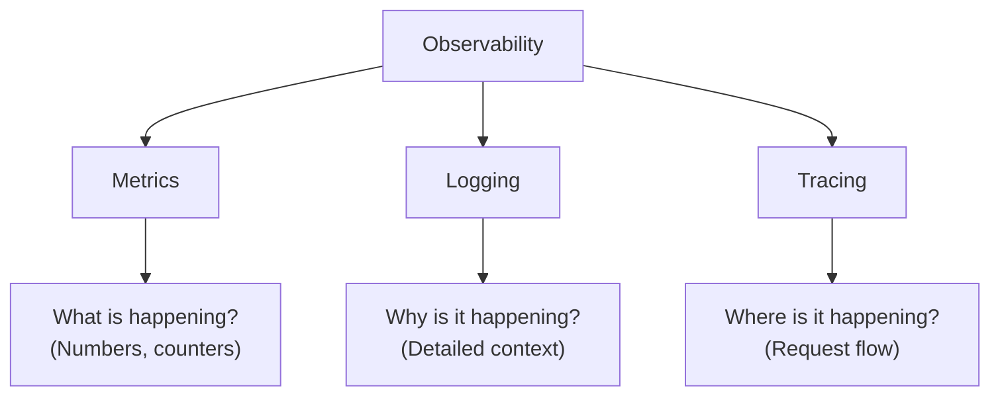

| Pillar | Question | Example | Tools |
|--------|----------|---------|-------|
| **Metrics** | What is happening? | CPU 80%, latency 200ms | Prometheus, Grafana |
| **Logging** | Why is it happening? | "Database connection timeout" | ELK, Loki |
| **Tracing** | Where is it happening? | Request flow across services | Jaeger, Zipkin |

## Metrics

Metrics are **numerical measurements** collected over time:

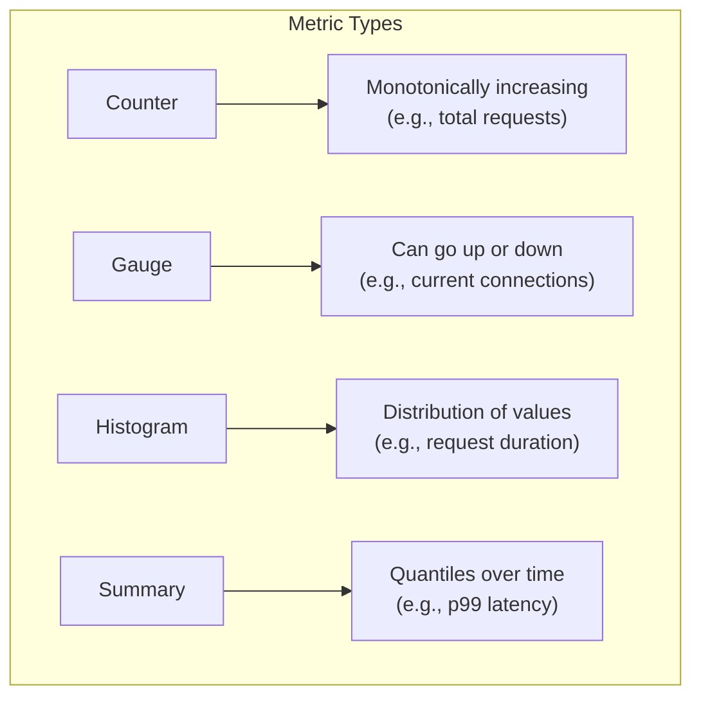

### Prometheus

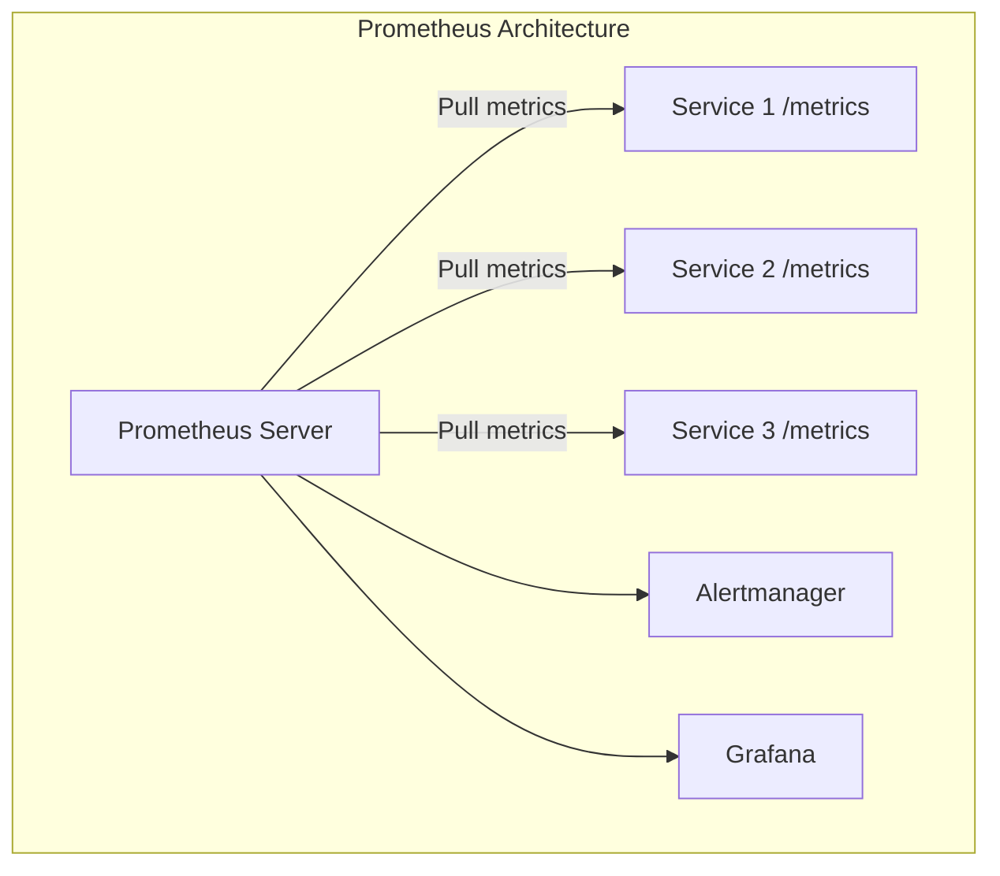

```python
# Python: Expose metrics
from prometheus_client import Counter, Histogram, start_http_server

REQUEST_COUNT = Counter('http_requests_total', 
                       'Total HTTP requests',
                       ['method', 'endpoint', 'status'])

REQUEST_LATENCY = Histogram('http_request_duration_seconds',
                           'Request latency in seconds',
                           ['method', 'endpoint'])

@app.route('/api/users')
def get_users():
    with REQUEST_LATENCY.labels(method='GET', endpoint='/api/users').time():
        result = do_work()
        REQUEST_COUNT.labels(method='GET', endpoint='/api/users', 
                           status=200).inc()
        return result

# Expose metrics endpoint
start_http_server(8000)  # /metrics
```

### Key Metrics (RED Method)

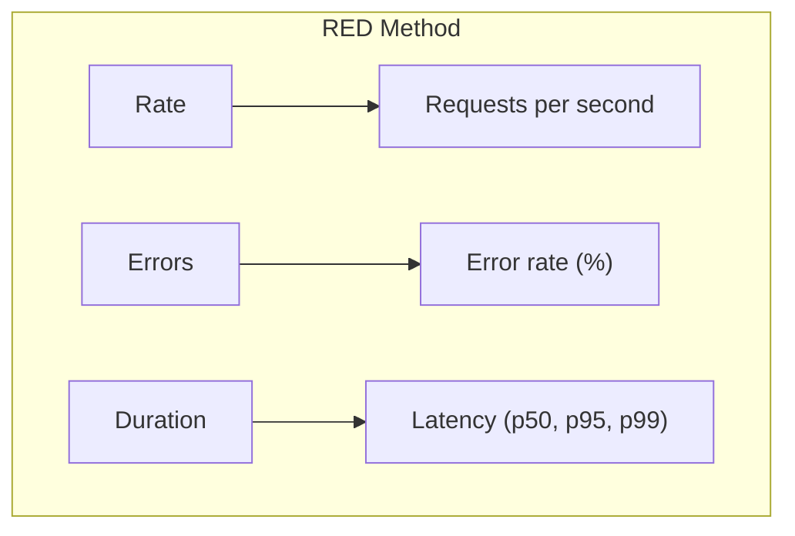

### Key Metrics (USE Method)

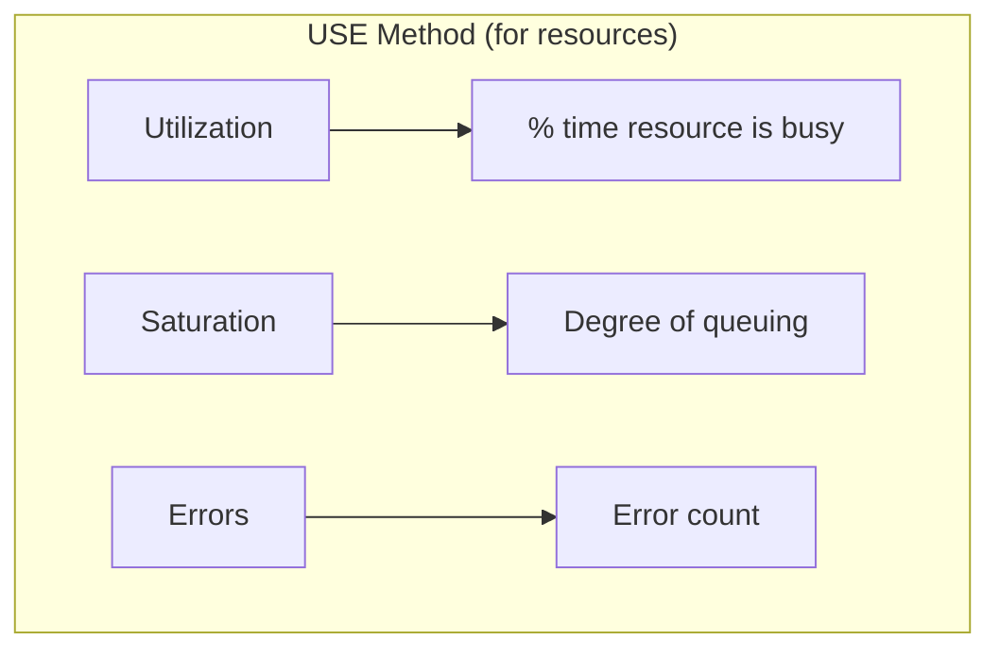

### Grafana Dashboard

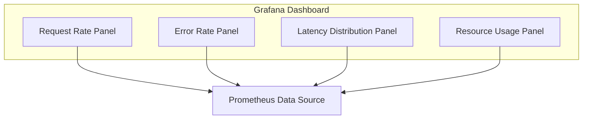

## Logging

Logs are **discrete event records** with timestamps and context:

### Structured Logging

```python
import structlog

logger = structlog.get_logger()

# Bad: unstructured
logger.info("User login successful")

# Good: structured
logger.info("user_login", 
           user_id="123",
           ip="192.168.1.1",
           duration_ms=45,
           status="success")
```

### Log Aggregation (ELK Stack)

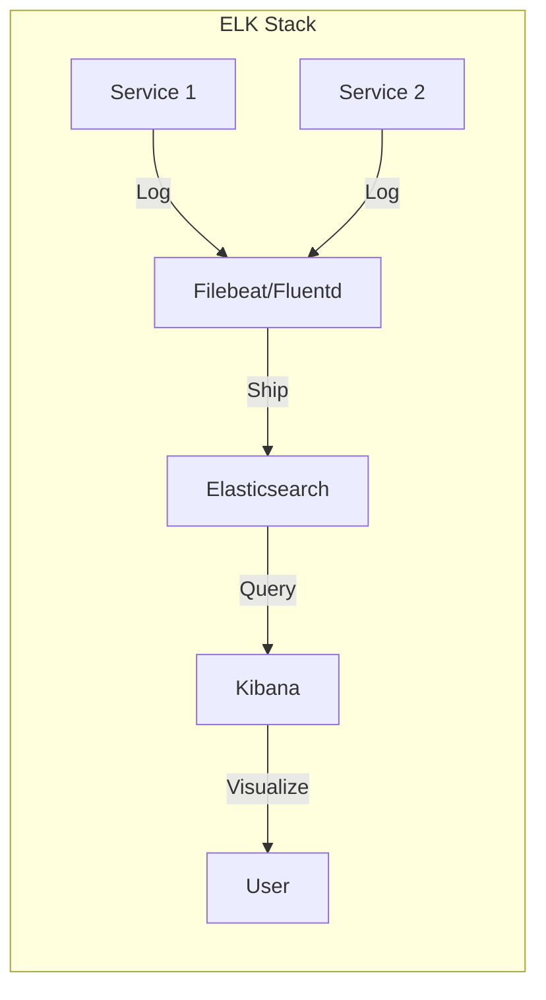

### Log Levels

| Level | Use Case | Example |
|-------|----------|---------|
| **ERROR** | Failures requiring attention | Database connection failed |
| **WARN** | Potential issues | High latency detected |
| **INFO** | Normal operations | Request processed |
| **DEBUG** | Detailed debugging | SQL query executed |

### Correlation IDs

```python
# Include correlation ID in all logs
@app.before_request
def before_request():
    g.correlation_id = request.headers.get('X-Request-ID', str(uuid.uuid4()))

@app.route('/api/users')
def get_users():
    logger.info("processing_request", 
               correlation_id=g.correlation_id,
               endpoint="/api/users")
    # Pass correlation_id to downstream services
    headers = {'X-Request-ID': g.correlation_id}
    response = requests.get("http://user-service/users", headers=headers)
    return response
```

## Distributed Tracing

Tracing tracks a **request as it flows through multiple services**:

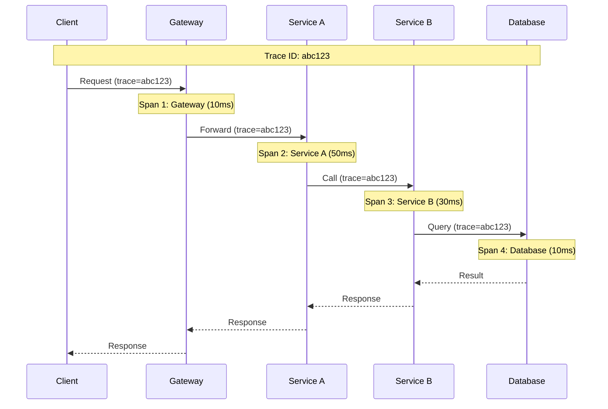

### Trace Structure

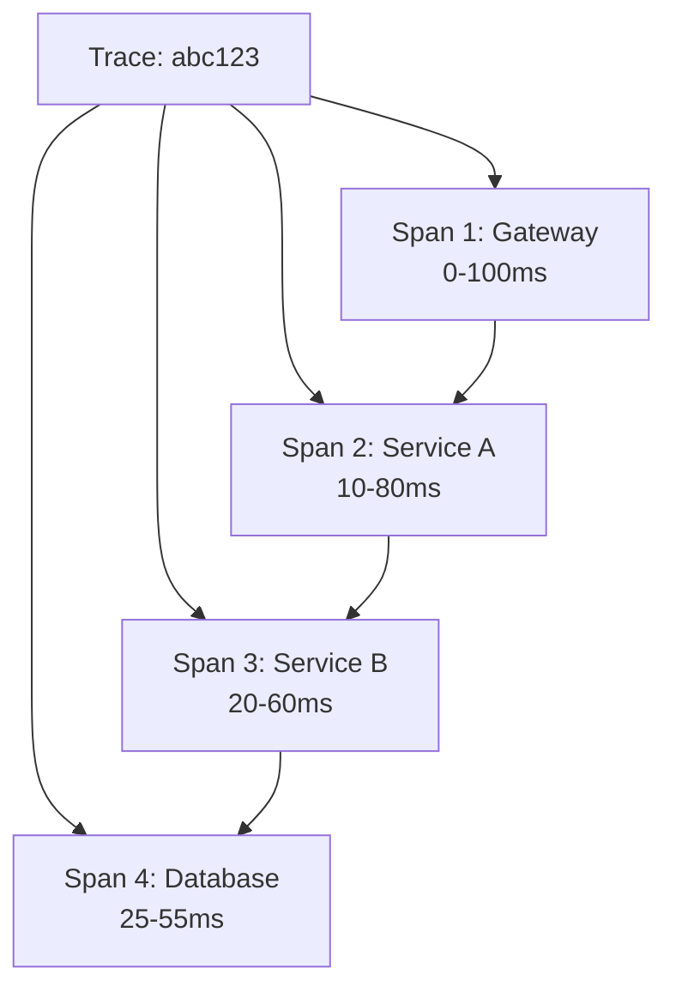

### OpenTelemetry

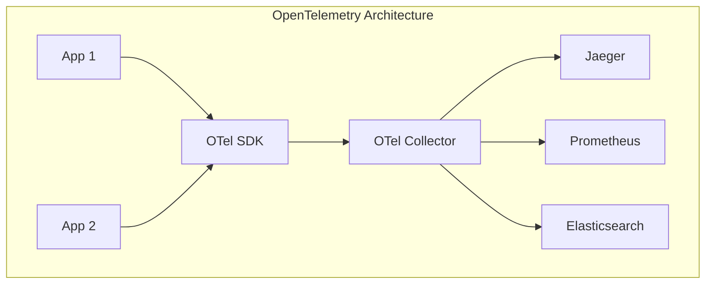

```python
# Python: OpenTelemetry tracing
from opentelemetry import trace
from opentelemetry.sdk.trace import TracerProvider
from opentelemetry.sdk.trace.export import BatchSpanProcessor
from opentelemetry.exporter.jaeger.thrift import JaegerExporter

# Setup
provider = TracerProvider()
jaeger_exporter = JaegerExporter(agent_host_name="localhost", 
                                  agent_port=6831)
provider.add_span_processor(BatchSpanProcessor(jaeger_exporter))
trace.set_tracer_provider(provider)

tracer = trace.get_tracer(__name__)

# Create spans
@app.route('/api/users')
def get_users():
    with tracer.start_as_current_span("get_users") as span:
        span.set_attribute("user.count", 100)
        
        with tracer.start_as_current_span("query_database"):
            users = db.query("SELECT * FROM users")
        
        return users
```

## Alerting

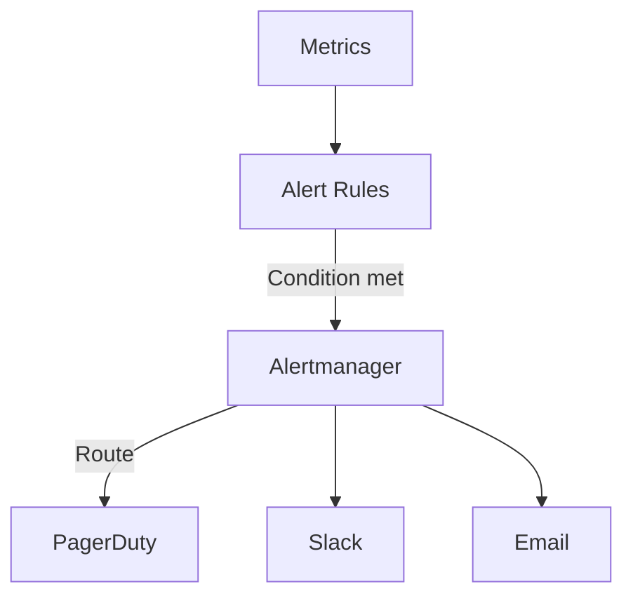

### Alert Examples

```yaml
# Prometheus alert rules
groups:
  - name: api_alerts
    rules:
      - alert: HighErrorRate
        expr: rate(http_requests_total{status=~"5.."}[5m]) / 
              rate(http_requests_total[5m]) > 0.05
        for: 5m
        labels:
          severity: critical
        annotations:
          summary: "High error rate (>5%)"
          
      - alert: HighLatency
        expr: histogram_quantile(0.99, 
              rate(http_request_duration_seconds_bucket[5m])) > 1
        for: 5m
        labels:
          severity: warning
        annotations:
          summary: "p99 latency > 1 second"
```

## Service Mesh Observability

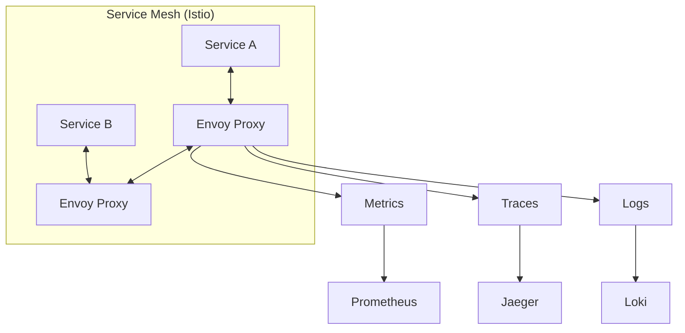

## Observability Tools Comparison

| Tool | Type | Strengths |
|------|------|-----------|
| **Prometheus** | Metrics | Pull-based, PromQL, alerting |
| **Grafana** | Visualization | Dashboards, multiple data sources |
| **ELK Stack** | Logging | Search, analysis, visualization |
| **Loki** | Logging | Lightweight, Grafana integration |
| **Jaeger** | Tracing | Distributed tracing, analysis |
| **Zipkin** | Tracing | Simple, Twitter-origin |
| **Datadog** | All-in-one | Managed, comprehensive |
| **New Relic** | All-in-one | APM, infrastructure |

## Interview Questions

1. **What are the three pillars of observability?**
   - Metrics: numerical measurements over time (what). Logging: discrete event records (why). Tracing: request flow across services (where). Together they provide complete system visibility.

2. **What is the RED method?**
   - Rate: requests per second. Errors: error rate. Duration: latency percentiles. Focuses on user-facing service health.

3. **What is the USE method?**
   - Utilization: resource busy time. Saturation: queuing degree. Errors: error count. Focuses on resource health (CPU, memory, disk).

4. **What is distributed tracing?**
   - Tracking a request as it flows through multiple services. Each service creates a span. Spans are collected into a trace. Helps debug latency and failures in microservices.

5. **What is OpenTelemetry?**
   - A vendor-neutral observability framework that provides APIs, SDKs, and tools for generating and collecting metrics, logs, and traces. Replaces OpenTracing and OpenCensus.

6. **How do you handle observability in microservices?**
   - Use structured logging with correlation IDs. Collect metrics using Prometheus. Implement distributed tracing with OpenTelemetry. Aggregate logs with ELK/Loki. Set up alerting for anomalies.

## Common Mistakes

- Not using **structured logging** — unstructured logs are hard to search
- Missing **correlation IDs** — can't trace requests across services
- Too many **metrics** — dashboard overload, focus on key indicators
- Not setting **alert thresholds** properly — too many false positives
- Ignoring **cardinality** — high-cardinality labels explode storage
- Not **sampling traces** — full tracing is expensive at scale

## Summary

Observability is essential for operating distributed systems. Metrics provide numerical health indicators, logging provides detailed context, and tracing tracks request flow. Tools like Prometheus, Grafana, ELK, and Jaeger form the observability stack. OpenTelemetry provides a vendor-neutral framework. Proper alerting ensures incidents are detected and resolved quickly.

## Cross-References

- [Microservices Overview](README.md) — Microservices architecture
- [Service Discovery](discovery.md) — Health checking
- [Circuit Breakers](circuit-breakers.md) — Monitoring circuit state
- [API Gateways](api-gateways.md) — Gateway metrics and logging
- [Stream Processing](../mapreduce/streaming.md) — Processing observability data
- [Message Queues](../messaging/queues.md) — Queue monitoring
