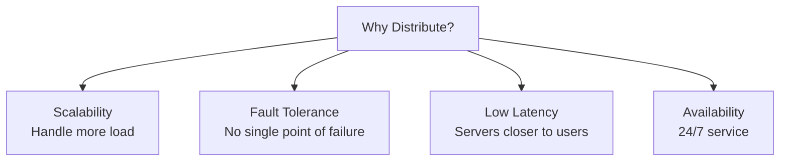
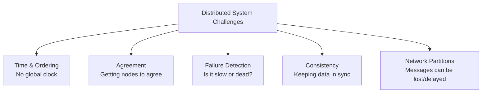

# Distributed Systems Overview

## Overview

A **distributed system** is a collection of independent computers that appears to its users as a single coherent system. These computers communicate and coordinate their actions by passing messages over a network. Distributed systems enable scalability, fault tolerance, and geographic distribution, but introduce fundamental challenges around consistency, coordination, and failure handling.

## Why Distributed Systems?

| Need | Single Machine | Distributed System |
|------|---------------|-------------------|
| **Scale** | Vertical (bigger machine) | Horizontal (more machines) |
| **Fault Tolerance** | Single point of failure | Redundancy across machines |
| **Latency** | One location | Edge servers worldwide |
| **Availability** | Limited by one machine | Survives individual failures |

## Fundamental Challenges

### The Eight Fallacies of Distributed Computing

Peter Deutsch's fallacies (1994):

1. **The network is reliable** — It isn't. Messages get lost, connections drop.
2. **Latency is zero** — It isn't. Cross-datacenter communication takes milliseconds.
3. **Bandwidth is infinite** — It isn't. Network congestion is real.
4. **The network is secure** — It isn't. Every communication can be intercepted.
5. **Topology doesn't change** — It does. Nodes join and leave constantly.
6. **There is one administrator** — There isn't. Multiple teams manage different parts.
7. **Transport cost is zero** — It isn't. Serialization, encryption, and routing cost CPU and time.
8. **The network is homogeneous** — It isn't. Different hardware, protocols, and configurations.

## Topics in This Section

| Topic | Description |
|-------|-------------|
| [CAP Theorem](./fundamentals/cap.md) | Consistency, Availability, Partition Tolerance — pick two |
| [FLP Impossibility](./fundamentals/flp.md) | Why deterministic consensus is impossible in asynchronous systems |
| [Consistency Models](./fundamentals/consistency.md) | Strong, eventual, causal, and more |
| [Time and Ordering](./fundamentals/time.md) | Physical clocks, logical clocks, happens-before |
| [Lamport Clocks](./fundamentals/lamport.md) | Logical clocks for event ordering |
| [Vector Clocks](./fundamentals/vector-clocks.md) | Capturing causal relationships |

## Real-World Distributed Systems

| System | Type | Scale |
|--------|------|-------|
| **Google Search** | Web service | Billions of queries/day |
| **Amazon DynamoDB** | Distributed database | Trillions of requests/day |
| **Apache Kafka** | Message streaming | Trillions of events/day |
| **Netflix** | Content delivery | 200+ million subscribers |
| **Bitcoin** | Blockchain | ~18,000 reachable nodes worldwide (hundreds of thousands including non-listening) |

## Interview Focus

- Explain the CAP theorem and its real-world implications
- Describe the difference between consistency models
- Explain why distributed consensus is hard
- Describe how vector clocks capture causality
- Give examples of distributed systems you use daily

## Cross References

- [CAP Theorem](fundamentals/cap.md)
- [Consistency Models](fundamentals/consistency.md)
- [Consensus](consensus/README.md)
- [Replication](replication/README.md)
- [Cloud Overview](../cloud/overview.md)
