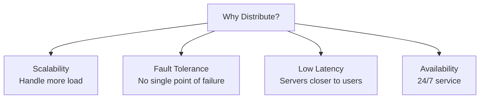
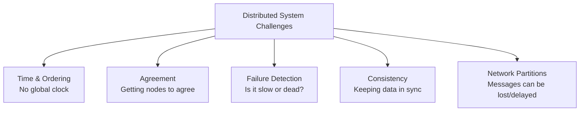
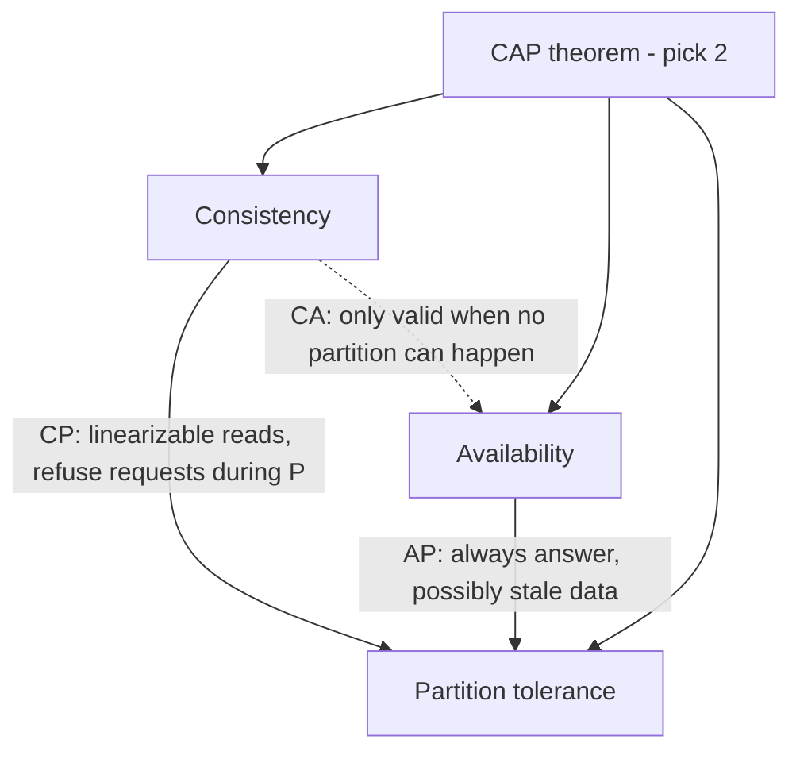

# Distributed Systems Overview

## Overview

A **distributed system** is a collection of independent computers that appears to its users as a single coherent system. These computers communicate and coordinate their actions by passing messages over a network. Distributed systems enable scalability, fault tolerance, and geographic distribution, but introduce fundamental challenges around consistency, coordination, and failure handling.

## Why Distributed Systems?

```mermaid
graph TB
    REASONS[Why Distribute?] --> SCALE[Scalability<br/>Handle more load]
    REASONS --> FAULT[Fault Tolerance<br/>No single point of failure]
    REASONS --> LATENCY[Low Latency<br/>Servers closer to users]
    REASONS --> AVAIL[Availability<br/>24/7 service]
```

| Need | Single Machine | Distributed System |
|------|---------------|-------------------|
| **Scale** | Vertical (bigger machine) | Horizontal (more machines) |
| **Fault Tolerance** | Single point of failure | Redundancy across machines |
| **Latency** | One location | Edge servers worldwide |
| **Availability** | Limited by one machine | Survives individual failures |

## Core Definitions

Four terms carry specific technical meanings in interviews; using them loosely ("we scale by adding servers") reads as junior. Anchor each to a measurement and a design decision.

| Term | Precise meaning | How it's measured | Design lever |
|---|---|---|---|
| **Scalability** | Capacity grows (ideally linearly) with resources added | Throughput/latency vs node count; Amdahl's law caps it | Partitioning/sharding the state; stateless frontends |
| **Availability** | Fraction of time the system answers correctly | \\( A = \\frac{MTBF}{MTBF + MTTR} \\) — "three nines" = 99.9% ≈ 8.7 h downtime/year | Redundancy + failover; health checks; graceful degradation |
| **Consistency** | What order/visibility anomalies concurrent reads may see | The chosen consistency model (linearizable → eventual) | Quorums, consensus protocols, conflict resolution (CRDTs, LWW) |
| **Partition tolerance** | The system survives arbitrary message loss/delay between nodes | By construction — networks *will* partition | Redundant paths, timeouts, retry/fencing; decides C-vs-A under P |

The subtle point interviewers probe: **partition tolerance is not optional**. Scalability and availability are goals you trade off; partitions are a physical fact, which is why CAP really says "when P happens, choose C or A" (see the diagram below).

## Fundamental Challenges

```mermaid
graph TB
    CHALLENGES[Distributed System Challenges] --> TIME[Time & Ordering<br/>No global clock]
    CHALLENGES --> CONSENSUS[Agreement<br/>Getting nodes to agree]
    CHALLENGES --> FAILURE[Failure Detection<br/>Is it slow or dead?]
    CHALLENGES --> CONSISTENCY[Consistency<br/>Keeping data in sync]
    CHALLENGES --> PARTITION[Network Partitions<br/>Messages can be lost/delayed]
```

### The Eight Fallacies of Distributed Computing

Peter Deutsch's fallacies (1994):

1. **The network is reliable** — It isn't. Messages get lost, connections drop.
2. **Latency is zero** — It isn't. Cross-datacenter communication takes milliseconds.
3. **Bandwidth is infinite** — It isn't. Network congestion is real.
4. **The network is secure** — It isn't. Every communication can be intercepted.
5. **Topology doesn't change** — It does. Nodes join and leave constantly.
6. **There is one administrator** — There isn't. Multiple teams manage different parts.
7. **Transport cost is zero** — It isn't. Serialization, encryption, and routing cost CPU and time.
8. **The network is homogeneous** — It isn't. Different hardware, protocols, and configurations.

Each fallacy has a canonical production countermeasure; naming the mitigation (not just "it's wrong") is what makes the list an interview weapon rather than trivia.

| # | Fallacy | Production reality | Standard mitigation |
|---|---|---|---|
| 1 | Network is reliable | Links flap, switches reboot, GC pauses read as dead peers | Retries with backoff + idempotency keys, replication |
| 2 | Latency is zero | 1 cross-region round trip ≈ 30–150 ms; tail latencies 10× the median | Co-locate, cache, batch, async/prefetch, avoid chatty protocols (N+1 RPCs) |
| 3 | Bandwidth is infinite | Backups saturate links; replication storms crush tenants | Compression, incremental sync (Merkle trees), rate limiting |
| 4 | Network is secure | Any hop can sniff/inject; insider + BGP hijack threats | TLS/mTLS everywhere, zero-trust, authn/authz on every call |
| 5 | Topology doesn't change | Autoscaling, deployments, failures reshuffle IPs hourly | Service discovery, load-balancer health checks, leader election |
| 6 | One administrator | App team + network team + vendor SaaS with separate SLAs | Explicit contracts (SLAs/SLOs), chaos testing, clear ownership |
| 7 | Transport cost is zero | Serialization dominates CPU at scale; schema bloats payloads | Compact formats (protobuf/Avro), schema registry, columnar batching |
| 8 | Network is homogeneous | TCP vs RDMA, IPv4/IPv6, cloud↔on-prem links with different MTUs | Abstract behind stable interfaces, test multi-environment, avoid vendor-locked protocol assumptions |

## The Consistency Models Ladder

CAP's "C" is the top rung of a ladder; most interviews ask you to place a workload on it. Know what each rung forbids, which system defaults there, and the mechanism that implements it.

| Model | Guarantee (what it forbids) | Typical implementation | Default home |
|---|---|---|---|
| Linearizability | Acts as one atomic copy; reads see latest completed write | Consensus (Raft/Paxos) on the read path, leases | etcd, ZooKeeper, Spanner |
| Sequential | Same total order everywhere; order need not match real time | Single-leader ordering, sequence numbers | Kafka partitions, primary-replica DBs |
| Causal | Causes are seen before effects; concurrent writes may reorder | Vector clocks, HLCs | Dynamo-style stores, MongoDB (per-doc) |
| Read-your-writes | Your own writes are visible to your next reads | Sticky sessions, session tokens | Logged-in user data on AP stores |
| Eventual | Replicas converge *eventually*; any read may lag | Anti-entropy, read repair, CRDT merge | Cassandra, Riak, DNS caches |

The ladder pays rent in design interviews: a shopping cart wants read-your-writes for the buyer and eventual consistency for everyone else; a lock service wants linearizability; a social feed usually accepts causal. Answering "which rung, which mechanism, why is the weaker rung cheaper?" is the senior signal.

## Failure-Mode Dictionary

Vocabulary precision matters as much as the algorithms — these are the failure classes the theory assumes, in increasing severity:

| Failure | Definition | Canonical defense |
|---|---|---|
| **Crash (fail-stop)** | Node halts cleanly and stops; state lost or preserved but no wrong output | Checkpoints + consensus with stable storage |
| **Omission** | Message sent but never arrives (dropped, delayed beyond timeout) | Retries + idempotency, acknowledgments |
| **Timing** | Bounds on latency are violated (asynchronous reality) | Leases expire, timeouts + failure detectors |
| **Byzantine** | Node sends arbitrary/malicious messages | \\( 3f + 1 \\) replicas, PBFT/HotStuff-class BFT quorums |
| **Partition** | A subset of nodes is cut off but keeps running | CAP decision per workload; fencing tokens |

Note that real clouds are crash-plus-omission systems almost all the time and byzantine almost never — which is why Raft suffices for most infrastructure and BFT remains a niche (blockchains, safety-critical federations). That scoping argument is itself a favorite senior question.

## CAP Theorem in One Diagram

CAP (Gilbert & Lynch, 2002): a distributed data store can guarantee at most two of **Consistency**, **Availability**, and **Partition tolerance** — and since partitions are unavoidable in any real network, the actual choice is C vs A *during* a partition.

```mermaid
graph TD
    CAP["CAP theorem - pick 2"] --> C["Consistency"]
    CAP --> A["Availability"]
    CAP --> P["Partition tolerance"]
    C -->|"CP: linearizable reads, refuse requests during P"| P
    A -->|"AP: always answer, possibly stale data"| P
    C -.->|"CA: only valid when no partition can happen"| A
```

The one-line system placements to memorize: **CP** — ZooKeeper, etcd, Spanner, HBase; **AP** — Cassandra, DynamoDB, Riak, Eureka. PACELC extends the story: even without partitions you choose between latency and consistency, which is why "eventual consistency with low latency" (AP/EL) and "sync replication with higher latency" (CP/EC) are both legitimate designs. Interviews frequently ask where the *nuance* is: real systems tune per-operation (Dynamo-style tunable quorums; Spanner offers read-only transactions without TrueTime waits), and CAP's C means linearizability, not the looser "consistency models" most apps need.

## Topics in This Section

| Topic | Description |
|-------|-------------|
| [CAP Theorem](./fundamentals/cap.md) | Consistency, Availability, Partition Tolerance — pick two |
| [FLP Impossibility](./fundamentals/flp.md) | Why deterministic consensus is impossible in asynchronous systems |
| [Consistency Models](./fundamentals/consistency.md) | Strong, eventual, causal, and more |
| [Time and Ordering](./fundamentals/time.md) | Physical clocks, logical clocks, happens-before |
| [Lamport Clocks](./fundamentals/lamport.md) | Logical clocks for event ordering |
| [Vector Clocks](./fundamentals/vector-clocks.md) | Capturing causal relationships |

## Reading Map

This section is large; navigate by layer. Start with `fundamentals/` for the theory every interviewer assumes, `advanced/` for the senior-level mechanisms, `systems/` for concrete architectures to cite as evidence, and `testing/` for the "how do you know it works" questions that close senior loops.

| Layer | Read for | Pages to hit first |
|---|---|---|
| [fundamentals/](./fundamentals/README.md) | CAP, consistency models, clocks, failure detection, FLP | [cap.md](./fundamentals/cap.md), [consistency.md](./fundamentals/consistency.md), [time.md](./fundamentals/time.md), [vector-clocks.md](./fundamentals/vector-clocks.md), [failure-detectors.md](./fundamentals/failure-detectors.md) |
| [consensus/](./consensus/README.md) | Raft/Paxos family — the agreement problem solved | [raft.md](./consensus/raft.md), [paxos.md](./consensus/paxos.md), [multi-paxos.md](./consensus/multi-paxos.md) |
| [replication/](./replication/README.md) | How copies stay in sync | [quorum.md](./replication/quorum.md), [primary-backup.md](./replication/primary-backup.md), [chain.md](./replication/chain.md) |
| [partitioning/](./partitioning/README.md) | How data spreads for scalability | [consistent-hashing.md](./partitioning/consistent-hashing.md), [range.md](./partitioning/range.md), [hash.md](./partitioning/hash.md) |
| [advanced/](./advanced/README.md) | Senior-signal mechanisms: CRDTs, HLCs, leases, anti-entropy, quorum math | [crdt-deep.md](./advanced/crdt-deep.md), [hybrid-logical-clocks.md](./advanced/hybrid-logical-clocks.md), [leases.md](./advanced/leases.md), [quorum-systems.md](./advanced/quorum-systems.md), [merkle-sync.md](./advanced/merkle-sync.md) |
| [systems/](./systems/README.md) | Real architectures to name-drop with specifics | [spanner-internals.md](./systems/spanner-internals.md), [etcd-internals.md](./systems/etcd-internals.md), [zookeeper-internals.md](./systems/zookeeper-internals.md), [cockroachdb-architecture.md](./systems/cockroachdb-architecture.md) |
| [messaging/](./messaging/README.md) | Decoupling with queues and streams | [kafka.md](./messaging/kafka.md), [pubsub.md](./messaging/pubsub.md), [rabbitmq.md](./messaging/rabbitmq.md) |
| [microservices/](./microservices/README.md) | Applying the theory to service meshes | [circuit-breakers.md](./microservices/circuit-breakers.md), [api-gateways.md](./microservices/api-gateways.md), [discovery.md](./microservices/discovery.md) |
| [testing/](./testing/README.md) | Verifying the guarantees above | [jepsen.md](./testing/jepsen.md), [deterministic-simulation.md](./testing/deterministic-simulation.md) |

A high-yield 3-day pass: day 1 — cap, consistency, time/vector-clocks, raft; day 2 — quorums + replication + partitioning; day 3 — one systems deep-dive (Spanner or etcd) plus jepsen for the verification story. That arc covers ~80% of distributed-systems interview questions end to end.

## Real-World Distributed Systems

| System | Type | Scale |
|--------|------|-------|
| **Google Search** | Web service | Billions of queries/day |
| **Amazon DynamoDB** | Distributed database | Trillions of requests/day |
| **Apache Kafka** | Message streaming | Trillions of events/day |
| **Netflix** | Content delivery | 200+ million subscribers |
| **Bitcoin** | Blockchain | ~18,000 reachable nodes worldwide (hundreds of thousands including non-listening) |

## Interview Focus

- Explain the CAP theorem and its real-world implications
- Describe the difference between consistency models
- Explain why distributed consensus is hard
- Describe how vector clocks capture causality
- Give examples of distributed systems you use daily

## Interview Questions

1. **Why is CAP "choose C or A" rather than "choose two of three"?** Partition tolerance is not a design choice — links *will* fail — so the theorem effectively governs behavior when a partition occurs. A CP system (etcd, ZooKeeper) refuses writes/reads that would break linearizability until the partition heals, sacrificing availability; an AP system (Cassandra, DynamoDB) keeps answering but may serve divergent data that needs reconciliation (CRDTs, last-write-wins, read-repair). Systems also relax per-operation: tunable quorums let you pick per request, and PACELC adds that even partition-free you trade latency vs consistency.

2. **A product manager asks for "100% availability." What do you actually promise, and how?** You promise a measured SLO (e.g., 99.95% of requests succeed within 300 ms over a rolling month) and design degradation paths, because 100% is unreachable under partitions and crashes. Mechanisms: redundant replicas behind health-checked load balancers, retry budgets with idempotency keys, circuit breakers that fail fast to fallbacks, and read-your-writes sessions so degraded consistency is explicit. The interview point is converting an availability *number* into the replication/consistency budget that pays for it.

3. **Why can't you just detect that a node is dead and remove it?** In an asynchronous network, "slow" and "dead" are indistinguishable beyond an arbitrary timeout — this is the FLP result and the reason failure *suspicion* is probabilistic (phi-accrual detectors, SWIM) rather than certain. Acting on suspicion unilaterally causes split-brain: two primaries both serving, which is why removal decisions go through quorum-based leases or fencing tokens. Strong answers cite ZooKeeper sessions, Kubernetes leader election, and fencing tokens as the standard defenses.

4. **What does a vector clock give you that a Lamport clock doesn't?** A Lamport clock establishes only a one-way "happens-before or concurrent" ordering — if clock(a) < clock(b), a might still be concurrent with b. Vector clocks carry one counter per process, so comparing vectors tells you exactly which events are causally ordered and which are genuinely concurrent — the property Dynamo-style stores use to detect conflicting writes as concurrent versions. The costs are size O(n) per node and the merge question: you detect the conflict, but you still need an application policy (CRDT merge, sibling resolution) to resolve it.

5. **Name a real system and which CAP position it took — with evidence.** Spanner is CP-flavored: it offers external consistency via TrueTime commit waits and Paxos groups, and during a partition a replica group simply cannot commit without its quorum. Cassandra is AP: any node can accept writes with consistent hashing + tunable quorums, and conflicts surface as read-repair or timestamped resolution. The strongest answers connect the choice to the workload — Spanner for financial ledgers, Cassandra for always-write-available telemetry — rather than treating the labels as dogma.

6. **Why does two-phase commit block when the coordinator dies, and what do real systems do instead?** In 2PC, after a participant votes "yes" it is pinned: it can neither abort nor commit until the coordinator announces the decision, so a coordinator crash freezes every participant holding locks — the classic blocking window. Consensus-based commit (Raft/Paxos over the decision) replaces the single coordinator with a replicated one, so a crash costs an election, not a deadlock; Spanner, CockroachDB, and TiDB all commit through consensus per shard. If the follow-up is "why keep 2PC at all": it's the lowest-latency option when the coordinator is assumed reliable, and it's the model XA and many queue-transaction integrations standardized on.

## Key Takeaways

- A distributed system = independent machines + message passing + the appearance of one system; every hard problem downstream (consensus, consistency, failure detection) follows from that definition.
- **Partitions are a fact, not a choice** — CAP's real decision is C-vs-A during a partition, and PACELC adds the latency-vs-consistency choice even without one.
- The eight fallacies are an engineering checklist: for each, know the failure mode *and* the standard mitigation (retries+idempotency, caching/batching, mTLS, discovery, schema-registry).
- Availability is a number you design for — \\( A = \\frac{MTBF}{MTBF+MTTR} \\) — and you buy it with redundancy, graceful degradation, and tested failure paths, not slogans.
- Failure detection is always probabilistic; leases, fencing tokens, and quorum decisions are what keep suspicion from causing split-brain.
- Clocks: Lamport orders, vectors detect concurrency, HLCs bridge both for real databases — pick the tool by the anomaly you must exclude.
- Read the section in layers: fundamentals → consensus/replication/partitioning → one systems deep-dive → Jepsen-style verification; that arc answers most interview loops.

## Cross References

- [CAP Theorem](fundamentals/cap.md)
- [Consistency Models](fundamentals/consistency.md)
- [Consensus](consensus/README.md)
- [Replication](replication/README.md)
- [Cloud Overview](../cloud/overview.md)
- [Fundamentals hub](./fundamentals/README.md) — clocks, failure detectors, FLP, gossip: the theory layer under this page
- [Advanced hub](./advanced/README.md) — CRDTs, HLCs, leases, quorum systems: the senior-level mechanism layer
- [Systems hub](./systems/README.md) — Spanner/etcd/ZooKeeper/CockroachDB internals to cite as evidence
- [Testing hub](./testing/README.md) — Jepsen and deterministic simulation: how these guarantees are actually verified
- [Raft](./consensus/raft.md) — the consensus protocol every backend interview expects
- [Consistent Hashing](./partitioning/consistent-hashing.md) — the scalability mechanism behind "just add nodes"
