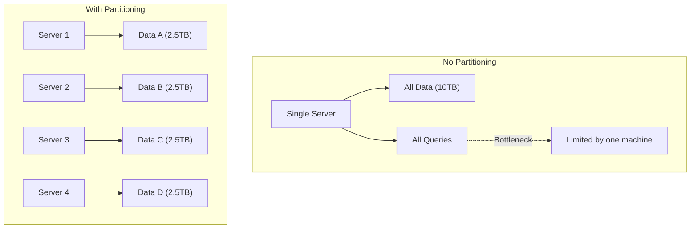
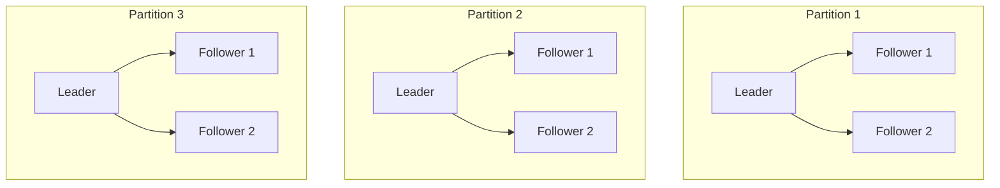
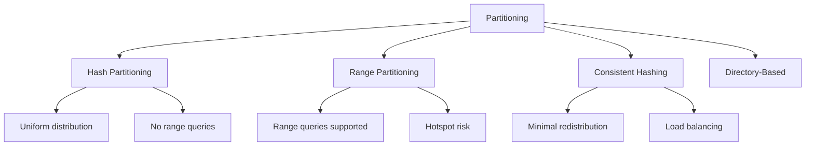
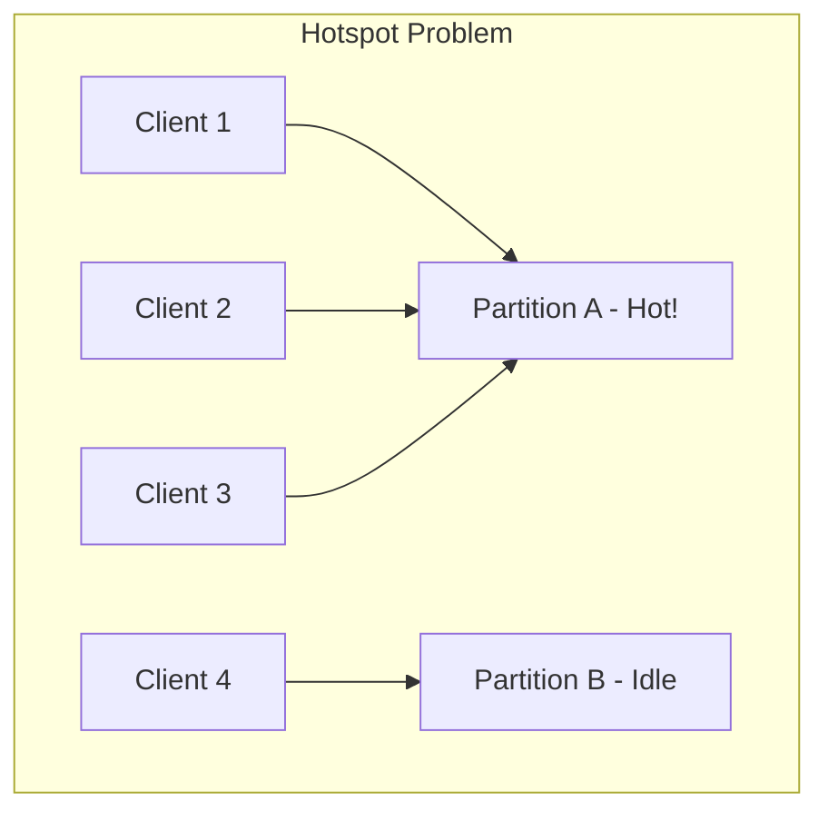
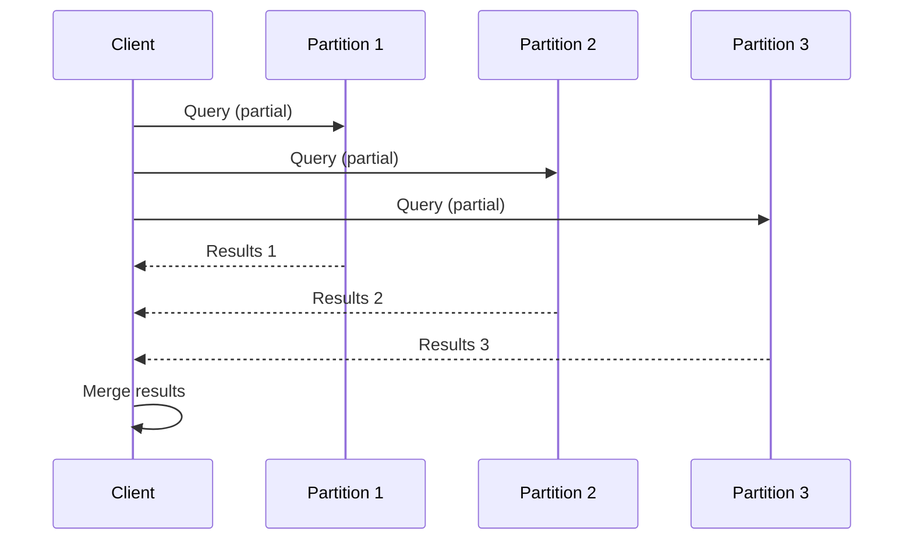
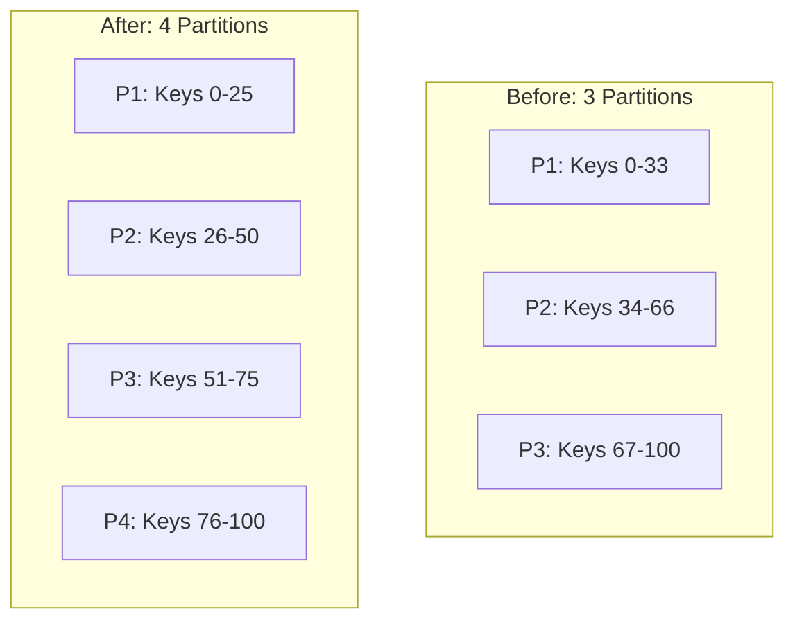
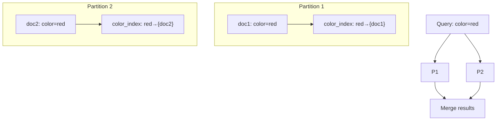
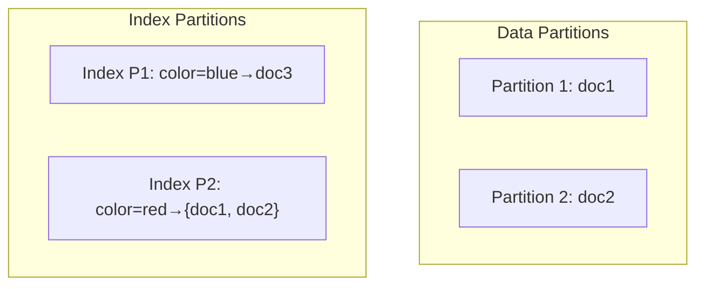

# Partitioning (Sharding)

## Overview

Partitioning (also called sharding) is the practice of **splitting a large dataset across multiple nodes**. Each node is responsible for a subset of the data, allowing the system to scale beyond what a single machine can handle. Partitioning is essential for horizontal scalability — adding more nodes to increase capacity.

## Why Partition?

| Benefit | Description |
|---------|-------------|
| **Scalability** | Data and queries distributed across nodes |
| **Performance** | Parallel processing of queries |
| **Storage** | More data than fits on one machine |
| **Availability** | Failure affects only one partition |

## Partitioning + Replication

In practice, partitioning and replication are combined:

Each partition is replicated independently. A node may be leader for one partition and follower for another.

## Partitioning Strategies

## Comparison

| Strategy | Distribution | Range Queries | Hotspot Risk | Redistribution |
|----------|-------------|---------------|-------------|----------------|
| **Hash** | Uniform | No | Low | Full reshuffling |
| **Range** | Ordered | Yes | High | Minimal |
| **Consistent Hashing** | Ring-based | No | Low | Minimal |

## Key Challenges

### Hotspots

When one partition receives disproportionately more traffic:

**Solutions**:
- Split the hotspot partition
- Add a key prefix/suffix to distribute load
- Use consistent hashing with virtual nodes

### Cross-Partition Queries

Queries that span multiple partitions are expensive:

### Rebalancing

When adding or removing nodes, data must be redistributed:

## Secondary Indexes with Partitioning

Secondary indexes complicate partitioning because they can point to data on different partitions.

### Local Index (Per-Partition)

### Global Index (Partitioned Separately)

## Interview Questions

1. **What is partitioning and why is it needed?**
   - Splitting data across multiple nodes for scalability. A single machine has finite storage and processing capacity; partitioning allows horizontal scaling.

2. **Compare hash partitioning and range partitioning.**
   - Hash: uniform distribution, no range queries, low hotspot risk. Range: supports range queries, ordered data, but prone to hotspots.

3. **What is the hotspot problem and how do you solve it?**
   - One partition receives disproportionate traffic. Solve by: splitting the hotspot, adding key salting, using consistent hashing with virtual nodes, or caching.

4. **How does partitioning interact with replication?**
   - Each partition is independently replicated. A node can be leader for one partition and follower for another. This combines scalability (partitioning) with availability (replication).

5. **What are the challenges of secondary indexes with partitioning?**
   - Local indexes: each partition has its own index; queries must scatter-gather across all partitions. Global indexes: index is partitioned separately; writes must update multiple partitions, but reads can target one.

## Common Mistakes

- Choosing the **wrong partition key** — leads to hotspots or unbalanced partitions
- Forgetting about **cross-partition queries** — they're expensive and complex
- Not planning for **rebalancing** — adding nodes requires data redistribution
- Ignoring **secondary index** implications — they complicate partitioning
- Assuming partitions are independent — transactions across partitions are hard

## Summary

Partitioning is essential for scaling beyond a single machine. The choice of partitioning strategy depends on query patterns: hash for uniform distribution, range for ordered queries, consistent hashing for dynamic clusters. Combining partitioning with replication provides both scalability and availability. Key challenges include hotspots, cross-partition queries, and rebalancing.

## Cross-References

- [Hash Partitioning](hash.md) — Simple hash-based distribution
- [Range Partitioning](range.md) — Ordered partitioning
- [Consistent Hashing](consistent-hashing.md) — Dynamic partitioning
- [Replication Strategies](../replication/README.md) — Combining with partitioning
- [MapReduce](../mapreduce/README.md) — Processing partitioned data
- [Kafka](../messaging/kafka.md) — Partitioned message queues

## Cross References

- [Hash Partitioning](hash.md)
- [Range Partitioning](range.md)
- [Consistent Hashing](consistent-hashing.md)
- [DBMS Sharding](../../dbms/distributed/sharding.md)
