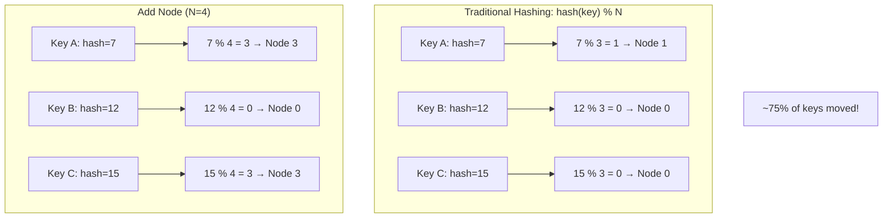
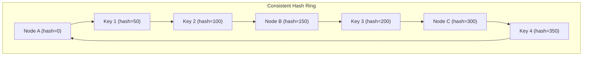
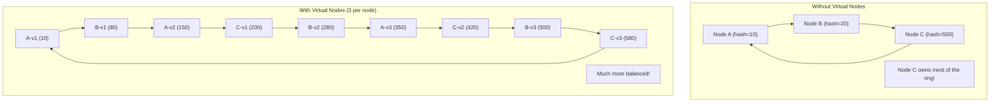

# Consistent Hashing

## Overview

Consistent hashing is a distributed hashing technique that **minimizes redistribution** when nodes are added or removed. Unlike traditional hash partitioning (hash % N), consistent hashing maps both keys and nodes onto a hash ring, so only a small fraction of keys need to move when the cluster changes. It's used by Dynamo, Cassandra, Riak, Memcached, and many CDNs.

## The Problem with Traditional Hashing



When N changes from 3 to 4, most keys get reassigned. This causes massive data movement.

## The Hash Ring

Consistent hashing maps both keys and nodes onto a **ring** (0 to 2^32 - 1):



### Assignment Rule

Each key is assigned to the **first node clockwise** from the key's position on the ring:


## Adding a Node

When a new node is added, only keys between the new node and its predecessor need to move:

```mermaid
graph TD
    subgraph "Before: 3 Nodes"
        B_N0["Node A (0)"] --> B_K1["Key 1 (50)"]
        B_K1 --> B_K2["Key 2 (100)"]
        B_K2 --> B_N1["Node B (150)"]
        B_N1 --> B_K3["Key 3 (200)"]
        B_K3 --> B_N2["Node C (300)"]
        B_N2 --> B_K4["Key 4 (350)"]
        B_K4 --> B_N0
    end
    
    subgraph "After: Add Node D (250)"
        A_N0["Node A (0)"] --> A_K1["Key 1 (50)"]
        A_K1 --> A_K2["Key 2 (100)"]
        A_K2 --> A_N1["Node B (150)"]
        A_N1 --> A_K3["Key 3 (200)"]
        A_K3 --> A_ND["Node D (250) - NEW"]
        A_ND --> A_N2["Node C (300)"]
        A_N2 --> A_K4["Key 4 (350)"]
        A_K4 --> A_N0
    end
    
    Note["Only Key 3 moves (from C to D)"]
```



**With N nodes, adding one node only moves ~1/N of the keys.**

## Virtual Nodes

The basic ring can have **uneven distribution** if nodes hash to similar positions. **Virtual nodes** solve this:



Each physical node gets **multiple virtual nodes** (typically 100-200) spread around the ring. This ensures uniform distribution.

### Virtual Node Benefits

| Benefit | Description |
|---------|-------------|
| **Better distribution** | Keys spread evenly across physical nodes |
| **Heterogeneous nodes** | Powerful nodes get more virtual nodes |
| **Smooth rebalancing** | When a node leaves, its keys spread across many nodes |

## Implementation

```python
import hashlib
import bisect

class ConsistentHash:
    def __init__(self, nodes, num_virtual=150):
        self.num_virtual = num_virtual
        self.ring = {}  # hash -> node
        self.sorted_keys = []
        
        for node in nodes:
            self.add_node(node)
    
    def _hash(self, key):
        return int(hashlib.md5(key.encode()).hexdigest(), 16)
    
    def add_node(self, node):
        for i in range(self.num_virtual):
            key = f"{node}:{i}"
            hash_val = self._hash(key)
            self.ring[hash_val] = node
            bisect.insort(self.sorted_keys, hash_val)
    
    def remove_node(self, node):
        for i in range(self.num_virtual):
            key = f"{node}:{i}"
            hash_val = self._hash(key)
            del self.ring[hash_val]
            self.sorted_keys.remove(hash_val)
    
    def get_node(self, key):
        hash_val = self._hash(key)
        idx = bisect.bisect_right(self.sorted_keys, hash_val)
        if idx == len(self.sorted_keys):
            idx = 0
        return self.ring[self.sorted_keys[idx]]

# Usage
ch = ConsistentHash(["Node A", "Node B", "Node C"])
print(ch.get_node("user:123"))  # "Node B"
print(ch.get_node("user:456"))  # "Node A"
```

## Rebalancing

When nodes are added or removed, consistent hashing minimizes data movement:

### Adding a Node

With N nodes, adding one moves approximately 1/N of keys. Removing one moves approximately 1/N of keys to neighbors. This is the core advantage over traditional hash partitioning.

### Rebalancing Process

1. New node joins the ring (gets virtual node positions)
2. New node identifies keys it now owns (from successor)
3. Data is transferred from successor to new node
4. Ring metadata is updated on all clients/servers

### Gradual Rebalancing (Riak/Cassandra Style)

Instead of moving all data at once, systems often **stream data gradually** in the background to prevent network saturation. The new node begins serving reads as soon as its data transfer completes for a given range.

### Consistent Hashing vs. Range Partitioning

| Aspect | Consistent Hashing | Range Partitioning |
|--------|-------------------|-------------------|
| **Key distribution** | Hash-based, uniform | Sequential, can be skewed |
| **Range queries** | Not supported | Efficient |
| **Rebalancing** | Minimal key movement | May split/merge ranges |
| **Use case** | Key-value lookups | Time-series, ordered data |
| **Examples** | Dynamo, Cassandra, Riak | HBase, CockroachDB, Bigtable |

## Consistent Hashing in Practice

### Amazon Dynamo

Amazon's Dynamo paper (2007) popularized consistent hashing for distributed databases:

Each node is assigned multiple positions on the hash ring (virtual nodes). A key is mapped to the ring and assigned to the first N distinct physical nodes encountered clockwise, where N is the replication factor.

**Dynamo innovations**:
- **Preference list**: each key has an ordered list of nodes responsible for it
- **Sloppy quorum**: writes/reads succeed even if some nodes are down
- **Hinted handoff**: temporary nodes store data and forward it when the original recovers
- **Virtual nodes** with configurable count per physical node

### Cassandra

Cassandra uses Murmur3 hash function with token ranges assigned per node:

```sql
-- Each node owns a range of tokens
-- Node 1: tokens 0-42
-- Node 2: tokens 43-85
-- Node 3: tokens 86-127

-- Partition key determines token
token = Murmur3(partition_key)
-- Routes to node owning that token
```

**Cassandra specifics**:
- `num_tokens` config controls virtual nodes (default: 16 in Cassandra 4.0+)
- `NetworkTopologyStrategy` ensures replicas are in different racks/data centers
- `nodetool ring` shows the token ring and which nodes own which ranges
- Adding a node triggers streaming of data from neighbors

### Memcached

Client-side consistent hashing (no server coordination needed):

```python
# Ketama algorithm is most common for Memcached
# Each client maintains its own ring
# Servers are added with weights controlling vnode count

# Client-side ring
ring = {
    "server1:11211": 40,  # Weight: 40 vnodes
    "server2:11211": 30,  # Weight: 30 vnodes
    "server3:11211": 30,  # Weight: 30 vnodes
}

# Get server for a key
def get_server(key):
    hash_val = hash(key)
    # Find next server clockwise on the ring
    return find_next_server(hash_val, ring)
```

**Memcached advantages**: No server-side coordination, clients are independent, adding/removing servers only affects a fraction of cache misses.

### Load Balancers (Nginx, Envoy)

Consistent hashing in load balancers ensures the same client always hits the same backend:

```nginx
# Nginx consistent hashing
upstream backend {
    hash $request_uri consistent;
    server backend1:8080;
    server backend2:8080;
    server backend3:8080;
}
```

Useful for:
- **Session affinity** (sticky sessions)
- **Cache warming** (requests to same URL hit same backend)
- **WebSocket connections** (same client to same server)
- **CDN edge routing** (same content to same edge node)

### Cassandra

```sql
-- Each node owns a range of tokens
-- Node 1: tokens 0-100
-- Node 2: tokens 100-200
-- Node 3: tokens 200-300

-- Partition key determines token
token = Murmur3(partition_key)
-- Routes to node owning that token
```

### Memcached

```python
# Client-side consistent hashing
# Each client maintains the ring
# No coordination needed between servers

def get_server(key):
    hash_val = hash(key)
    # Find next server clockwise on the ring
    return find_next_server(hash_val)
```

## Consistent Hashing vs. Traditional Hashing

| Aspect | Consistent Hashing | Traditional Hashing |
|--------|-------------------|-------------------|
| **Redistribution** | ~1/N keys | ~(N-1)/N keys |
| **Add/remove node** | Minimal movement | Reshuffle everything |
| **Distribution** | Uneven (basic), even (vnodes) | Even |
| **Complexity** | Higher | Lower |
| **Use case** | Dynamic clusters | Fixed clusters |

## Interview Questions

1. **What is consistent hashing and why is it needed?**
   - A hashing technique where adding/removing nodes only redistributes a small fraction of keys (~1/N). Needed because traditional hashing (hash % N) redistributes most keys when N changes.

2. **How does the hash ring work?**
   - Both keys and nodes are hashed onto a ring (0 to 2^32-1). Each key is assigned to the first node clockwise from its position. When a node is added, only keys between it and its predecessor move.

3. **What are virtual nodes and why are they important?**
   - Multiple virtual nodes per physical node, spread around the ring. They ensure uniform distribution even if physical nodes hash to similar positions. Also enables heterogeneous nodes (powerful nodes get more vnodes).

4. **How much data moves when adding a node?**
   - Approximately 1/N of the keys move (where N is the number of nodes). For example, going from 3 to 4 nodes moves ~25% of keys.

5. **Where is consistent hashing used?**
   - Amazon Dynamo, Apache Cassandra, Riak, Memcached (client-side), CDNs (content distribution), load balancers.

6. **What is the difference between consistent hashing and consistent hashing with virtual nodes?**
   - Basic consistent hashing can have uneven distribution. Virtual nodes spread each physical node across multiple positions on the ring, ensuring balanced load.

## Common Mistakes

- Not using **virtual nodes** — leads to uneven distribution
- Choosing too few virtual nodes — 10-20 is not enough; use 100-200
- Forgetting that consistent hashing doesn't solve **hotspot** problems — a popular key still concentrates load
- Not handling **node failures** — the ring must be updated when nodes leave
- Confusing consistent hashing with **rendezvous hashing** — they solve similar problems differently

## Summary

Consistent hashing minimizes data redistribution when nodes are added or removed by mapping keys and nodes onto a hash ring. Each key is assigned to the first node clockwise. Virtual nodes ensure uniform distribution. The technique is essential for dynamic distributed systems where the cluster size changes frequently.

## Cross-References

- [Partitioning Overview](README.md) — Partitioning strategies
- [Hash Partitioning](hash.md) — Traditional hash partitioning
- [Range Partitioning](range.md) — Ordered alternative
- [Quorum-Based Replication](../replication/quorum.md) — Dynamo uses both
- [Distributed Caching](../microservices/observability.md) — Memcached uses consistent hashing

## Cross References

- [Hash Partitioning](hash.md)
- [Load Balancing](../../networks/load-balancing/README.md)
- [DBMS Sharding](../../dbms/distributed/sharding.md)
- [CDN](../../networks/cdn/README.md)
