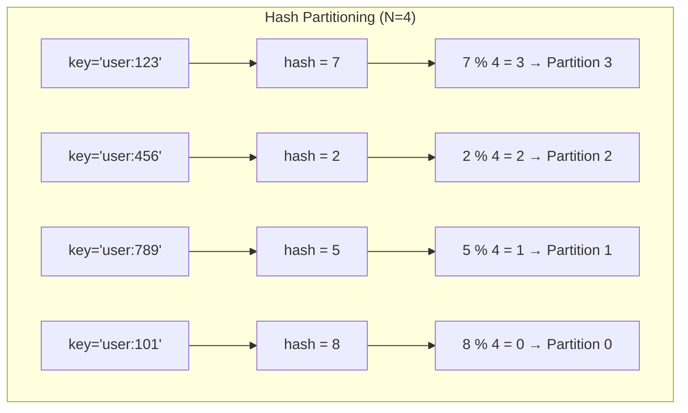
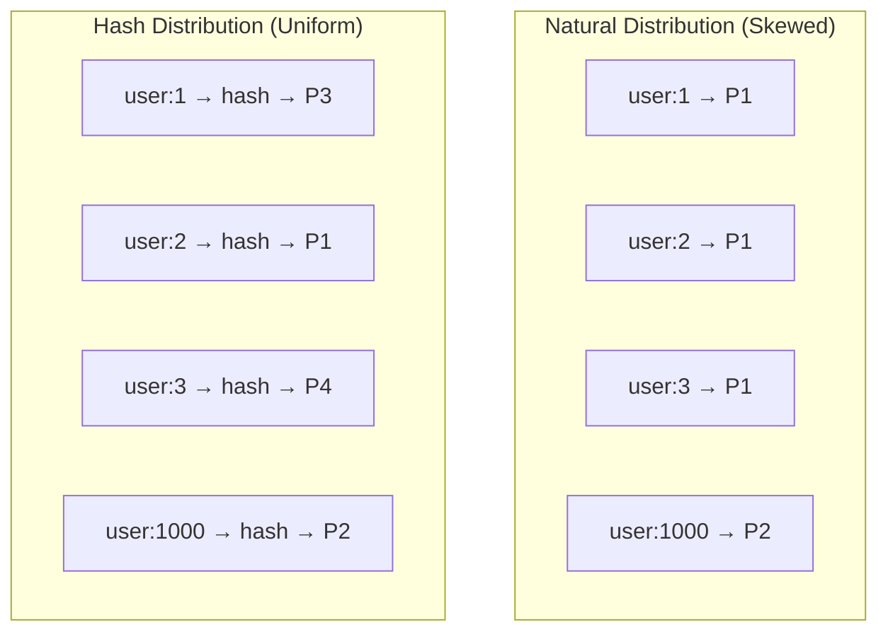
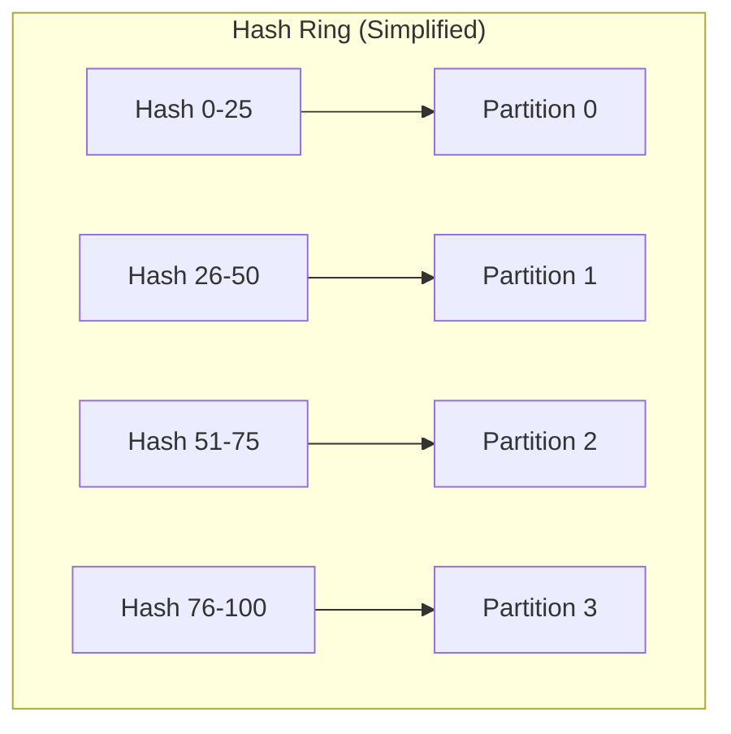
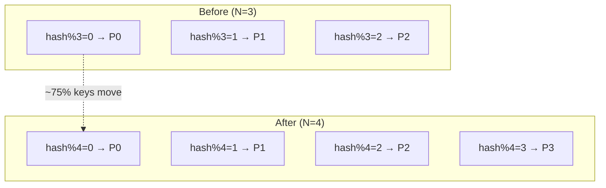

# Hash Partitioning

## Overview

Hash partitioning distributes data across partitions by computing a **hash of the partition key** and mapping it to a partition. This provides uniform distribution of data regardless of the key's natural distribution, making it the most common partitioning strategy for key-value stores and distributed databases.

## How It Works


### Formula

```
partition = hash(key) % num_partitions
```

### Example



## Uniform Distribution

Hash functions distribute data uniformly regardless of key patterns:



## Choosing a Hash Function

| Hash Function | Properties | Use Case |
|--------------|-----------|----------|
| **MurmurHash** | Fast, good distribution | Cassandra, Redis |
| **xxHash** | Very fast, good distribution | General purpose |
| **SHA-256** | Cryptographic, slow | Security-sensitive |
| **MD5** | Fast, good distribution | Legacy systems |

## Partitioning with Hash Tables



## Composite Keys

For complex data models, use composite partition keys:

```python
# Simple key
partition = hash(user_id) % N

# Composite key (for multi-tenant systems)
partition = hash(tenant_id + user_id) % N

# Compound key (for time-series)
partition = hash(sensor_id) % N  # Distribute sensors
# Within partition: sort by timestamp
```

## Advantages

1. **Uniform distribution**: Hash functions spread data evenly
2. **No hotspots**: Random distribution prevents concentration
3. **Simple implementation**: Just hash and mod
4. **O(1) lookup**: Direct calculation of partition

## Disadvantages

1. **No range queries**: Can't efficiently query ranges (keys are scattered)
2. **Repartitioning is expensive**: Changing N requires redistributing all data
3. **No ordering**: Data is not sorted within or across partitions
4. **Loss of locality**: Related data may end up on different partitions

## The Repartitioning Problem

When adding a new partition, most keys need to move:



With N=3 changing to N=4, approximately 75% of keys must be redistributed. This is why **consistent hashing** is preferred for dynamic clusters.

## Hash Partitioning in Practice

### Cassandra

```sql
-- Partition key determines which node stores the data
CREATE TABLE users (
    user_id UUID PRIMARY KEY,
    name TEXT,
    email TEXT
);
-- partition = hash(user_id) % num_tokens
```

### MongoDB

```javascript
// Shard key determines partition
db.users.createIndex({ user_id: "hashed" })
sh.shardCollection("mydb.users", { user_id: "hashed" })
```

### Redis Cluster

```python
# Hash slot = CRC16(key) % 16384
# Each node owns a range of slots
slot = crc16(key) % 16384
```

## Hash Partitioning vs. Range Partitioning

| Aspect | Hash Partitioning | Range Partitioning |
|--------|------------------|-------------------|
| **Distribution** | Uniform | Can be skewed |
| **Range queries** | Not supported | Efficient |
| **Hotspots** | Rare | Common |
| **Repartitioning** | Expensive | Minimal |
| **Use case** | Key-value lookups | Time-series, alphabetical |

## Interview Questions

1. **How does hash partitioning work?**
   - Compute hash(key) % N to determine the partition. This distributes data uniformly regardless of key distribution.

2. **What are the disadvantages of hash partitioning?**
   - No range queries (keys are scattered), expensive repartitioning (changing N redistributes most data), no ordering.

3. **Why is repartitioning expensive with hash partitioning?**
   - Changing N from 3 to 4 means hash%3 ≠ hash%4 for most keys. Approximately (N-1)/N of all keys must move.

4. **When would you choose hash over range partitioning?**
   - Hash: when you need uniform distribution and only do point lookups (key-value stores). Range: when you need range queries or ordered data.

5. **How do databases like Cassandra use hash partitioning?**
   - Cassandra uses MurmurHash to compute a token for each partition key. Each node owns a range of tokens. The partition key determines which node stores the data.

## Common Mistakes

- Using a **poor hash function** — leads to uneven distribution
- Not considering **repartitioning costs** — use consistent hashing for dynamic clusters
- Choosing hash partitioning when **range queries are needed**
- Forgetting about **composite keys** for multi-tenant or hierarchical data
- Not accounting for **data skew** even with hashing (some keys may be much hotter)

## Summary

Hash partitioning provides uniform data distribution by computing hash(key) % N. It's simple, efficient for point lookups, and prevents hotspots. However, it doesn't support range queries and repartitioning is expensive. For dynamic clusters, consistent hashing is preferred. For ordered data, range partitioning is better.

## Cross-References

- [Partitioning Overview](README.md) — Partitioning strategies comparison
- [Range Partitioning](range.md) — Ordered alternative
- [Consistent Hashing](consistent-hashing.md) — Dynamic repartitioning
- [Kafka](../messaging/kafka.md) — Uses hash partitioning for messages
- [Cassandra](../replication/quorum.md) — Uses hash partitioning with quorum replication
