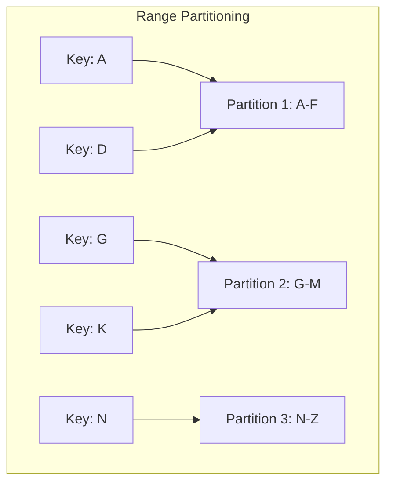
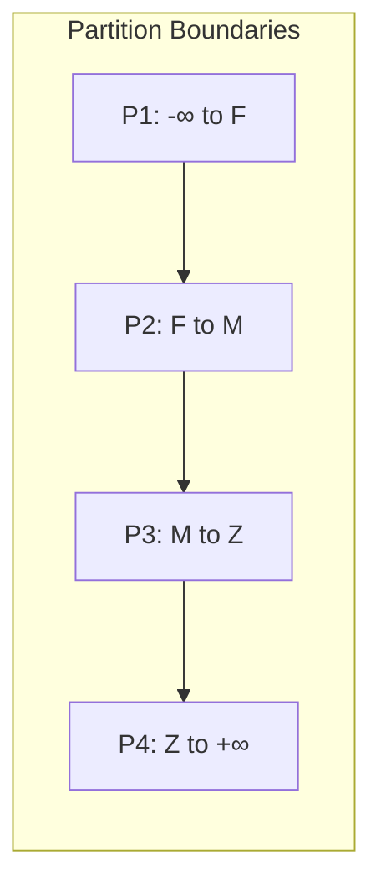
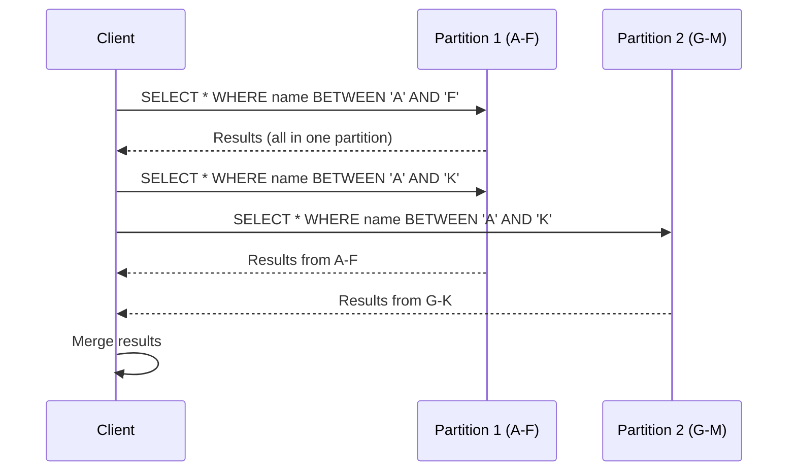
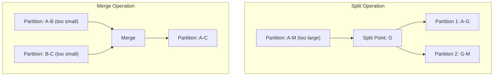
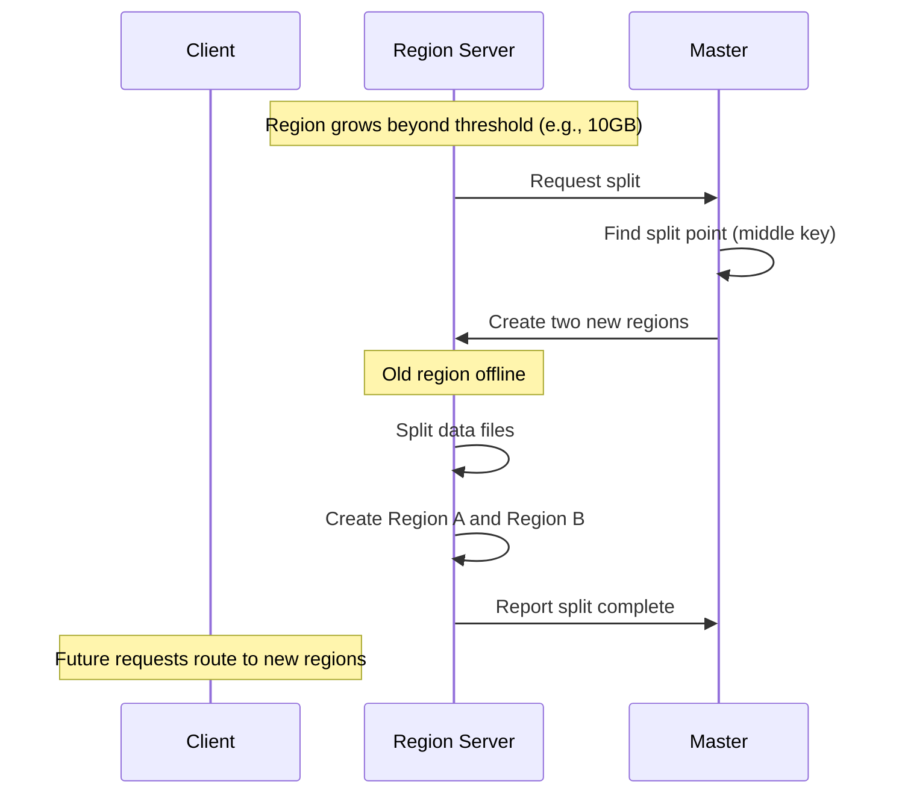
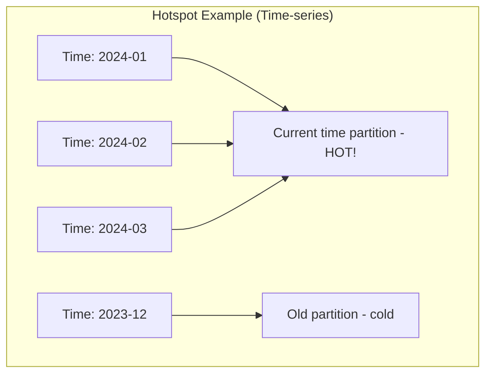

# Range Partitioning

## Overview

Range partitioning divides data into partitions based on **contiguous ranges of the partition key**. Each partition is responsible for a range of key values, maintaining the natural ordering of data. This strategy is used by HBase, Bigtable, CockroachDB, TiDB, and many data warehouses.

## How It Works



### Range Boundaries



## Range Queries

The key advantage: **efficient range queries** since data is ordered.

```sql
-- Efficient: scans contiguous partition
SELECT * FROM users WHERE name BETWEEN 'A' AND 'F';

-- Can be served entirely from Partition 1
```



## Dynamic Splitting and Merging

Range partitions can **split** when they get too large and **merge** when they get too small:



### HBase Region Splits



## Hotspot Problem

Range partitioning is prone to **hotspots** when access patterns are skewed:



### Solutions to Hotspots

#### 1. Key Salting

```python
# Original key
partition_key = timestamp

# Salted key
partition_key = f"{timestamp}_{random.randint(0, 9)}"
# Distributes across 10 sub-partitions
```

#### 2. Reverse Keys

```python
# Original: 2024-01-15 (all recent data in same partition)
# Reversed: 51-10-4202 (distributes recent data)
reversed_key = key[::-1]
```

#### 3. Hash Prefix

```python
# Add hash prefix to distribute hot keys
partition_key = f"{hash(key) % 10}_{original_key}"
```

## Range Partitioning in Practice

### HBase / Bigtable

```
Row Key: user_id + timestamp
Region 1: user_001_2024-01-01 to user_001_2024-06-30
Region 2: user_001_2024-07-01 to user_002_2024-01-01
Region 3: user_002_2024-01-01 to user_003_2024-01-01
```

### CockroachDB

```sql
-- Automatic range partitioning by primary key
CREATE TABLE users (
    id UUID PRIMARY KEY,
    name STRING,
    created_at TIMESTAMP
);
-- Ranges automatically split at ~512MB
```

### PostgreSQL (Declarative Partitioning)

```sql
CREATE TABLE orders (
    id SERIAL,
    order_date DATE,
    amount DECIMAL
) PARTITION BY RANGE (order_date);

CREATE TABLE orders_2024_01 PARTITION OF orders
    FOR VALUES FROM ('2024-01-01') TO ('2024-02-01');

CREATE TABLE orders_2024_02 PARTITION OF orders
    FOR VALUES FROM ('2024-02-01') TO ('2024-03-01');
```

### Cassandra (Wide Rows)

```sql
-- Partition key: sensor_id
-- Clustering key: timestamp (ordered within partition)
CREATE TABLE sensor_data (
    sensor_id INT,
    timestamp TIMESTAMP,
    value DOUBLE,
    PRIMARY KEY (sensor_id, timestamp)
) WITH CLUSTERING ORDER BY (timestamp DESC);

-- Range query within a partition
SELECT * FROM sensor_data 
WHERE sensor_id = 1 
AND timestamp BETWEEN '2024-01-01' AND '2024-01-31';
```

## Range Partitioning vs. Hash Partitioning

| Aspect | Range Partitioning | Hash Partitioning |
|--------|-------------------|------------------|
| **Data ordering** | Ordered within and across partitions | No ordering |
| **Range queries** | Efficient (single partition) | Requires scatter-gather |
| **Point lookups** | O(log n) to find partition | O(1) to compute partition |
| **Hotspot risk** | High (sequential access) | Low (uniform distribution) |
| **Split/Merge** | Easy (just adjust boundaries) | Expensive (rehash all data) |
| **Use case** | Time-series, alphabetical | Key-value, random access |

## Interview Questions

1. **What is range partitioning and when would you use it?**
   - Dividing data into contiguous ranges by key value. Use when you need range queries (e.g., time-series data, alphabetical lookups) or ordered data.

2. **What is the hotspot problem in range partitioning?**
   - Sequential access patterns (e.g., current time) concentrate writes on one partition. Solutions: key salting, reverse keys, hash prefixes.

3. **How do databases like HBase handle range partitioning?**
   - HBase uses regions (range partitions) that automatically split when they exceed a threshold. The master coordinates splits and updates the region location table.

4. **Compare range partitioning and hash partitioning.**
   - Range: ordered, efficient range queries, hotspot-prone. Hash: unordered, uniform distribution, no range queries. Choose based on query patterns.

5. **How does PostgreSQL implement range partitioning?**
   - Using declarative partitioning with PARTITION BY RANGE. Each partition has bounds (FROM...TO). The query planner routes queries to the correct partition.

## Common Mistakes

- Choosing range partitioning for **random access patterns** — use hash instead
- Not accounting for **hotspots** with sequential keys (timestamps, auto-increment IDs)
- Forgetting about **partition pruning** — queries must include the partition key
- Setting partition boundaries **too wide or too narrow** — affects performance and management
- Not planning for **partition growth** — data patterns change over time

## Summary

Range partitioning organizes data into contiguous ranges, enabling efficient range queries and ordered access. The main trade-off is hotspot risk with sequential access patterns. Solutions include key salting and reverse keys. Range partitioning is ideal for time-series data, alphabetical lookups, and any workload that benefits from data ordering.

## Cross-References

- [Partitioning Overview](README.md) — Partitioning strategies comparison
- [Hash Partitioning](hash.md) — Uniform distribution alternative
- [Consistent Hashing](consistent-hashing.md) — Dynamic repartitioning
- [Kafka](../messaging/kafka.md) — Partitioned message storage
- [MapReduce](../mapreduce/README.md) — Processing partitioned data
