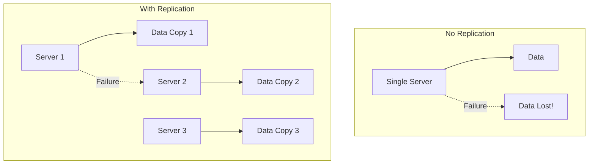
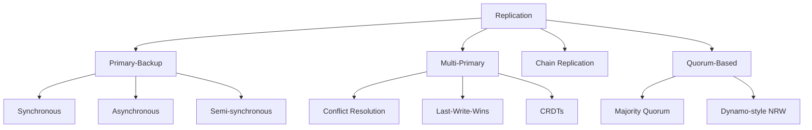

# Replication Strategies

## Overview

Replication is the process of maintaining **multiple copies of data** across different nodes to improve availability, fault tolerance, and read performance. It's one of the most fundamental concepts in distributed systems — nearly every production database, file system, and cache uses some form of replication.

## Why Replicate?



| Benefit | Description |
|---------|-------------|
| **Availability** | Data survives node failures |
| **Durability** | Multiple copies protect against data loss |
| **Read scalability** | Reads can be served from any replica |
| **Low latency** | Place replicas close to users |

## The CAP Theorem

Replication strategies must navigate the CAP theorem:

```mermaid
graph TD
    subgraph "CAP Theorem"
        C[Consistency] --- A[Availability]
        A --- P[Partition Tolerance]
        P --- C
    end
    
    subgraph "Choose 2 of 3"
        CP[CP: Consistent + Partition Tolerant\n(Sacrifice Availability)]
        AP[AP: Available + Partition Tolerant\n(Sacrifice Consistency)]
        CA[CA: Consistent + Available\n(No Partitions)]
    end
```

In practice, **network partitions are unavoidable**, so the real choice is between:
- **CP systems**: Consistent but may be unavailable during partitions (e.g., ZooKeeper, etcd)
- **AP systems**: Available but may return stale data during partitions (e.g., Cassandra, DynamoDB)

## Consistency Models

| Model | Guarantees | Example |
|-------|-----------|---------|
| **Strong (Linearizability)** | All reads see the most recent write | Traditional RDBMS |
| **Sequential** | All operations appear in some total order | ZooKeeper |
| **Causal** | Causally related operations are ordered | MongoDB (causal sessions) |
| **Eventual** | All replicas converge given no new updates | Cassandra, DynamoDB |

## Replication Strategies Overview



## Comparison

| Strategy | Write Path | Read Path | Consistency | Availability | Complexity |
|----------|-----------|-----------|-------------|-------------|------------|
| **Primary-Backup** | Through primary | Any replica (may be stale) | Strong | Moderate | Low |
| **Multi-Primary** | Any primary | Any primary | Eventual | High | High |
| **Chain** | Head node | Tail node | Strong | Moderate | Medium |
| **Quorum** | W replicas | R replicas | Configurable | High | Medium |

## Choosing a Strategy

```mermaid
graph TD
    Start[Need Replication?] --> Q1{Need strong consistency?}
    Q1 -->|Yes| Q2{Read-heavy or write-heavy?}
    Q1 -->|No| Q3{Need high availability?}
    Q2 -->|Read-heavy| PB[Primary-Backup\n(read from replicas)]
    Q2 -->|Write-heavy| CH[Chain Replication]
    Q3 -->|Yes| QU[Quorum-Based\n(Dynamo-style)]
    Q3 -->|No| MP[Multi-Primary]
```

## Interview Questions

1. **What is the CAP theorem and how does it affect replication?**
   - CAP states that a distributed system can provide at most 2 of: Consistency, Availability, Partition tolerance. Since partitions are unavoidable, the choice is between consistency (CP) and availability (AP).

2. **What's the difference between strong and eventual consistency?**
   - Strong consistency: every read returns the most recent write. Eventual consistency: replicas may temporarily diverge but will converge given no new updates.

3. **When would you use primary-backup vs. quorum-based replication?**
   - Primary-backup: when you need strong consistency and can tolerate some unavailability. Quorum-based: when you need tunable consistency and high availability.

4. **What is the cost of replication?**
   - Storage overhead (multiple copies), write latency (must update replicas), complexity (handling failures, consistency), and potential for stale reads.

## Common Mistakes

- Assuming replication automatically provides consistency — consistency depends on the strategy
- Forgetting about **network partitions** when designing replication
- Not considering **read-after-write consistency** for user-facing applications
- Ignoring the **trade-off between consistency and availability**

## Summary

Replication is essential for building reliable distributed systems. The choice of strategy depends on consistency requirements, availability needs, and read/write patterns. Primary-backup provides simplicity and strong consistency. Multi-primary offers high availability with eventual consistency. Chain replication provides strong consistency with high throughput. Quorum-based systems offer tunable consistency.

## Cross-References

- [Primary-Backup Replication](primary-backup.md) — Simplest replication strategy
- [Multi-Primary Replication](multi-primary.md) — High availability
- [Chain Replication](chain.md) — Strong consistency with throughput
- [Quorum-Based Replication](quorum.md) — Tunable consistency
- [Consensus Algorithms](../consensus/README.md) — Used for replication coordination
- [Consistent Hashing](../partitioning/consistent-hashing.md) — Data distribution

## Cross References

- [Primary-Backup](primary-backup.md)
- [Multi-Primary](multi-primary.md)
- [Quorum](quorum.md)
- [Chain Replication](chain.md)
- [DBMS Replication](../../dbms/distributed/replication.md)
