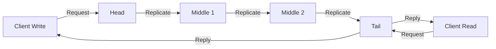
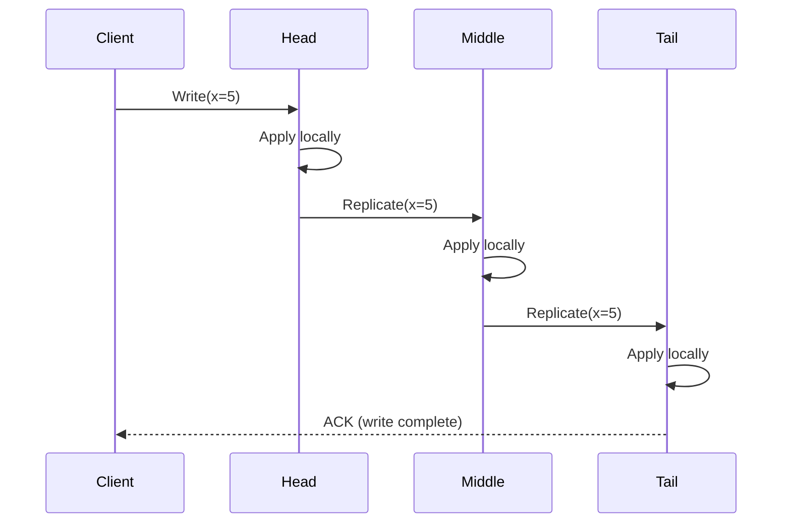
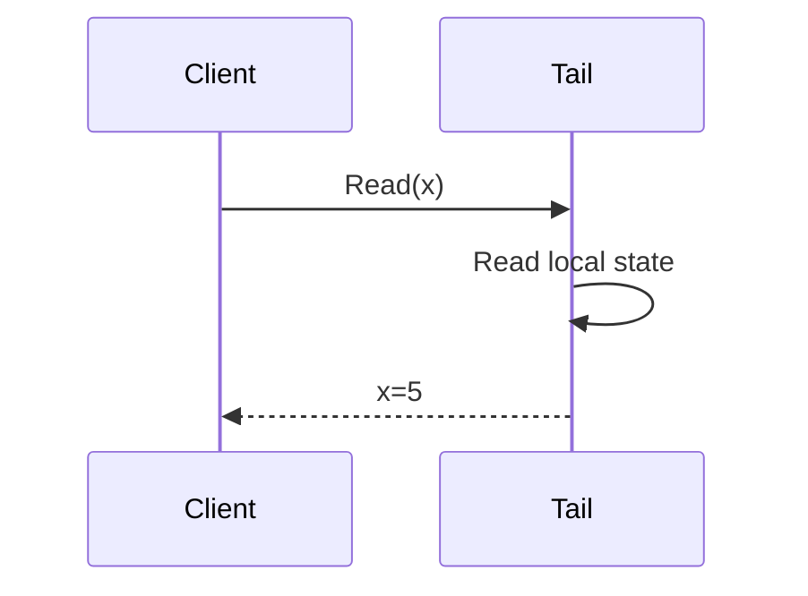
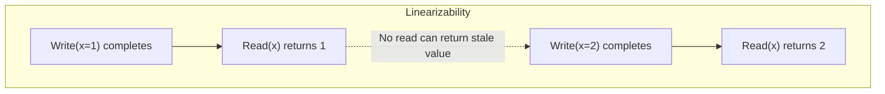
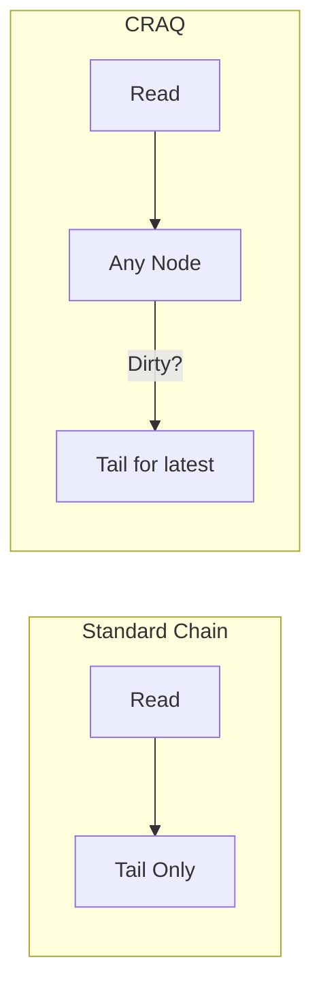
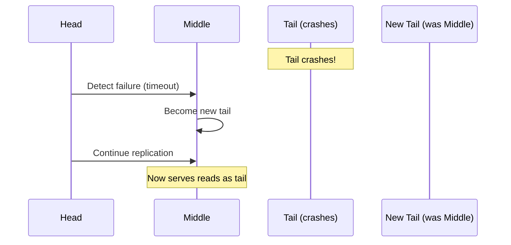
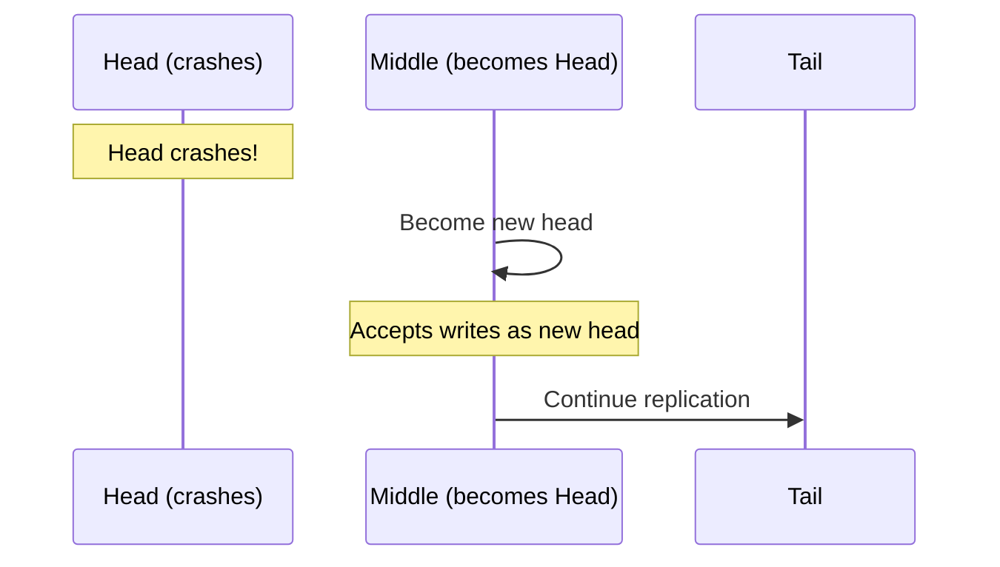
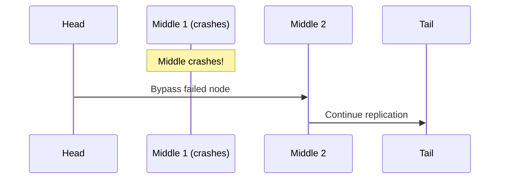
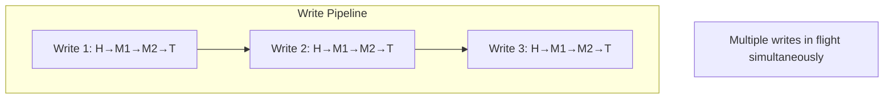
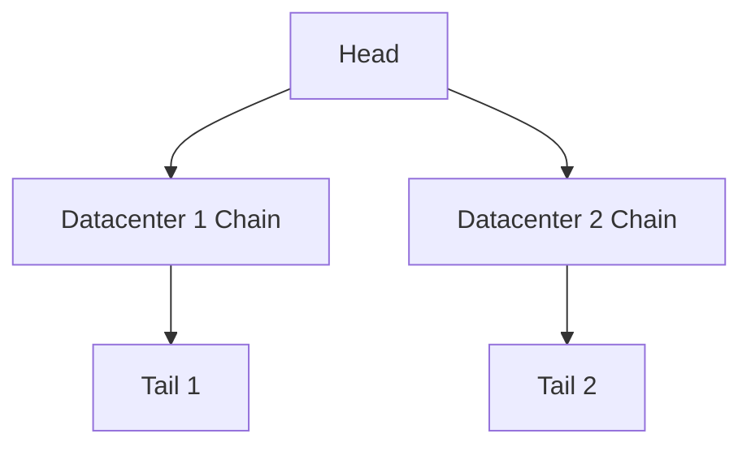

# Chain Replication

## Overview

Chain replication is a replication protocol that provides **strong consistency** with **high throughput** by organizing replicas in a linear chain. Writes enter at the **head** and propagate to the **tail**, while reads are served from the **tail**. This design ensures that all reads see the most recent write, providing linearizability without the overhead of consensus for each operation.

## How It Works

### Write Path

### Read Path

**Key property**: Since the tail only processes a write after all predecessors have processed it, reads at the tail always see the latest committed write.

## Linearizability Guarantee

Chain replication provides **linearizability** (strongest consistency):

This is because:
1. Writes are applied in order from head to tail
2. Reads only happen at the tail
3. A write is only acknowledged after the tail applies it

## Chain Replication with Apportioned Queries (CRAQ)

Standard chain replication only serves reads at the tail, limiting read throughput. **CRAQ** allows reads at any node:

Each node tracks:
- **Clean versions**: Fully committed (propagated from tail)
- **Dirty versions**: Not yet confirmed by tail

When a node receives a read for a dirty version, it checks with the tail for the latest committed version.

## Failure Handling

### Tail Failure

### Head Failure

### Middle Node Failure

The predecessor and successor of the failed node connect directly, maintaining the chain.

## Chain Replication vs. Primary-Backup

| Aspect | Chain Replication | Primary-Backup |
|--------|------------------|----------------|
| **Read location** | Tail only (or any in CRAQ) | Any replica |
| **Write path** | Head → Tail | Primary → All backups |
| **Consistency** | Linearizable | Depends on sync mode |
| **Write throughput** | High (pipeline) | Limited by slowest replica |
| **Read throughput** | Limited (tail only) | High (all replicas) |
| **Failure handling** | Remove from chain | Failover to backup |

## Chain Replication vs. Quorum

| Aspect | Chain Replication | Quorum |
|--------|------------------|--------|
| **Read location** | Tail | R replicas |
| **Write path** | Linear chain | W replicas |
| **Consistency** | Strong (always) | Configurable |
| **Latency** | Sum of all hops | Max of W hops |
| **Complexity** | Medium | Medium |

## Performance Characteristics

Chain replication achieves high throughput through **pipelining**: multiple writes can be in different stages of propagation simultaneously.

## Variants

### 1. Speculative Execution

Process requests before previous ones complete, rolling back if needed.

### 2. Hierarchical Chain

### 3. Fast Chain Replication

Bypass the chain for reads by using quorum reads at the tail and one other node.

## Real-World Usage

| System | Usage |
|--------|-------|
| **Microsoft Azure Storage** | Stream layer uses primary-replica (leader-based) replication with erasure coding (not classic chain replication) |
| **HDFS** | Pipeline replication (data flows unidirectionally, similar in spirit to chain but not the head→tail ACK model) |
| **Ceph** | RADOS PG replication is primary-fanout (primary OSD serializes writes, then forwards to replicas), not chain |
| **CORFU** | Chain replication for shared log |

## Interview Questions

1. **What is chain replication and how does it work?**
   - Replicas are organized in a linear chain. Writes enter at the head and propagate to the tail. Reads are served from the tail. This provides linearizability because the tail only acknowledges writes after all replicas have applied them.

2. **What consistency does chain replication provide?**
   - Linearizability (strongest consistency). Reads at the tail always see the latest committed write because writes propagate in order from head to tail.

3. **How does chain replication handle failures?**
   - Tail failure: the predecessor becomes the new tail. Head failure: the successor becomes the new head. Middle failure: the chain is reconfigured to bypass the failed node.

4. **What is CRAQ?**
   - Chain Replication with Apportioned Queries. It allows reads at any node (not just the tail) by tracking clean/dirty versions. Nodes check with the tail for dirty versions.

5. **Compare chain replication to primary-backup.**
   - Chain: writes pipeline through the chain (high write throughput), reads at tail only (limited read throughput), linearizable. Primary-backup: writes go to all replicas (limited by slowest), reads at any replica (high read throughput), consistency depends on sync mode.

6. **When would you use chain replication?**
   - When you need strong consistency and write-heavy workloads. Not ideal for read-heavy workloads (unless using CRAQ).

## Common Mistakes

- Thinking chain replication is good for read-heavy workloads — reads are limited to the tail
- Forgetting that **pipelining** is what gives chain replication high write throughput
- Not considering **failure recovery** — chain reconfiguration can temporarily block operations
- Confusing chain replication with primary-backup — the key difference is the linear write path

## Summary

Chain replication provides linearizable consistency by organizing replicas in a linear chain. Writes propagate from head to tail, and reads are served from the tail. This design achieves high write throughput through pipelining but limits read throughput. CRAQ extends it to allow reads at any node. Failure handling involves reconfiguring the chain to bypass failed nodes.

## Cross-References

- [Replication Overview](README.md) — Replication strategies comparison
- [Primary-Backup Replication](primary-backup.md) — Simpler alternative
- [Multi-Primary Replication](multi-primary.md) — High availability
- [Quorum-Based Replication](quorum.md) — Tunable consistency
- [Consensus Algorithms](../consensus/README.md) — For chain reconfiguration
